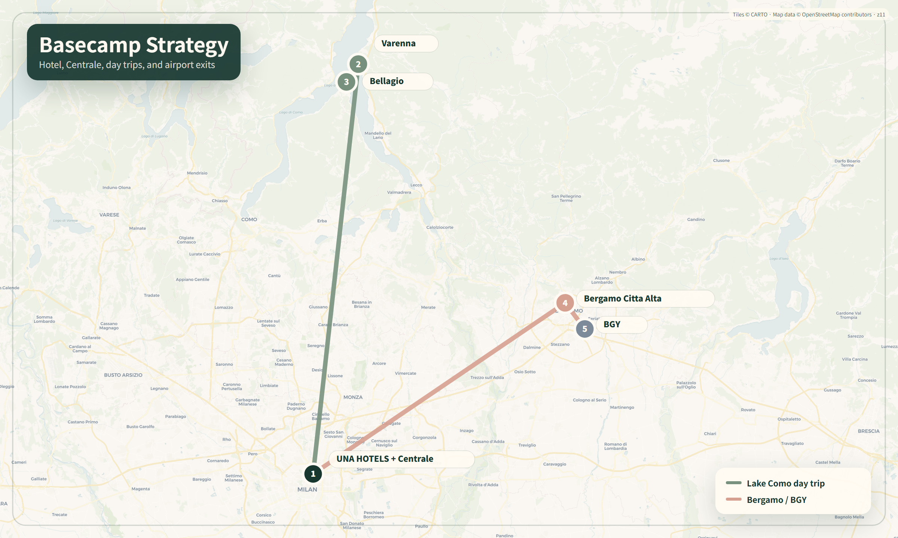
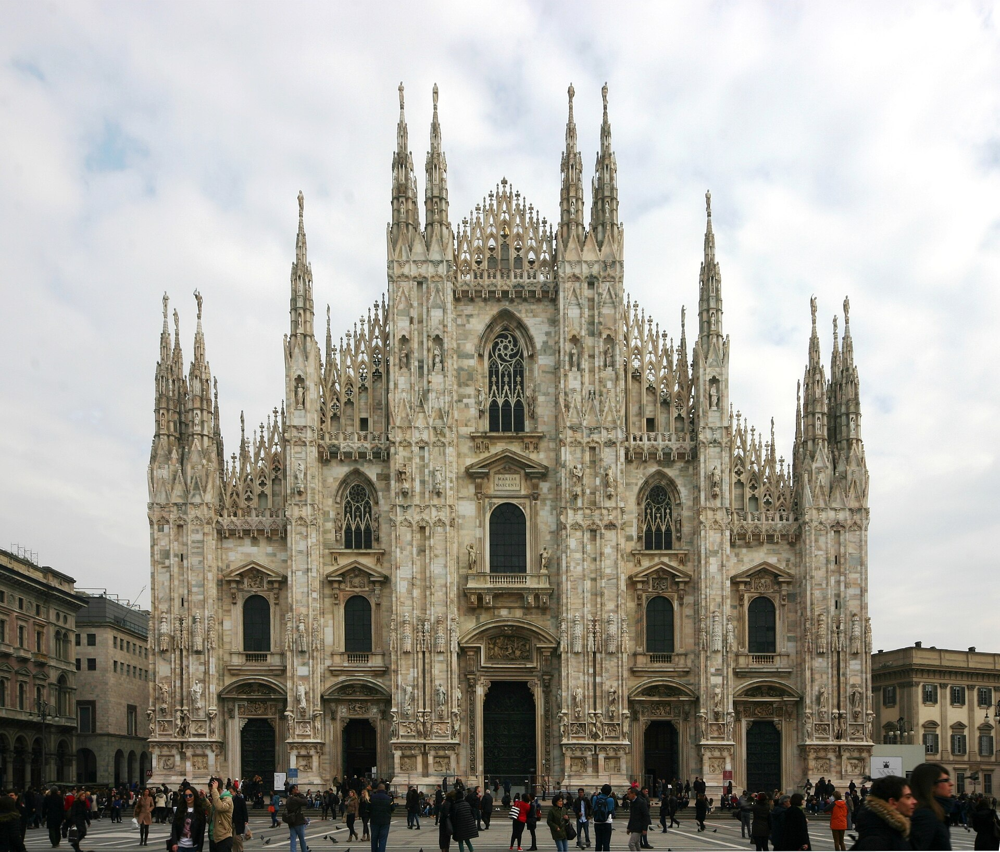
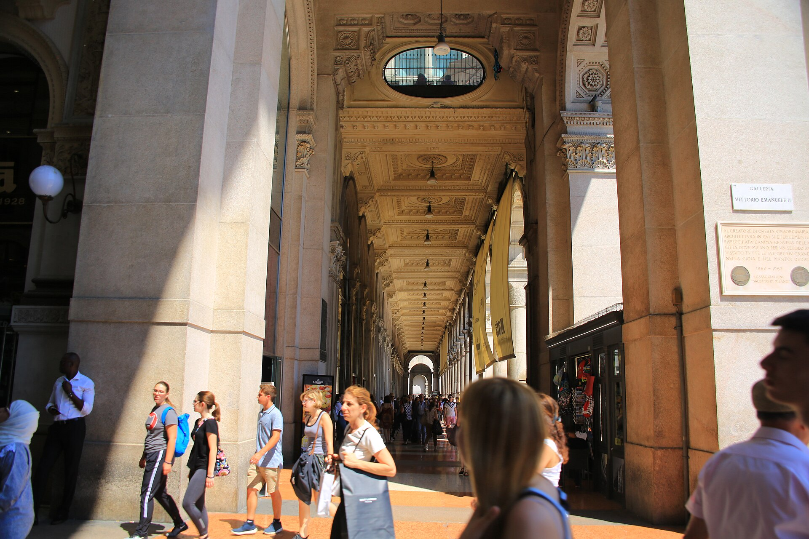
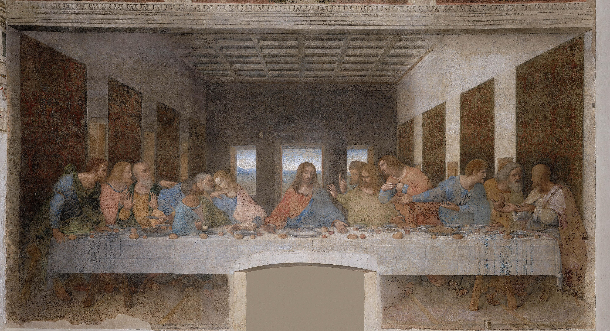
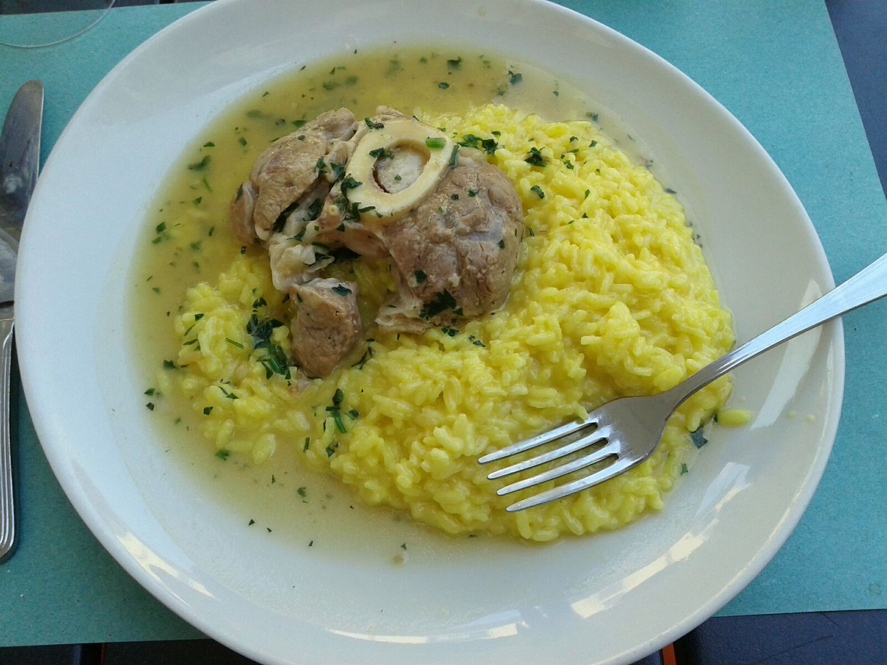
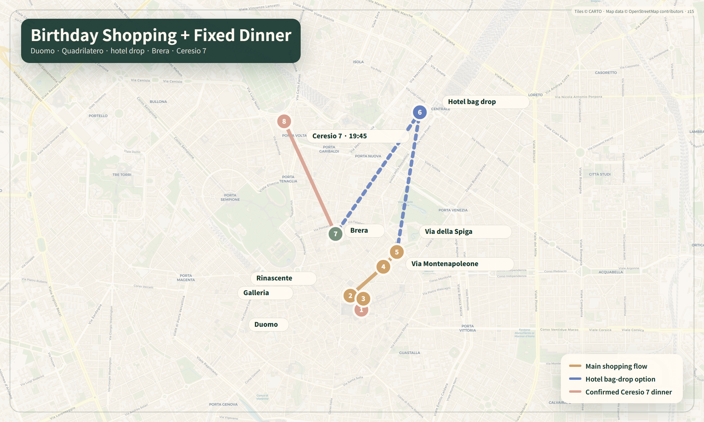

# 표지

## 밀라노 도시 여행가이드북

### UNA HOTELS Century Milano에서 시작해 예술·건축·미식·디자인으로 읽는 도시

> 여행 기간: 2026.07.21 화 - 2026.07.26 일
> 숙소: UNA HOTELS Century Milano, Via Fabio Filzi 25 B, 20124 Milano
> 작성·검증 기준일: 2026.07.10
> 원천 일정: `italy_honeymoon_guide.html`, `assets/map-data.json`, `info/milano_honeymoon_additional_info.md`
> 작성 원칙: 확정된 숙소·교통·생일 디너·관광 예약 순서는 바꾸지 않고, 도시를 더 깊이 이해할 설명을 덧붙인다.

---

# 1장. 이 여행의 확정 조건

<p class="lead">이 책은 밀라노 일정을 새로 짜는 문서가 아니다. 이미 예약한 호텔과 교통, 7월 22일 두오모, 7월 23일 생일 디너를 중심축으로 고정하고, 그 동선에서 마주치는 도시를 더 잘 읽도록 만든 학습형 필드 가이드다.</p>

## 1.1 먼저 구분할 것: 확정·예약필요·선택

| 상태 | 항목 | 이 책에서의 처리 |
|---|---|---|
| <span class="status-confirmed">확정</span> | UNA HOTELS Century Milano, 2026.07.21-07.26, 5박 | 모든 밀라노 동선의 출발·복귀 기준점 |
| <span class="status-confirmed">확정</span> | 07.21 Domodossola 15:49 → Milano Centrale 18:35 통합표 | 첫날은 호텔 체크인과 가까운 저녁만 운영 |
| <span class="status-required">증빙확인</span> | 07.22 Duomo 10:30 Fast-Track | 달력에는 예약완료, 다른 준비표에는 예약/저녁 슬롯 확인으로 섞여 있어 예약메일 기준 재확인 |
| <span class="status-required">예약필요</span> | 07.22 Cenacolo Vinciano 17:00 목표 | 표를 확보한 경우에만 16:30 도착 축 실행. 미확보 시 CityLife 등 백업 사용 |
| <span class="status-confirmed">확정</span> | 07.23 Ceresio 7, 19:45, 2명 | 생일 저녁은 변경하지 않음. 쇼핑은 이 예약에 맞춰 종료 |
| <span class="status-confirmed">확정</span> | 07.24 Varenna + Bellagio, 07.25 Bergamo Città Alta | Verona는 Day 5-1 대안일 뿐이며, 파업·날씨로 Bergamo가 불가능할 때만 전환 |
| <span class="status-confirmed">확정</span> | 07.26 BGY 15:10 → PRG 16:35 | 11:10-11:30 전후 Centrale 셔틀 탑승을 우선 |

> 주의
> `최후의 만찬 17:00`은 현재 원천 일정에서 **예약필요**로 표시되어 있다. 예약 완료로 오해하지 않는다. 공식 사이트는 전 입장권 예약을 요구하고 실제 작품 관람은 15분으로 제한한다.

## 1.2 숙소 고정값

<div class="fact-strip">
  <div><b>ADDRESS</b><span>Via Fabio Filzi 25 B</span></div>
  <div><b>CHECK-IN / OUT</b><span>14:00 이후 / 12:00 이전</span></div>
  <div><b>TRANSIT</b><span>Centrale·M2·M3 약 200m</span></div>
</div>

호텔 공식 안내 기준 Milano Centrale, 공항 셔틀 정류장, M2·M3 지하철이 약 200m이고 Duomo는 약 2.7km다. 이 위치의 가장 큰 장점은 ‘중앙 관광지 한가운데’가 아니라 **도착·당일치기·공항 이동이 모두 단순한 교통 베이스**라는 점이다. 반면 낭만적인 구시가지 골목을 문밖에서 바로 만나는 숙소는 아니므로, 저녁 분위기는 Brera·Navigli·Porta Nuova에서 만들고 귀환은 지하철 또는 택시로 단순화한다.

공식 서비스로 무료 Wi-Fi, 컨시어지, 택시 서비스, 세탁, 바·레스토랑 등이 안내되어 있다. 4성급 숙박세는 원천 자료 기준 2026년 말까지 1인 1박 €10로 잡아, 2명 × 5박 = **약 €100**을 객실요금과 별도로 준비한다. 실제 부과액과 포함 여부는 체크인 때 다시 확인한다.

## 1.3 이 책을 쓰는 순서

- 출발 전: 2장 ‘도시를 공부하는 법’과 14장 ‘실전 운영’을 읽는다.
- 07.21 호텔 도착 후: 3장 숙소 반경과 10장 음식의 ‘첫 저녁’만 읽는다.
- 07.22 아침: 4장 Duomo, 5장 Last Supper, 7장 Porta Nuova, 9장 Navigli를 순서대로 본다.
- 07.23 쇼핑 전: 11장 디저트, 12장 제품·Tax Free, 13장 Day 3 운영을 본다.
- 비·폭염·체력 저하: 8장의 실내 디자인 선택지에서 **한 곳만** 고른다.
- 현장에서 설명이 너무 많게 느껴지면 각 명소의 `왜 유명한가 → 꼭 볼 것 3개 → 예약`만 읽는다.

<figure class="guide-map">
  
  <figcaption>베이스캠프 전략. 도시 중심 관광과 당일치기, BGY 출국을 모두 Milano Centrale과 호텔로 회수한다. 이 지도는 권역 이해용이며 당일 길찾기는 공식 교통 앱과 Google Maps를 함께 확인한다.</figcaption>
</figure>

## 1.4 변동 정보 표시 원칙

요금·운영시간·파업·공연·전시·식당 메뉴는 바뀔 수 있다. 본문에서 현재 수치를 제시하더라도 **출발 7일 전, 2일 전, 전날 밤** 세 번 확인한다. 역사·작품 해설은 현장에서 오래 유효하지만, 티켓과 영업정보는 공식 페이지가 항상 우선이다.

---

# 2장. 밀라노를 공부하는 가장 좋은 방법

## 2.1 ‘명소 목록’보다 일곱 개의 도시 렌즈

밀라노는 로마처럼 고대 유적이 연속되는 도시도, 피렌체처럼 르네상스 중심부가 한눈에 완결되는 도시도 아니다. 여러 시대가 계속 덧씌워진 도시다. 아래 일곱 렌즈를 기억하면 서로 멀어 보이던 장소가 하나의 이야기로 연결된다.

<div class="lens-grid">
  <div class="lens-card"><h3>1 · 권력과 대성당</h3><p>Visconti·Sforza의 도시 야망이 Duomo와 Castello에 어떻게 물질화됐는지 본다.</p></div>
  <div class="lens-card"><h3>2 · 르네상스 실험</h3><p>Leonardo와 Bramante가 원근법, 회화기법, 궁정문화를 어떻게 바꾸었는지 읽는다.</p></div>
  <div class="lens-card"><h3>3 · 통일국가와 시민의 거실</h3><p>Galleria, Piazza Scala에서 19세기 상업·공공공간·이탈리아 통일의 상징을 본다.</p></div>
  <div class="lens-card"><h3>4 · 산업도시와 디자인</h3><p>철도역, 가구·조명·생활제품, Triennale와 Compasso d'Oro를 산업과 생활의 연결로 본다.</p></div>
  <div class="lens-card"><h3>5 · 도시재생</h3><p>Porta Nuova, BAM, Fondazione Prada에서 오래된 기반과 새 프로그램의 결합을 관찰한다.</p></div>
  <div class="lens-card"><h3>6 · 패션과 소비문화</h3><p>Quadrilatero와 Rinascente를 ‘무엇을 살까’뿐 아니라 쇼윈도·브랜드 연출·서비스의 무대로 본다.</p></div>
  <div class="lens-card"><h3>7 · 일상의 의식</h3><p>에스프레소, 아페리티보, 리소토, 판에토네를 통해 도시의 시간 사용법을 배운다.</p></div>
</div>

## 2.2 현장에서 쓰는 90초 관찰법

<div class="method-grid">
  <div class="method-card"><h3>먼저 멀리서</h3><p>건물의 실루엣, 광장과 길의 축, 사람들이 어디서 멈추는지 30초 본다.</p></div>
  <div class="method-card"><h3>다음은 가까이서</h3><p>재료, 표면, 접합부, 손때, 보수 흔적을 30초 본다. 밀라노는 대리석·벽돌·철·유리의 대비가 강하다.</p></div>
  <div class="method-card"><h3>마지막은 사람</h3><p>누가 이 공간을 쓰고 무엇을 하는지 30초 본다. 관광지와 생활공간의 차이가 선명해진다.</p></div>
  <div class="method-card"><h3>한 문장 기록</h3><p>“이 장소는 ___ 때문에 밀라노답다”를 휴대폰 메모에 남긴다.</p></div>
</div>

## 2.3 예술 작품은 세 가지만 본다

모든 작품을 이해하려고 하지 않는다. 각 미술관에서 대표작 3-5점만 미리 고른다. 작품 앞에서는 다음 순서를 쓴다.

1. **무슨 순간인가**: 사건 직전·직후인지, 인물들이 무엇을 알아차렸는지 본다.
2. **시선이 어디로 가는가**: 원근선, 빛, 손짓, 색이 눈을 어디로 끌고 가는지 찾는다.
3. **왜 이 도시인가**: 후원자, 정치, 종교, 기술 중 어떤 밀라노 조건이 작품을 만들었는지 연결한다.

## 2.4 건축은 ‘예쁜가’보다 네 가지 질문

- 이 건물은 기존 도시와 붙는가, 스스로 섬이 되는가?
- 사람을 위로 올리거나 아래로 내리는 레벨 변화가 있는가?
- 오래된 재료와 새 재료가 어떻게 만나는가?
- 외관의 인상과 내부 동선이 같은 메시지를 주는가?

이 질문은 Duomo의 테라스, Galleria의 십자형 통로, BAM의 고층군, Fondazione Prada의 증류소 재생 모두에 적용된다.

## 2.5 여행 전 7일 마이크로 학습

| 시점 | 20분 학습 | 현장에서 얻는 것 |
|---|---|---|
| D-7 | 지도에서 Centrale, Duomo, Brera, Cadorna, Navigli, Porta Nuova 표시 | 도시 방향감각 |
| D-6 | Duomo 공식 ‘Cathedral’과 ‘Terraces’ 페이지 읽기 | 대리석·첨탑·Madonnina 이해 |
| D-5 | Cenacolo 공식 작품·보존 페이지 읽기 | 15분 관람 때 볼 우선순위 |
| D-4 | Brera 공식 ‘5 Masterpieces’ 오디오 목록 저장 | 미술관 피로 감소 |
| D-3 | Triennale 또는 ADI에서 디자인 물건 5개 고르기 | 쇼핑이 물건 공부로 바뀜 |
| D-2 | risotto, ossobuco, cotoletta, mondeghili 차이 익히기 | 중복 주문 방지 |
| D-1 | ATM, 티켓, 신분증, 예약메일, 파업·날씨 확인 | 운영 리스크 감소 |

---

# 3장. UNA HOTELS Century Milano 생활권

## 3.1 숙소 주변을 세 개의 반경으로 이해하기

### 0-10분: 도착과 생존의 반경

- **Milano Centrale**: 열차역이자 공항 셔틀의 기준점. 역 자체도 20세기 밀라노의 야심과 권력 이미지를 읽는 건축물이다.
- **Piazza Duca d'Aosta**: 역 정면 광장. 낮에는 방향을 잡기 좋지만, 캐리어를 든 채 오래 머물기보다 호텔로 바로 이동한다.
- **Mercato Centrale Milano**: 시간이 부족한 아침, 물·빵·샌드위치를 빠르게 해결하는 백업. 원천 일정은 06:30 오픈 안내를 사용한다.
- **호텔 프런트**: 짐 보관, 택시 호출, 세탁, 식당 예약 재확인에 적극 활용한다.

### 10-25분: ‘새로운 밀라노’ 반경

- **Piazza Gae Aulenti**: 고가 광장과 수공간, 철도 위 도시재생을 체험한다.
- **BAM Biblioteca degli Alberi**: 단순 잔디공원이 아니라 식재 패턴과 문화 프로그램을 결합한 현대 공공공간이다.
- **Bosco Verticale**: BAM 쪽에서 볼 때 발코니와 식재가 입면을 만드는 방식이 가장 잘 읽힌다.
- **Isola**: 고층군 바로 옆의 낮은 생활가로. ‘재개발된 스카이라인’과 ‘기존 동네’의 경계를 보는 곳이다.
- **Corso Como**: Porta Nuova와 Garibaldi 사이의 상업·식음 축. 시간이 남을 때만 붙인다.

### 지하철 10-20분: 본격 관광 반경

- **M3 Centrale → Duomo**: 원천 일정 기준 4정거장. Duomo·Galleria·Quadrilatero의 가장 단순한 진입축이다.
- **M2 Centrale → Lanza/Cadorna/Porta Genova**: Brera·Castello·Last Supper·Navigli를 잇는다.
- **M2/M5 Garibaldi·Monumentale**: Ceresio 7, Cimitero Monumentale, ADI Design Museum 접근에 유리하다.

> 운영 원칙
> 7월 한낮에는 “도보 25분이면 가깝다”가 항상 정답이 아니다. 아침·해질녘에는 걸어서 도시 결을 보고, 13:30-16:00에는 M2·M3·택시로 체력을 산다.

## 3.2 Centrale 역을 그냥 통과하지 않는 법

역 정면에서 먼저 **거대한 수평 매스와 높은 아치**를 본다. 고전주의 장식처럼 보이지만 규모와 동선은 근대 대도시의 기계에 가깝다. 내부에서는 천장 높이, 장거리 승객을 위로 끌어올리는 계단과 에스컬레이터, 플랫폼 전실의 압도적인 축을 관찰한다. 이 역은 여행자에게 편리한 시설이면서, 20세기 이탈리아가 철도를 국가적 무대로 연출한 장소다.

관찰 질문:

- 왜 입구보다 계단과 전실이 더 극적으로 느껴지는가?
- 장식은 고대·중세를 연상시키는데, 실제 기능은 얼마나 현대적인가?
- Duomo의 수직성과 Centrale의 수평적 거대함은 어떤 차이가 있는가?

## 3.3 아침·첫 저녁 운영

| 상황 | 1순위 | 이유 |
|---|---|---|
| 07.22 여유 있는 아침 | Pasticceria Rovida | Centrale에서 크게 벗어나지 않고 커피와 페이스트리로 시작 |
| 시간이 촉박하거나 비 | Mercato Centrale Milano | 역과 붙어 있어 M3 동선 손실 최소 |
| 07.21 첫 저녁 | Osteria del Treno 20:15 권장 | 원천 일정에서 밀라노·롬바르디아 메뉴 회수율이 가장 높은 1순위 |
| 피곤하거나 예약 불가 | Barzac, Osteria Fara, Napule è, La Piola | 호텔 주변에서 컨디션별 선택, 멀리 이동하지 않음 |

첫날은 `mondeghili + risotto alla milanese 또는 ossobuco con risotto`처럼 도시 대표 메뉴를 시작할 수 있다. 그러나 두 사람이 리소토, 오소부코, 코톨레타를 한꺼번에 모두 주문하면 너무 무겁다. 전채 1개, 메인 축 1개, 채소 또는 디저트 1개를 공유하고 다음 날 다른 요리를 남겨 둔다.

## 3.4 숙소 복귀 규칙

- 밤에는 지하철 출구를 나오기 전에 호텔 방향을 확인하고, 휴대폰을 손에 든 채 광장 중앙에서 오래 서 있지 않는다.
- 쇼핑백이 많으면 Centrale 역을 가로질러 장거리 도보 이동하지 말고 택시 또는 가장 가까운 출구를 쓴다.
- 07.23 생일 쇼핑백 호텔 드롭은 **Brera 종료 후가 아니라 Brera 진입 전에** 한다. Quadrilatero에서 M3 Montenapoleone → Centrale로 복귀해 짐을 두고, M2로 Lanza에 재진입하면 19:45 Ceresio 7 예약을 해치지 않는다.
- 마지막 날 공항 셔틀 정류장 위치는 전날 낮에 한 번 걸어 보고 사진으로 남긴다.

---

# 4장. Duomo·Galleria·La Scala: 도시의 의식과 무대

## 4.1 Duomo di Milano — 왜 유명한가

Duomo 건설은 1386년경 시작됐다. Gian Galeazzo Visconti는 전통적인 롬바르디아 벽돌 대신 **Candoglia 대리석**과 국제 고딕 양식을 선택했다. 이를 위해 유럽 각지의 기술자·건축가·석공이 모였고, 성당은 수세기에 걸친 집단 제작소가 되었다. 그래서 Duomo는 한 시대의 완성품보다 **도시가 600년 동안 계속 고쳐 만든 살아 있는 프로젝트**로 보는 편이 정확하다.

<div class="fact-strip">
  <div><b>START</b><span>1386년경</span></div>
  <div><b>TERRACES</b><span>약 31m·45m 레벨</span></div>
  <div><b>STONE FOREST</b><span>135 첨탑·3,400+ 조각</span></div>
</div>

공식 테라스 안내는 135개의 첨탑, 3,400점이 넘는 조각, 150개의 가고일을 소개한다. 가장 높은 방문 가능 중앙 테라스는 약 45m이며, 주첨탑의 Madonnina는 1774년부터 도시를 내려다본다. 중요한 것은 숫자를 외우는 일이 아니라, 지상에서는 한 덩어리로 보이던 장식이 옥상에서 **사람 크기의 조각과 구조 부재**로 바뀌는 경험이다.

<figure class="guide-map">
  
  <figcaption>Duomo 정면. 수직선만 보지 말고 Candoglia 대리석의 분홍·회색 결, 중앙문 위의 층위, 첨탑과 조각이 만드는 ‘돌의 숲’을 구분해 본다. 사진: José Luiz Bernardes Ribeiro, CC BY-SA 3.0, Wikimedia Commons.</figcaption>
</figure>

### 테라스에서 꼭 볼 것

1. **Candoglia 대리석의 색**: 순백색이 아니라 분홍·회색 결이 섞여 있다. 빛과 풍화에 따라 표정이 달라진다.
2. **버팀과 장식의 결합**: 플라잉 버트레스와 첨탑이 구조인지 장식인지 한눈에 구분되지 않는다.
3. **Madonnina와 도시 수평선**: 성당이 오랫동안 밀라노 높이의 기준점이었던 상징을 떠올린다.
4. **근접 조각**: 지상에서 볼 수 없던 표정·주름·동물을 가까이 본다. 박물관을 가면 교체된 원작을 더 가까이 볼 수 있다.

### 내부에서 꼭 볼 것

- 거대한 기둥 열이 제단 방향으로 만드는 깊이와, 스테인드글라스의 색이 어두운 내부에 들어오는 방식.
- 바닥의 대리석 패턴. 정면 입면만 보고 나가면 놓치기 쉬운 ‘수평의 Duomo’다.
- 가능한 경우 고고학 구역에서 Santa Tecla와 초기 세례당의 흔적을 확인해, 현재 성당 아래에 이전 도시가 겹쳐 있음을 본다.
- 예배 공간이므로 모자, 큰 소리, 노출이 큰 옷을 피하고 얇은 셔츠나 숄을 준비한다.

### 07.22 예약 운영

<span class="status-required">증빙확인</span> 원천 일정 달력은 07.22 10:30 Fast-Track을 예약완료로 표시하지만, 별도 준비표에는 단순 ‘예약’과 07.23 저녁 슬롯 확인이 남아 있다. 실제 예약메일·바우처 날짜를 기준으로 하나로 확정한다. 07.22 10:30이 맞으면 09:40 광장 도착, 사진, 입구 확인, 테라스, 내부, 가능한 지하구역 순으로 본다. 큰 가방·캐리어·유리 물품을 피하고 작은 크로스백과 편한 신발을 쓴다. 테라스는 엘리베이터를 타더라도 상부에 계단이 남을 수 있다.

> 공식 사이트 확인 필요
> 운영시간과 입구, 개방 구역은 당일 종교행사·보수·날씨에 따라 달라질 수 있다. 예약 이메일의 입구명과 Duomo 공식 규정을 전날 다시 확인한다.

## 4.2 Galleria Vittorio Emanuele II — 쇼핑몰이 아니라 시민의 거실

Galleria는 Duomo와 Teatro alla Scala를 잇는 19세기 통로다. Giuseppe Mengoni가 설계했고 1865년 첫 돌을 놓아 1867년 개장했다. 유리와 철의 거대한 지붕은 날씨와 무관하게 산책·소비·만남이 가능한 공공 실내를 만들었다. 이곳이 ‘밀라노의 거실’이라 불리는 이유다.

<figure class="guide-map">
  
  <figcaption>Galleria의 축형 아케이드. 천장 장식·반복 기둥·통일 간판과 사람의 흐름이 하나의 실내 거리로 작동한다. 사진: Ray Swi-hymn, CC BY-SA 2.0, Wikimedia Commons.</figcaption>
</figure>

꼭 볼 디테일:

- 중앙 팔각형에서 네 방향 통로가 만드는 완벽한 대칭.
- 바닥의 밀라노·토리노·피렌체·로마 문장과 통일국가의 상징 체계.
- 유리 돔 아래의 유럽·아시아·아프리카·아메리카 알레고리.
- 모든 점포가 금색 글자와 검은 배경의 통일된 간판 규칙을 따르는 장면.
- 고급 매장만 보지 말고, 사람들이 어디서 멈추고 사진 찍고 약속하는지 관찰한다.

토리노 황소 모자이크 위에서 뒤꿈치로 세 바퀴 도는 행위는 관광 의식이 되었다. 작품 보존을 생각하면 무리하게 밀거나 오래 점유하지 말고, 바닥 문장 체계를 읽는 데 더 시간을 쓴다.

## 4.3 Piazza della Scala와 Teatro alla Scala

Galleria 북쪽 출구를 나서면 갑자기 공간의 톤이 바뀐다. 화려한 Galleria 뒤에 La Scala의 신고전주의 정면은 의외로 절제되어 있다. 1778년 Giuseppe Piermarini의 극장으로 시작한 뒤 전쟁과 개보수를 거쳤고, 오늘날까지 밀라노가 전통을 유지하면서 기술·운영을 갱신하는 방식의 상징이다.

2026년 7월 공식 달력은 여행 기간인 07.21-07.26에 본 공연을 표시하지 않는다. 공연을 억지로 기대하기보다 광장·외관과 Museo Teatrale alla Scala를 선택지로 본다. 박물관 입장권으로 3층 박스에서 극장 내부를 볼 수 있지만, 리허설·공연·행사가 있으면 시야가 제한될 수 있다. 무료 공식 앱에는 20·30·60·90분 오디오 코스가 있다.

관찰 질문:

- 왜 세계적 극장의 정면은 Galleria보다 조용한가?
- 광장 중앙 Leonardo 기념상과 Teatro, Palazzo Marino가 만드는 권력·예술의 삼각형은 무엇을 말하는가?
- 화려함이 외관보다 내부의 무대와 관객석에 집중되는 이유는 무엇인가?

## 4.4 Santa Maria presso San Satiro — 97cm로 만든 9.7m의 환영

Duomo에서 Via Torino 쪽으로 짧게 걸으면 Bramante의 원근법 실험을 무료로 볼 수 있다. 실제 후진 공간이 약 97cm에 불과했기 때문에, 그는 회화와 스투코로 약 9.7m 깊이처럼 보이는 가짜 합창석을 만들었다.

보는 순서:

1. 입구 중앙에서 제단 뒤가 깊다고 느끼는 순간을 먼저 경험한다.
2. 천천히 측면으로 이동해 환영이 무너지는 지점을 찾는다.
3. ‘사진에서 진짜처럼 보이는가’보다, 몸의 위치가 공간 인식을 어떻게 바꾸는지 생각한다.

이 장소는 Last Supper를 보기 전 훌륭한 예습이다. 두 작품 모두 원근법으로 실제 공간과 그려진 공간의 경계를 흔든다.

---

# 5장. Leonardo와 Sforza의 밀라노

## 5.1 왜 Leonardo의 대표작이 밀라노에 있는가

Leonardo는 피렌체 출신이지만, 밀라노의 Sforza 궁정에서 화가뿐 아니라 기술자·무대연출가·도시와 군사 프로젝트의 설계자로 일했다. 이 도시에서 그의 작업을 보면 ‘천재 한 사람’보다 **후원자, 궁정, 수도원, 기술 실험이 결합한 생산 환경**이 보인다.

## 5.2 Cenacolo Vinciano — 15분 동안 볼 순서

<span class="status-required">예약필요</span> 모든 표는 예약 필수이며, 공식 안내상 작품 관람은 15분, 한 타임 최대 40명이다. 07.22 17:00 표를 확보한 경우 16:30까지 매표소 도착, 신분증과 예약 확인 메일을 준비한다. 미확보 상태라면 현장 대기만 믿지 않는다.

작품은 1495-1498년경 Santa Maria delle Grazie 수도원 식당 북벽에 그려졌다. Leonardo는 젖은 회벽에 빠르게 그리는 전통 프레스코 대신 마른 벽에 색을 올리는 방식을 택했다. 천천히 수정하고 섬세한 빛을 만들 수 있었지만, 색이 회벽에 흡수되지 않아 일찍부터 손상되었다. ‘왜 관람 시간이 짧고 인원이 제한되는가’의 답은 이 취약한 재료와 보존 환경에 있다.

<figure class="guide-map">
  
  <figcaption>Leonardo da Vinci, 《최후의 만찬》. 원근선이 그리스도의 머리로 모이고, 열두 제자의 반응은 세 명씩 네 무리로 파동처럼 퍼진다. 공개 도메인 충실 복제 이미지, Wikimedia Commons.</figcaption>
</figure>

### 15분 관람 프로토콜

1. **0-2분 · 전체 공간**: 실제 식당의 벽과 그려진 방이 어떻게 이어지는지 본다. 원근선은 그리스도의 머리로 모인다.
2. **2-5분 · 사건의 파동**: “너희 중 하나가 나를 배신한다”는 말이 전달된 직후, 사도들이 세 명씩 무리를 이루며 반응하는 리듬을 본다.
3. **5-8분 · 손과 얼굴**: 베드로의 몸 기울기, 유다의 어두운 위치와 손, 도마의 들린 손가락, 벌어진 팔과 대화를 찾는다.
4. **8-11분 · 빛**: 실제 식당 왼쪽 창의 빛과 그림 속 빛이 어떻게 맞물리도록 설계됐는지 본다.
5. **11-13분 · 반대편 벽**: Donato Montorfano의 Crucifixion도 함께 보며 두 벽이 수도원의 식사·명상 공간을 어떻게 만들었는지 생각한다.
6. **13-15분 · 한 문장**: 가장 강한 감정의 인물 한 명을 고르고 이유를 메모한다.

> 주의
> 작품을 ‘선명한 르네상스 벽화’로 기대하면 실망할 수 있다. 지금 보이는 것은 오랜 손상과 복원 역사를 포함한 취약한 표면이다. 그 약함 자체가 이 작품의 재료 실험과 보존사를 증명한다.

## 5.3 Santa Maria delle Grazie

Last Supper만 보고 바로 떠나지 말고 외관의 붉은 벽돌과 Bramante가 관여한 동쪽부를 짧게 본다. 고딕 전통과 르네상스의 기하학적 질서가 한 건물에 만나는 장면이다. 작품 관람은 수도원 식당에서 이루어지므로 성당 입장과 별도라는 점도 기억한다.

## 5.4 Castello Sforzesco — 성, 궁정, 병영, 박물관

Castello의 기원은 14세기 Visconti 방어시설이며, 이후 Sforza 궁정과 군사 거점, 병영을 거쳐 오늘날 시립박물관군이 되었다. 무료로 들어가는 안뜰만 봐도 방어시설과 도시 궁정의 두 얼굴을 읽을 수 있다.

꼭 볼 우선순위:

- **Torre del Filarete와 안뜰**: 도시에서 성으로 진입하는 축과 벽돌 스케일.
- **Pietà Rondanini**: Michelangelo가 말년에 계속 다듬은 마지막 조각. 완성된 영웅적 육체보다, 어머니와 아들의 몸이 하나로 녹는 듯한 미완성 표면을 본다.
- **Parco Sempione 방향**: 성의 방어적 뒷면이 현대 공원과 연결되는 전환.
- 관심이 분명할 때만 회화·가구·악기·장식미술 컬렉션을 더한다. 한 번에 전부 보려 하지 않는다.

<span class="status-closed">2026 변동</span> Sala delle Asse는 복원으로 폐쇄 상태를 공식 공지에서 확인해야 한다. Leonardo의 이름만 보고 입장권을 사기 전에 실제 공개 구역을 확인한다. 안뜰은 매일 개방되지만 박물관은 월요일 휴관, 화-일 10:00-17:30 운영 안내가 기본이다. 현재 공식 홈페이지에는 **Corte Ducale 1층 16-26실(Pinacoteca, Museo dei Mobili e delle Sculture Lignee)을 특별보수로 13:00에 폐실**한다는 공지가 있다. 적용 종료일이 명시되지 않은 현행 공지이므로 방문 전날 다시 확인한다.

## 5.5 Pietà Rondanini를 보는 법

전성기 Michelangelo의 매끈하고 강한 신체를 기대하지 않는다. 이 작품에서는 돌에서 인체를 완전히 해방시키려는 대신, 형체가 다시 돌로 돌아가는 듯하다. 그리스도의 가느다란 다리, 마리아와 몸이 겹치는 축, 이전 구상의 흔적을 찾는다. ‘미완성이라 부족한 작품’이 아니라, 죽음과 구원을 다룬 노년의 작업 과정이 그대로 남은 작품으로 본다.

## 5.6 선택 확장: Sant'Ambrogio와 Pinacoteca Ambrosiana

- **Basilica di Sant'Ambrogio**: 도시 수호성인의 교회로, 밀라노의 기독교·중세 정체성을 이해하는 데 좋다. Last Supper 주변에서 시간이 남는 경우에만 선택한다.
- **Pinacoteca/Biblioteca Ambrosiana**: Leonardo의 Portrait of a Musician과 Codex Atlanticus 일부를 통해 ‘회화가·기록자·설계자’의 폭을 볼 수 있다. 다만 07.22 일정은 이미 밀도가 높으므로 다른 날과 교체할 때만 들어간다.

---

# 6장. Brera — 그림을 보고 골목에서 도시를 복습하는 법

## 6.1 Brera가 특별한 이유

Brera는 단순히 ‘예쁜 골목’이 아니다. Palazzo Brera 안에 Pinacoteca, Accademia di Belle Arti, Braidense 도서관, 천문대, 식물원이 겹쳐 있는 **예술과 학문의 복합지구**다. 미술관을 본 뒤 학생·주민·갤러리·카페가 섞인 골목으로 나오면 작품 감상과 도시 생활이 바로 이어진다.

Day 2에는 Duomo 이후 일정이 빡빡하므로 Brera 미술관까지 넣지 않는 편이 낫다. Day 3 생일 쇼핑의 마지막 골목으로 보는 것이 기본이며, 회화가 최우선이면 다른 블록을 덜어 Pinacoteca 1.5-2시간을 독립적으로 확보한다.

## 6.2 Pinacoteca di Brera의 다섯 작품

공식 무료 오디오 루트 ‘5 Masterpieces for You’를 미리 저장하면 방을 모두 읽지 않아도 된다.

### Andrea Mantegna, 《죽은 그리스도》

발이 화면 앞에 놓이고 머리가 멀어지는 극단적 단축법으로 유명하다. 정확한 원근법 시범이라기보다, 관람자를 죽은 몸 바로 앞에 세우는 감정적 장치다. 발이 예상보다 작게 처리된 이유, 상처와 얼굴의 고통, 화면 왼쪽 애도자들의 좁은 공간을 본다.

### Piero della Francesca, 《Montefeltro 제단화》

아치와 반원형 공간, 매달린 타조알 같은 형태, 차갑고 고른 빛이 인물들을 하나의 건축 안에 묶는다. 후원자 Federico da Montefeltro가 성스러운 장면에 어떻게 자신을 배치했는지 보며 권력과 신앙의 관계를 읽는다.

### Raphael, 《성모의 결혼》

바닥의 선과 인물 배열이 뒤쪽 중앙 성전으로 수렴한다. 앞 장면만 보지 말고, 원형 성전의 문이 다시 먼 풍경으로 열리는 이중 깊이를 본다. 젊은 Raphael이 Perugino의 질서를 얼마나 자신감 있게 정리했는지 느낄 수 있다.

### Caravaggio, 《엠마오의 저녁식사》

화려한 색보다 어둠과 절제된 빛, 늙고 피곤한 얼굴에 주목한다. 부활한 그리스도를 알아차리는 순간이 손과 몸의 움직임으로 번진다. Last Supper의 집단적 반응과 비교하면 ‘식탁에서 깨달음이 일어나는 방식’이 달라진다.

### Francesco Hayez, 《키스》

연인의 낭만적 장면으로 널리 소비되지만, 1859년 이탈리아 독립과 통일의 정치적 분위기 속에서 발표됐다. 남자의 한쪽 발이 계단에 올라 있고 망토 아래 단검처럼 보이는 형태가 있어, 작별과 긴박함이 함께 느껴진다. 사랑 이미지와 Risorgimento의 상징이 겹친다.

## 6.3 관람 운영

<div class="fact-strip">
  <div><b>OPEN</b><span>화-일 08:30-19:15</span></div>
  <div><b>LAST ENTRY</b><span>18:00</span></div>
  <div><b>BOOKING</b><span>예약 필수 안내</span></div>
</div>

Grande Brera 티켓은 Pinacoteca와 Palazzo Citterio를 묶는다. Citterio는 근현대 컬렉션을 보여 주지만 둘을 같은 날 모두 보면 3시간 이상 걸릴 수 있다. 첫 방문은 Pinacoteca 대표작 5점에 집중하고, 디자인·현대미술 관심이 더 크면 Citterio 또는 Triennale 중 하나만 추가한다.

월요일 휴관. 4-10월 Brera 식물원은 월-토 10:00-18:00 무료 안내가 기본이므로 미술관 전후 20-30분의 조용한 전환 공간으로 좋다.

## 6.4 골목에서 볼 것

- **Via Brera**: 미술관 정면과 상업 가로가 만나는 중심축.
- **Via Fiori Chiari**: 오래된 골목의 비례와 현대 상업의 혼합. 7월 23일은 셋째 일요일 시장과 관계없으므로 골동품시장 기대는 하지 않는다.
- **Piazza del Carmine**: 교회 전면과 카페 테라스가 동네 거실을 만드는 방식.
- **Piazza San Marco**: 번화한 Brera보다 생활감 있는 광장.
- **Via Madonnina·Via Solferino**: 쇼윈도, 갤러리, 오래된 외벽의 재료를 천천히 본다.

Day 3에는 향수·디자인 소품·아트 프린트처럼 개인적 선물을 찾는 마무리 지구로 쓴다. 모든 상품이 밀라노산은 아니므로 브랜드 역사와 제조국을 따로 확인한다.

---

# 7장. Centrale에서 Porta Nuova까지 — 산업도시와 도시재생

## 7.1 Pirelli Tower — 경제기적의 얇은 마천루

Centrale 맞은편의 Pirelli Tower는 Gio Ponti와 Pier Luigi Nervi 등이 만든 20세기 밀라노의 상징이다. 전쟁으로 파괴된 피렐리 공장 부지에 올라선 127m, 31층 철근콘크리트 고층건물로, 산업기업과 전후 경제성장의 자신감을 보여 준다.

정면에서만 보지 말고 건물 양끝이 칼날처럼 가늘어지는 평면을 찾는다. 거대한 Centrale의 무겁고 장식적인 매스와, Pirelli의 얇은 유리·구조 표현을 한 프레임에서 비교하면 1930년대와 1960년대의 미래상이 달랐음을 알 수 있다. 내부 관광지는 아니므로 외관 10분이면 충분하다.

## 7.2 Shoah Memorial · Platform 21

Centrale 아래에는 1943-1945년 유대인과 정치범을 강제수용소로 보내던 화물열차가 출발한 실제 공간이 남아 있다. 지상의 웅장한 승객역과 보이지 않는 하부 플랫폼이 같은 건물에 공존한다는 점이 핵심이다.

입구의 `INDIFFERENZA`라는 단어, 실제 화차, 추방자들의 이름을 본다. 이 장소는 여행을 ‘아름다운 도시 소비’로만 만들지 않고, 건축과 기반시설이 권력에 어떻게 사용될 수 있는지 생각하게 한다.

2026년 공식 안내 기본값은 금요일 휴관, 그 외 10:00-16:00, 마지막 입장 15:30, 성인 €10이다. 45-60분을 별도로 확보하고 가벼운 관광 블록 사이에 끼우지 않는다. 감정적으로 무거운 장소이므로 이후 일정에 휴식 시간을 둔다.

## 7.3 Porta Nuova — 철도 위에 만든 새 중심

Porta Nuova는 단일 건물보다 **역·광장·상업·공원·주거를 연결한 보행 네트워크**로 봐야 한다. 호텔에서 걸어서 접근할 수 있는 가장 중요한 현대 밀라노다.

추천 순서:

`UNA HOTELS → Via Pirelli → Piazza Gae Aulenti → Egg → BAM → Bosco Verticale → Isola`

### Piazza Gae Aulenti

원형 고가 광장은 주변 도로와 철도, 지하 상업을 여러 레벨로 묶는다. 중앙 수공간은 단순 장식이 아니라 하늘과 타워를 반사해 광장의 시각적 중심을 만든다. 사람들의 계단 앉기, 쇼핑·통근 동선, 사진 촬영 지점이 겹치는 장면을 본다.

### Egg

Alberto Garutti의 음향 설치는 23개의 금속 튜브로 지하 주차장과 광장의 소리를 연결한다. 거대한 재개발 속에서 작은 몸의 감각을 개입시키는 공공미술로 본다.

### BAM Biblioteca degli Alberi

‘나무 도서관’이라는 이름처럼 식물 종과 원형 숲, 선형 길, 활동 공간이 하나의 목록처럼 배열된다. 공원에서 Bosco Verticale를 올려다보면 개별 건물이 아니라 녹지·주거·보행이 결합한 도시 실험으로 읽힌다.

### Bosco Verticale

76m와 100m 주거타워의 발코니에 약 800그루의 나무, 4,500개의 관목, 15,000개의 식물이 배치된 것으로 공식 관광 자료가 소개한다. 식물은 장식 화분이 아니라 입면의 계절 변화, 그늘, 생물서식과 유지관리 시스템을 만든다.

사유 주거이므로 내부 입장을 시도하지 않는다. BAM과 Via Gaetano de Castillia에서 발코니 깊이, 수종과 높이에 따른 식재 밀도, 두 타워의 서로 다른 실루엣을 본다.

## 7.4 Isola — 새 도시 옆의 기존 동네

Bosco Verticale 사진만 찍고 돌아서면 재개발의 절반만 본다. Isola의 낮은 가로와 상점, 카페, 주거 입구를 걸으며 고층의 새 자본과 기존 생활권이 어떻게 접하는지 본다. 동네를 ‘힙한 배경’으로만 소비하지 말고 주민 통행을 막지 않는다.

## 7.5 07.22 일정에 넣는 정확한 방식

Duomo·Galleria 이후 Porta Nuova 점심 블록은 13:30-15:30이다. 무더위에는 야외 전체를 완주하려 하지 말고 다음만 남긴다.

1. 점심 장소에서 짧게 식사.
2. Mancuso Gelati는 원하는 경우 작은 컵으로 빠르게.
3. Bosco Verticale를 BAM에서 한 번 제대로 보기.
4. Piazza Gae Aulenti 수공간을 지나 지하철로 이동.

Last Supper 17:00 표를 확보한 경우 15:45에는 이동을 시작한다. 미확보 시에만 CityLife 같은 백업을 검토한다.

---

# 8장. 디자인 수도를 이해하는 네 곳

## 8.1 먼저 선택 기준

| 관심 | 1순위 | 이유 | 권장 시간 |
|---|---|---|---:|
| 이탈리아 디자인 입문 | Triennale Museo del Design Italiano | 약 400개 물건을 1920s-2000s 흐름으로 읽기 좋음 | 1.5-2시간 |
| 수상제품·산업디자인 | ADI Design Museum | Compasso d'Oro를 통해 제품·기업·사회 연결 | 1-1.5시간 |
| 현대미술+재생건축 | Fondazione Prada | 1910년대 증류소와 OMA 신축의 대비 | 2-3시간 |
| 도시·기업·조각사 | Cimitero Monumentale | 기업가 묘역과 150년 건축양식이 한 야외공간에 공존 | 1.5-2시간 |
| 스타 건축과 마스터플랜 | CityLife | Hadid·Isozaki·Libeskind 타워·주거·공원 비교 | 1-1.5시간 |

현재 일정에는 디자인 반나절이 따로 없다. **한 곳만 선택**하는 것이 원칙이다. 폭염·비로 야외 블록을 줄일 때 Triennale 또는 ADI가 가장 실용적이다.

## 8.2 Triennale Milano

Triennale는 100년 넘게 디자인·건축·예술·공연을 교차시켜 온 기관이다. 상설 Museo del Design Italiano는 약 400개 물건으로 1920년대부터 2000년대까지 이탈리아 디자인을 산업·사회와 함께 보여 준다.

볼 때 브랜드 이름만 외우지 않는다.

- 어떤 생활문제를 해결했는가?
- 재료와 생산기술이 이전 제품과 무엇이 다른가?
- 사용하기 쉬운가, 상징성이 더 강한가?
- 지금 집에 놓아도 자연스러운가, 시대성이 보이는가?

화-일 10:30-20:00, 월요일 휴관. 건물과 정원 입장은 무료지만 일부 전시·공연은 티켓이 필요하다. 상설 디자인뮤지엄 공식 표기는 성인 €14, 학생 무료다. Cadorna M1·M2에서 Parco Sempione를 통해 접근하기 좋다.

## 8.3 ADI Design Museum — 2026년 7월은 축소 운영

Compasso d'Oro는 1954년 시작된 이탈리아 산업디자인상이다. 좋은 모양뿐 아니라 기능, 생산, 기술, 사회적 의미가 결합한 프로젝트를 살펴보는 자료다.

<span class="status-closed">확장공사</span> 2026년 7월에는 확장공사로 Compasso d'Oro 갤러리만 무료 개방되고, bookshop과 bistrot는 임시 폐쇄라는 공식 공지가 있다. 8월 휴관, 9월 재개장 예정. 금요일 휴관, 나머지 요일 10:30-20:00 안내를 출발 직전 다시 확인한다.

축소 운영이라도 07.23 Ceresio 7과 같은 Via Ceresio 축에 있어 지리적으로는 흥미롭다. 다만 생일 쇼핑과 디너 사이에 억지로 넣지 않는다.

## 8.4 Fondazione Prada — 오래된 증류소와 새 건축의 충돌

OMA/Rem Koolhaas가 1910년대 증류소의 기존 건물과 Podium, Cinema, Torre 같은 신축을 병치했다. 하나의 통일된 미술관보다 오래된 것과 새것, 낮은 것과 높은 것, 거친 것과 정밀한 것이 계속 충돌하는 캠퍼스다.

볼 디테일:

- 기존 산업건축의 흔적과 새 구조가 만나는 접합부.
- 금박 외관의 Haunted House가 주변의 거친 재료와 만드는 과장된 대비.
- 60m Torre 각 층의 다른 평면·높이·빛.
- 중정에서 건물 사이의 여백이 관람 동선을 만드는 방식.
- Wes Anderson이 디자인한 Bar Luce의 ‘영화적 과거’와 실제 미술관 운영의 차이.

월·수-일 10:00-19:00, 화요일 휴관. Milano+Osservatorio 통합 €15 안내가 기본이고 외부공간·bookshop·Bar Luce는 티켓 없이 접근 가능하다. 07.22에는 Navigli 대신 통째로 바꾸는 대안일 뿐, Last Supper와 함께 넣지 않는다.

## 8.5 Cimitero Monumentale — 밀라노 기업가의 야외박물관

1866년 이후 기업가·예술가·시민이 자신의 기억을 건축과 조각으로 표현한 곳이다. Famedio, Toscanini, Bernocchi, Campari, Pirelli, Bocconi 같은 이름을 따라가면 밀라노의 문화와 산업 네트워크가 묘역에 재현된다.

추천 루트:

1. Famedio와 Alessandro Manzoni.
2. BBPR의 강제수용소 희생자 기념물.
3. Toscanini 묘역.
4. Bernocchi 묘당의 나선형 수난 조각.
5. Campari 가족 묘의 청동 《최후의 만찬》.
6. Pirelli·Bocconi·Falck 등 기업가 묘역.

Campari 묘는 Leonardo의 식탁 구도를 청동 조각으로 변주한다. 실제 Last Supper를 본 뒤 비교하면 작품이 종교·브랜드·가족 기억으로 다시 번역되는 과정을 볼 수 있다.

화-일 08:00-18:00, 마지막 입장 17:30, 월요일 휴관, 무료 안내가 기본이다. 늦어도 17시 전에 들어간다. 묘지이므로 조용히 걷고 장례나 추모 중인 사람을 촬영하지 않는다.

## 8.6 CityLife — 세 타워보다 마스터플랜

옛 전시장 부지를 Zaha Hadid, Arata Isozaki, Daniel Libeskind의 건축과 공원·주거·상업으로 재생한 지구다. M5 Tre Torri에서 내리면 세 타워의 수직성·비틀림·곡선을 한 번에 비교할 수 있다.

- Isozaki/Allianz: 곧고 반복되는 수직성.
- Hadid/Generali: 비틀리는 몸체와 동적 실루엣.
- Libeskind/PwC: 굽은 형태가 원형 광장을 감싸는 방식.
- Hadid·Libeskind 주거동: 타워의 조형언어가 발코니와 생활 스케일로 내려오는 방식.
- ArtLine과 공원: 기업 업무지구가 공공공간을 어떻게 제공하는지.

무료 외부 산책이며 2026년에도 CityWave 공사가 진행되는 변화 중인 경관이다. Last Supper 미예약 시 늦은 오후 75-90분 대안으로만 쓴다.

---

# 9장. Navigli — 물류 기반시설이 저녁 문화가 된 곳

## 9.1 왜 밀라노에 운하가 있는가

Navigli를 단순한 술집 거리로 보면 역사적 이유를 놓친다. 운하는 농업용수와 물자 운송, 도시 공사를 연결했다. Candoglia 대리석도 Toce 강, Lake Maggiore, Ticino, Naviglio Grande를 거쳐 Duomo 공사장 가까이 이동했다. Leonardo는 밀라노 체류 중 수문과 물 조절 문제를 연구했다.

오늘날 Naviglio Grande와 Naviglio Pavese는 Darsena에서 만나고, 옛 항구 주변은 산책·아페리티보·저녁 문화의 중심이 되었다. **인프라가 여가 공간으로 용도를 바꾼 도시재생**으로 읽는다.

## 9.2 가장 좋은 걷기 순서

`M2 Porta Genova → Darsena → Naviglio Grande → Vicolo dei Lavandai → 저녁식사`

- **Darsena**: 두 운하가 만나는 넓은 수면과 옛 항구의 형태.
- **case di ringhiera**: 공동 철제 발코니를 가진 저층 주거. 관광용 세트가 아니라 실제 생활건축이므로 사생활을 지킨다.
- **Vicolo dei Lavandai**: 경사진 세탁석과 지붕 아래 작업공간. 도시 가사노동의 흔적이다.
- **다리 위 시점**: 수면 반사, 저층 건물, 테라스 조명이 한 프레임에 들어온다.
- **Tortona/MUDEC 방향**: 디자인·문화지구로 더 확장할 수 있지만 07.22에는 저녁과 휴식이 우선이다.

일몰 45-60분 전에 도착하면 밝은 운하와 야간 조명이 바뀌는 과정을 모두 볼 수 있다. 7월 저녁과 주말은 붐비므로 수변 첫 줄만 고집하지 않는다.

## 9.3 Aperitivo를 식사와 구분하기

Aperitivo는 저녁식사 전 음료와 가벼운 음식으로 하루의 일을 전환하는 사회적 시간이다. 음식이 많이 나온다고 항상 `apericena`, 즉 저녁 대용은 아니다. `Cosa è incluso con l'aperitivo?`라고 포함 범위를 묻고, 이미 Osteria 저녁을 계획했다면 작은 음료 한 잔만 고른다.

밀라노 연결성이 강한 선택:

- Campari Seltz: 드라이하고 쌉쌀한 가장 직접적인 Campari 경험.
- Negroni Sbagliato: Bar Basso에서 진 대신 스푸만테를 넣어 탄생했다고 전해지는 밀라노 칵테일.
- Campari Spritz: Aperol보다 밀라노 연결성이 강한 변형.
- 무알코올: `un aperitivo analcolico, non troppo dolce`라고 요청.

## 9.4 07.22 저녁 식사 선택

원천 일정의 1순위는 Osteria del Binari, 옵션은 El Brellin과 NAVIGLIO 48이다. 첫날 전통 메뉴와 겹치지 않게 고른다.

- Day 1에 ossobuco+risotto를 먹었다면 Day 2는 `cotoletta + riso al salto`로 식감과 조리법을 바꾼다.
- Day 1에 가벼운 피자·파스타를 먹었다면 Day 2에 `mondeghili + ossobuco con risotto`를 회수한다.
- 두 사람이 risotto, ossobuco, cotoletta를 모두 한 번에 시키지 않는다.
- Navigli 분위기를 위해 El Brellin을 고를 수 있지만, 전통 메뉴 회수율은 Osteria del Binari가 더 분명하다.

---

# 10장. 밀라노 음식 — 무엇을 왜 먹는가

## 10.1 ‘전통’ 표시를 읽는 법

Comune di Milano의 De.Co.는 상품의 절대적 품질등급이라기보다, 도시 역사·문화와 연결된 음식이라는 지역성 표시다. Risotto, ossobuco, cotoletta, mondeghili, michetta, panettone, cassoeula 등이 포함된다. 한 접시가 De.Co. 이름을 쓴다고 자동으로 훌륭한 것은 아니지만, **무엇이 밀라노의 기억으로 관리되는가**를 이해하는 출발점이다.

## 10.2 7월 우선순위

<div class="decision-grid">
  <div class="decision-card"><h3>1 · Risotto alla milanese</h3><p><b>왜:</b> 샤프란의 금빛과 쌀·버터·육수 중심의 롬바르디아 식문화. <b>판별:</b> 밥알은 al dente, 전체는 부드럽게 흐르는 질감. <code>È con midollo?</code>로 골수 포함을 확인한다.</p></div>
  <div class="decision-card"><h3>1 · Ossobuco con risotto</h3><p><b>왜:</b> 송아지 정강이의 뼈구멍·골수·gremolada와 금빛 리소토의 대표 결합. <b>판별:</b> 부드러운 고기, 남아 있는 중앙 골수, 무거움을 자르는 레몬·파슬리 향.</p></div>
  <div class="decision-card"><h3>2 · Mondeghili</h3><p><b>왜:</b> 남은 익힌 고기·빵·달걀을 되살린 밀라노식 절약 요리. <b>판별:</b> 토마토소스 미트볼이 아니라 버터에 지진 전채이며, 두 사람이 공유하기 좋다.</p></div>
  <div class="decision-card"><h3>2 · Cotoletta alla milanese</h3><p><b>왜:</b> 뼈 붙은 송아지 갈비와 버터 조리의 오래된 도시 대표 음식. <b>질문:</b> <code>con osso, alta, fritta nel burro?</code> 얇고 큰 <i>orecchia d'elefante</i>는 현대 변형이다.</p></div>
  <div class="decision-card"><h3>3 · Riso al salto</h3><p><b>왜:</b> 남은 리소토를 바삭한 원반으로 되살리는 회수 음식. 이미 리소토를 먹은 다음 날 식감 비교용으로 고른다.</p></div>
  <div class="decision-card"><h3>3 · Michetta</h3><p><b>왜:</b> 별·장미 모양과 속이 빈 구조의 밀라노 대표 빵. 갓 구운 바삭함이 핵심이며 장거리 선물보다 당일 간식에 맞다.</p></div>
  <div class="decision-card"><h3>7월 제외 · Cassoeula</h3><p>돼지고기와 사보이 양배추의 겨울 고열량 음식이다. 도시 전통은 맞지만 계절이 맞지 않으므로 7월에 억지로 찾지 않는다.</p></div>
</div>

## 10.3 Risotto alla milanese

샤프란은 단순한 색소가 아니라 쌀·버터·치즈·육수의 지방감에 향과 쌉쌀한 깊이를 더한다. 좋은 리소토는 볶음밥처럼 마르지도, 죽처럼 퍼지지도 않는다. 접시를 움직이면 천천히 퍼지는 `all'onda` 질감과 가운데 살아 있는 쌀알을 본다.

골수 `midollo`를 넣는 전통형은 풍미가 진하다. 채식 여부가 중요하면 육수와 골수 모두 확인해야 한다. 오소부코와 함께 먹을 때는 리소토가 별도 메인이 아니라 고기의 소스와 구조를 받치는 한 접시가 된다.

## 10.4 Ossobuco

`oss bus`는 밀라노 방언으로 ‘구멍 난 뼈’를 뜻한다. 송아지 정강이 단면을 천천히 익혀 고기와 결합조직을 부드럽게 만들고, 중앙 골수를 숟가락으로 먹는다. 마무리의 gremolada — 레몬 껍질, 파슬리, 마늘 계열 — 가 무거운 고기에 밝은 향을 준다.

<figure class="guide-map">
  
  <figcaption>Ossobuco con risotto alla milanese. 중앙의 뼈구멍·골수, 샤프란 리소토의 노란색, 허브와 레몬 계열의 마무리를 함께 본다. 사진: pier, CC BY-SA 4.0, Wikimedia Commons.</figcaption>
</figure>

처음 먹는다면 `ossobuco di vitello con risotto alla milanese`로 한 번에 경험한다. 두 사람이 메인 하나를 공유할 수 있는지 식당에 묻고, 전채는 가볍게 둔다.

## 10.5 Cotoletta

전통형은 뼈가 붙은 두툼한 송아지 갈비에 빵가루를 입혀 버터로 익힌다. 얇게 펴서 접시 밖으로 넘칠 만큼 큰 `orecchia d'elefante`도 흔하지만 같은 경험은 아니다. 어느 쪽이 ‘더 맛있다’보다, 주문 전에 원하는 스타일을 고른다.

- 전통형을 원하면: `La cotoletta è con osso e alta?`
- 버터 조리를 확인: `È fritta nel burro?`
- 두 사람이 공유할 때: `Possiamo dividerla in due?`

## 10.6 Mondeghili와 Riso al salto — 남은 음식의 지혜

두 음식은 밀라노 요리가 화려한 궁정음식만이 아니라, 남은 재료를 다른 식감으로 되살리는 도시 가정식이었음을 보여 준다. Mondeghili는 익힌 고기와 빵을 작은 완자로 만들고, riso al salto는 전날 리소토를 팬에 눌러 겉을 바삭하게 만든다. 한 여행에서 둘을 모두 먹으면 ‘버터와 재활용’이라는 공통 원리를 맛으로 이해할 수 있다.

## 10.7 일정에서 중복 없이 먹기

### 07.21 Osteria del Treno 1순위

<span class="status-option">예약권장</span> 예약완료 식당은 아니다. 20:15 도착을 목표로 방문 전 좌석을 확인한다. 공식 메뉴의 최근 공개값은 변동 가능성이 있지만 `mondeghili → ossobuco con risotto`가 가장 효율적인 첫 경험이다. 둘이 충분히 배부르면 디저트는 다음 날 남긴다.

### 07.22 Osteria del Binari 1순위

첫날 오소부코와 리소토를 먹었다면 `cotoletta + riso al salto`로 바꾼다. 첫날 피자·가벼운 식사를 했다면 여기서 `mondeghili + ossobuco con risotto`를 회수한다. El Brellin은 운하 바로 옆 분위기를 더 원할 때, NAVIGLIO 48은 캐주얼한 대안으로 둔다.

### 07.23 Ceresio 7 확정

<span class="status-confirmed">예약완료</span> 이 저녁은 전통 메뉴 수집보다 **현대 밀라노의 루프탑·서비스·스카이라인과 기념일 경험**에 초점을 둔다. 낮에 전통 음식을 무겁게 먹지 말고, 쇼핑 중간 점심과 디저트를 조절한다.

## 10.8 식당 이용의 작은 규칙

- `coperto`는 좌석·식기 등을 포함한 커버차지로 메뉴에 표시될 수 있다. 팁과 같은 뜻은 아니다.
- 물은 `acqua naturale` 또는 `frizzante`를 고른다. 수돗물을 자동으로 무료 제공하는 문화로 가정하지 않는다.
- 두 사람이 여러 요리를 공유하고 싶으면 주문 전에 가능 여부를 묻는다.
- 알레르기는 `Sono allergico/a a ...`로 분명히 말하고, 중증이면 이탈리아어 카드도 준비한다.
- 계산은 `Il conto, per favore.`라고 요청한다. 카드 결제 전 금액을 확인한다.

---

# 11장. 디저트·커피·아페리티보

## 11.1 Panettone — 7월에도 먹을 가치가 있는 밀라노의 상징

높은 돔형 발효빵에 버터, 달걀, 건포도, 설탕에 절인 오렌지·시트론이 들어간다. 크리스마스 음식이지만 밀라노를 대표하는 수출품이 되었고, 일부 전통 파스티체리아는 연중 생산한다.

7월에는 아무 매장에서나 ‘전통 파네토네’가 있다고 가정하지 않는다. Pasticceria Cucchi처럼 연중 생산을 명시한 곳이나, 밀라노 상공회의소의 전통 공방 지도를 확인한다. 먼저 한 조각과 커피로 맛을 본 뒤 선물용 크기와 유통기한을 고른다.

판별 포인트:

- 손으로 찢었을 때 긴 결이 이어지는가.
- 버터 향과 감귤 껍질 향이 인공적으로 튀지 않는가.
- 지나치게 마르지 않고 속이 촉촉한가.
- 포장 전 제조일·유통기한·보관법을 확인했는가.

## 11.2 Cannoncino, brioche, gelato의 정확한 위치

- **Cannoncino**: 커스터드가 든 나선형 퍼프 페이스트리. 밀라노 파스티체리아에 잘 어울리지만 북이탈리아에 널리 퍼져 있어 ‘밀라노 고유’라고 단정하지 않는다. 바삭한 껍질과 눅눅하지 않은 크림이 핵심이며 시칠리아 cannolo와 다르다.
- **Brioche**: 아침 커피와 함께 먹는 이탈리아식 페이스트리. 지역 고유 디저트보다 일상 리듬을 체험하는 음식이다.
- **Gelato**: 이탈리아 일반 문화다. `artigianale` 간판만 믿지 말고 지나치게 높이 쌓인 형광색 진열보다 제철 맛, 자연스러운 색, 원재료 설명을 본다.

젤라또 주문:

`Una coppetta piccola, due gusti: pistacchio e limone, per favore.`
작은 컵, 두 가지 맛, 피스타치오와 레몬을 부탁한다는 뜻이다. 진한 맛과 산뜻한 맛을 짝지으면 적은 양으로 비교하기 좋다.

## 11.3 Barbajada와 Pan de Mej

Barbajada는 커피·초콜릿·우유를 섞은 역사적 밀라노 음료로 De.Co.에 등록됐지만 지금은 흔하지 않다. 발견하면 ‘희귀해서 무조건 맛있다’가 아니라, La Scala 주변 카페 문화와 연결된 도시 음료로 경험한다.

Pan de Mej는 옥수수가루와 엘더플라워 향의 봄철 과자다. 4월 23일 전통과 연결되므로 7월 최우선은 아니다. 계절에 맞지 않는 음식을 억지로 체크리스트화하지 않는 것이 좋은 미식 여행이다.

## 11.4 커피는 카운터와 테이블이 다르다

`Un caffè`는 기본적으로 에스프레소다. 카운터 `al banco`에서 빠르게 마시는 가격과 테이블 `al tavolo` 서비스 가격이 다를 수 있다.

- 에스프레소 + 페이스트리: `Un caffè e una brioche, al banco.`
- 우유 조금: `Un caffè macchiato.`
- 짧고 진하게: `Un ristretto.`
- 차가운 커피 여부: `Avete un caffè freddo?`

Marchesi 1824 Galleria는 쇼핑 중간 디저트와 패키지 경험이 강하다. 역사적 공간과 서비스 비용까지 포함한 경험으로 보고, 모든 제품이 밀라노 고유 레시피라고 가정하지 않는다.

## 11.5 Campari와 밀라노 칵테일

### Campari Seltz

Camparino에서 1915년부터 이어진 대표 주문으로 소개된다. Campari와 강한 탄산수의 드라이하고 쌉쌀한 조합이다. 단맛이 많은 칵테일보다 식전 입맛을 깨우는 성격이 분명하다.

### Negroni Sbagliato

Bar Basso에서 진 대신 스푸만테를 넣는 실수로 만들어졌다고 전해진다. Campari·sweet vermouth·스푸만테의 조합으로 일반 Negroni보다 가볍고 탄산감이 있다. 이름의 `sbagliato`가 ‘잘못된’이라는 뜻이다.

### Campari Spritz

Prosecco 3, Campari 2, soda 1의 공식 레시피가 기본이다. Aperol Spritz보다 쓴맛과 밀라노 연결성이 강하다.

### 술을 줄이고 싶을 때

`Un aperitivo analcolico, non troppo dolce.` — 너무 달지 않은 무알코올 아페리티보를 부탁한다는 뜻이다. 한낮 더위와 긴 일정 뒤에는 술보다 물과 음식이 먼저다.

---

# 12장. 패션·디자인·식품 선물과 Tax Free

## 12.1 쇼핑 지구의 역할을 구분한다

<figure class="guide-map">
  
  <figcaption>생일 쇼핑 회로. Duomo·Rinascente에서 넓게 비교하고, Quadrilatero에서 브랜드를 결정한 뒤 Brera에서 개인적인 소품을 찾는다. Ceresio 7 예약시간이 최종 마감선이다.</figcaption>
</figure>

### Rinascente

패션·뷰티·홈 디자인·고메를 한 건물에서 비교하고 Tax Free 서류를 한 번에 다루기 좋다. 그러나 글로벌 브랜드, 이탈리아 브랜드, 밀라노 브랜드가 섞여 있다. `brand origin`, `Made in`, 제조국을 따로 본다. 상층에서는 Duomo 측면을 보며 도시 중심의 상업과 종교건축이 얼마나 가깝게 붙는지 관찰한다.

### Quadrilatero della Moda

Via Montenapoleone, Via Manzoni, Via della Spiga, Corso Venezia가 만드는 럭셔리 지구다. 모든 브랜드가 밀라노에서 시작한 것은 아니지만, 쇼윈도·매장 서비스·패션사의 도시 연출이 가장 농축되어 있다. 구매 전에는 다른 지점 재고, 색상, 수선·환불, Tax Free 서류를 확인한다.

### Brera

향수, 디자인 소품, 아트 프린트, 책, 빈티지처럼 ‘기억이 남는 작은 물건’에 적합하다. 패션 로고보다 제작자와 재료 이야기를 물어보기 좋다.

## 12.2 무엇이 정말 밀라노다운 선물인가

<div class="decision-grid">
  <div class="decision-card"><h3>전통 panettone · 연결성 매우 강함</h3><p>도시를 대표하는 발효 디저트. 7월 연중 생산 여부, 제조일·유통기한·보관법을 확인한다.</p></div>
  <div class="decision-card"><h3>Campari Soda·Depero 병 · 강함</h3><p>밀라노 음료문화와 1932년 산업디자인을 함께 기억한다. 유리·액체·무게 때문에 위탁수하물 규정을 먼저 본다.</p></div>
  <div class="decision-card"><h3>Prada · 강함</h3><p>1913년 Galleria 첫 매장으로 시작한 패션사. 개별 제품의 실제 제조국·소재·A/S는 별도로 확인한다.</p></div>
  <div class="decision-card"><h3>Kartell 소형 제품 · 강함</h3><p>밀라노 디자인 생태계와 가까운 플라스틱 산업디자인. 부피·표면 스크래치·한국 가격을 비교한다.</p></div>
  <div class="decision-card"><h3>Triennale·ADI 책·포스터 · 강함</h3><p>도시에서 공부한 기록이 되는 선물. 2026년 7월 ADI bookshop 임시폐쇄 공지는 출발 전 다시 확인한다.</p></div>
  <div class="decision-card"><h3>Saffron + Carnaroli rice · 요리 연상</h3><p>집에서 risotto를 재현하기 좋지만 생산지가 반드시 밀라노인 것은 아니다. 원산지와 포장 상태를 읽는다.</p></div>
  <div class="decision-card"><h3>Alessi · 이탈리아 디자인</h3><p>밀라노에서 비교·구매하기 좋지만 Omegna에서 출발한 기업으로, 밀라노 고유 브랜드라고 설명하지 않는다.</p></div>
  <div class="decision-card"><h3>Bialetti Moka · 이탈리아 커피 아이콘</h3><p>실사용 가능한 산업디자인. Omegna 계열의 역사와 인덕션 호환 여부를 확인한다.</p></div>
  <div class="decision-card"><h3>DOP 치즈·mostarda · 지역형 확인</h3><p>Gorgonzola DOP 생산권역은 Lombardia와 Piemonte, Taleggio DOP는 Lombardia 중심이지만 Piemonte·Veneto도 포함한다. <i>Mostarda di Cremona</i> 또는 <i>di Mantova</i>처럼 구체적 지역형을 고르고, 냉장·냄새·유리·반입 규정을 확인한다.</p></div>
</div>

## 12.3 디자인 제품을 고르는 다섯 질문

1. 이름이 유명해서가 아니라 실제로 집에서 쓸 것인가?
2. 재료와 제조방식이 제품 기능에 필요한가?
3. 여행가방에서 깨지거나 찌그러질 위험은?
4. 한국 전압·인덕션·부품·보증과 호환되는가?
5. 이 제품을 보고 ‘밀라노에서 무엇을 배웠는지’ 설명할 수 있는가?

## 12.4 2026 Saldi

공식 관광 안내는 2026년 여름 세일을 7월 4일-9월 2일로 소개하므로 여행 기간이 겹친다. 그러나 명품·주얼리·시즌 신상품은 제외될 수 있고 인기 사이즈와 색상은 이미 빠졌을 수 있다. 생일 선물은 할인율보다 **재고·사이즈·색상·A/S**를 먼저 본다.

매장에서 확인할 말:

- `Questo articolo è in saldo?` — 이 상품은 세일 대상인가요?
- `Avete un'altra taglia / un altro colore?` — 다른 사이즈/색상이 있나요?
- `Posso fare il tax free?` — Tax Free가 가능한가요?
- `Il rimborso è sulla carta o in contanti?` — 환급은 카드인가요, 현금인가요?

## 12.5 Tax Free 핵심

- 이탈리아 세관 안내 기준 비EU 거주 여행자의 대상 구매액은 **인보이스별 €70 초과**, 실무적으로 €70.01 이상으로 잡는다.
- 구매 시 여권 또는 동등한 유효 신분증으로 비EU 거주 사실을 증명한다. 전자 Tax Free 인보이스의 문서번호·인적사항·ADM request code가 맞는지 매장에서 확인한다.
- 상품은 개인·가족용이어야 하며 개인 수하물로 EU 밖으로 반출한다. 세관 확인 전까지 사용하지 않고 포장·택과 함께 제시 가능한 상태로 두는 편이 안전하다.
- 밀라노 → 프라하는 EU 내부 이동이다. 최종 EU 출국이 프라하라면 프라하 공항에서 세관 확인과 환급 절차를 한다.
- 환급대행사 창구와 세관 확인은 같은 일이 아니다. 먼저 세관 검증 조건을 충족한다.
- 표준 VAT가 22%여도 판매가의 22%가 그대로 돌아오는 것은 아니다. 세금 포함 가격에서 VAT 몫은 기본적으로 22/122이고, 환급대행 수수료와 현금·카드 지급 방식 때문에 실제 수령액은 더 작다.
- 고가품은 환급액보다 카드 해외수수료, 환율, 국내 입국 면세한도와 신고의무까지 함께 계산한다.

## 12.6 07.23 쇼핑백 호텔 드롭

<div class="decision-grid">
  <div class="decision-card"><h3>추천 · Brera 전에 드롭</h3><p>16:25-16:35 Quadrilatero 종료 → M3 Montenapoleone → Centrale → 호텔 드롭 → M2 Centrale → Lanza → 17:15 전후 Brera → 18:40 Ceresio 7 직행.</p></div>
  <div class="decision-card"><h3>대안 · 드롭 생략</h3><p>쇼핑백이 적고 고가품 관리가 가능하면 Brera에서 Ceresio 7로 바로 이동한다. 18:40 이후 호텔 왕복은 예약 버퍼가 사라져 피한다.</p></div>
</div>

짐이 많으면 택시가 항상 빠르다고 가정하지 않는다. 퇴근 시간 도로와 호출 대기가 있다. M3 Montenapoleone-Centrale, M2 Centrale-Lanza의 예측 가능한 축을 기준으로 하고, 최종 Brera-Ceresio 7만 짧은 택시 또는 도보로 결정한다.

---

# 13장. 확정 일정에 붙이는 날짜별 해설

## 13.1 07.21 화 — 입성일

<span class="status-confirmed">확정</span> Domodossola 15:49 → Sesto Calende 17:32 → Milano Centrale 18:35. 호텔까지 도보 5-7분, 체크인·샤워·짐 정리 후 20:15 Osteria del Treno를 1순위로 둔다. 식당은 예약완료가 아니라 예약권장이다.

이 날의 학습 목표는 하나다. Centrale 정면의 거대함과 Pirelli Tower의 얇은 실루엣을 5분 비교하고, 밀라노가 중세 성당뿐 아니라 철도·기업·디자인의 도시임을 첫 장면으로 기억한다. Porta Nuova는 다음 날로 남긴다.

## 13.2 07.22 수 — 고딕·근대상업·도시재생·Leonardo·운하

| 시간축 | 고정 흐름 | 현장 학습 |
|---|---|---|
| 08:00 | Pasticceria Rovida, 촉박하면 Mercato Centrale | al banco 커피와 brioche의 아침 리듬 |
| 09:40 | Duomo 광장 | 대리석 색·입면·광장 바닥을 먼저 관찰 |
| 10:30 | Fast-Track 목표 | 예약메일 날짜·입구 증빙 확인 후 테라스→내부→가능한 지하 |
| 12:45 | Galleria | 중앙 돔·도시문장·간판 규칙 |
| 13:30-15:30 | Porta Nuova·Bosco·BAM | 고가 광장·공원·식재 입면의 도시재생 |
| 15:45 | Santa Maria delle Grazie 이동 | Last Supper 표가 있을 때 16:30 매표소 도착 |
| 17:00 | Cenacolo 목표 | <span class="status-required">예약필요</span> 15분 관람 프로토콜 사용 |
| 18:30 이후 | Navigli·Osteria del Binari | 물류 운하가 저녁 문화가 된 방식, 첫날과 다른 전통 메뉴 |

Last Supper 표가 없으면 CityLife를 75-90분 백업으로 보되, Porta Nuova·CityLife·Fondazione Prada를 모두 넣지 않는다. Navigli는 요청한 핵심 일정이므로 보존한다.

## 13.3 07.23 목 — 생일 쇼핑과 Ceresio 7

<span class="status-confirmed">예약완료</span> Ceresio 7, 19:45, 2명, 스카이라인 테라스 요청. 이 시간부터 역산한다.

`Rinascente → Galleria → Montenapoleone → Via della Spiga → 호텔 드롭 여부 결정 → Brera → Ceresio 7`

학습 목표:

- Rinascente에서는 ‘판매되는 이탈리아’와 ‘밀라노에서 시작한 브랜드’를 구분한다.
- Galleria는 전날 관광지와 달리 상업 연출·서비스·간판 규칙을 본다.
- Quadrilatero에서는 쇼윈도 동선, 재료, 고객 응대, 건물 입면이 하나의 브랜드 무대를 만드는 방식을 본다.
- Brera에서는 로고보다 제작자·향·책·프린트 같은 개인적 선물을 찾는다.
- Ceresio 7에서는 전통 음식 회수보다 루프탑, 수영장, 스카이라인, 기념일 서비스라는 현대 밀라노 경험에 집중한다.

두오모 테라스 저녁 슬롯은 별도 티켓이 실제로 있고 쇼핑이 일찍 끝났을 때만 붙이는 백업이다. 예약 증빙 없이 일정의 고정값으로 취급하지 않는다.

## 13.4 07.24 금 — Varenna와 Bellagio

밀라노 시내 학습을 더 넣지 않는다. Centrale의 장점은 호텔에서 바로 열차 당일치기를 시작하는 데 있다. Varenna, Villa Monastero, Lovers' Walk, Bellagio의 두 곳만 충분히 보고 돌아온다. 열차·페리·파업·날씨는 전날 재확인한다.

ADI Design Museum은 금요일 휴관 안내이므로 비상 대안으로도 맞지 않는다. 폭염·비로 호수 일정이 취소될 경우 Triennale 또는 Castello/Brera 같은 실내 대안을 **하나만** 고른다.

## 13.5 07.25 토 — Bergamo 확정, Verona는 대안

Bergamo Città Alta가 기본이다. 버스 1번과 푸니쿨라, 성벽, Piazza Vecchia, Basilica di Santa Maria Maggiore, Cappella Colleoni, Il Circolino 1순위, Balzer의 Polenta e Osei를 유지한다. Verona는 Day 5-1 대안이지 동급 동시 일정이 아니다.

밀라노 귀환 후 MAIO는 일정 1순위 저녁안일 뿐 예약완료가 아니다. 7월 24-26 San Siro 대형 공연으로 밤 교통·택시 수요가 늘 수 있으므로 서쪽으로 새 일정을 벌리지 않는다.

## 13.6 07.26 일 — BGY 출국일

<span class="status-confirmed">확정</span> BGY 15:10 → PRG 16:35. 10:45 체크아웃 준비, 11:00 호텔 출발, 11:10-11:30 전후 Piazza Luigi Savoia에서 공항셔틀 탑승, 12:00-12:20 BGY 도착 목표가 기본이다.

공항버스는 예약완료가 아니라 구매필요다. 전날 운행표와 정류장, 수하물 규정을 확인한다. 이날은 Porta Nuova 산책을 다시 넣지 않고 Mercato Centrale의 가벼운 식사, 체크아웃, 공항 이동만 한다.

---

# 14장. 교통·더위·안전·예약 실전 매뉴얼

## 14.1 ATM 교통권

2026-07-10 공식 페이지 확인값:

| 종류 | 가격 | 유효 | 이번 여행에서의 쓰임 |
|---|---:|---|---|
| 90분권 | €2.20 | 첫 검표 후 90분 | 짧은 왕복이 없는 날 |
| 24시간권 | €7.60 | 첫 검표 후 24시간, 무제한 | Day 2, Day 3처럼 4회 이상 이동 가능성이 큰 날 |
| 3일권 | €15.50 | 연속 3일, 셋째 날 서비스 종료까지 | 실제 시내 이용일과 당일치기 비중을 계산해 결정 |

24시간권 손익분기는 단순 금액으로 90분권 4회다. 그러나 편의성, 재입장, 버스·트램까지 고려하면 Day 2와 Day 3에 유리할 수 있다. Day 4·5는 시외열차 중심이므로 무조건 3일권을 사지 않는다.

Contactless는 같은 카드 또는 같은 기기로 입·출장을 처리한다. 실물카드로 들어가고 휴대폰 지갑으로 나가면 서로 다른 결제로 인식될 수 있다. 두 사람은 각자 다른 카드·기기를 쓴다.

## 14.2 호텔에서 주요 지점까지

| 목적지 | 추천 | 예상 문전 시간 | 메모 |
|---|---|---:|---|
| Centrale·Pirelli | 도보 | 3-7분 | 도착·출국·당일치기 기준점 |
| Porta Nuova·BAM·Bosco | 도보 | 15-22분 | 한낮에는 지하철·택시로 체력 절약 가능 |
| Duomo | M3 직행 | 15-20분 | 4정거장, 가장 단순 |
| Brera | M3 Montenapoleone 또는 M2 Lanza | 20-25분 | 쇼핑이면 Montenapoleone, 미술관이면 Lanza/Montena 비교 |
| Castello | M2 Lanza 후 도보 | 약 20분 | 안뜰만 볼지 박물관까지 볼지 결정 |
| Last Supper | M2 Cadorna 후 도보 | 25-30분 | 예약 30분 전 도착 |
| Monumentale·ADI | M2 Garibaldi + M5 | 20-25분 | Ceresio 7 권역 |
| Navigli | M2 Porta Genova | 25-30분 | 저녁 혼잡 고려 |
| Triennale | M2 Cadorna + 도보 | 25-30분 | Parco Sempione와 연결 |
| Fondazione Prada | M3 Lodi T.I.B.B. + 도보 | 30-35분 | 화요일 휴관 |
| CityLife | M2 Garibaldi + M5 Tre Torri | 25-30분 | Last Supper 미예약 시 백업 |

예상 시간은 대기·보행·출구 탐색을 포함한 계획값이며 실시간 길찾기가 우선이다.

## 14.3 7월 폭염 운영

밀라노의 여름은 덥고 습하다. 공식 관광 안내는 7월 평균 범위를 대략 20-30°C로 소개하지만 실제 열파에는 더 높아질 수 있다. 장기 평균보다 출발 3일 전 예보와 당일 체감온도를 본다.

- 13:30-16:00은 실내 식사·미술관·백화점·호텔 드롭 시간으로 쓴다.
- 물, 선글라스, 모자, 자외선 차단제, 얇은 긴팔 또는 숄을 준비한다.
- Milano의 녹색 공공 분수 `vedovelle` 물은 공식 관광 안내상 마실 수 있다. 물병을 채우되 분수 안에 들어가지는 않는다.
- 술을 마시기 전 물과 음식을 먼저 먹는다.
- 두통·어지럼·메스꺼움이 생기면 일정을 줄이고 냉방 공간에서 쉰다.

## 14.4 명소별 복장·가방

- Duomo: 민소매·깊게 파인 옷·짧은 하의를 피하고 숄이나 얇은 셔츠를 준비한다. 큰 가방, 캐리어, 유리 물품을 피한다.
- Last Supper: 신분증과 예약메일을 바로 꺼낼 수 있게 하고 큰 가방을 가져가지 않는다.
- Triennale: 큰 가방·대형 수하물·헬멧은 전시공간 반입 제한 안내가 있다.
- Cimitero Monumentale: 조용한 복장과 태도, 추모객 사생활 존중.
- Ceresio 7: 예약 메시지의 dress code가 있으면 우선. 낮 쇼핑복에서 저녁으로 전환할 작은 액세서리와 구김 적은 상의를 준비한다.

## 14.5 파업·공연·혼잡

파업 확인 루틴:

- T-7일: MIT 공식 파업 캘린더에서 Lombardia, Milano, Ferroviario, TPL, Aereo 확인.
- T-2일: Como 철도·페리, Bergamo 철도, BGY 셔틀과 항공을 다시 확인.
- 전날 밤: 다음 날 첫 이동의 앱·운영사 공지를 캡처.

7월 24-26 San Siro의 대형 공연 일정이 있어 밤 시간 서쪽 지하철·택시 수요와 혼잡이 커질 수 있다. 공연을 보지 않는다면 귀환 후 San Siro 방향 식당을 새로 넣지 않는다.

## 14.6 현재 확인된 2026 운영 함정

| 장소 | 2026-07-10 상태 | 행동 |
|---|---|---|
| Duomo | 07.22 예약완료/확인 표기가 저장소에서 충돌 | 바우처 날짜·시간·입구를 기준으로 확정 |
| Last Supper | 17:00 목표지만 예약필요 | 공식 사이트·매주 수요일 추가표 확인, 미확보 시 백업 |
| Castello Sala delle Asse | 복원으로 일반 공개 중단 | Leonardo 관람을 전제로 표를 사지 않음 |
| Castello Sale Panoramiche | 기술 문제로 7월 휴관 공지 | 방문 직전 공식 공지 재확인 |
| Castello Corte Ducale 1층 16-26실 | 특별보수로 13:00 조기 폐실 현행 공지 | 해당 컬렉션이 목적이면 오전 방문, 적용 여부 전날 재확인 |
| ADI Design Museum | 7월 Compasso d'Oro 갤러리만 무료, 확장공사 | 전체 박물관 기대 금지, 금요일 휴관 |
| La Scala | 07.21-07.26 공식 공연 달력 공백 | 공연보다 외관·박물관 선택 |
| Brera | 예약 필수 안내, 월요일 휴관 | 독립 1.5-2시간 확보 시에만 예약 |

## 14.7 소지품과 결제

- 지하철 문, 에스컬레이터, 붐비는 광장에서는 가방 지퍼를 닫고 몸 앞쪽에 둔다.
- 카드 한 장과 소액 현금을 분산하고 여권 사본은 휴대폰·클라우드·동행자 기기에 나눈다.
- 길을 볼 때 건물 벽 쪽으로 이동해 멈추고, 승강장 끝이나 차도 가까이에서 휴대폰을 오래 들지 않는다.
- 환전소는 수수료와 실제 수령액을 확인한다. 카드 결제 시 원화가 아닌 유로 결제를 선택하는 것이 일반적으로 환율 구조를 이해하기 쉽다.
- 영수증, Tax Free Form, 고가품 보증서를 한 봉투에 보관한다.

## 14.8 응급·의료·분실

<div class="fact-strip">
  <div><b>EMERGENCY</b><span>112</span></div>
  <div><b>NON-URGENT MEDICAL</b><span>116117</span></div>
  <div><b>KOREAN CONSULAR CALL</b><span>+82 2 3210 0404</span></div>
</div>

112는 경찰·소방·응급의료를 통합한 유럽 긴급번호다. 위치, 무슨 일이 일어났는지, 다친 사람이 몇 명인지 차분히 말하고 상담원이 끊으라고 할 때까지 기다린다. 생명을 위협하지 않는 야간·주말 의료상담은 116117 안내가 있다.

주밀라노 대한민국 총영사관 원천 자료:

```text
Piazza Cavour, 3 - 20121 Milano
대표 +39 02 2906 2641
긴급 +39 329 751 1936
milano@mofa.go.kr
```

연락처는 출발 직전 외교부 공식 페이지에서 다시 확인한다. 여권 분실 시 경찰 신고서, 여권 사본, 항공권, 숙소 정보, 신분 확인자료를 준비해 공관 또는 영사안전콜센터에 연락한다.

---

# 15장. 이 도시를 내 것으로 만드는 기록법

## 15.1 하루에 세 장면만 기록

관광지마다 수십 장을 찍기보다 아래 세 장면을 남긴다.

1. **도시 장면**: 광장·운하·공원처럼 사람과 건물이 함께 보이는 한 장.
2. **디테일**: 대리석 결, 모자이크, 손짓, 제품 접합부 같은 가까운 한 장.
3. **우리 장면**: 장소의 특징이 배경으로 읽히는 커플 한 장.

사진 직후 한 문장만 적는다. `이 장소가 밀라노다운 이유는 ______ 때문이다.` 나중에 사진을 고를 때 위치 태그보다 기억이 오래 남는다.

## 15.2 명소 기록 템플릿

| 질문 | 메모 |
|---|---|
| 첫인상 한 단어 |  |
| 멀리서 본 형태 |  |
| 가까이서 본 재료·표면 |  |
| 사람들이 이 공간을 쓰는 방식 |  |
| 예상과 달랐던 점 |  |
| 다시 보고 싶은 디테일 |  |

## 15.3 음식 기록 템플릿

| 항목 | 메모 |
|---|---|
| 음식 이름·식당 |  |
| 첫 향·첫 식감 |  |
| 버터·육수·치즈·산미의 균형 |  |
| 다른 날 먹은 음식과 차이 |  |
| 다시 주문할 것인가 |  |
| 집에서 재현하고 싶은 요소 |  |

## 15.4 제품 기록 템플릿

| 질문 | 메모 |
|---|---|
| 브랜드가 시작된 도시·연도 |  |
| 실제 제조국·재료 |  |
| 기능을 개선한 디자인 요소 |  |
| 집에서 쓸 빈도 |  |
| 가격·Tax Free·A/S |  |
| 이 물건이 여행을 기억시키는 이유 |  |

## 15.5 30분 독학 모듈

### Duomo 전날

- 공식 Cathedral 5분.
- Terraces 5분.
- Candoglia quarry 5분.
- 예약·규정 5분.
- ‘대리석, 구조, 조각, 도시전망’ 네 키워드 저장 10분.

### Last Supper 전날

- 공식 작품 페이지 5분.
- 보존·건식기법 5분.
- 사도 그룹과 손짓 5분.
- 15분 관람 프로토콜 저장 5분.
- 예약메일·신분증·도착경로 확인 10분.

### Brera 전날

- 공식 5 Masterpieces 목록 5분.
- 각 작품 한 문장 10분.
- 미술관 지도와 입구 5분.
- 보고 싶은 작품 3개 순위 5분.
- 이후 카페·Brera 출구 방향 5분.

### Design day 전날

- Triennale, ADI, Prada 중 하나 선택 5분.
- 현재 전시·휴관 확인 5분.
- 물건 또는 건축 5개 저장 10분.
- ‘문제-재료-생산-사용’ 네 질문 5분.
- 숙소 왕복 동선 5분.

## 15.6 출발 전 체크리스트

- [ ] 호텔 예약 원문과 체크인·체크아웃, 조식 포함 여부 저장
- [ ] Duomo 바우처 날짜·시간·입구 확인 — 저장소의 상충 표기 해소
- [ ] Last Supper 예약 확보 여부 확정, 미확보 시 CityLife 백업 결정
- [ ] Ceresio 7 예약메일과 테라스 요청 저장
- [ ] Como 열차·페리, Bergamo 열차, BGY 공항버스 구매 상태 확인
- [ ] ATM 앱, Trenord 앱, 항공사 앱 로그인 확인
- [ ] 파업 캘린더 T-7일·T-2일·전날 확인
- [ ] 여권·보험·항공권·호텔 주소 오프라인 저장
- [ ] Tax Free용 영수증 봉투와 쇼핑백 호텔 드롭 시간 확정
- [ ] 112·공관·보험사 연락처 동행자와 공유

## 15.7 매일 아침 체크리스트

- [ ] 체감온도·비·폭염경보
- [ ] 첫 예약 시간과 도착 버퍼
- [ ] 대중교통·파업·공사 공지
- [ ] 물·보조배터리·선글라스·숄
- [ ] 오늘 꼭 남길 2-3개 장면
- [ ] 포기할 수 있는 백업 1개

---

# 16장. 표현·공식 출처·최종 카드

## 16.1 길과 교통

- `Dov'è la metropolitana M3?` — M3 지하철은 어디인가요?
- `Qual è l'uscita per Via Fabio Filzi?` — Via Fabio Filzi 방향 출구가 어디인가요?
- `Questo treno va a Varenna-Esino?` — 이 열차가 Varenna-Esino로 가나요?
- `Dove parte l'autobus per l'aeroporto di Bergamo?` — Bergamo 공항버스는 어디서 출발하나요?
- `Il treno è in orario?` — 열차는 정시인가요?

## 16.2 명소와 예약

- `Abbiamo una prenotazione per le dieci e trenta.` — 10시 30분 예약이 있습니다.
- `Dove dobbiamo ritirare i biglietti?` — 표는 어디서 수령하나요?
- `Dobbiamo arrivare trenta minuti prima?` — 30분 전에 와야 하나요?
- `Questo spazio è aperto oggi?` — 이 공간은 오늘 열려 있나요?
- `Possiamo lasciare la borsa qui?` — 가방을 여기에 맡길 수 있나요?

## 16.3 식당과 카페

- `Un caffè e una brioche, al banco.` — 에스프레소와 브리오슈, 카운터에서요.
- `Qual è il piatto più tipico milanese?` — 가장 전형적인 밀라노 요리는 무엇인가요?
- `La cotoletta è con osso e fritta nel burro?` — 코톨레타는 뼈가 붙고 버터에 튀기나요?
- `Il risotto contiene midollo?` — 리소토에 골수가 들어가나요?
- `Possiamo dividere questo piatto?` — 이 요리를 나눠 먹을 수 있나요?
- `Cosa è incluso con l'aperitivo?` — 아페리티보에 무엇이 포함되나요?
- `Il conto, per favore.` — 계산서 부탁합니다.

## 16.4 쇼핑과 Tax Free

- `Questo articolo è in saldo?` — 이 상품은 세일 대상인가요?
- `Avete un'altra taglia o un altro colore?` — 다른 사이즈나 색상이 있나요?
- `Dove è stato prodotto?` — 어디에서 생산됐나요?
- `Posso fare il tax free?` — Tax Free가 가능한가요?
- `Può controllare il nome e il numero del passaporto?` — 이름과 여권번호를 확인해 주시겠어요?
- `Il rimborso è sulla carta?` — 환급은 카드로 되나요?

## 16.5 공식 출처 — 숙소·교통·안전

<ul class="source-list">
  <li><a href="https://www.unaitalianhospitality.com/en/hotels/una-hotels-century-milano">UNA HOTELS Century Milano</a> — 주소, 위치, 체크인·체크아웃, 서비스.</li>
  <li><a href="https://www.atm.it/en/ViaggiaConNoi/Biglietti/Pages/tickets_milan.aspx">ATM Milano Tickets</a> — 90분권·24시간권·3일권.</li>
  <li><a href="https://www.atm.it/EN/VIAGGIACONNOI/BIGLIETTI/Pages/contactless_cards_metro.aspx">ATM Contactless</a> — 같은 카드·기기 사용 규칙.</li>
  <li><a href="https://scioperi.mit.gov.it/mit2/public/scioperi">MIT Scioperi</a> — 전국 교통 파업 공식 캘린더.</li>
  <li><a href="https://www.orioshuttle.com/_eng/Orio-al-Serio_Milano-Centrale.cfm">Orioshuttle</a> — Milano Centrale-BGY 셔틀.</li>
  <li><a href="https://www.milanbergamoairport.it/en/">Milan Bergamo Airport</a> — BGY 공식 안내.</li>
  <li><a href="https://www.yesmilano.it/en/articles/useful-information-your-visit">YesMilano Useful Information</a> — 물, 화장실, 약국, 112, 관광안내.</li>
  <li><a href="https://it.mofa.go.kr/it-milano-ko/index.do">주밀라노 대한민국 총영사관</a> — 공관·긴급연락처 최종 확인.</li>
</ul>

## 16.6 공식 출처 — 명소·박물관

<ul class="source-list">
  <li><a href="https://www.duomomilano.it/en/art-and-culture/the-cathedral/">Duomo Cathedral</a>, <a href="https://www.duomomilano.it/en/art-and-culture/the-terraces/">Terraces</a>, <a href="https://www.duomomilano.it/en/regulations/regulation/">Regulation</a> — 역사, 테라스, 입장규정.</li>
  <li><a href="https://cenacolovinciano.org/en/info/">Cenacolo Info</a>, <a href="https://cenacolovinciano.org/en/museum/the-works/the-last-supper-leonardo-da-vinci-1452-1519/">The Last Supper</a>, <a href="https://cenacolovinciano.org/en/museum/backstage/">Backstage</a> — 예약, 작품, 보존.</li>
  <li><a href="https://pinacotecabrera.org/en/visit/orari/">Pinacoteca di Brera Hours</a>, <a href="https://pinacotecabrera.org/en/collezioni/masterpieces/">Masterpieces</a>, <a href="https://pinacotecabrera.org/en/educazione/materiali-utili/masterpieces-for-you/">Free Audio Route</a>.</li>
  <li><a href="https://www.milanocastello.it/">Castello Sforzesco</a>, <a href="https://www.milanocastello.it/it/i-musei/museo-pieta-rondanini-michelangelo">Pietà Rondanini</a> — 운영 공지와 작품.</li>
  <li><a href="https://www.museoscala.org/en/visit/museum-and-theater/plan-your-visit.html">Museo Teatrale alla Scala</a>, <a href="https://www.teatroallascala.org/en/calendar.html">La Scala Calendar</a>.</li>
  <li><a href="https://www.yesmilano.it/en/see-and-do/venues/galleria-vittorio-emanuele-ii">Galleria Vittorio Emanuele II</a>, <a href="https://www.yesmilano.it/en/see-and-do/venues/santa-maria-presso-san-satiro">San Satiro</a>.</li>
  <li><a href="https://triennale.org/en/visit/plan-your-visit">Triennale Milano</a>, <a href="https://www.adidesignmuseum.org/en/tickets/">ADI Design Museum</a>, <a href="https://www.fondazioneprada.org/visit/visit-milano/">Fondazione Prada</a>.</li>
  <li><a href="https://monumentale.comune.milano.it/index.php/visita-il-monumentale">Cimitero Monumentale</a>, <a href="https://bam.milano.it/en/">BAM</a>.</li>
</ul>

## 16.7 공식 출처 — 음식·쇼핑

<ul class="source-list">
  <li><a href="https://www.comune.milano.it/it/amministrazione/food-policy/risorse-e-materiali-di-approfondimento">Comune di Milano De.Co.</a> — 도시 전통 음식 등록.</li>
  <li><a href="https://www.yesmilano.it/en/articles/traditional-dishes-milano">YesMilano Traditional Dishes</a> — risotto, cotoletta, ossobuco, mondeghili, michetta, panettone.</li>
  <li><a href="https://www.osteriadeltreno.it/menu-cena-fine-settimana/">Osteria del Treno Menu</a>, <a href="https://www.osteriadelbinari.it/menu/">Osteria del Binari Menu</a> — 방문 직전 계절 메뉴·가격 재확인.</li>
  <li><a href="https://www.milomb.camcom.it/-/la-mappa-del-panettone">Camera di Commercio Panettone Map</a>, <a href="https://pasticceriacucchi.it/products/panettone">Cucchi Panettone</a>.</li>
  <li><a href="https://www.yesmilano.it/en/articles/getting-taste-milanos-iconic-cocktails">YesMilano Iconic Cocktails</a>, <a href="https://www.yesmilano.it/en/articles/aperitivo-milano">Aperitivo</a>.</li>
  <li><a href="https://www.yesmilano.it/en/see-and-do/itineraries/fashion-and-shopping-milano">Fashion & Shopping Milano</a>, <a href="https://www.yesmilano.it/en/articles/sales-milano">2026 Sales</a>.</li>
  <li><a href="https://taxation-customs.ec.europa.eu/taxation/vat/vat-directive/vat-refunds_en">European Commission VAT Refund</a>, <a href="https://vatrefund.adm.gov.it/howto">ADM VAT Refund</a>.</li>
</ul>

## 16.8 사진·지도 크레딧

- Duomo: José Luiz Bernardes Ribeiro, CC BY-SA 3.0, Wikimedia Commons.
- Galleria Vittorio Emanuele II: Ray Swi-hymn, CC BY-SA 2.0, Wikimedia Commons.
- Leonardo da Vinci, *The Last Supper*: 공개 도메인 충실 복제 이미지, Wikimedia Commons.
- Ossobuco con risotto alla milanese: pier, CC BY-SA 4.0, Wikimedia Commons.
- 숙소·쇼핑·날짜별 경로 이미지는 이 저장소의 확정 일정과 경유지로 만든 여행용 도식이다. 축척·실시간 운행·도로통제를 보증하지 않으므로 이동 직전 공식 교통 및 지도 앱으로 다시 확인한다.

상세 원본 파일명·라이선스·원본 페이지는 `assets/milan-guidebook/ATTRIBUTION.md`에 보존했다.

## 16.9 최종 운영 카드

| 구분 | 최종 상태 |
|---|---|
| BASE | UNA HOTELS Century Milano, Via Fabio Filzi 25 B |
| ARRIVAL | 07.21 Milano Centrale 18:35 → 호텔 도보 5-7분 |
| DUOMO | 07.22 10:30 표기 상충 → 예약메일 날짜·입구 확인 |
| CENACOLO | 07.22 17:00 목표 → 아직 예약필요, 16:30 도착 |
| BIRTHDAY | 07.23 Ceresio 7 19:45, 2명, 예약완료 |
| DAY TRIP | 07.24 Varenna + Bellagio / 07.25 Bergamo 확정 |
| DEPARTURE | 07.26 BGY 15:10 → PRG 16:35, 공항버스 구매필요 |
| EMERGENCY | 112 |

> 최종 확인
> 이 가이드북은 2026년 7월 10일 확인 자료로 작성됐다. 요금, 운영시간, 공사, 전시, 파업, 항공편, 공연, 식당 메뉴는 바뀔 수 있다. 실제 여행 전 7일, 2일, 전날 밤에 공식 링크를 기준으로 재확인한다.

### 여행 메모

........................................................................................
........................................................................................
........................................................................................
........................................................................................
........................................................................................
