# 1장. 이 여행의 확정 조건

## 이 책의 목적

이 책은 프라하 명소를 나열하는 요약본이 아니다. 이미 예약한 두 숙소를 도시를 읽는 베이스캠프로 삼아, **왜 이 장소가 유명한지, 무엇을 보아야 하는지, 무엇을 먹고 사야 하는지, 그리고 그것이 체코 문화에서 어떤 의미인지**를 현장에서 바로 이해하도록 만든 개인용 가이드북이다.

첫 체류의 Hotel Paris Prague는 왕의 길 동쪽 관문인 공화국 광장과 화약탑 옆에 있다. 귀국 전 마지막 밤의 Charles Bridge Palace Hotel은 카를교와 클레멘티눔 사이에 있다. 따라서 같은 구시가지라도 첫 숙소에서는 도시가 성으로 향하는 축을, 두 번째 숙소에서는 강과 다리가 만드는 축을 읽는다.

> **고정 원칙:** 예약된 숙소, 항공편, 프라하 스냅, 확정된 날짜별 골격은 변경하지 않는다. 이 책의 추가 코스는 일정 교체안이 아니라, 이미 지나가는 장소를 더 잘 이해하기 위한 해설과 여유 시간용 선택지다.

## 예약과 일정 기준표

| 날짜 | 고정된 내용 | 이 책에서의 역할 |
|---|---|---|
| 07.11 | KE969 인천 11:05 출발, 프라하 17:05 도착 | 첫날은 방향 감각과 숙소 반경 관찰에 집중 |
| 07.11-07.16 | Hotel Paris Prague, 조식 포함 | 베이스캠프 A: 공화국 광장, 화약탑, 왕의 길 |
| 07.12 | 카를교, 프라하성, 성 비투스, 로브코비츠 또는 Kuchyň, 스트라호프, Pork's 축 | 왕권, 종교, 귀족, 수도원, 펍 음식의 하루 |
| 07.13 | 체스키 크룸로프 당일치기 | 이동 방식은 아직 확정되지 않았으므로 예약 완료로 쓰지 않음 |
| 07.14 | 하벨시장, 천문시계, 화약탑, Pilsnerka, 19:30-21:30 스냅 | 시장의 현재성, 중세 시간관, 야간 도시의 빛 |
| 07.15 | Café Savoy, 발트슈타인 정원, Café Imperial | 카페 문화, 귀족 정원, 20세기 장식 예술 |
| 07.16 | LX1485 프라하 09:30 출발, 취리히 10:55 도착 | 아침 이동이 우선인 날 |
| 07.26 | 베르가모 15:10 출발, 프라하 16:35 도착 | 귀국 전 두 번째 프라하 입성 |
| 07.26-07.27 | Charles Bridge Palace Hotel, 조식 없음 | 베이스캠프 B: 카를교, 클레멘티눔, 강변 |
| 07.27 | Café Slavia 기본안, KE970 프라하 19:05 출발 | 프라하 카페와 국립극장을 마지막 장면으로 정리 |

> **상태 구분:** Café Savoy는 예약 권장 후보이지 예약 완료로 확인된 장소가 아니다. 체스키 크룸로프 왕복 교통도 미확정이다. 현장에서 새 예약을 할 때는 기존 일정의 출발 시각과 충돌하지 않는지만 확인한다.

## 두 숙소의 공식 주소

- **Hotel Paris Prague**: U Obecního domu 1, 110 00, Staré Město, Praha 1. 호텔과 문화재 목록은 1904년 건립으로 요약하고, 프라하 관광청의 상세 건축사는 공사 기간을 1904-1907년으로 설명한다. 네오고딕과 초기 아르누보 성격의 문화 기념물이며 공화국 광장, 시민회관, 화약탑이 바로 옆에 있다. [프라하 관광청 숙소 소개](https://prague.eu/en/ubytovani/hotel-paris-prague-2/), [호텔 공식 역사](https://www.hotel-paris.cz/en/about-us/), [호텔 공식 연락처](https://www.hotel-paris.cz/cs/kontakt/)
- **Charles Bridge Palace Hotel**: Anenské nám. 203/1, Prague 1. 카를교 약 150m, Karlovy Lázně 트램 정류장 약 100m, Staroměstská 메트로 A역은 공식 안내 기준 도보 약 8분이다. [호텔 공식 연락처](https://www.charlesbridgepalace.com/contact)

## 2026년 7월에 특히 중요한 변동 정보

- 2026년 7월 12일 성 방문 시 트램은 **3월 21일부터 7월 17일 23:59까지 Chotkovy sady-Brusnice 구간에서 중단**되며 `Pražský hrad`와 `Královský letohrádek` 정류장을 이용할 수 없다. `Pohořelec`, `Brusnice`, `Prašný most` 쪽 우회를 검토한다. 로브코비츠 궁전 공식 안내에 따르면 Lví dvůr 식당 인근 성 입구는 계속 열린다. 출발 당일 PID Lítačka에서 실제 하차 지점을 다시 확인한다. [DPP 운행 중단](https://www.dpp.cz/en/restrictions-and-emergencies), [프라하성 접근 안내](https://www.hrad.cz/en/prague-castle-for-visitors/how-to-get-to-castle), [로브코비츠 궁전 접근 공지](https://www.lobkowicz.cz/en/lobkowicz-palace)
- 페트르진 푸니쿨라는 전면 재건축으로 운휴 중이다. 2026년 여름 재개라는 초기 안내보다, DPP의 최신 체코어 안내는 승객을 태운 시험 운행을 여름과 가을 사이로 예상한다. **이번 여행에는 운행하지 않는 것으로 준비**하고 Pohořelec에서 완만하게 내려오는 길을 기본으로 본다. [프라하 관광청 현황](https://prague.eu/en/objevujte/petrin-funicular-lanova-draha-na-petrin/), [DPP 공식 현황](https://www.dpp.cz/zabava-a-zazitky/lanova-draha-na-petrin)
- 프라하성, 유대인박물관, 클레멘티눔은 국가행사, 종교일, 제한 인원 때문에 운영이 달라질 수 있다. 이 책의 시각과 요금은 **2026년 7월 10일 조사 스냅숏**이며, 입장 직전 공식 페이지를 한 번 더 확인한다.

## 이 책을 사용하는 순서

1. 하루를 시작하기 전에 날짜별 해설에서 오늘의 관찰 질문 3개를 고른다.
2. 현장에서는 사진 수보다 건축, 사용 방식, 사람의 흐름을 먼저 본다.
3. 음식은 이름만 체크하지 말고 재료와 먹는 맥락을 함께 기억한다.
4. 구매품은 제작자, 생산지, 인증을 확인한다.
5. 숙소로 돌아와 오늘 예상과 달랐던 점을 세 문장으로 적는다.

\newpage

# 2장. 프라하를 읽는 법

## 도시를 한 문장으로 이해하기

프라하는 중세를 박제한 도시가 아니라, **중세의 길 위에 바로크의 신앙, 19세기의 민족주의, 20세기의 독립과 전체주의, 1989년 이후의 자유가 겹쳐 사는 도시**다. 유네스코는 구시가, 말라스트라나, 신시가에 남은 중세 도시 구조와 고딕, 하이 바로크, 1900년 전후 모더니즘의 연속성을 세계유산 가치로 본다. [유네스코 프라하 역사 지구](https://whc.unesco.org/en/list/616)

## 도시 읽기 1. 왕과 제국의 축

화약탑에서 첼레트나 거리, 구시가 광장, 카를교, 말라스트라나, 프라하성으로 이어지는 길은 과거 대관 행렬이 지나던 왕의 길이다. 이 축을 걸으면 상업도시의 동쪽 문에서 왕권과 교회가 자리한 언덕까지 권력이 어떻게 연출되었는지 보인다.

  
<b>화약탑</b>도시의 문 왕의 길 시작

  
<b>구시가</b>시장과 시민 도시 자치

  
<b>카를교</b>강을 건너는 국가 프로젝트

  
<b>말라스트라나</b>귀족 궁정과 바로크 교회

  
<b>프라하성</b>왕권, 교회, 오늘의 대통령

관찰 질문은 단순하다. 길이 좁아졌다 넓어지는 지점은 어디인가, 높은 탑은 누구에게 보이기 위해 세워졌는가, 장식은 도시민과 순례자에게 어떤 메시지를 주었는가를 묻는다.

## 도시 읽기 2. 종교와 기억의 축

성 비투스 대성당, 성 니콜라스 성당, 요세포프의 회당과 묘지, 얀 후스 기념비는 모두 신앙 공간이지만 서로 다른 권력과 기억을 담는다. 가톨릭 대성당의 화려함만 감상하지 말고, 후스파 개혁, 합스부르크의 재가톨릭화, 유대인 공동체의 공존과 박해까지 함께 본다.

종교 시설에서는 관광객의 속도를 낮춘다. 예배 중 중앙 통로를 막지 않고, 회당과 묘지를 사진 배경으로만 소비하지 않으며, 희생자 이름 앞에서는 설명보다 침묵을 우선한다.

## 도시 읽기 3. 체코 민족과 시민의 축

시민회관, 국립극장, 바츨라프 광장은 체코인이 독일어권 합스부르크 제국 안에서 언어와 문화를 지키고, 1918년 체코슬로바키아를 만들고, 1989년 공산정권을 끝낸 과정을 잇는다. 화려한 건물의 장식은 단순 취향이 아니라 "우리가 누구인가"를 공공 공간에 새긴 정치적 표현이다.

## 도시 읽기 4. 디자인의 축

프라하에서는 고딕과 바로크만 보면 절반을 놓친다. Hotel Paris와 시민회관의 아르누보, 검은 성모의 집의 체코 큐비즘, Café Imperial의 타일과 모자이크, 댄싱 하우스의 해체주의를 비교하면 도시가 각 시대의 새로움을 어떻게 받아들였는지 보인다.

## 도시 읽기 5. 살아 있는 생활권

관광지 바깥의 프라하는 빵집, `lahůdky` 델리, 트램, 동네 펍, 시장으로 이어진다. 한 번은 슈퍼마켓이나 동네 제과점에 들어가 진열 순서와 가격표를 보고, 한 번은 관광객이 적은 트램 정류장에서 사람들의 이동을 관찰한다. "프라하 사람도 이곳을 쓰는가"라는 질문이 진짜와 관광상품을 구분하는 좋은 출발점이다.

## 10분-현장-3문장 공부법

  
<b>방문 전 10분</b>
공식 소개 한 편을 읽고 연도, 기능, 핵심 인물 하나씩만 기억한다.

  
<b>현장 3요소</b>
형태 하나, 사용 흔적 하나, 사람의 행동 하나를 사진보다 먼저 찾는다.

  
<b>방문 후 3문장</b>
예상과 달랐던 점, 가장 오래 남을 장면, 더 알고 싶은 질문을 적는다.

예를 들어 카를교에서는 "1357년 착공, 왕의 길, 바로크 조각"만 미리 기억한다. 현장에서는 사암의 마모, 원본과 복제품의 차이, 출근자와 관광객의 충돌을 본다. 숙소에 돌아와 다리가 중세 시설이면서 오늘도 생활 통로라는 점을 세 문장으로 정리한다.

## 건축 양식 빠른 판별표

| 양식 | 현장에서 찾을 형태 | 대표 장소 | 읽어야 할 의미 |
|---|---|---|---|
| 로마네스크 | 둥근 아치, 두꺼운 벽, 낮고 단단한 비례 | 성 이르지 바실리카, 성 마르틴 원형교회 | 초기 국가와 수도원의 안정성 |
| 고딕 | 뾰족 아치, 수직성, 리브 볼트, 트레이서리 | 성 비투스, 틴 성당, 카를교 탑 | 카를 4세 시대의 제국 도시 |
| 르네상스 | 대칭, 수평선, 스그라피토, 고전 질서 | 슈바르첸베르크 궁전, 벨베데레 | 이탈리아 인문주의의 수용 |
| 바로크 | 곡선, 극적인 빛, 환영 천장화, 감각적 장식 | 성 니콜라스, 클레멘티눔 | 재가톨릭화와 감정의 설득 |
| 역사주의 | 과거 양식을 되살린 웅장한 국가 건축 | 국립박물관, 국립극장 | 19세기 민족 정체성 |
| 아르누보 | 식물 문양, 총체예술, 유리와 금속 공예 | 시민회관, Hotel Paris | 근대 도시의 자신감과 기술 |
| 체코 큐비즘 | 결정처럼 꺾인 면, 사선, 입체적 가구 | 검은 성모의 집 | 회화를 건축과 생활로 확장 |
| 현대 건축 | 구조와 재료의 노출, 비정형 실루엣 | 댄싱 하우스, DOX | 1989년 이후 표현의 자유 |

## 프라하 역사 12장면

  
<b>약 880년</b>보르지보이 공이 프라하성을 세우며 왕조와 국가 중심이 형성된다.

  
<b>1346-1378년</b>카를 4세 통치기에 신시가, 카를교, 성 비투스가 제국 수도의 규모로 확장된다.

  
<b>1415-1430년대</b>얀 후스 처형과 후스 전쟁이 종교개혁 이전 유럽의 거대한 균열을 만든다.

  
<b>1526년</b>보헤미아가 합스부르크 지배 아래 들어가 빈과 프라하의 역사가 촘촘히 연결된다.

  
<b>1583-1612년</b>루돌프 2세가 프라하를 궁정으로 삼아 예술, 천문학, 연금술의 도시 이미지를 강화한다.

  
<b>1618년</b>프라하성 창문 투척 사건이 30년전쟁의 도화선이 된다.

  
<b>18세기</b>합스부르크 재가톨릭화 속에서 말라스트라나와 구시가에 하이 바로크가 번성한다.

  
<b>1918년</b>시민회관과 바츨라프 광장에서 독립 체코슬로바키아의 탄생이 선포된다.

  
<b>1939-1945년</b>나치 점령과 쇼아가 도시의 공동체를 파괴한다.

  
<b>1948년</b>공산정권이 들어서고 프라하는 동구권 수도가 된다.

  
<b>1968-1969년</b>프라하의 봄이 침공으로 무너지고 얀 팔라흐가 바츨라프 광장에서 항거한다.

  
<b>1989-1993년</b>벨벳혁명으로 공산체제가 끝나고, 1993년 체코 공화국이 출범한다.

## 강과 언덕으로 외우는 프라하

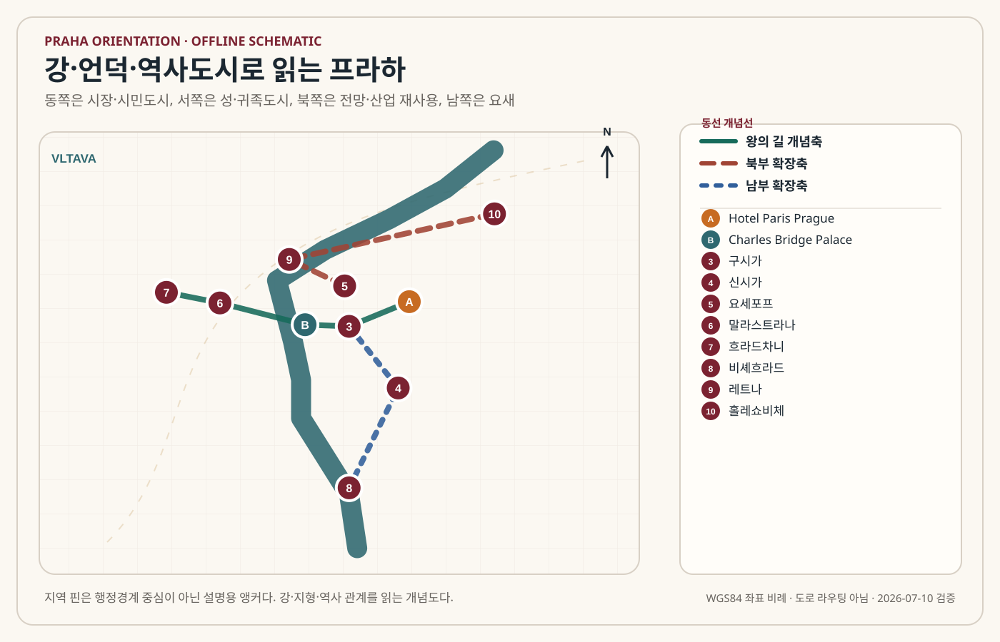

프라하의 지역을 설명할 때는 명소 이름부터 나열하지 않는다. 먼저 블타바강을 세로축으로 놓고, **동쪽 평지에는 시장과 시민의 도시**, **서쪽 경사지에는 성과 귀족의 도시**가 형성되었다고 말한다. 그다음 북쪽의 레트나와 홀레쇼비체, 남쪽의 비셰흐라드를 붙이면 도시 전체가 기억된다.

1. 강 서쪽 능선의 프라하성과 흐라드차니는 국가와 교회의 중심이다.
2. 성 아래 말라스트라나는 궁전, 수도원, 바로크 교회가 모인 귀족도시다.
3. 강 동쪽 구시가는 시장, 길드, 시청, 교회가 모인 상업도시다.
4. 구시가 북쪽 요세포프는 유대인 공동체의 삶, 박해, 해방, 도시정비가 겹친 기억의 지역이다.
5. 구시가 남쪽 신시가는 카를 4세가 넓은 시장과 도로를 계획한 확장도시다.
6. 남쪽 절벽의 비셰흐라드는 두 번째 요새이자 19세기 국민 기억의 장소다.
7. 북쪽 고원의 레트나는 도시를 내려다보는 공원이며 정치적 집회의 무대다.
8. 더 북동쪽 홀레쇼비체는 항만, 철도, 도축장, 공장이 시장과 문화공간으로 재사용된 산업도시다.

> **지역 설명 공식:** `강의 어느 쪽인가 -> 평지인가 언덕인가 -> 누가 살고 일했는가 -> 어떤 건물이 남았는가 -> 19-20세기에 무엇이 바뀌었는가` 순서로 말하면 처음 듣는 사람도 이해한다.

## 지역 1. Staré Město - 상인과 시민이 만든 구시가

**한 문장:** 구시가는 유럽 교역로의 시장에서 출발해 시민 자치, 길드, 교회, 시청이 성장한 강 동쪽의 중세 상업도시다.

**2분 해설:** 구시가 광장은 10세기 무렵 교역로가 만나는 시장으로 성장했고 12세기부터 도시의 중심 광장이 되었다. 화약탑에서 구시가 광장으로 이어지는 첼레트나, 광장에서 카를교로 이어지는 카를로바는 물건과 사람, 왕의 행렬이 같은 도시를 서로 다른 목적으로 통과했음을 보여 준다. 골목은 불규칙하고 필지는 좁으며, 집 위로 틴 성당과 시청탑이 솟는다. 이것은 성이 지배하는 도시가 아니라 상인과 시민 조직도 강한 도시였다는 증거다. [구시가 광장 공식 설명](https://prague.eu/en/objevujte/old-town-square-staromestske-namesti/)

**현장에서 증명할 것:** 광장으로 모이는 골목, 좁고 긴 집의 폭, 상점 위로 솟은 종교·시민 탑을 찾는다. Hotel Paris에서 화약탑을 통과하는 순간이 구시가의 동쪽 문에 들어가는 장면이다.

## 지역 2. Nové Město - 카를 4세가 설계한 확장도시

**한 문장:** 신시가는 자연스럽게 커진 교외가 아니라, 1348년 카를 4세가 제국 수도의 크기에 맞춰 계획한 넓은 도시다.

**2분 해설:** 구시가의 골목이 좁고 굽어 있다면 신시가는 긴 광장, 넓은 도로, 큰 수도원 부지로 스케일이 달라진다. 오늘의 바츨라프 광장은 원래 말 시장, 카를 광장은 가축 시장 기능을 가졌고, 서로 다른 생산과 거래가 넓은 공간에 배치되었다. 유네스코는 이 중세 도시계획을 카를 4세의 '새 예루살렘' 구상과 연결해 평가한다. 19세기에는 국립박물관, 상업 건물, 카페가 들어서고 1918년 독립, 1969년 얀 팔라흐, 1989년 벨벳혁명의 기억이 바츨라프 광장에 겹쳤다. [유네스코 프라하 역사 지구](https://whc.unesco.org/en/list/616)

**현장에서 증명할 것:** 구시가에서 바츨라프 광장으로 나갈 때 갑자기 넓어지는 시야와 긴 축을 본다. '새롭다'는 말은 현대적이라는 뜻이 아니라, 중세 구시가보다 나중에 계획되었다는 뜻이다.

## 지역 3. Josefov - 남은 유산과 사라진 도시가 함께 있는 곳

**한 문장:** 요세포프는 회당과 묘지만 보는 지역이 아니라, 유대인 공동체의 삶과 규제, 해방, 쇼아, 19세기 말 철거와 재개발을 함께 읽어야 하는 기억의 도시다.

**2분 해설:** 프라하의 유대인 정착은 중세 이전까지 거슬러 올라가며, 공동체는 종교·교육·상업·자선 조직을 발전시켰다. 구신회당과 구유대인묘지는 오래된 공동체의 실제 공간이다. 그러나 오늘 회당 사이에 보이는 넓은 파리슈스카 거리와 아르누보·역사주의 건물 대부분은 19세기 말 게토 정비 이후의 도시다. 따라서 '중세 유대인 지구가 그대로 남았다'고 말하면 틀린다. 남은 종교 유산과 새로 만들어진 근대 블록의 대비가 지역의 핵심이다. 핀카스 회당의 희생자 이름과 묘지에서는 전설보다 실존 인물과 공동체의 존엄을 우선한다. [유대인박물관 Jewish Town](https://www.jewishmuseum.cz/en/explore/sites/jewish-town/)

**현장에서 증명할 것:** 낮은 회당·묘지와 넓은 파리슈스카·근대 아파트 블록을 한 프레임에서 비교한다. Hotel Paris에서는 구시가 광장 북쪽으로 이어지고, Charles Bridge Palace에서는 강변을 따라 북동쪽으로 연결된다.

## 지역 4. Malá Strana - 성 아래의 귀족과 바로크 도시

**한 문장:** 말라스트라나는 카를교 건너의 예쁜 골목이 아니라, 성 아래 경사지에 귀족 궁전, 정원, 수도원, 바로크 교회가 자리 잡은 권력의 생활도시다.

**2분 해설:** 구시가가 상인과 시민의 도시라면 말라스트라나는 프라하성과 가까운 서안의 행정·귀족 생활권이었다. 1541년 대화재 뒤 르네상스 재건이 진행되고, 합스부르크 시대와 재가톨릭화 속에서 궁전과 하이 바로크 교회가 지역의 인상을 바꾸었다. 성 니콜라스 성당의 돔, 발트슈타인 궁전과 정원, 네루도바의 궁전 정면은 모두 건축이 신앙과 신분을 설득하는 방식이다. 담장 뒤 정원이 많은 이유도 큰 토지를 가진 귀족 공간이 거리와 분리되었기 때문이다. [프라하 관광청 말라스트라나 이야기](https://prague.eu/en/home/discover/prague-phenomenon/prague-stories/the-secrets-of-pragues-house-signs/)

**현장에서 증명할 것:** 강에서 성 방향으로 올라가는 경사, 궁전의 큰 문, 담장 위로 보이는 정원수, 성 니콜라스의 돔을 찾는다. 카를교 서단에서 '상업도시를 떠나 궁정도시로 들어간다'고 설명하면 좋다.

## 지역 5. Hradčany - 성 하나가 아니라 능선 위 국가도시

**한 문장:** 흐라드차니는 프라하성의 배경 마을이 아니라 왕궁, 대성당, 수도원, 귀족 궁전, 광장이 능선 위에 모인 국가와 교회의 도시다.

**2분 해설:** 약 880년 시작된 프라하성은 한 건물이 아니라 여러 세기에 걸쳐 확장된 성곽 단지다. 성 비투스 대성당은 종교와 왕조 기억, 구왕궁은 세속 통치, 성 이르지는 수도원과 초기 국가, 황금소로는 방어시설과 생활을 보여 준다. 성 밖 흐라드차니 광장과 로레타, 스트라호프 수도원까지 함께 보아야 능선 전체가 권력과 지식의 지역으로 이해된다. 아래 도시를 내려다보는 시선도 중요하다. 이곳의 건축은 시민 광장 안에 섞이기보다 성벽, 문, 안뜰, 고도 차로 접근을 통제한다. [프라하성 역사](https://www.hrad.cz/en/prague-castle-for-visitors/other/history-of-prague-castle-10340)

**현장에서 증명할 것:** 성벽과 문, 무료 공개 광장과 유료 역사 건물의 경계, 성 비투스와 왕궁의 기능 차이를 말한다. '프라하성에 간다'보다 '능선 위 국가도시를 통과한다'고 설명한다.

## 지역 6. Vyšehrad - 전설과 실제 역사를 분리하는 남쪽 요새

**한 문장:** 비셰흐라드는 프라하의 기원 전설, 실제 중세 요새, 바로크 방어시설, 19세기 국민묘지가 한 절벽에 겹친 남쪽 기억의 장소다.

**2분 해설:** 전설은 비셰흐라드를 체코 왕조의 가장 오래된 자리로 말하지만, 실제 정착은 10세기 중반에 형성되었다. 블타바 위 절벽은 강과 남쪽 접근을 통제하기 좋은 지형이었고, 이후 중세 왕권의 또 다른 거점과 바로크 요새가 되었다. 19세기에는 성 베드로와 바울 성당, 비셰흐라드 묘지와 슬라빈을 통해 작곡가, 작가, 예술가를 기억하는 국민 공간이 되었다. 따라서 성벽과 전망만 보는 곳이 아니라 '국가가 자신의 기원을 어떻게 이야기하는가'를 공부하는 곳이다. [비셰흐라드 공식 설명](https://prague.eu/en/objevujte/vysehrad/)

**현장에서 증명할 것:** 절벽 아래 강의 굽이, 성 마르틴 로마네스크 원형교회, 바로크 성벽, 국민묘지의 인물 이름을 차례로 본다.

## 지역 7. Letná - 도시를 내려다보는 정치적 빈자리

**한 문장:** 레트나는 전망 좋은 공원이면서, 대형 스탈린 기념상과 그 철거 뒤의 메트로놈, 시민 집회를 통해 20세기 권력과 공공 공간을 설명하는 고원이다.

**2분 해설:** 레트나의 넓은 고원은 구시가와 여러 다리를 한눈에 내려다보는 위치 때문에 국가적 전시와 대규모 집회에 적합했다. 1955년 거대한 스탈린 기념상이 세워졌지만 탈스탈린화 속에서 1962년 폭파되었다. 1991년 설치된 메트로놈은 같은 기단 위에서 시간과 변화, 비어 있는 권력의 자리를 드러낸다. 이곳에서는 조각 하나보다 '무엇이 사라졌고 왜 빈자리가 남았는가'를 설명해야 한다. [레트나 메트로놈](https://prague.eu/en/objevujte/metronome/)

**현장에서 증명할 것:** 구시가와 교량축을 내려다보는 시야, 거대한 기단, 공원을 일상적으로 쓰는 시민을 함께 본다.

## 지역 8. Holešovice - 산업 시설을 버리지 않고 다시 쓰는 도시

**한 문장:** 홀레쇼비체는 관광 중심 밖의 북부 산업지대가 시장, 미술관, 디자인과 창작 공간으로 전환된 프라하의 현재형이다.

**2분 해설:** 철도, 강 항만, 도축장, 공장에 맞춰 큰 필지와 산업 건물이 형성되었고, 오늘은 시장 홀, 전시장, 갤러리와 창작 공간이 이 구조를 재사용한다. 구시가처럼 작은 필지와 교회 첨탑이 중심이 아니라, 긴 벽돌 입면, 철골, 넓은 하역 공간, 큰 도로가 지역의 문법이다. '낡은 공장을 예쁘게 꾸몄다'고만 말하지 말고, 생산과 물류가 떠난 뒤 기존 구조를 어떻게 새로운 도시 기능으로 바꾸었는지 본다. [Holešovice - A District Reborn](https://prague.eu/en/holesovice-a-district-reborn/)

**현장에서 증명할 것:** 큰 블록, 산업 재료, 오래된 기능의 흔적, 새로운 사용자를 비교한다. 짧은 첫 여행에서는 선택 학습 지역이며, 일정의 확정 명소를 대체하지 않는다.

## 책을 덮고 말하는 60초 프라하

> "프라하는 블타바강 양쪽의 서로 다른 도시가 연결된 곳입니다. 강 동쪽의 구시가는 상인과 시민이 만든 중세 시장도시이고, 남쪽 신시가는 카를 4세가 계획한 확장도시입니다. 북쪽 요세포프에는 유대인 공동체의 유산과 19세기 도시정비가 겹쳐 있습니다. 강 서쪽 말라스트라나는 성 아래의 귀족·바로크 도시이고, 그 위 흐라드차니는 왕궁·대성당·수도원이 모인 국가도시입니다. 남쪽 비셰흐라드는 요새와 국민 기억, 북쪽 레트나는 정치적 전망대, 홀레쇼비체는 산업시설을 문화공간으로 다시 쓰는 현재의 프라하를 보여 줍니다. 카를교는 이 도시들을 사진 배경이 아니라 하나의 역사축으로 연결합니다."

\newpage

# 3장. 베이스캠프 A - Hotel Paris Prague

## 숙소 자체가 첫 번째 명소다

Hotel Paris Prague는 호텔과 문화재 목록에서 1904년 건립으로 요약되지만, 프라하 관광청의 상세 건축사는 공사 기간을 1904-1907년으로 설명한다. 따라서 한 해의 '완공'으로 단정하기보다, 20세기 초 네오고딕과 초기 아르누보가 결합한 건물로 이해한다. 프라하 관광청은 보후밀 흐라발의 소설 《영국 왕을 모셨지》의 중요한 무대로도 소개한다. 호텔을 단지 잠자는 곳으로 보지 말고, 1900년 전후 프라하가 빈과 파리의 세련된 대도시 문화를 받아들이던 장면으로 읽는다.

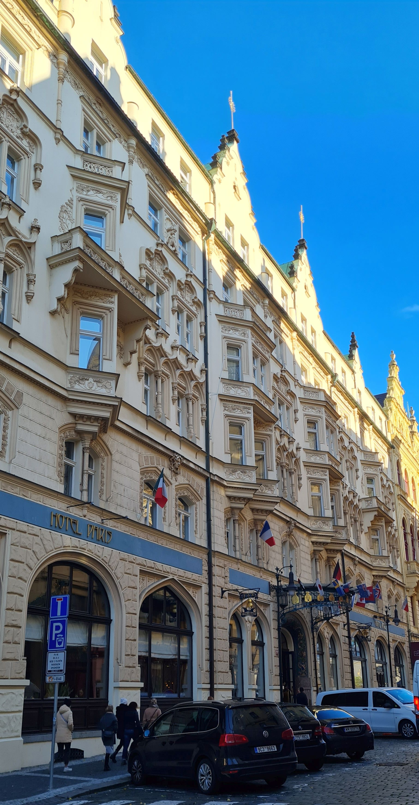

체크인 뒤 로비와 외관에서 다음을 찾는다.

- 중세를 연상시키는 수직선과 탑 모티프가 새로운 아르누보 장식과 어떻게 섞였는가.
- 목재, 금속, 유리, 조명 설계가 하나의 분위기를 만드는가.
- 바로 맞은편 시민회관의 화려한 프랑스풍 아르누보와 무엇이 다른가.
- Tony's Café & Bar가 거리와 호텔 사이의 공공 공간처럼 작동하는가.

## 베이스캠프 A 반경 지도

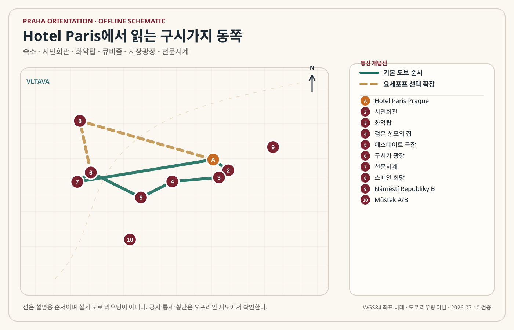

| 도보권 | 장소 | 그곳에서 읽을 것 | 실용 기능 |
|---|---|---|---|
| 0-3분 | 시민회관, 화약탑, 공화국 광장 | 아르누보와 후기 고딕의 정면 비교 | 메트로 B, 트램, 쇼핑센터, 식사 |
| 4-7분 | 검은 성모의 집, 첼레트나 거리 | 체코 큐비즘과 왕의 길 | 카페, 디자인숍, 올드타운 진입 |
| 8-12분 | 구시가 광장, 천문시계, 에스테이트 극장 | 시장도시, 시민 자치, 모차르트 | 관광안내소, 티켓, 야간 산책 |
| 12-18분 | 요세포프, 바츨라프 광장 하단 | 공동체 기억과 근대 상업도시 | 메트로 A/C 연결, 쇼핑 |
| 20-25분 | 카를교, 클레멘티눔, 국립박물관 | 강의 축, 지식과 국가 기억 | 두 번째 숙소권과 연결 |

> **거리 해석법:** 소요시간은 길을 찾는 시간과 신호 대기를 제외한 개략값이다. 목적은 분 단위 약속이 아니라, 숙소에서 어떤 역사층이 동심원처럼 펼쳐지는지 이해하는 데 있다.

## 도착일 25분 방향 감각 산책

장거리 비행 뒤에는 명소를 많이 넣지 않는다. 호텔 정문에서 시민회관의 모자이크를 보고, 화약탑 아래를 통과해 첼레트나 거리 첫 구간까지만 걷고 돌아온다. 이 짧은 왕복에서 내일 다시 찾을 수 있는 기준점 세 개를 기억한다.

1. 시민회관의 둥근 지붕과 대형 모자이크.
2. 검은 화약탑의 뾰족한 실루엣.
3. 공화국 광장의 메트로 B 입구.

돌아오는 길에는 Hotel Paris 외관의 조명과 시민회관 조명을 비교한다. 첫날의 목표는 정복이 아니라 "숙소는 왕의 길 바로 앞"이라는 감각을 몸에 넣는 것이다.

## 아침 35분 왕의 길 예습

관광객이 적은 시간에 화약탑에서 첼레트나 거리를 따라 검은 성모의 집까지 왕복한다. 상점 간판보다 건물 모서리의 성상과 집 표지를 본다. 번지 체계가 생기기 전, 사람들은 집의 이름과 그림으로 장소를 기억했다. 검은 성모상도 그런 도시 기억의 한 예다.

## 저녁 45분 아르누보 비교 산책

Hotel Paris 외관에서 시작해 시민회관 정면, Na Příkopě 거리 초입, 은행과 상업 건물을 본다. 아르누보가 꽃무늬 장식만이 아니라 전기 조명, 환기, 엘리베이터, 대형 공연장 같은 당대 기술과 결합한 "새로운 생활 시스템"이었음을 기억한다.

## 숙소 주변 실용 거점

- 메트로 B `Náměstí Republiky`: 호텔 공식 안내는 약 1분 거리로 소개한다.
- Palladium: 비, 더위, 늦은 시간에 생필품을 보충하는 백업 거점이다. 쇼핑 자체보다 화장실, 물, 우산, 약국 같은 기능을 기억한다.
- 프라하 공식 관광 안내: 구시청사와 Na Můstku 센터에서 지도와 공식 티켓 정보를 확인할 수 있다. [공식 관광 안내](https://prague.eu/en/official-tourist-information/)
- Tony's Café & Bar: 호텔에서 바로 접근 가능한 공간이다. 늦은 도착이나 긴 하루 뒤 멀리 이동하지 않고 음료와 분위기를 비교하는 안전한 기준점이다. [공식 연락처](https://www.tonyscafeandbar.cz/kontakt)

\newpage

# 4장. 베이스캠프 B - Charles Bridge Palace Hotel

## 두 번째 숙소는 강과 지식의 교차점이다

Charles Bridge Palace는 Anenské náměstí의 작은 광장에 있다. 카를교는 약 150m, 클레멘티눔과 카를로바 거리는 바로 북쪽, 국립극장과 Café Slavia는 남동쪽에 있다. 첫 숙소가 왕의 길의 출발점이라면 이곳은 **다리, 대학, 극장, 강변이 만나는 중간점**이다.

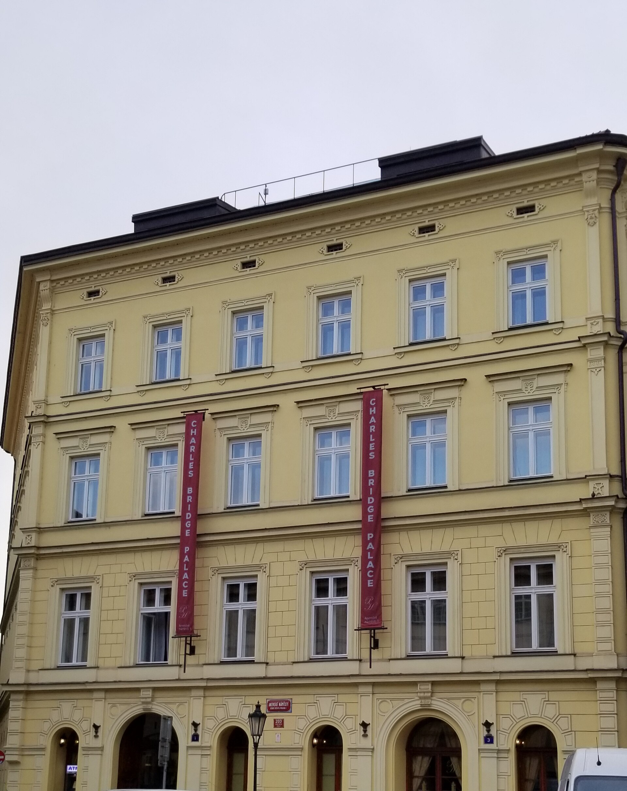

숙소명 때문에 다리 전망만 기대하기보다, 아넨스케 광장의 조용함과 몇 분 뒤 카를교의 밀도를 비교한다. 관광도시에서 한 블록이 분위기를 얼마나 바꾸는지 관찰하기 좋은 위치다.

## 베이스캠프 B 반경 지도

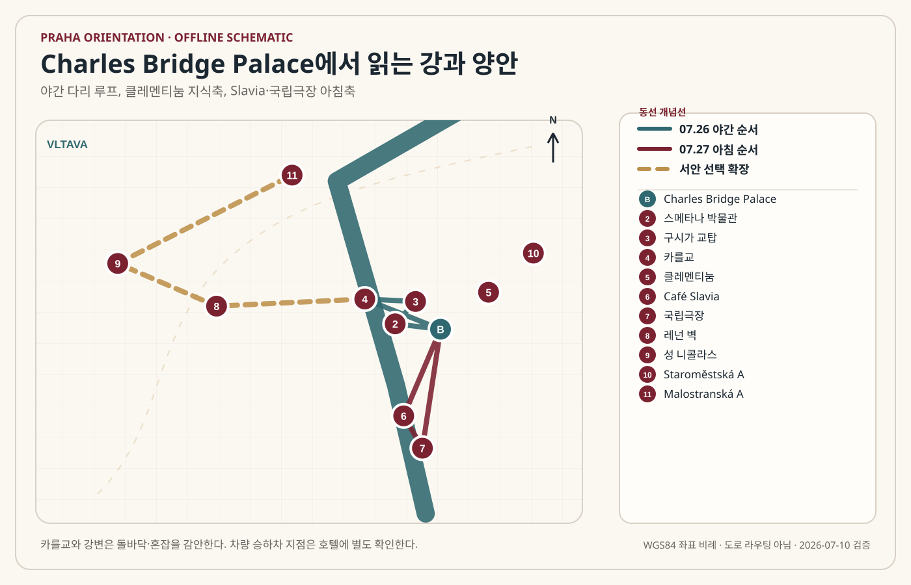

| 도보권 | 장소 | 핵심 해석 | 추천 시간대 |
|---|---|---|---|
| 0-3분 | 카를교 동단, 스메타나 박물관, 블타바 강변 | 다리와 강, 체코 음악 | 새벽 또는 늦은 밤 |
| 3-6분 | 클레멘티눔, 카를로바 거리 | 예수회, 대학, 천문학, 관광 흐름 | 예약 시간 전후 |
| 7-10분 | 구시가 광장, Café Slavia, 국립극장 | 시민 공간과 예술 | 아침, 해질녘 |
| 10-15분 | 요세포프, 캄파, 레넌 벽 | 기억, 강변 생활, 자유의 상징 | 낮 또는 이른 저녁 |
| 18-25분 | 발트슈타인 정원, 말라스트라나 광장 | 귀족 권력과 바로크 | 정원 운영시간 내 |

## 07.26 야간 30분 산책

체크인 뒤 카를교 전체를 건너지 않아도 된다. 구시가 교탑 아래에서 다리 첫 번째 아치까지 나가 성의 야간 실루엣을 보고, 강변 Smetanovo nábřeží를 따라 짧게 돌아온다. 이미 첫 체류에서 본 다리를 이번에는 다음 질문으로 다시 본다.

- 낮에 보이지 않던 가스등과 조각의 그림자는 무엇을 강조하는가.
- 유람선, 트램, 보행자는 같은 강을 서로 다르게 사용하는가.
- 다리는 사진 촬영지가 아니라 귀국 전 프라하를 정리하는 장소로 어떻게 달라졌는가.

## 07.27 아침 40분 마지막 산책

Café Slavia로 가는 길에 블타바 강을 오른쪽에 두고 걷는다. 국립극장의 금빛 지붕, 레기 다리, 페트르진 언덕을 한 프레임에 넣는다. 카페에서는 창가 자리가 없더라도 공간의 축과 피아노, 극장과의 관계를 본다. 식사 뒤에는 강변을 같은 길로 되돌아오며 프라하의 첫 숙소권과 두 번째 숙소권을 머릿속에서 연결한다.

## 짐과 이동을 고려한 운영 원칙

- 이 호텔은 조식이 포함되지 않은 예약이므로 Café Slavia 기본안과 자연스럽게 연결된다.
- 도시세는 현장 결제 조건이므로 체크아웃 직전 결제 방식과 영수증을 확인한다.
- 카를교 주변 돌바닥은 캐리어 이동에 불편하다. 공항 이동은 여유를 두고, 픽업 지점이 차량 접근 가능한 도로인지 호텔에 확인한다.
- Staroměstská 메트로역은 공식 안내 기준 약 8분이지만, 짐이 있을 때는 더 걸린다고 본다.

\newpage

# 5장. 날짜별로 겹쳐 읽는 프라하

## 날짜별 07.11 - 도착과 구시가지 첫인상

**오늘의 질문:** 왜 호텔 앞 한 블록에 15세기 고딕 탑, 1904년 호텔, 1912년 시민회관이 나란히 있는가.

도착일에는 굴뚝빵을 먹더라도 그것을 프라하의 고대 전통이라고 기억하지 않는다. `trdelník`는 트란실바니아에서 헝가리와 슬로바키아를 거쳐 체코 관광지에 퍼진 간식이다. 계피 향과 거리 분위기를 즐기는 것은 좋지만, 첫날부터 "관광 마케팅"과 "지역의 실제 전통"을 구분하는 연습을 한다. [VisitCzechia 사실 해설](https://www.visitczechia.com/en-us/things-to-do/places/gastronomic-tourism/czech-cuisine-and-regional-products/c-trdelnik-chimney-cake-in-czechia)

기록할 세 문장:

- 장거리 이동 뒤 가장 쉽게 기억된 기준점은 무엇이었나.
- 구시가의 돌길, 조명, 소리는 예상과 어떻게 달랐나.
- 굴뚝빵은 맛의 경험과 역사 설명을 분리하면 어떻게 평가할 수 있나.

## 날짜별 07.12 - 왕권과 신앙의 언덕

**오늘의 질문:** 프라하성은 한 채의 성이 아니라 왜 국가와 교회의 도시 안 도시인가.

카를교에서 프라하성으로 오르는 동선은 왕의 길을 역방향으로 체험한다. 성 비투스에서는 스테인드글라스와 첨탑만 보지 말고, 성 바츨라프 예배당과 왕들의 무덤이 국가 정체성을 어떻게 만든지 본다. 구왕궁에서는 블라디슬라프 홀의 거대한 리브 볼트와 1618년 창문 투척 사건의 장소를 연결한다. 성 이르지 바실리카의 로마네스크 단순함은 대성당의 고딕 수직성과 대조한다.

> **2026-07-12 접근 주의:** `Pražský hrad` 트램 정류장 임시 폐쇄 기간이다. Lví dvůr 쪽 입구는 열려 있지만 PID 앱의 당일 우회 안내를 확인하고, 평소 안내문을 그대로 따라가면 안 된다.

Kuchyň에서는 16세기 궁정 요리책에서 영감을 받은 체코 요리라는 맥락과 테라스 전망을 함께 본다. 로브코비츠 카페를 이용한다면 귀족 가문 컬렉션과 와인, 궁전 테라스라는 다른 서사를 경험한다. 스트라호프에서는 도서관 홀 안에 들어가는 것이 아니라 입구에서 본다는 현실 조건을 알고 간다. 하루를 Pork's의 돼지 무릎으로 마치면, 공유 요리 크기와 겨자, 서양고추냉이, 피클이 지방감을 어떻게 조절하는지 본다.

## 날짜별 07.13 - 체스키 크룸로프로 보는 프라하의 규모

**오늘의 질문:** 같은 보헤미아의 역사도시라도 수도와 영주도시는 공간이 어떻게 다른가.

체스키 크룸로프는 블타바의 굽이와 성 아래 형성된 작은 영주도시다. 프라하의 왕권과 제국 규모, 크룸로프의 로젠베르크 가문과 소도시 구조를 비교한다. 교통 방식은 아직 확정되지 않았으므로 이 책은 특정 버스나 투어를 예약 완료로 다루지 않는다.

돌아온 뒤 두 가지만 적는다.

- 프라하에서는 권력이 넓은 축과 다리, 성으로 표현되는데 크룸로프에서는 어떻게 보였나.
- 관광객이 많은 역사도시에서 실제 주민의 생활 흔적은 어디에 남아 있었나.

## 날짜별 07.14 - 시장, 시간, 탑, 사진

**오늘의 질문:** 관광지가 된 장소에서 역사적 장소성과 현재 상품 구성을 어떻게 분리할까.

하벨시장은 13세기부터 이어진 시장 자리지만 현재 특히 주말 상품은 관광형 기념품 비중이 높다. "시장터는 진짜이고 모든 상품이 지역산인 것은 아니다"라는 구분이 핵심이다. 천문시계에서는 정시 사도 행렬보다 먼저 천문판의 태양, 달, 황도대, 시간 체계를 본다. 화약탑에서는 186개의 계단을 오를 체력과 사진 가치를 판단하고, 올라가지 않더라도 후기 고딕 조각과 도시문 기능을 읽는다.

Pilsnerka에서는 라거의 신선도와 거품, 잔 관리가 체코 맥주 문화의 핵심임을 본다. 19:30 스냅은 말로스트란스카 스타벅스 집합 조건을 우선한다. 촬영 전에는 얇은 물, 발에 익은 신발, 휴대품 최소화가 실용적이다.

## 날짜별 07.15 - 카페와 귀족 정원

**오늘의 질문:** 카페와 정원은 왜 먹고 쉬는 곳을 넘어 정치와 문화의 무대가 되었나.

Café Savoy에서는 높은 네오르네상스 천장, 서비스 동선, 빵과 제과를 함께 본다. 예약은 권장 상태이지 완료로 확인된 것이 아니므로 현황을 확인한다. 발트슈타인 정원에서는 인공 동굴벽, 대칭 축, 공작새, 상원의 현재 사용을 통해 귀족 권력이 어떻게 정원으로 연출되는지 본다.

Café Imperial의 도자기 타일과 모자이크는 사진 배경이 아니라 1910년대 장식예술의 총체다. 메뉴의 전통 체코 요리를 현대 서비스로 번역하는 방식도 관찰한다. 이 날은 "역사적 실내가 맛의 기대를 얼마나 바꾸는가"를 기록한다.

## 날짜별 07.16 - 떠나는 아침

09:30 항공편이 우선이다. 조식 포함이라는 이유로 시간을 끝까지 쓰지 말고 공항 이동 기준을 지킨다. 프라하 공항의 공식 대중교통은 59번 트롤리버스와 메트로 A 조합이지만, 기존에 확정한 이동수단이 있다면 그것을 따른다. 비상 대안으로만 기억한다. [프라하 공항 대중교통](https://www.prg.aero/en/public-transport-buses)

## 날짜별 07.26 - 같은 도시에 두 번째로 도착하기

첫 체류의 체크리스트를 반복하지 않는다. Charles Bridge Palace 체크인 뒤 카를교를 다시 볼 때, 이번에는 "익숙해진 것"을 찾는다. 간판을 읽는 속도, 트램 소리, 돌길의 감각, 성의 방향이 처음보다 빨리 이해된다면 도시 지도가 몸 안에 생긴 것이다.

## 날짜별 07.27 - 카페에서 마무리하는 프라하

Café Slavia는 1881년부터 이어진 역사와 국립극장, 지식인, 반체제 문화의 관계가 핵심이다. 공식 안내는 조식을 14:00까지 제공하며 창가에서 국립극장, 카를교, 프라하성 방향을 볼 수 있다고 소개한다. 마지막 식사에서는 새로운 명소를 추가하기보다, 첫날부터 이어진 왕, 시민, 예술가, 여행자의 프라하를 한 장면으로 정리한다. [Café Slavia 공식 안내](https://www.cafeslavia.cz/en/?lang=en)

\newpage

# 6장. 주요 명소 상세 해설

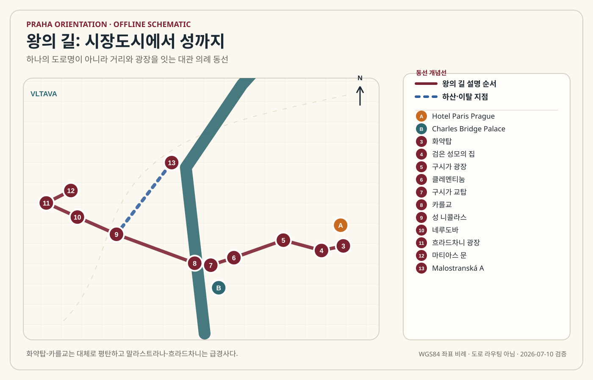

왕의 길은 지도 위의 한 도로명이 아니라 여러 거리와 광장을 잇는 의례의 축이다. 아래 명소 프로필을 따로 외우지 말고, 동쪽 시장도시에서 서쪽 국가도시로 이동하는 하나의 이야기로 연결한다.

## 명소 1. 시민회관 - 체코인이 만든 근대의 선언

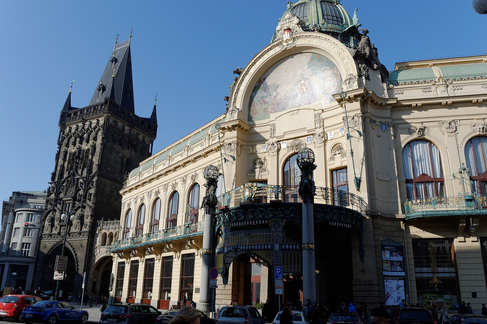

시민회관은 Hotel Paris 바로 맞은편에 있으므로 이 여행의 가장 개인적인 첫 교과서다. 1905-1911년에 지어진 프라하 아르누보의 대표 건축으로, 카페와 레스토랑, 아메리칸 바, 시장실, 스메타나 홀을 한 건물에 묶은 총체예술 작품이다. 알폰스 무하를 비롯한 당대 주요 예술가가 장식에 참여했다.

왜 중요한가. 이곳은 단순히 화려한 공연장이 아니라 체코어권 시민이 합스부르크 제국 안에서 자신들의 문화와 기술력을 선언한 건물이다. 1918년 10월 28일 체코슬로바키아 독립이 선포된 장소이며, 1989년에는 공산정부와 바츨라프 하벨 측이 대화한 장소가 되었다. [프라하 관광청 시민회관 이야기](https://prague.eu/en/home/discover/prague-phenomenon/prague-stories/municipal-house-the-art-nouveau-pearl-of-prague/)

  
<b>먼저 볼 것</b>
입구 위 카렐 슈필라르의 프라하 찬양 모자이크, 양쪽 조각, 유리와 금속 조명.

  
<b>실내 핵심</b>
스메타나 홀과 무하가 장식한 시장실은 가이드 투어로 보는 것이 가장 정확하다.

  
<b>권장 시간</b>
외관 15분, 카페 40분, 가이드 투어가 맞으면 약 1시간을 별도로 잡는다.

  
<b>관찰 질문</b>
민족 정체성을 직접 국기 대신 음악, 전설, 공예로 어떻게 표현했는가.

카페만 이용해도 조명, 가구, 창, 서비스 공간의 통일성을 본다. 아르누보는 꽃 장식 하나가 아니라 건물, 가구, 그래픽, 공연, 식사가 같은 세계관을 만드는 방식이다. [시민회관 공식 명소 안내](https://prague.eu/en/objevujte/municipal-house-obecni-dum/)

\newpage

## 명소 2. 화약탑 - 왕의 길이 시작되는 후기 고딕 문

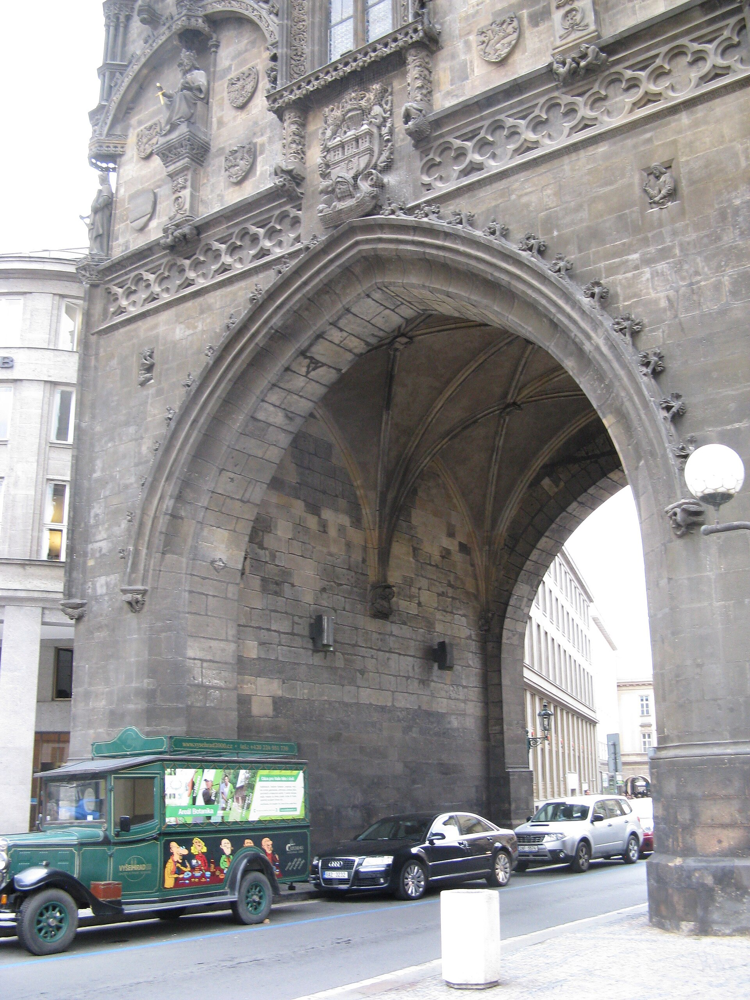

화약탑은 1475년부터 건설된 후기 고딕 성문이다. 낡은 기존 성문을 대신했고, 왕의 궁정이 있던 자리와 가까워 대관 행렬의 상징적 출발점이 되었다. 이후 화약 저장 기능 때문에 지금의 이름을 얻었다.

탑의 검은 외관을 중세 원형 그대로라고 단정하면 안 된다. 오늘의 모습에는 19세기 복원과 재해석이 포함된다. 중요한 것은 프라하가 근대에 중세 이미지를 어떻게 복원해 국가 서사로 만들었는지까지 함께 보는 것이다.

- **외관:** 왕과 성인 조각, 마테이 레이세크의 흔적, 시민회관과 연결되는 통로를 찾는다.
- **높이:** 탑은 65m, 전망 갤러리는 약 44m 높이에 있으며 186개 돌계단을 오른다.
- **전망:** 첼레트나 거리에서 구시가 광장으로 이어지는 왕의 길과 시민회관 지붕을 읽기 좋다.
- **피로 관리:** 같은 날 성 남탑이나 구시청사 탑도 오른다면 전망대는 하나만 선택해도 충분하다.

> **흔한 오해:** 화약탑은 성을 지키는 외곽 방어시설만이 아니다. 상징적 도시문, 왕의 길, 화약고, 19세기 중세 복원이라는 여러 기능이 겹쳐 있다.

[화약탑 공식 상세 설명](https://prague.eu/en/objevujte/powder-gate-tower-prasna-brana/)

\newpage

## 명소 3. 첼레트나와 왕의 길 - 거리를 하나의 의식으로 보기

`Celetná`라는 이름은 중세에 이 거리에서 구웠던 땋은 빵과 연결된다. 지금은 기념품점이 많지만, 건물 지하와 필지에는 로마네스크와 고딕의 흔적이 남고 외관에는 바로크와 근대 장식이 겹친다. 왕의 길은 하나의 공식 도로명이 아니라 화약탑에서 성으로 향한 의례적 동선이다.

걷는 순서는 화약탑, 검은 성모의 집, 첼레트나 거리의 집 표지, 구시가 광장, 작은 광장, 카를로바 거리, 카를교다. 모든 상점을 보려 하지 말고 다음 세 가지를 기록한다.

1. 거리 폭이 좁아지며 시야가 탑이나 교회에 의해 닫히는 지점.
2. 모서리 성상과 동물, 왕관, 색으로 된 집 표지.
3. 1층 관광 상업과 상부 주거 외관이 서로 다른 시간을 보여주는 장면.

왕의 길을 이해하면 구시가가 무작위 골목이 아니라 장면 전환을 계산한 의식 공간으로 보인다. 다만 실제 대관 행렬과 오늘의 관광 동선은 같지 않으며, 혼잡한 카를로바에서는 설명을 읽으며 멈추기보다 작은 광장이나 안뜰로 비켜선다.

\newpage

## 명소 4. 검은 성모의 집 - 회화가 건물이 된 체코 큐비즘

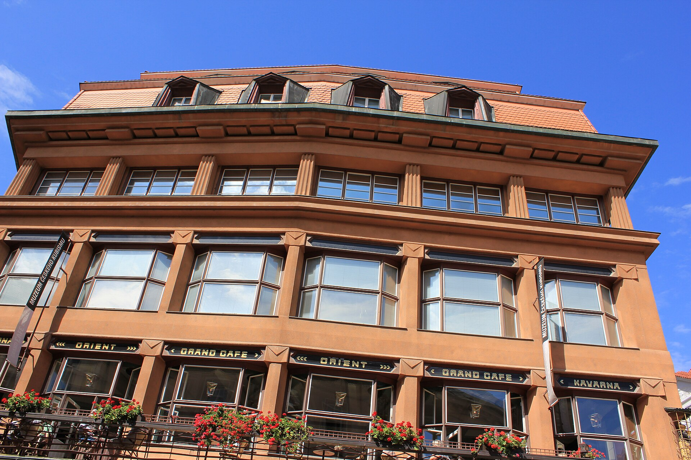

요제프 고차르가 1911-1912년에 설계한 검은 성모의 집은 체코 큐비즘 건축의 대표작이다. 큐비즘은 파리 회화에서 시작했지만 프라하에서는 건물, 계단, 가구, 유리, 도자기까지 확장되었다. 그래서 이곳은 세계 미술사에서 드문 "큐비즘 생활 공간"이다.

건물 이름은 모서리의 바로크 검은 성모상에서 왔다. 새 건물이 역사적 구시가에 들어설 때 반발이 있었지만, 고차르는 뾰족하게 접힌 창과 모서리, 입체적 돌출을 사용하면서 주변 건물 높이와 리듬을 존중했다.

  
<b>외관에서</b>
평면 장식이 아니라 창틀과 캐노피, 모서리 자체가 결정처럼 꺾이는지 본다.

  
<b>계단에서</b>
난간과 계단실의 빛이 반복되는 사선으로 공간을 조각하는지 본다.

  
<b>전시에서</b>
의자, 컵, 시계가 건축과 같은 언어를 사용하는지 비교한다.

  
<b>카페에서</b>
Grand Café Orient는 맛보다 큐비즘 실내를 실제로 사용하는 경험이 핵심이다.

박물관은 월요일 휴관, 화요일 연장 운영 등 요일별 차이가 있으므로 공식 정보를 확인한다. [프라하 관광청 검은 성모의 집](https://prague.eu/en/objevujte/museum-of-decorative-arts-house-at-the-black-madonna-dum-u-cerne-matky-bozi/)

\newpage

## 명소 5. 구시가 광장 - 천 년의 정치 무대

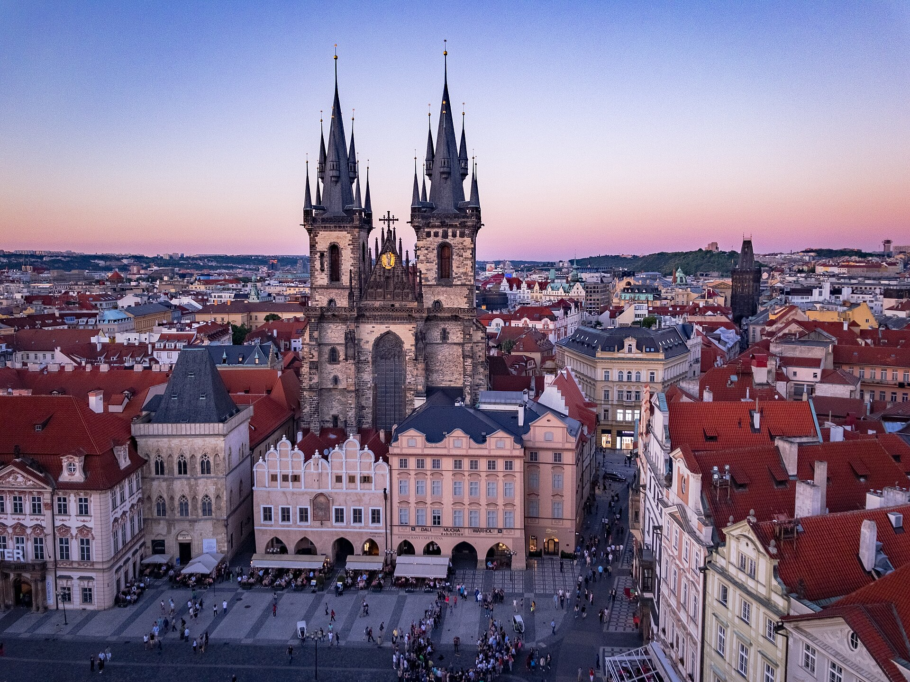

구시가 광장은 10세기 무렵 유럽 교역로가 만나는 시장에서 성장했다. 틴 성당의 고딕, 성 니콜라스 성당의 바로크, 킨스키 궁전의 로코코, 구시청사와 천문시계, 얀 후스 기념비가 한 시야에 들어온다. 이 광장은 프라하의 건축 연대표를 360도로 읽는 장소다.

먼저 중앙에 서지 말고 구시청사 벽을 등지고 천천히 시계 방향으로 본다.

- 틴 성당의 비대칭처럼 보이는 두 탑과 상업 건물 뒤에 숨은 진입 구조.
- 킨스키 궁전 발코니와 1948년 공산체제 선포의 기억.
- 얀 후스 기념비가 가톨릭 성당과 마주 보는 정치적 구도.
- 바닥의 27개 십자가와 1621년 보헤미아 귀족 처형의 기억.
- 프라하 자오선을 알리는 바닥 표식.

> **감상 원칙:** 광장의 아름다움과 폭력의 기억을 분리하지 않는다. 시장, 처형, 독립, 공산주의 선포, 관광이 같은 공간을 차례로 사용했다.

밤에는 조명이 건축 양식의 차이를 평평하게 만들 수 있다. 가능하면 낮에 구조를 먼저 이해하고, 야간에는 분위기를 두 번째로 본다. [구시가 광장 공식 설명](https://prague.eu/en/objevujte/old-town-square-staromestske-namesti/)

\newpage

## 명소 6. 구시청사와 천문시계 - 중세의 우주를 움직이는 기계

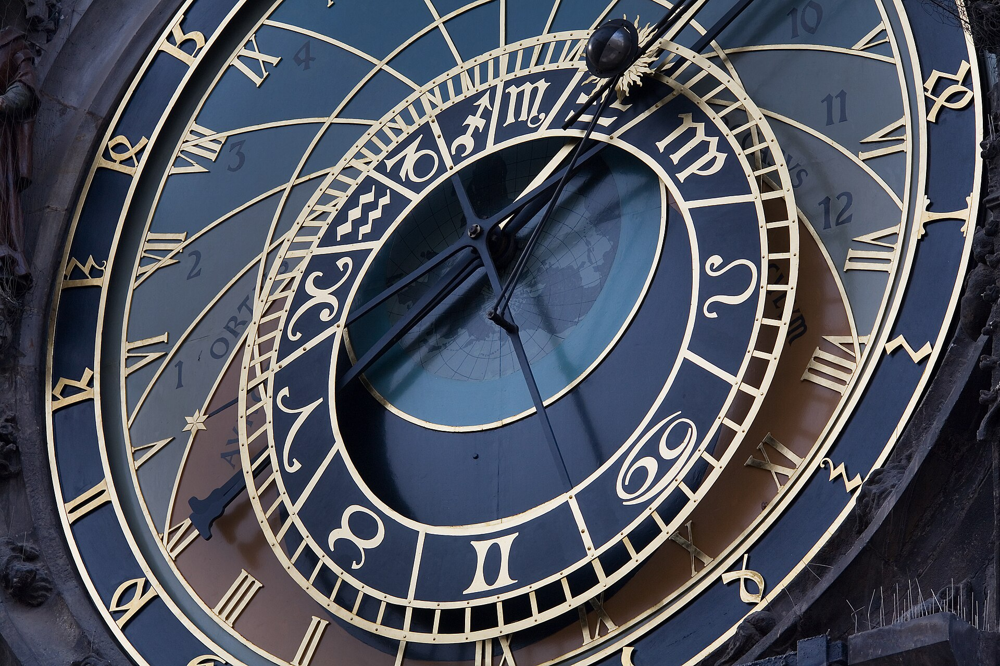

구시청사는 1338년 구시가 행정 중심으로 세워졌다. 여러 집을 이어 붙여 확장했기 때문에 하나의 균질한 건물이 아니라 시민 자치의 성장 기록이다. 제2차 세계대전 말 프라하 봉기 때 동쪽 날개가 파괴되어 복원되지 않은 빈자리도 도시 기억의 일부다.

천문시계는 인형이 나오는 시계보다 훨씬 복잡하다. 위 천문판은 지구 중심 우주관 속 태양과 달, 황도대, 여러 시간 체계를 보여주고, 아래 달력판은 계절과 성인의 날, 농촌의 월별 노동을 보여준다. 해골은 죽음을, 허영과 탐욕의 인물은 인간의 약점을 상징한다.

관람 순서:

1. 정시 10분 전에 천문판의 색과 원을 본다.
2. 태양과 달의 위치, 황도대 고리, 해골을 찾는다.
3. 정시 사도 행렬은 짧게 보고 군중이 빠진 뒤 달력판을 본다.
4. 내부 투어에서는 예배당, 국가실, 로마네스크-고딕 지하를 통해 광장 아래 시대층을 확인한다.

사도 행렬은 공식 안내상 08:00-23:00 정시에 작동한다. 4-12월 구시청사 운영은 대체로 09:00-20:00이지만 행사와 시즌 변동을 확인한다. [구시청사와 천문시계 공식 안내](https://prague.eu/en/objevujte/old-town-hall-with-astronomical-clock-staromestska-radnice-s-orlojem/)

\newpage

## 명소 7. 틴 성당과 얀 후스 - 첨탑 뒤의 종교 갈등

구시가 광장의 시각적 중심인 틴 성당은 14세기부터 성장한 고딕 교회다. 그러나 정문이 광장에 직접 열리지 않고 앞의 틴 학교 건물 아래 통로로 들어간다는 점이 흥미롭다. 교회는 광장을 지배하지만 접근은 숨어 있다.

안에서는 바로크 제단만 보지 말고, 덴마크 천문학자 티코 브라헤의 무덤을 찾는다. 루돌프 2세의 프라하가 천문학과 궁정 지식의 중심이었던 흔적이다. 바깥에서는 얀 후스 기념비와 성당의 관계를 본다. 후스는 교회의 부패를 비판했고 1415년 화형당했으며, 이후 후스 전쟁은 보헤미아 사회를 바꾸었다.

이 장소를 이해하는 핵심은 "프라하 사람은 모두 같은 기독교 전통을 공유했다"가 아니라, 같은 광장에서 개혁과 가톨릭, 민족주의가 긴 시간 충돌했다는 점이다. 미사와 종교행사 중에는 내부 촬영과 이동을 최소화한다.

\newpage

## 명소 8. 에스테이트 극장 - 모차르트가 직접 지휘한 프라하

에스테이트 극장은 1783년에 문을 연 신고전주의 극장으로, 유럽에서 원형이 잘 남은 역사적 극장 가운데 하나다. 1787년 모차르트의 오페라 《돈 조반니》가 이곳에서 세계 초연되었고 모차르트가 직접 지휘했다. 1791년 《티토 황제의 자비》도 프라하에서 초연되었다.

왜 빈이 아니라 프라하에서 이 이야기가 중요한가. 프라하 관객은 모차르트 음악을 열렬히 받아들였고, 도시의 귀족과 부르주아 문화는 국제적인 음악 네트워크의 일부였다. 외관의 절제된 고전주의는 시민회관의 아르누보, 국립극장의 네오르네상스와 좋은 대비가 된다.

- 공연이 맞으면 좌석과 자막 조건을 공식 사이트에서 확인한다.
- 투어만 가능하다면 무대 기계, 객석의 말발굽 형태, 왕실 박스를 본다.
- 외관만 본다면 과일시장 `Ovocný trh`의 작은 도시 공간에 극장이 어떻게 끼어 있는지 본다.

[에스테이트 극장 공식 역사](https://www.narodni-divadlo.cz/en/stages/the-estates-theatre/history)

\newpage

## 명소 9. 카를교 - 고딕 다리 위에 세운 바로크 야외 성당

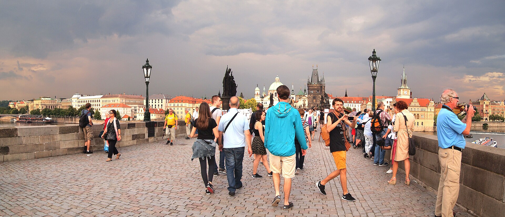

유디트교가 1342년 홍수로 크게 파괴된 뒤, 카를 4세 후원 아래 1357년 새 다리 공사가 시작되어 1402년 완성되었다. 사암 블록의 고딕 다리는 구시가와 말라스트라나를 잇는 교통, 상업, 군사, 의례의 기반이었다. 17-20세기에 30개 성인 조각이 더해지면서 다리 위에 바로크 신앙 풍경이 생겼다.

구시가에서 말라스트라나 방향으로 걸을 때 네 층을 읽는다.

1. **구조:** 넓은 아치와 교각이 홍수 많은 블타바를 어떻게 건너는가.
2. **문:** 구시가 교탑이 다리를 도시의 의식적 입구로 어떻게 만든가.
3. **조각:** 성인상은 대부분 중세 다리보다 훨씬 늦은 바로크 시대 작품이다.
4. **사용:** 예술가, 관광객, 통근자, 촬영팀이 한정된 폭을 어떻게 나누는가.

성 요한 네포무크 동상의 청동 부분을 만지는 행위는 관광 의식이 되었지만, 그가 왕비의 고해 비밀을 지키다 순교했다는 전설과 실제 정치적 맥락은 구분한다. 다리 위 많은 조각은 보존을 위해 복제품으로 교체되었고 원본 일부는 박물관이나 비셰흐라드 지하에 있다.

새벽은 구조와 생활을, 해질녘은 성의 실루엣을, 밤은 가스등과 조각의 연극성을 보기 좋다. 세 시간대 중 두 번 방문하는 것이 한 번 오래 머무는 것보다 이해에 도움이 된다. [카를교 공식 상세 설명](https://prague.eu/en/objevujte/charles-bridge-karluv-most/)

\newpage

## 명소 10. 클레멘티눔 - 예수회, 대학, 도서관, 천문학

클레멘티눔은 1556년 예수회 대학에서 출발해 프라하성 다음으로 큰 역사 단지가 되었다. 반종교개혁과 대학 통합의 장소이면서, 도서관과 천문 관측, 기상 기록의 중심이었다. 1775년부터 이어진 체계적 기상 관측은 유럽에서 가장 오래된 연속 기록 가운데 하나다.

투어는 바로크 도서관을 입구에서 보고, 자오선 홀의 천문기구를 지나, 천문탑 전망대에 오르는 약 50분 구성이다. 도서관 홀 안에는 들어가지 않으며, 전망 발코니까지 엘리베이터 없이 172계단이다.

  
<b>도서관</b>
약 2만7천 권의 고서, 지구본, 과학과 예술을 주제로 한 천장화를 입구에서 본다.

  
<b>자오선 홀</b>
빛과 선으로 정오를 판단한 방에서 시간 측정이 종교와 과학을 잇는 방식을 본다.

  
<b>천문탑</b>
68m 탑과 관측기구, 1775년 이후 기상 기록의 연속성을 이해한다.

  
<b>예약</b>
표는 제한 인원 가이드 투어이며 다음 2주분이 월요일에 열리는 정책을 공식 페이지에서 확인한다.

"세계에서 가장 아름다운 도서관"이라는 수식어보다, 지식이 누구에게 개방되었고 종교 권력이 교육을 어떻게 조직했는지 묻는다. [클레멘티눔 공식 안내](https://prague.eu/en/objevujte/the-clementinum-astronomical-tower-and-baroque-library/)

\newpage

## 명소 11. 요세포프 - 한 장의 티켓으로 읽는 공동체의 시간

프라하 유대인박물관은 한 건물이 아니라 마이젤, 핀카스, 구신, 스페인 회당과 구유대인묘지 등이 연결된 도시형 박물관이다. 1906년에 세워진 유럽의 오래된 유대인박물관 가운데 하나이며, 나치 점령기에는 사라진 공동체의 종교물과 문서가 이곳으로 모였다. 이 역사는 "기적적으로 보존된 박물관"이라는 단순 서사보다 훨씬 고통스럽다. [유대인박물관 역사](https://www.jewishmuseum.cz/en/info/about-us/history-of-the-museum/)

관람 순서는 마이젤 회당에서 공동체 역사를 개괄하고, 핀카스 회당과 묘지에서 기억에 집중한 뒤, 구신회당과 스페인 회당에서 종교의 지속과 근대화를 보는 방식이 좋다. 전체를 사진 위주로 1시간에 돌면 의미를 잃기 쉽다. 최소 2.5-3시간을 생각한다.

2026년 성인 기본권은 600 CZK이며 개인권은 3일 동안 각 장소 1회 유효하다. 토요일과 유대교 휴일에는 닫는다. [통합권과 요금](https://www.jewishmuseum.cz/en/info/visit/admission/), [2026 운영시간](https://www.jewishmuseum.cz/en/info/visit/opening-hours/)

> **예절:** 구신회당은 여전히 살아 있는 종교 공간이다. 남성 머리 가리개 등 현장 안내를 따르고, 예배와 추모를 관광 배경으로 소비하지 않는다.

\newpage

## 명소 12. 핀카스 회당과 구유대인묘지 - 이름과 돌의 기록

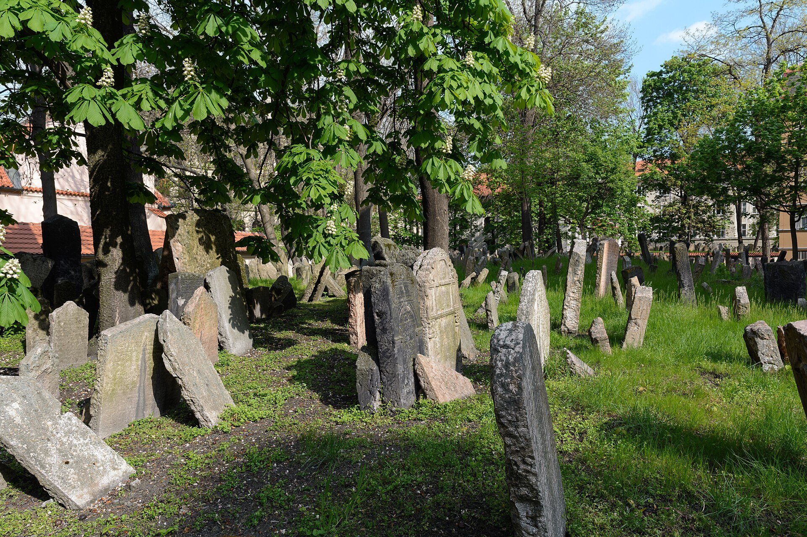

핀카스 회당 벽에는 쇼아로 희생된 보헤미아와 모라비아 유대인 약 8만 명의 이름이 적혀 있다. 위층의 테레진 수용소 어린이 그림은 통계를 개인의 삶으로 되돌린다. 이 공간에서는 모든 이름을 읽을 수 없다는 사실 자체를 받아들이고, 한 가족명이나 한 도시명을 오래 보는 편이 낫다.

구유대인묘지는 1439-1787년에 사용되었다. 1만2천 개가 넘는 묘석이 남고, 공간 부족과 무덤 훼손을 금하는 전통 때문에 여러 층으로 매장되었다. 묘석의 기호는 고인의 이름, 가문, 직업, 종교적 역할을 암시한다.

- 축복하는 두 손: 코헨 계열 제사장 가문.
- 주전자와 물그릇: 레위인 역할과 연결.
- 사자, 사슴, 새: 이름이나 성서적 상징을 암시.
- 책과 도구: 학문이나 직업을 표현.

좁고 겹친 묘석을 낭만적 미로로만 보지 않는다. 이는 오랜 공동체와 제한된 거주 공간, 종교적 존중이 만든 물리적 기록이다. [핀카스 회당](https://www.jewishmuseum.cz/en/explore/sites/pinkas-synagogue/), [구유대인묘지](https://www.jewishmuseum.cz/en/explore/sites/old-jewish-cemetery/)

\newpage

## 명소 13. 구신회당, 스페인 회당, 마이젤 회당 - 세 시대 비교

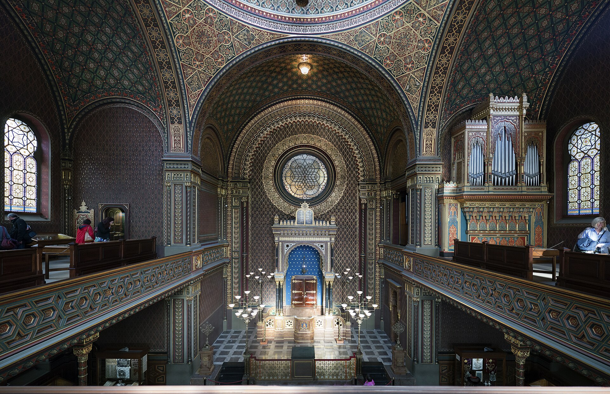

구신회당은 13세기 후반 왕실 석공이 지은 초기 고딕 회당으로, 유럽에서 가장 오래 활동을 이어온 회당 가운데 하나다. 골렘 전설로 유명하지만, 전설보다 700년 넘게 예배 공동체가 이어진 사실이 더 중요하다. 낮은 리브 볼트와 중앙 비마가 공동체의 집중을 만든다.

스페인 회당은 세파르디 공동체의 중세 회당이 아니다. 1868년에 지어진 개혁파 회당이며 알함브라를 연상시키는 무어 부흥 장식으로 19세기 유대인 해방과 근대화를 표현한다. 화려한 장식과 20세기 파괴의 역사를 함께 본다.

마이젤 회당은 루돌프 2세 시대 유대인 시장 모르데하이 마이젤과 공동체 번영의 이야기를 담는다. 현재 전시는 보헤미아와 모라비아 유대 역사를 시간순으로 이해하기 좋은 출발점이다.

세 장소의 비교 질문:

- 구신회당의 집중된 중세 예배 공간과 스페인 회당의 19세기 장식은 공동체의 사회적 위치 변화를 어떻게 보여주는가.
- 마이젤의 후원은 프라하 궁정과 유대인 엘리트의 관계를 어떻게 드러내는가.
- 골렘 같은 전설은 기억을 돕지만 실제 공동체 역사를 가릴 위험은 없는가.

[프라하 유대인 지구 공식 안내](https://www.jewishmuseum.cz/en/explore/sites/jewish-town/)

\newpage

## 명소 14. 바츨라프 광장과 국립박물관 - 현대 체코사의 긴 무대

바츨라프 광장은 카를 4세가 1348년 신시가를 만들 때 조성한 옛 말 시장이다. 폭보다 길이가 두드러지는 750m 축이며, 오늘은 상업과 교통, 시위와 기념이 겹친다. 1918년 독립, 1948년 공산체제, 1969년 얀 팔라흐와 얀 자이츠의 항거, 1989년 벨벳혁명 집회가 이곳에서 이어졌다.

위쪽 국립박물관에서 아래쪽 Můstek 방향으로 내려오며 읽는다.

1. 성 바츨라프 기마상과 국가 수호성인의 이미지.
2. 얀 팔라흐와 얀 자이츠 추모 지점.
3. 국립박물관 외벽과 1968년 침공 흔적의 기억.
4. 멜란트리흐 건물 발코니와 1989년 시위.
5. 광장 하단에서 구시가와 신시가가 연결되는 상업 흐름.

국립박물관의 네오르네상스 역사관은 국가가 자연, 역사, 예술을 수집해 자신을 설명하는 19세기 제도다. 2018년 재개관한 역사관과 신관은 지하 통로로 연결된다. 돔 전망을 이용할 수 있다면 광장 전체를 하나의 정치 무대로 읽기 좋다. [바츨라프 광장 공식 역사](https://prague.eu/en/objevujte/wenceslas-square-vaclavske-namesti/), [국립박물관 단지](https://www.nm.cz/en/visit-us/buildings/museum-complex-of-the-national-museum)

\newpage

## 명소 15. 국립극장과 Café Slavia - 시민이 세운 문화의 집

국립극장은 체코 민족 부흥의 상징이다. 체코어 공연을 위한 극장을 시민 모금으로 세웠고, 1881년 개관 직후 화재를 겪은 뒤 다시 모금해 1883년 재개관했다. 금빛 지붕과 네오르네상스 장식은 공연장 이상의 국가 선언이다.

길 건너 Café Slavia는 1881년부터 극장과 함께 예술가, 작가, 지식인이 모인 장소였다. 프라하 카페의 가치는 원두 산지보다 공간과 대화, 정치적 기억에 있다. 창가에 앉으면 국립극장, 블타바, 성 방향을 한 시야에 놓을 수 있다.

07.27 아침에는 다음 순서가 좋다.

- 외부에서 국립극장 지붕의 황금 장식과 강변 축을 본다.
- 카페 내부의 긴 창, 좌석 배치, 피아노와 서비스 동선을 본다.
- 조식을 먹으며 예술가가 극장 앞 카페에서 사람을 만나던 이유를 상상한다.
- 식사 뒤 레기 다리 입구에서 극장과 카페를 한 프레임으로 본다.

> **흔한 실수:** Café Slavia를 카프카 이름만으로 설명하지 않는다. 국립극장 예술가, 바츨라프 하벨과 반체제 지식인, 공산주의 이후 재개장의 역사가 더 넓은 맥락이다.

[국립극장 공식 역사](https://www.narodni-divadlo.cz/en/stages/the-national-theatre/history), [Café Slavia 공식 안내](https://www.cafeslavia.cz/en/?lang=en)

\newpage

## 명소 16. 말라스트라나와 성 니콜라스 성당 - 바로크가 감정을 설계하는 법

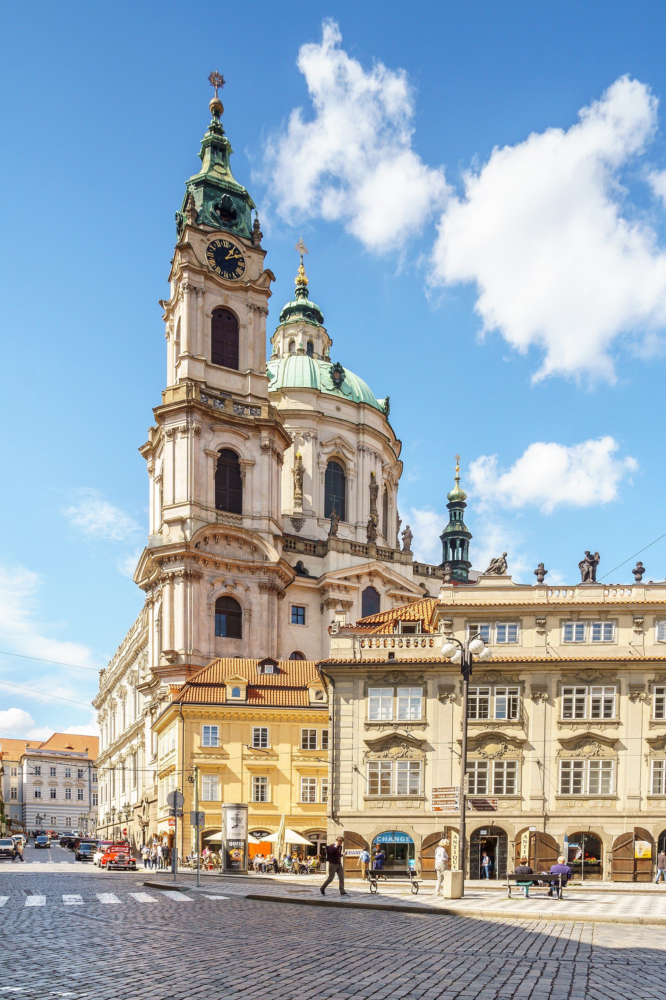

말라스트라나는 성 아래의 작은 도시라는 뜻이다. 좁은 중세 골목 위에 합스부르크 시대 귀족 궁전과 하이 바로크 교회가 들어서며 지금의 풍경이 형성되었다. 구시가가 시장과 시민의 공간이라면 말라스트라나는 귀족, 외교, 교회 권력이 밀집한 공간이다.

성 니콜라스 성당은 지름 약 20m의 돔, 높이 약 57m의 내부, 대형 천장화와 조각, 빛으로 관람자의 감정을 압도한다. 바로크의 목표는 차분한 비례만이 아니라 신앙을 몸으로 느끼게 하는 설득이었다.

안에서 볼 것:

- 기둥과 곡면이 시선을 돔으로 끌어올리는 방식.
- 실제 건축과 환영 천장화의 경계가 흐려지는 지점.
- 어두운 측랑과 밝은 중앙 공간의 대비.
- 18세기 오르간과 음악 공연이 공간의 울림을 사용하는 방식.

광장 바깥에서는 트램이 바로크 건물 사이를 통과하는 장면을 본다. 프라하는 역사 지구가 생활 교통과 분리된 테마파크가 아니라는 좋은 증거다. [말라스트라나 성 니콜라스 성당](https://prague.eu/en/objevujte/st-nicholas-church-at-mala-strana-kostel-sv-mikulase-mala-strana/)

\newpage

## 명소 17. 프라하성 - 한 채가 아니라 천 년의 국가 단지

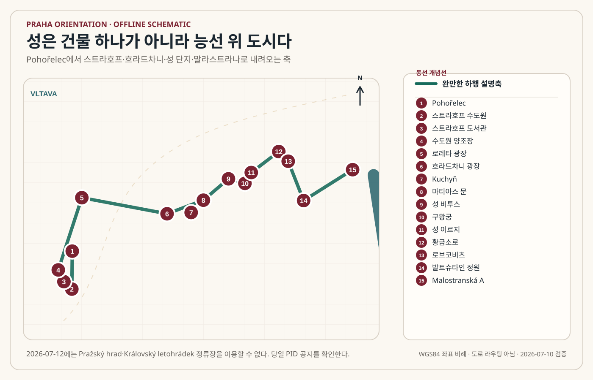

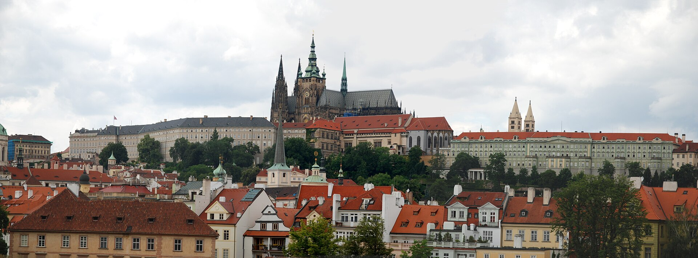

프라하성은 약 880년 프르제미슬 왕조의 보르지보이 공이 세운 요새에서 출발했다. 왕궁, 대성당, 수도원, 행정, 정원, 방어시설이 축적되었고 오늘도 체코 대통령의 집무 공간이다. 왕관 보석, 보헤미아 왕들의 유해, 종교 유물과 국가 문서가 이 단지에 보관된다.

성을 하나의 궁전처럼 보지 말고 세 개의 시간층으로 나눈다.

1. **초기 국가:** 성 이르지와 초기 교회, 왕조의 종교 중심.
2. **제국 수도:** 카를 4세의 성 비투스와 왕궁 확장.
3. **근대 국가:** 1918년 이후 대통령궁, 요제 플레치니크의 정원과 동선 개조.

4-10월 성 단지 자체는 공식 안내상 06:00-22:00, 주요 역사 건물은 대체로 09:00-17:00이다. 여행일인 일요일 07.12 성 비투스 관광 입장은 12:00-17:00이며 마지막 입장은 16:40이다. 국가행사와 미사로 수시 단축될 수 있으므로 당일 공지를 본다. [프라하성 역사](https://www.hrad.cz/en/prague-castle-for-visitors/other/history-of-prague-castle-10340), [운영시간](https://www.hrad.cz/en/prague-castle-for-visitors/opening-hours), [현재 휴관 공지](https://www.hrad.cz/en/prague-castle-for-visitors/current-closures)

> **7월 12일 동선 주의:** `Pražský hrad` 정류장 폐쇄 기간이므로 평소 블로그 동선을 복사하지 않는다. 성 입구와 실제 하차 지점을 PID 앱에서 확인한다.

\newpage

## 명소 18. 성 비투스 대성당 - 왕권, 성인, 국민의 긴 건설

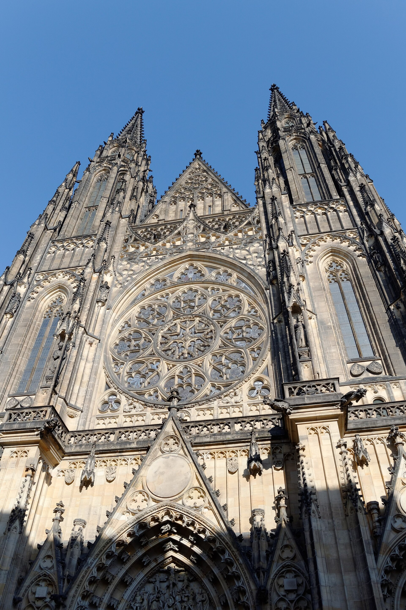

성 비투스 대성당 자리는 10세기 원형교회, 11세기 바실리카를 거쳐 1344년 카를 4세 시대 고딕 대성당 공사가 시작된 곳이다. 프랑스 대성당을 모델로 했지만 전쟁과 정치 변화로 공사는 수세기 중단되었고 1929년에야 완성되었다. 따라서 하나의 중세 건물이 아니라 중세와 근대 민족운동이 함께 완성한 국가 성소다.

관람의 네 초점:

- **성 바츨라프 예배당:** 체코 수호성인의 무덤과 보석 장식, 왕관 보석 보관실로 이어지는 상징 중심.
- **왕실 묘역:** 보헤미아 왕과 성인의 유해가 왕권과 신앙을 결합한다.
- **스테인드글라스:** 중세풍 전체 안에 알폰스 무하 등 근대 예술가의 창이 들어가 있다.
- **건축의 시간차:** 성가대석의 중세 고딕과 서쪽 파사드의 19-20세기 완성을 비교한다.

남탑은 대성당 본당 관람과 별도 체력 과제다. 약 100m 높이와 280여 계단을 고려해 같은 날 다른 전망대와 중복하지 않는다. 일요일은 관광 입장이 정오부터라는 공식 기준을 기억한다.

감상 질문은 "어느 부분이 가장 오래돼 보이는가"가 아니라 "후대가 중세를 어떻게 완성하고 국가 상징으로 만들었는가"다.

\newpage

## 명소 19. 구왕궁, 성 이르지, 황금소로 - 권력과 일상의 대비

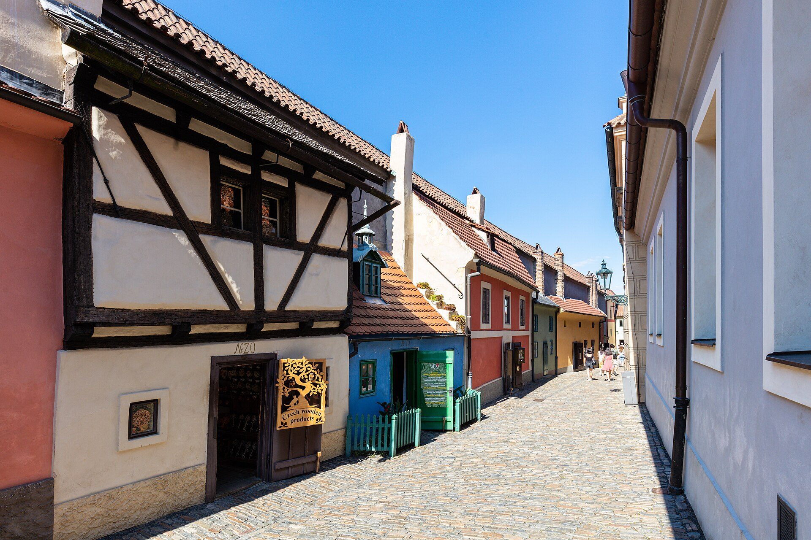

구왕궁의 블라디슬라프 홀은 후기 고딕 리브 볼트와 넓은 세속 공간이 결합된 국가 의전 무대다. 기사 대회, 연회와 왕실 행사가 열렸고, 과거에는 의회에 의한 대통령 선거도 이곳에서 열렸다. 2013년부터 대통령은 국민 직접선거로 선출되며, 블라디슬라프 홀은 현재 취임 선서와 국가기념일 의식 등에 사용된다. 홀 옆 루트비히 관에서는 1618년 보헤미아 귀족들이 황제 관리들을 창밖으로 던진 사건이 일어나 30년전쟁의 도화선이 되었다. [구왕궁 공식 설명](https://www.hrad.cz/en/prague-castle-for-visitors/objects-for-visitors/old-royal-palace-10332)

성 이르지 바실리카는 10세기 기원과 12세기 로마네스크 내부를 보여준다. 대성당의 수직성과 색채를 본 직후 이곳의 두꺼운 벽, 둥근 아치, 절제된 공간을 비교한다.

황금소로는 15세기 말 북쪽 방어시설에 붙은 사수와 가족, 장인의 작은 주거에서 출발했다. 연금술사 마을이라는 관광 전설보다 500년 생활사와 작은 주거 규모가 핵심이다. 카프카가 22번 집을 사용한 사실은 중요하지만, 그 하나가 골목 전체 역사를 대신하지 않는다. [황금소로 공식 설명](https://www.hrad.cz/en/prague-castle-for-visitors/objects-for-visitors/golden-lane-10334)

세 장소를 한 문장으로 묶으면 이렇다. 거대한 국가 의전 홀, 오래된 수도원 교회, 성벽에 붙은 서민 주거가 같은 성 안에 있어 권력의 중심도 수많은 노동과 생활로 유지되었음을 보여준다.

\newpage

## 명소 20. 로브코비츠 궁전 - 국가사가 아닌 한 가문의 시선

16세기 로브코비츠 궁전은 프라하성 안에서 유일한 개인 소유 궁전이다. 박물관은 유럽의 오래된 귀족 컬렉션 가운데 하나를 통해 보헤미아 역사를 한 가문의 후원, 몰수, 반환 이야기로 보여준다. 음악 악보, 회화, 무기, 장식예술을 국가박물관과 다른 관점에서 볼 수 있다.

20세기에는 나치와 공산정권 아래 컬렉션이 두 차례 몰수되었고, 1989년 이후 반환과 복원이 진행되었다. 따라서 전시는 "귀족의 보물"만이 아니라 소유권, 체제 변화, 문화유산 보존의 문제다.

카페와 레스토랑은 10:00-18:00 운영으로 안내되며 테라스에서 도시 전망을 볼 수 있다. Kuchyň과의 선택은 어느 곳이 절대 우위라기보다, 로브코비츠는 가문과 컬렉션, Kuchyň은 궁정 요리와 전망이라는 차이다. 기존 일정과 예약 상태에 맞춘다. [로브코비츠 카페 공식 안내](https://www.lobkowicz.cz/en/lobkowicz-palace/lobkowicz-palace-cafe)

관찰 질문:

- 개인 가문의 수집품이 어떻게 국가 문화유산이 되는가.
- 몰수와 반환의 역사가 작품 설명에 어떤 감정을 더하는가.
- 테라스 전망은 궁전의 권력을 어떻게 시각화하는가.

\newpage

## 명소 21. 스트라호프 수도원 - 책의 내부보다 지식의 질서를 보기

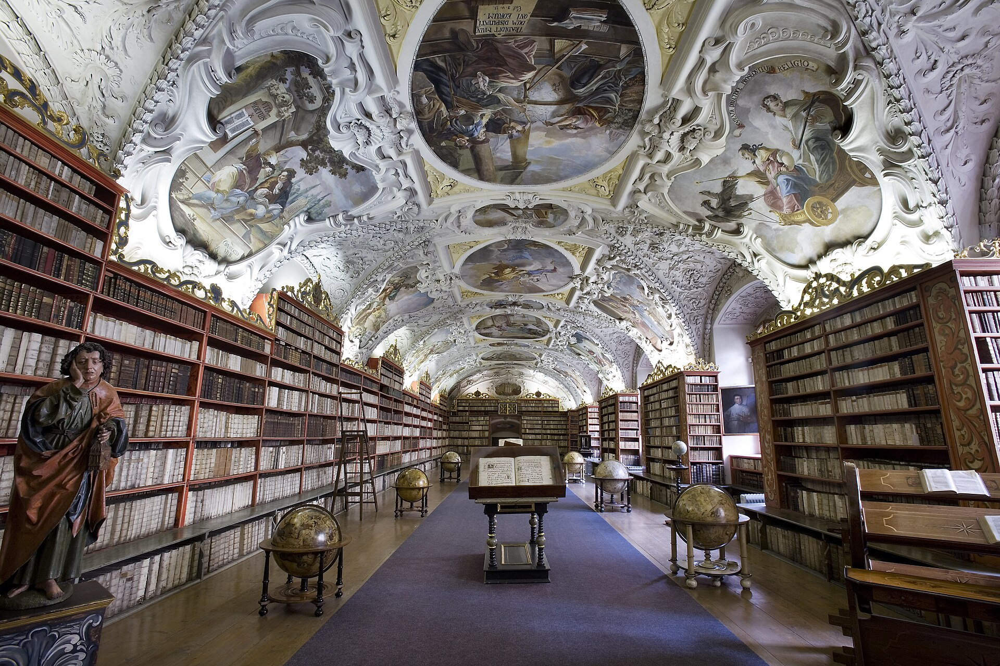

스트라호프 수도원은 12세기 프레몬스트라텐시안 수도원으로, 언덕에서 프라하성과 구시가를 내려다본다. 도서관의 신학홀은 17세기 후반, 철학홀은 18세기 말에 조성되었다. 천장화, 서가, 지구본, 호기심의 방은 지식을 분류하고 권위를 보여주는 장치다.

일반 관람권으로 두 홀 안에 들어가는 것이 아니라 입구에서 본다. 이 현실을 모르고 가면 실망하기 쉽다. 대신 다음을 본다.

- 신학홀의 바로크 곡선과 철학홀의 고전주의 질서 차이.
- 책등, 지구본, 표본이 세계를 분류하는 방식.
- 관광객의 시선이 입구에 제한되는 이유와 보존의 우선순위.
- 수도원 양조 전통과 오늘의 수도원 맥주가 성과 속의 경계를 어떻게 연결하는가.

도서관 뒤에는 도시 전망과 완만한 내리막이 있다. 푸니쿨라 운휴 기간에는 트램으로 Pohořelec까지 올라와 스트라호프를 보고 내려오는 방식이 체력상 합리적이다. [스트라호프 도서관 공식 안내](https://www.strahovskyklaster.cz/en/for-visitors/what-you-can-visit/strahov-library)

\newpage

## 명소 22. 페트르진 - 전망대보다 언덕의 지형 읽기

페트르진은 과수원, 정원, 숲길, 전망대가 이어진 도심 언덕이다. 1891년 기념 박람회를 위해 세운 페트르진 전망대는 에펠탑에서 영감을 받은 1:5 비율의 철 구조물이다. 중요한 것은 복제품 여부가 아니라 19세기 프라하가 산업과 관광, 도시 전망을 새 방식으로 소비하기 시작한 점이다.

2026년 7월에는 푸니쿨라 운휴를 전제로 한다. 권장 접근은 `Pohořelec` 트램 정류장에서 스트라호프를 본 뒤 완만하게 페트르진 정상과 정원을 거쳐 내려오는 방향이다. Újezd에서 바로 오르는 길은 짧아 보여도 경사가 가파르고 더운 날 체력 소모가 크다.

언덕에서 볼 것은 네 가지다.

- 블타바 강과 다리가 도시를 어떻게 나누고 연결하는가.
- 성과 대성당이 지형의 높은 곳을 차지하는 방식.
- 과수원과 정원이 관광시설 사이에 생활 녹지로 남아 있는가.
- 전망대, 거울 미로, 기념 박람회가 19세기 대중 오락을 어떻게 보여주는가.

> **방문 직전 확인:** 푸니쿨라 시험 운행 일정은 변동 가능성이 높다. 공식 페이지가 실제 운행을 명시하지 않으면 이용 가능하다고 가정하지 않는다.

[페트르진 전망대 공식 안내](https://prague.eu/en/objevujte/petrin-tower-petrinska-rozhledna/)

\newpage

## 명소 23. 발트슈타인 정원 - 30년전쟁 장군의 권력 연출

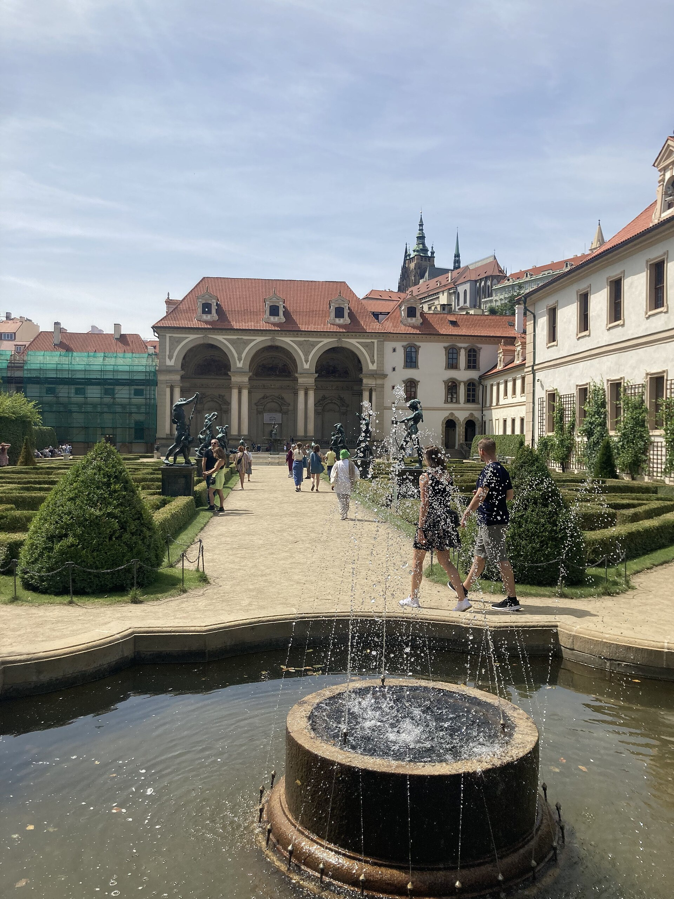

발트슈타인 궁전과 정원은 17세기 초 알브레히트 폰 발트슈타인이 말라스트라나의 여러 집과 정원을 합쳐 만든 대규모 귀족 단지다. 오늘 궁전은 체코 상원이 사용하고 정원은 시즌에 개방된다.

정원은 자연을 그대로 두는 곳이 아니라 권력을 질서로 바꾸는 무대다. 궁전에서 살라 테레나, 조각, 분수, 연못으로 이어지는 축을 보고, 반대편 인공 동굴벽 `grotto`가 규칙적인 정원 안에 의도적 불안을 만드는 방식을 본다. 공작새는 낭만적 장식이지만 가까이 다가가거나 먹이를 주지 않는다.

복제된 청동 조각들은 1648년 스웨덴군의 프라하 약탈과 원본의 이동을 떠올리게 한다. 아름다운 정원 안에도 30년전쟁과 전리품의 역사가 남아 있다.

관찰 질문:

- 발트슈타인은 왕이 아니면서 왜 왕궁 같은 공간을 만들었나.
- 바로크 정원에서 자연은 통제되는가, 연극적으로 연출되는가.
- 오늘의 상원이 귀족 궁전을 사용하는 것은 권력 공간의 어떤 연속인가.

\newpage

## 명소 24. 캄파와 레넌 벽 - 강변 생활과 자유의 표면

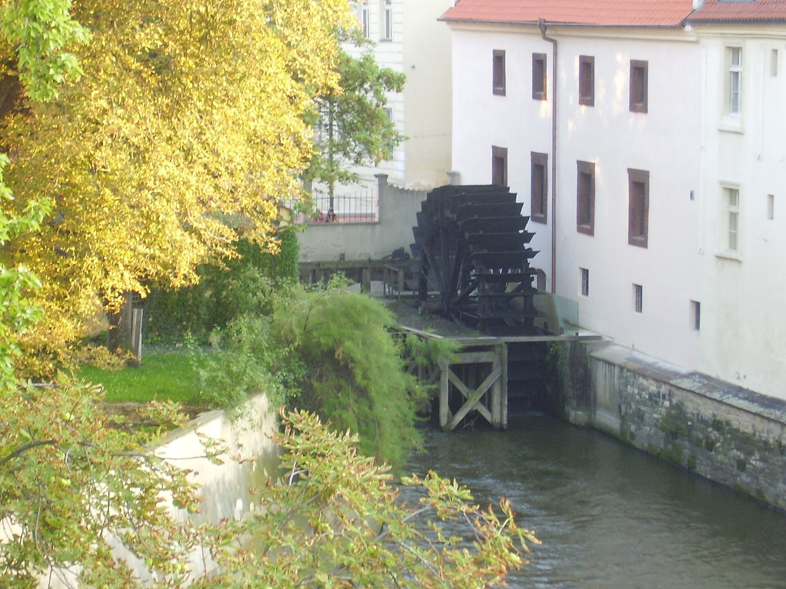

캄파는 블타바와 체르토프카 수로 사이에 형성된 섬이다. 물레방아, 작은 광장, 공원, 미술관이 이어져 카를교의 밀도와 다른 강변 속도를 보여준다. 강을 배경으로 사진만 찍기보다 수로가 제분과 생활에 어떤 기능을 했는지 본다.

레넌 벽은 1980년 존 레넌 사후 추모에서 시작해 공산정권 비판과 자유 표현의 장소가 되었다. 오늘의 벽은 수십 년간 덧칠된 결과이며, 어느 한 낙서가 영구 원본은 아니다. 현재 공식 안내는 스프레이 사용을 금지하고 펜, 연필, 분필만 허용한다.

벽을 볼 때 세 층을 나눈다.

1. 레넌과 평화라는 국제 대중문화 상징.
2. 공산주의 체코슬로바키아 청년의 저항과 표현 욕구.
3. 오늘의 관광객 참여와 과잉 소비 문제.

캄파 공원에서 카를교를 올려다보면 다리 조각과 구조가 아래에서 다르게 보인다. [캄파 공식 설명](https://prague.eu/en/objevujte/kampa/), [레넌 벽 공식 안내](https://prague.eu/en/objevujte/john-lennon-wall-zed-johna-lennona/)

\newpage

## 명소 25. 레트나 메트로놈 - 사라진 스탈린과 남은 빈자리

레트나 언덕의 메트로놈 자리에는 한때 거대한 스탈린 기념상이 있었다. 1955년 완공된 기념상은 탈스탈린화 속에서 1962년 폭파되었고, 1991년 현재의 메트로놈이 설치되었다. 거대한 권력 이미지를 제거해도 기단과 기억은 남는다.

메트로놈은 시간의 흐름, 과거 반복에 대한 경고로 자주 해석된다. 동시에 오늘은 스케이터, 청년, 산책자가 사용하는 생활 공간이다. 기념물의 의미가 국가 선전에서 시민의 사용으로 바뀐 사례다.

전망은 구시가와 여러 다리를 한눈에 보여준다. 카를교 단독 사진보다 블타바가 프라하의 여러 역사 지구를 어떻게 엮는지 읽기 좋다. 계단과 경사가 있으므로 더운 오후보다 늦은 시간이나 선선한 날이 낫다.

관찰 질문: 없어진 기념물이 현재 도시에서 더 강한 기억을 만들 수 있는가. [레트나 메트로놈 공식 안내](https://prague.eu/en/objevujte/metronome/)

\newpage

## 명소 26. 비셰흐라드 - 전설, 요새, 국민묘지

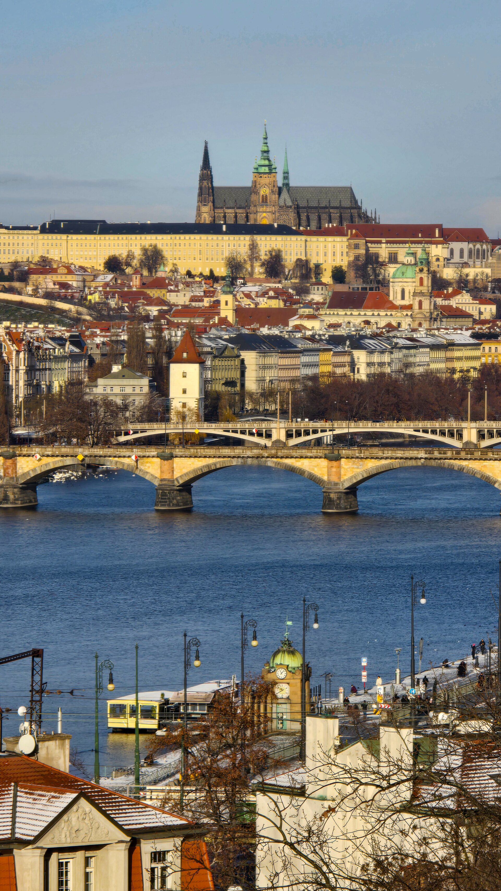

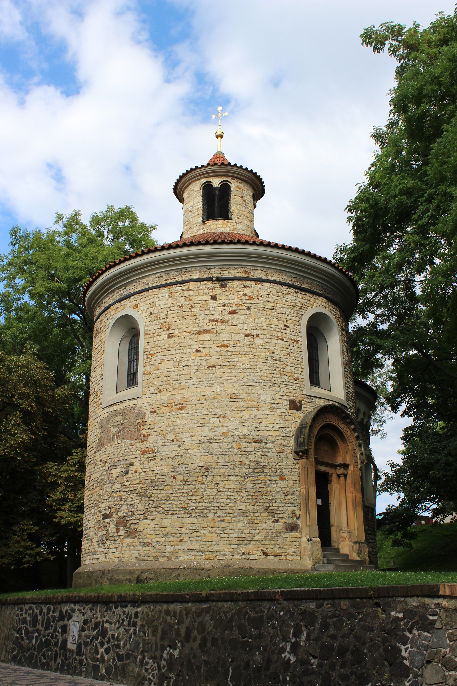

비셰흐라드는 체코 건국 전설과 연결되지만, 확실한 고고학 자료는 10세기 중엽부터다. 한때 왕의 거처였고 카를 4세 때 프라하의 상징 축에 편입되었으며, 30년전쟁 뒤에는 바로크 요새가 되었다. 19세기에는 체코 민족 부흥의 성지와 국민묘지로 재해석되었다.

볼 것:

- 성 마르틴 원형교회의 로마네스크 단순성.
- 성 베드로와 바오로 성당의 네오고딕 외관과 아르누보풍 내부.
- 슬라빈 묘지에 묻힌 스메타나, 드보르자크 등 체코 문화 인물.
- 고르리체 지하 공간의 카를교 원본 바로크 조각.
- 절벽 전망에서 프라하성과 다른 남쪽 도시 축.

프라하성보다 덜 붐비며, "오래된 전설"이 19세기 국민국가 형성에 어떻게 다시 사용되었는지 공부하기 좋다. 전설과 고고학을 섞지 않는다. [비셰흐라드 역사와 신화](https://praha-vysehrad.cz/en/history-and-myths/), [프라하 관광청 비셰흐라드](https://prague.eu/en/objevujte/vysehrad/)

\newpage

## 명소 27. 댄싱 하우스와 나플라브카 - 1989년 이후의 강변

댄싱 하우스는 블라도 밀루니치와 프랭크 게리가 설계해 1996년 완공했다. 돌로 된 남성형 탑과 휘어진 유리 탑을 프레드 아스테어와 진저 로저스에 빗대어 설명한다. 역사도시 한복판의 비정형 건물은 1989년 이후 체코가 새 표현을 받아들이는 과정의 상징이 되었다.

건물 터의 기존 주택은 1945년 미군 오폭으로 파괴되었다. 따라서 댄싱 하우스는 장난스러운 실루엣 뒤에 전쟁의 빈터와 탈공산주의 시대의 재건을 함께 가진다. [댄싱 하우스 공식 설명](https://prague.eu/en/objevujte/dancing-house-tancici-dum/)

남쪽 나플라브카 강변은 산책, 자전거, 보트, 바, 토요 농부시장이 섞이는 현재의 도시 생활 공간이다. 2-12월 토요일 시장은 공식 안내 기준 대체로 08:00-14:00이며, 지역 농산물과 빵, 치즈, 공예를 볼 수 있다. 이번 고정 일정과 맞지 않으면 억지로 넣지 않고 지식으로 남긴다. [나플라브카 농부시장](https://prague.eu/en/objevujte/naplavka-farmers-market)

\newpage

## 명소 28. 카를린, 비노흐라디, 홀레쇼비체, 지슈코프 - 관광지 밖의 현재

시간이 생겼을 때 추가할 지역은 명소 수보다 도시의 현재를 보기 위해 고른다. 고정 일정이 촘촘하다면 실제 방문하지 않아도 "프라하는 구시가만이 아니다"라는 지도를 머릿속에 둔다.

| 지역 | 특징 | 무엇을 공부할까 | 대표 접근 |
|---|---|---|---|
| 카를린 | 2002년 홍수 뒤 재생된 업무, 주거, 미식 지역 | 산업과 재생, 현대 체코 음식 | 메트로 B `Křižíkova` |
| 비노흐라디 | 19세기 주거 블록, 공원, 카페 | 관광 중심 밖의 중산층 생활과 시장 | 메트로 A `Jiřího z Poděbrad` |
| 홀레쇼비체 | 시장, DOX, 현대미술, 디자인 | 산업 시설의 문화 전환 | 트램 또는 메트로 C |
| 지슈코프 | 노동자 주거, TV 타워, 펍 | 사회주의와 현대 일상, 도시 전망 | 트램 또는 메트로 A |

이 지역의 카페와 식당은 "현지인 맛집"이라는 인증을 받기 위해 가는 곳이 아니다. 관광객과 주민이 섞인 현재의 프라하, 더 다양한 가격과 실내 디자인, 젊은 세대의 생활 방식을 보는 곳이다. 일정에 넣는다면 한 지역만 2시간 이상 천천히 본다.

\newpage

# 7장. 시장과 생활권을 공부하는 법

## 하벨시장 - 오래된 장소와 관광형 상품의 차이

하벨시장은 1232년부터 이어진 시장 자리다. 장소의 역사는 진짜지만 오늘의 상품이 모두 지역 전통품인 것은 아니다. 공식 관광 안내도 주말에는 관광 기념품 비중이 높다고 설명한다. 따라서 이곳에서는 "살 것 찾기"보다 관광도시의 시장이 어떻게 바뀌었는지 관찰한다. [하벨시장 공식 안내](https://prague.eu/en/objevujte/havelsky-market/)

구매 전 확인할 것:

- 포장에 `Made in Czech Republic` 또는 제작자명이 있는가.
- 목제품, 시계, 장식품의 제작 방식과 산지를 판매자가 설명할 수 있는가.
- 과일이나 간식은 단위 가격인지 100g 가격인지 표시가 명확한가.
- 같은 상품이 여러 점포에 완전히 똑같이 진열되어 있다면 대량생산 가능성이 높다.

## 나플라브카와 동네 농부시장

나플라브카 토요 시장은 지역 농산물, 빵, 치즈, 달걀, 생선, 수공예와 강변 생활을 함께 볼 수 있다. Jiřák, Kulaťák, Heřmaňák 같은 시장은 관광 중심지보다 주민의 장보기와 생산자 판매를 관찰하기 좋다. 이번 고정 일정과 요일이 맞지 않으면 무리해서 넣지 말고, 다음 프라하를 위한 생활 지도에 표시한다. [프라하 공식 시장 일정](https://prague.eu/en/akce-kategorie/markets/)

## Holešovice Hall 22 - 생활 시장의 혼합

홀레쇼비체 시장의 Hall 22는 과일, 채소, 빵, 달걀, 유제품, 고기와 아시아 식재료가 섞인다. 관광지의 "전통"보다 현대 프라하의 다문화 식탁을 보기 좋다. 베트남계 공동체의 음식과 식재료는 프라하의 현재를 이루는 중요한 층이다. [홀레쇼비체 시장 공식 안내](https://prague.eu/en/objevujte/market-in-holesovice/)

## 생활권 관찰 체크리스트

- [ ] 숙소 반경에서 빵집 하나, 델리 하나, 슈퍼마켓 하나를 찾았다.
- [ ] 관광 기념품이 아닌 실제 장보기 품목의 가격대를 보았다.
- [ ] 체코어 상품명 세 개를 사진으로 남기고 뜻을 찾아보았다.
- [ ] 포장에 생산자와 생산국이 표시된 제품을 한 번 확인했다.
- [ ] 관광객과 주민이 공간을 다르게 사용하는 장면을 기록했다.

\newpage

# 8장. 체코 음식을 이해하는 기본 문법

## 체코 음식은 중부유럽의 교차로다

체코 요리를 "순수한 슬라브 전통"으로만 설명하면 부정확하다. 보헤미아는 오스트리아, 독일, 헝가리 문화권과 오랫동안 연결되었고, 궁정 요리와 농민 음식, 도시 카페와 펍이 함께 식문화를 만들었다. 슈니첼, 슈트루델, 굴라시가 주변 지역과 공유된다고 해서 가짜인 것은 아니다. 오히려 국경을 넘나든 역사를 보여준다.

체코 식탁의 구조는 다음과 같다.

  
<b>소스와 고기</b>
천천히 익힌 고기, 뿌리채소, 크림, 양파로 깊은 소스를 만든다.

  
<b>크네들리키</b>
빵 또는 감자 덤플링이 소스와 육즙을 흡수한다. 맛 없는 빵이 아니라 기능적 중심이다.

  
<b>신맛의 균형</b>
양배추, 피클, 식초, 크랜베리, 레몬이 지방과 크림의 무게를 줄인다.

  
<b>숲과 저장</b>
버섯, 자두, 양귀비씨, 절임 소시지, 숙성 치즈가 계절과 저장 문화를 보여준다.

한 끼에 대표 음식 여러 개를 몰아넣지 않는다. 스비치코바 한 번, 돼지고기와 양배추 한 번, 펍 안주와 맥주 한 번, 동네 빵집 아침 한 번이면 서로 다른 체코 식탁을 경험할 수 있다.

\newpage

## 미식 1. 프라하 햄 - 도시 이름을 가진 실제 특산품

`Pražská šunka`는 염지하고 훈연한 돼지 뒷다리 햄이다. 전통 방식과 명칭이 EU의 TSG, 전통 특산품 보증으로 등록되어 있다. TSG는 반드시 프라하에서 생산된다는 지리 표시가 아니라, 정해진 전통 규격을 따랐다는 뜻이다. 이 차이를 알면 마케팅 문구를 더 정확히 읽을 수 있다. [EU 등록 규정](https://eur-lex.europa.eu/eli/reg_impl/2018/506)

왜 먹어야 하나. 프라하와 직접 이름이 연결된 드문 음식이며, 도시의 육가공 기술과 19세기 식품 유통을 보여준다. 뼈째 구운 햄, 뼈 없는 햄, 통조림 형태가 등록 규격에 포함된다.

노점에서는 큰 덩어리를 썰어 무게로 계산하는 경우가 있다. 주문 전에 `100g당 가격인지`, 원하는 중량이 얼마인지, 최종 예상액이 얼마인지 확인한다. 2인이 맛만 볼 경우 소량을 명확히 요청하고, 큰 접시를 자동으로 받지 않는다.

맛의 기준은 과도한 단맛보다 훈연 향, 돼지고기 결, 짠맛의 균형이다. 겨자와 빵이 곁들여지면 햄의 지방과 염도를 조절한다.

\newpage

## 미식 2. 흘레비체크 - 프라하가 만든 일상의 축하 음식

, Chlebicek.2.jpg, Wikimedia Commons, CC BY-SA 4.0; cropped.")

`chlebíček`는 얇은 빵 위에 감자샐러드, 햄, 달걀, 치즈, 피클, 생선 등을 장식한 오픈 샌드위치다. 프라하의 델리 문화와 연결되며, 20세기 초 얀 파우케르트가 2-3입 크기의 간식으로 발전시킨 이야기로 알려져 있다.

왜 먹어야 하나. 이 음식은 왕실 전통이나 관광용 거대 요리가 아니라 체코인의 생일, 회사 모임, 피로연에 등장하는 생활 음식이다. 진열장 앞에서 색과 높이, 재료 조합을 고르는 경험 자체가 중요하다.

먹는 법:

- 한 사람당 2-3개를 골라 서로 다른 토핑을 비교한다.
- 감자샐러드가 많은 고전형과 훈제연어, 비트 등 현대형을 하나씩 고른다.
- 빵이 마르지 않았는지, 진열 회전이 빠른지 본다.
- 달걀, 마요네즈, 겨자, 생선, 우유 알레르기를 토핑별로 확인한다.

무거운 정찬 사이의 가벼운 점심이나 기차, 비행 전 식사로도 좋다. [프라하 공식 미식 카테고리](https://prague.eu/en/objevujte-kategorie/gourmet/)

\newpage

## 미식 3. 스비치코바 - 체코 소스 문화의 완성형

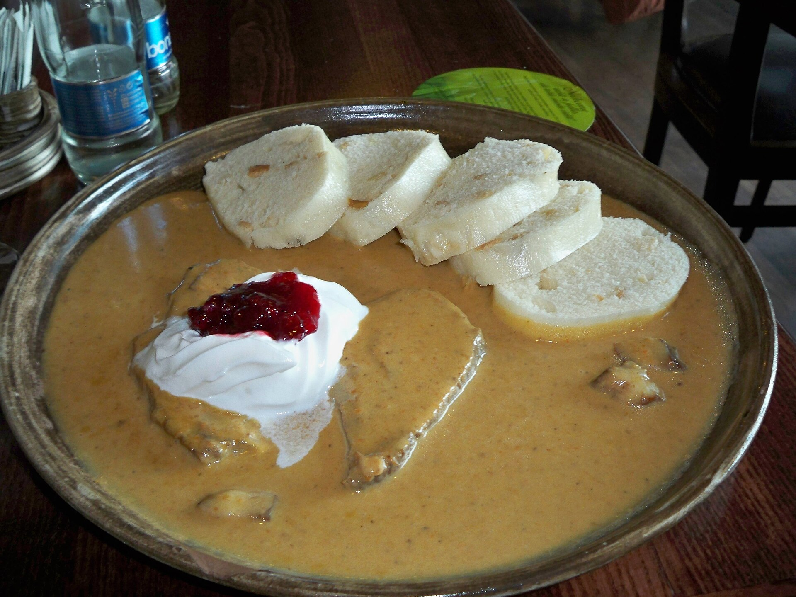

`svíčková na smetaně`는 쇠고기를 당근, 셀러리악, 파슬리뿌리 같은 뿌리채소와 익힌 뒤 크림소스로 만들고, 빵 크네들리키, 크랜베리, 레몬을 곁들이는 음식이다. 이름은 쇠고기 안심 부위와 연결되지만 실제 식당에서는 다른 부위를 쓰기도 한다.

왜 먹어야 하나. 달고 고소한 크림소스, 짭짤한 고기, 신맛과 향을 주는 레몬과 크랜베리, 소스를 흡수하는 크네들리키가 한 접시에서 균형을 이룬다. 과거 결혼식과 축하연에 올랐고 가족마다 "정답 레시피"가 달라 체코 가정식 정체성을 보여준다. [VisitCzechia 스비치코바](https://www.visitczechia.com/en-us/things-to-do/places/gastronomic-tourism/czech-cuisine-and-regional-products/g-svickova-na-smetane)

먹을 때는 크네들리키를 따로 평가하지 말고 소스를 충분히 묻힌다. 크랜베리와 레몬은 장식이 아니라 단맛과 지방을 끊는 기능을 한다. 소스가 지나치게 밀가루 맛이 나거나 단맛만 강하면 좋은 균형이 아니다.

대표 알레르기는 글루텐, 우유, 셀러리이며 조리법에 따라 겨자가 들어갈 수 있다.

\newpage

## 미식 4. 베프르조-크네들로-젤로 - 체코 펍의 삼각형

`vepřo-knedlo-zelo`는 구운 돼지고기, 크네들리키, 양배추 조림의 조합이다. 이름 자체가 세 요소를 나열한다. 지방진 돼지고기와 육즙을 빵 또는 감자 크네들리키가 받고, 흰색이나 붉은 양배추의 산미가 무게를 줄인다.

왜 먹어야 하나. 체코 펍 음식의 설계를 가장 직관적으로 이해할 수 있다. 화려한 소스보다 고기, 전분, 산미의 기능이 분명하다. 바삭한 껍질과 부드러운 살, 크네들리키의 흡수력, 양배추의 단맛과 신맛을 번갈아 먹는다.

오리구이 `pečená kachna`도 같은 구조를 확장한다. 붉은 양배추와 흰 양배추, 빵과 감자 크네들리키를 함께 내는 경우가 많다. 오리와 거위는 일상식보다 가족행사와 축일 음식의 성격이 강하고, 거위는 특히 11월 성 마르틴 전통과 연결된다.

한 접시가 크고 무거울 수 있으므로 수프와 메인, 디저트를 모두 한 번에 주문하기보다 양을 본 뒤 추가한다.

\newpage

## 미식 5. 체코식 굴라시 - 헝가리 음식의 보헤미아식 번역

굴라시는 헝가리에서 기원했지만 체코식 `guláš`는 국물 많은 수프보다 쇠고기와 많은 양파를 오래 졸인 진한 스튜에 가깝다. 파프리카와 향신료를 쓰고 빵 크네들리키를 곁들인다.

왜 먹어야 하나. 중부유럽의 공유 음식이 국경을 건너며 어떻게 변하는지 보여준다. 체코가 발명했다고 주장할 필요 없이, 펍과 크네들리키 문화가 굴라시를 체코식 한 접시로 번역했다고 이해하면 된다.

좋은 굴라시는 소스가 양파와 고기에서 자연스럽게 농축되고 고기가 포크로 쉽게 갈라진다. 크네들리키는 소스를 흡수하되 접시에서 무너지지 않아야 한다. 양파 토핑과 고추는 향과 식감을 더한다.

비교 포인트:

- 헝가리식 수프형 굴라시와 체코식 스튜형 굴라시.
- 빵 크네들리키와 감자 크네들리키의 흡수력.
- 관광지의 장식적 빵 그릇보다 접시에서 소스와 고기를 평가한다.

\newpage

## 미식 6. 구운 돼지 무릎 - 공유해야 이해되는 요리

`pečené vepřové koleno`는 돼지 무릎을 오래 익혀 겉을 바삭하게 마무리하고 겨자, 서양고추냉이, 피클, 빵과 내는 대형 요리다. Pork's 일정과 직접 연결된다.

왜 먹어야 하나. 체코 펍이 고기와 맥주, 산미 강한 곁들임을 어떻게 한 상에 구성하는지 가장 극적으로 보여준다. 뼈 무게가 포함되고 한 개가 매우 클 수 있어 2인이 공유하는 편이 자연스럽다.

Pork's 공식 안내는 Mostecká 16, 카를교 바로 아래에서 돼지 무릎과 돼지고기 요리, 필스너 탱크 맥주를 제공한다고 설명한다. [Pork's 공식 페이지](https://www.porks.cz/en/mostecka)

먹는 순서:

1. 바삭한 껍질과 부드러운 살을 함께 자른다.
2. 첫입은 그대로 먹어 염도와 훈연, 육즙을 본다.
3. 다음입은 겨자, 그다음은 서양고추냉이와 피클을 곁들인다.
4. 맥주를 마시지 않는다면 탄산수나 Kofola로 입안을 정리한다.

양이 많으므로 다른 메인을 미리 중복 주문하지 않는다.

\newpage

## 미식 7. 쿨라이다와 수프 - 숲, 유제품, 산미

`kulajda`는 버섯, 감자, 딜, 크림, 식초, 달걀을 넣은 새콤한 수프다. 체코인의 버섯 채집 문화와 유제품, 허브, 산미가 한 그릇에 모인다. 고기와 갈색 소스가 중심이라는 체코 음식의 고정관념을 깨기 좋은 메뉴다.

왜 먹어야 하나. 무거운 돼지고기 식사 사이에 다른 체코 맛을 경험할 수 있다. 딜 향, 식초의 산미, 크림의 부드러움, 버섯의 흙내, 반숙 달걀의 농도를 순서대로 느낀다.

다른 수프도 알아두면 메뉴를 읽기 쉽다.

- `bramboračka`: 감자, 뿌리채소, 버섯, 마조람이 든 감자수프.
- `česnečka`: 마늘수프. 치즈, 크루통, 감자가 들어가는 경우가 많다.
- `vývar`: 맑은 고기 육수와 면, 채소를 넣은 기본 수프.
- `zelňačka`: 사워크라우트와 소시지, 감자를 넣은 신 양배추 수프.

쿨라이다에는 우유와 달걀, 셀러리 가능성이 있고, 수프 육수에도 알레르기 재료가 숨어 있을 수 있다.

\newpage

## 미식 8. 브람보라크와 스마자크 - 생활 음식의 힘

`bramborák`는 생감자 반죽에 마늘과 마조람을 강하게 넣어 바삭하게 부친 감자전이다. 귀족 요리와 반대편에 있는 서민 음식이자 시장과 펍에서 쉽게 만나는 간식이다. 기름이 충분히 뜨겁지 않으면 무겁고 눅눅해지므로 가장자리가 바삭한지 본다.

`smažený sýr`, 줄여서 `smažák`는 치즈를 밀가루, 달걀, 빵가루로 입혀 튀기고 감자튀김 또는 감자, 타르타르소스와 먹는다. 오래된 왕실 전통은 아니지만 학교, 펍, 휴게소에서 널리 먹는 현대 체코 생활 음식이다.

왜 먹어야 하나. 여행자는 전통을 오래된 음식으로만 생각하기 쉽지만, 실제 주민이 반복해서 먹는 음식도 문화다. 한 번은 이런 평범한 메뉴를 선택해 관광용 거대 고기요리와 비교한다.

스마자크의 주요 알레르기는 글루텐, 달걀, 우유, 소스의 겨자다. 채식일 수 있지만 같은 기름에 고기를 튀기는지 엄격한 채식 기준이라면 확인한다.

\newpage

## 미식 9. 펍 안주와 비프 타르타르 - 맥주의 속도를 맞추는 음식

체코 펍의 음식은 주방이 닫힌 뒤에도 맥주와 먹을 수 있는 저장식에서 발달한 것이 많다.

- `utopenec`: 양파와 함께 식초에 절인 소시지. 이름은 "물에 빠진 사람"이라는 뜻이다.
- `nakládaný hermelín`: 흰곰팡이 치즈를 기름, 양파, 고추, 향신료에 숙성한다.
- `tlačenka`: 돼지고기 헤드치즈를 양파와 식초에 먹는다.
- 돼지기름 스프레드와 빵: 짭짤하고 단순한 펍 안주.

비프 타르타르 `hovězí tatarák`는 생쇠고기에 달걀노른자, 양파, 향신료를 섞고 마늘을 문지른 튀긴 빵 `topinka`와 먹는다. 기존 일정의 후보 음식이지만 생고기이므로 신뢰할 수 있는 식당, 냉장 관리, 개인 건강 상태를 우선한다. 임신, 면역저하, 생식 위험이 있는 경우 피한다.

왜 먹어야 하나. 탱크 라거의 쌉쌀함, 산미, 지방, 마늘이 서로 균형을 만드는 펍 문화의 문법을 이해할 수 있다. 모든 안주를 한 번에 주문하지 말고 맥주 한 잔에 하나를 나눠 먹는다.

\newpage

## 미식 10. 슈니첼과 프라하의 중부유럽성

슈니첼은 오스트리아와 중부유럽 전역의 공유 음식이다. 체코 메뉴의 `řízek`는 돼지고기나 닭고기를 얇게 두드려 빵가루를 입혀 튀기는 경우가 흔하다. 비엔나식 송아지 슈니첼과 재료, 두께, 곁들임이 다를 수 있다.

왜 먹어야 하나. 프라하가 오스트리아-헝가리 제국의 문화권 안에 있었고 음식의 경계가 오늘의 국경과 일치하지 않는다는 점을 맛으로 이해하게 한다. "체코 고유가 아니니 먹을 필요가 없다"가 아니라, 체코식 일상으로 어떻게 변했는지 본다.

체코식 감자샐러드, 삶은 감자, 레몬, 피클을 곁들이는지 보고, 튀김옷이 고기에서 분리되지 않고 가볍게 부풀었는지 본다. 같은 여행에서 돼지 무릎과 비교하면 거대한 덩어리 고기와 얇은 튀김이라는 서로 다른 중부유럽 조리법을 경험한다.

\newpage

# 9장. 디저트와 빵 - 무엇이 진짜 유명한가

## 디저트 분류 한눈에 보기

| 우선순위 | 항목 | 정체성 | 먹는 이유 |
|---|---|---|---|
| 꼭 경험 | 콜라체, 부흐티, 베트르니크 | 체코 제과와 생활 빵 | 양귀비씨, 트바로흐, 자두잼, 캐러멜 크림의 기본 어휘 |
| 꼭 경험 | 과일 크네들리키 | 달콤한 본식 | 디저트와 주식의 경계를 흔드는 체코식 한 끼 |
| 제과점 탐험 | 인디아네크, 슈피치카, 라스콘카, 라크비츠키 | 옛 `cukrárna` 문화 | 이름과 형태가 독특한 20세기 제과 |
| 프라하 맥락 | 프라시스키 콜라치, Grand Café Orient의 큐비즘 디저트 경험 | 도시 이름과 공간 | 맛과 건축을 함께 기억 |
| 공유 유산 | 사과 슈트루델, 메도브니크 계열 | 중부유럽과 주변 문화권 | 프라하 카페의 역사적 교류 |
| 지역 선물 | 카를로비바리 스파 웨이퍼 | 프라하 밖 보헤미아 특산 | 포장과 운반이 쉬운 지역 문화 |
| 관광 간식 | 트르델니크 | 트란실바니아 기원 가능성이 큰 현대 관광상품 | 거리 경험은 가능, 전통 설명은 분리 |

[체코 전통 디저트 공식 해설](https://www.visitczechia.com/en-us/news/2024/08/n-sweet-delicacies-czech-cuisine)

\newpage

## 미식 11. 콜라체 - 축일과 결혼식의 원형 빵

`koláče`는 발효 반죽을 둥글게 빚고 중앙에 양귀비씨 `mák`, 트바로흐 치즈 `tvaroh`, 자두잼 `povidla`, 견과류 같은 소를 올리는 체코 대표 빵이다. 지역과 행사에 따라 크기, 토핑, 크럼블이 달라진다.

왜 먹어야 하나. 관광지의 거대한 디저트보다 체코인의 결혼식, 교회 축제, 가족 행사와 연결된 실제 전통이다. 양귀비씨는 고소하고 약간 씁쓸하며, 트바로흐는 리코타와 다른 산뜻한 유제품 맛, 자두잼은 오래 졸인 깊은 과일 맛을 낸다.

세 가지를 비교한다.

- 양귀비씨: 체코 제과의 핵심 향과 질감.
- 트바로흐: 달지 않은 유제품의 산미.
- 자두잼: 설탕보다 농축된 과일 풍미.

동네 빵집에서 작은 것을 여러 개 골라 나눠 먹는 것이 좋다. `poppy seed`는 견과류가 아니지만 알레르기와 개인 복용약 관련 우려가 있으면 확인한다.

\newpage

## 미식 12. 부흐티와 바노치카 - 체코인의 빵집 아침

`buchty`는 폭신한 발효 반죽 안에 양귀비씨, 트바로흐, 자두잼 등을 넣고 여러 개를 붙여 구운 빵이다. 겉은 서로 붙어 있고 속은 부드럽게 찢어진다. 관광 명소보다 동네 빵집 진열장에서 자연스럽게 만난다.

`vánočka`는 꼬아 만든 달콤한 빵으로 건포도와 아몬드가 들어가며 본래 크리스마스 전통이 강하다. 여름에도 일부 제과점이나 포장 제품으로 볼 수 있지만 계절 맥락을 알고 먹는다. 부활절에는 비슷한 계열의 `mazanec`가 있다.

왜 먹어야 하나. 호텔 조식만으로는 체코인의 빵집 언어를 놓치기 쉽다. Hotel Paris 조식이 포함되어 있어도 산책 중 작은 부흐티 한 개를 사서 오후 간식으로 남겨두면 일정을 바꾸지 않고 생활 음식을 경험할 수 있다.

빵의 신선도는 표면의 촉촉함, 속의 탄력, 소의 향으로 본다. 지나치게 오래 진열된 제품은 표면이 마르고 소가 굳는다.

\newpage

## 미식 13. 과일 크네들리키 - 달콤한 점심이라는 반전

`ovocné knedlíky`는 딸기, 살구, 자두, 블루베리 같은 과일을 반죽으로 감싸 삶고, 녹인 버터, 설탕, 트바로흐, 양귀비씨, 빵가루 등을 얹는 음식이다. 체코에서는 디저트가 아니라 점심 본식이 될 수 있다.

왜 먹어야 하나. 여행자가 가진 "단맛은 식사 뒤"라는 순서를 깨며 체코 식문화의 독특함을 가장 분명히 보여준다. 여름은 살구, 딸기, 블루베리 등 제철 과일을 만날 가능성이 높다.

반죽은 감자, 트바로흐, 발효 반죽 등 여러 유형이 있다. 한 접시를 2인이 디저트처럼 나눌 수도 있지만 식당은 본식으로 제공할 수 있으니 양을 묻는다.

먹는 법:

1. 첫 덤플링을 잘라 과일과 반죽 비율을 본다.
2. 버터와 트바로흐를 섞어 산미를 더한다.
3. 양귀비씨 또는 빵가루 토핑의 질감 차이를 느낀다.
4. 아주 단 음료 대신 커피나 물과 먹는다.

\newpage

## 미식 14. 베트르니크와 베네체크 - 체코식 슈의 크기와 캐러멜

, Vetrnik.jpg, Wikimedia Commons, CC BY-SA 4.0; cropped.")

`větrník`는 프랑스 슈 페이스트리를 체코식으로 크게 발전시킨 디저트다. 둥근 슈 사이에 바닐라와 캐러멜 계열 크림을 채우고 위에 캐러멜 아이싱을 입힌다. `věneček`은 더 작은 고리 모양으로 바닐라 크림과 흰 아이싱을 쓰는 경우가 많다.

왜 먹어야 하나. 아르누보 카페와 20세기 제과점 문화에 잘 어울리며, 버터와 설탕이 풍부한 오스트리아-헝가리 제과 전통을 체코식 크기와 맛으로 만날 수 있다.

좋은 베트르니크는 슈 껍질이 완전히 눅눅하지 않고, 크림의 단맛과 캐러멜의 쌉쌀함이 균형을 이룬다. 한 개가 매우 클 수 있으므로 2인이 나눠 여러 디저트를 비교한다. Café Savoy, Café Imperial, Café Slavia 같은 역사적 카페에서는 공간의 맥락까지 함께 본다.

주요 알레르기는 글루텐, 달걀, 우유다.

\newpage

## 미식 15. 인디아네크, 슈피치카, 라스콘카, 라크비츠키 - 이름으로 기억하는 제과점

체코의 옛 `cukrárna`, 제과점 진열장에는 독특한 이름과 형태의 작은 디저트가 있다.

- `indiánek`: 스펀지 바닥 위에 달걀흰자 무스를 높게 올리고 초콜릿을 입힌다. 이름은 오늘의 감수성에서 불편할 수 있으나 전통 상품명으로 남아 있다.
- `špička`: 원뿔형 초콜릿 안에 파리지앵 크림과 에그노그 계열 필링을 넣는다.
- `laskonka`: 코코넛 머랭 사이에 크림을 넣는다. 재료상 글루텐이 없을 수 있지만 교차오염은 별도 확인한다.
- `rakvičky`: "작은 관"이라는 뜻의 바삭한 달걀 과자에 휘핑크림을 곁들인다.

왜 먹어야 하나. 최고급 현대 파티세리보다 체코인의 어린 시절과 20세기 제과점 기억을 보여준다. 2인이 두세 개를 골라 모양, 크림, 단맛을 비교한다.

\newpage

## 미식 16. 프라시스키 콜라치와 프라하 이름의 디저트

`Pražský koláč`는 부드러운 원형 발효 케이크를 가로로 갈라 크림을 채우고 표면에 크럼블이나 설탕을 올리는 프라하 이름의 디저트다. 지역 빵집마다 모양과 크림이 달라 하나의 엄격한 형태보다 도시 제과의 계보로 본다.

프라하 이름이 붙었다고 오래된 중세 음식인 것은 아니다. 중요한 것은 현대 제과점이 도시 정체성을 어떻게 상품으로 번역하는지 보는 것이다. 포장에 제조처와 원재료가 명확한 빵집 제품을 고르고, 관광지의 과도한 장식보다 발효 향과 크림 균형을 본다.

같은 날 콜라체와 비교하면 이름은 비슷하지만 구조가 다르다. `koláče`는 중앙에 소를 올린 작은 발효빵 계열, `Pražský koláč`는 케이크처럼 가르고 크림을 채우는 형태다.

\newpage

## 미식 17. 사과 슈트루델과 메도브니크 - 공유 유산을 정직하게 먹기

사과 슈트루델은 오스트리아와 보헤미아를 포함한 합스부르크 문화권의 공유 유산이다. 얇은 반죽에 사과, 건포도, 계피, 견과를 넣고 말아 굽는다. 프라하 고유는 아니지만 역사적 카페에서 먹을 가치가 충분하다.

`medovník` 또는 꿀 케이크 계열은 체코에서 널리 사랑받지만 코카서스와 동유럽의 여러 꿀 케이크 전통과 연결된다. 여러 겹의 얇은 시트와 꿀, 크림이 숙성되며 부드러워진다. "고대 보헤미아 왕실 케이크" 같은 과장 설명은 피한다.

왜 먹어야 하나. 프라하가 닫힌 민족 요리만 가진 도시가 아니라 제국과 이주, 상품 유통 속에서 맛을 주고받았음을 보여준다. 카페에서는 커피 한 잔과 한 조각을 천천히 먹으며 공간과 음악, 서비스까지 경험한다.

\newpage

## 미식 18. 트르델니크 - 맛과 역사를 분리하는 연습

`trdelník`는 반죽을 원통에 감아 불에 굽고 설탕, 계피, 견과를 입힌 간식이다. 오늘 프라하 중심지 어디서나 볼 수 있지만 공식 관광청도 기원을 프라하나 고대 체코가 아닌 트란실바니아 쪽에서 찾고, 헝가리와 슬로바키아를 거쳐 체코에 퍼진 것으로 설명한다.

왜 먹을 수 있나. 거리에서 구워지는 향, 따뜻한 반죽, 여행의 첫날 기억은 충분히 즐길 가치가 있다. 다만 아이스크림, 초콜릿, 과자를 가득 채운 거대한 형태는 현대 관광상품이다.

판별법:

- 전통성보다 바로 구워 따뜻하고 속이 비어 있는 단순형을 맛의 기준으로 본다.
- 오래 진열되어 딱딱한 제품은 피한다.
- 사진용 과도한 토핑은 양과 가격을 먼저 확인한다.
- 먹은 뒤 "프라하 전통"이 아니라 "현대 프라하 관광 풍경"으로 기록한다.

[트르델니크 공식 사실 해설](https://www.visitczechia.com/en-us/things-to-do/places/gastronomic-tourism/czech-cuisine-and-regional-products/c-trdelnik-chimney-cake-in-czechia)

\newpage

## 미식 19. 스파 웨이퍼와 포장 과자 - 프라하 밖 보헤미아를 사는 법

`Karlovarské oplatky`는 카를로비바리 온천 문화에서 발전한 얇고 둥근 웨이퍼다. 프라하산은 아니지만 보헤미아 지역 여행을 상징하는 포장 선물로 구하기 쉽다. 계피, 견과, 초콜릿 등 여러 맛이 있으며 가볍고 운반이 편하다.

`Hořické trubičky`는 동부 보헤미아 호르지체 지역의 얇은 웨이퍼 롤이다. 지역명을 정확히 쓰고, 프라하에서 샀다는 이유로 프라하 특산품이라 부르지 않는다.

선물로 고를 때는 포장 파손, 유통기한, 원산지, 알레르기 표시를 확인한다. 육류와 유제품, 씨앗류는 귀국 검역 규정이 별도이므로 출국 전 한국 반입 조건을 확인한다.

\newpage

# 10장. 맥주와 음료 - 체코의 잔을 읽는 법

## 미식 20. 필스너는 프라하가 아니라 플젠에서 태어났다

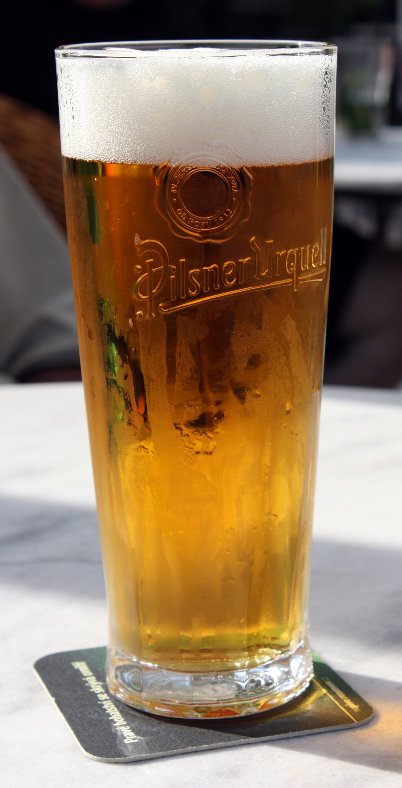

황금빛 하면발효 라거인 필스너는 1842년 플젠에서 요제프 그롤이 만든 Pilsner Urquell에서 출발했다. 프라하에서 마시는 경험은 중요하지만 "프라하가 발명한 맥주"라고 설명하지 않는다. 프라하의 강점은 신선한 탱크 라거, 오래된 펍, 다양한 따르기 방식, 현대 크래프트 양조장이 한 도시에 공존하는 데 있다. [Pilsner Urquell 공식 역사](https://www.prazdroj.cz/en/our-story)

메뉴의 `10°`, `11°`, `12°`는 알코올 도수가 아니라 발효 전 맥즙의 추출물 농도, 플라토 정도를 뜻한다. 일반적으로 10°는 가볍고 마시기 쉬우며 12°는 조금 더 풍부한 바디와 알코올을 가진다. 실제 ABV는 별도로 본다.

맥주를 평가하는 네 요소:

- 거품이 크림처럼 조밀하고 잔 벽에 흔적을 남기는가.
- 라거가 지나치게 따뜻하거나 탄산만 날카롭지 않은가.
- 쌉쌀한 홉과 맥아의 빵 같은 단맛이 균형을 이루는가.
- 잔이 세제 냄새 없이 깨끗하고 차갑게 관리되는가.

\newpage

## 미식 21. 흘라딘카, 슈니트, 믈리코, 초흐탄 - 같은 맥주의 네 표정

체코식 맥주 따르기는 거품을 실패가 아니라 맛을 조절하는 요소로 본다.

| 방식 | 잔의 모습 | 맛과 상황 | 주문 판단 |
|---|---|---|---|
| `hladinka` | 표준 맥주량과 두꺼운 크림 거품 | 거품이 산화를 막고 부드러운 첫입 | 첫 잔의 기본 선택 |
| `šnyt` | 큰 잔에 적은 맥주, 많은 거품, 빈 공간 | 마지막 한 잔이나 시음, 짧은 휴식 | 양을 줄이고 싶을 때 |
| `mlíko` | 잔 대부분이 젖 같은 미세 거품 | 빠르게 마시면 달고 부드러운 인상 | 거품 맛을 체험할 때 |
| `čochtan` | 거품이 거의 없음 | 탄산과 쌉쌀함이 날카롭고 빨리 변함 | 비교 체험용, 천천히 마시지 않음 |

같은 라거를 흘라딘카와 믈리코로 한 번씩 비교하면 재료가 아니라 질감과 산소 접촉이 맛을 바꾸는 것을 느낄 수 있다. 무리한 음주는 필요 없다. 2인이 작은 양을 나누거나 마지막 잔을 슈니트로 주문한다. [체코식 비어 매뉴얼](https://www.visitczechia.com/en-us/news/2017/04/n-beer-manual)

\newpage

## 미식 22. 수도원 맥주, 흑라거, 현대 크래프트

체코 맥주를 필스너 한 종류로 끝내지 않는다.

- **스트라호프 수도원 맥주:** 수도원과 양조, 순례와 환대가 이어진다는 맥락이 중요하다. 성 노르베르트 이름의 라거와 계절 맥주를 볼 수 있다.
- **U Fleků 흑라거:** 이 장소는 1499년부터 이어진 양조 전통과 13° 흑라거로 유명하다. 유산은 진짜지만 대형 관광 맥주홀과 공연형 서비스도 함께 존재한다. [U Fleků 공식 도시 안내](https://prague.eu/en/objevujte/u-fleku-brewery-and-restaurant/)
- **Břevnov 수도원 양조장:** 993년 수도원 설립과 연결된 체코에서 가장 오래 기록된 양조 전통을 잇는다. 현재 양조장은 2011년 부활했다. [VisitCzechia 브르제브노프](https://www.visitczechia.com/en-us/things-to-do/places/gastronomic-tourism/beer-and-breweries/g-brevnov-brewery-prague)
- **현대 크래프트:** 카를린과 홀레쇼비체 등에서는 체코 라거 기술 위에 IPA, 사워, 스타우트 같은 현대 스타일을 더한다.

"가장 오래된", "현지인만 가는" 같은 표현보다 실제 양조 여부, 맥주 스타일, 신선도, 공간의 역사 설명을 확인한다.

\newpage

## 미식 23. Kofola - 냉전이 만든 체코슬로바키아 콜라

Kofola는 1950년대 말 서방 콜라에 대응하는 체코슬로바키아 음료 개발에서 출발해 1960년 출시된 허브와 과일 향의 탄산음료다. 콜라와 비슷하지만 감초, 허브, 과일 시럽이 섞인 독특한 맛이 난다.

왜 마셔야 하나. 술을 마시지 않아도 냉전기 산업과 소비문화를 맛으로 이해할 수 있다. 병이나 캔보다 펍에서 생맥주처럼 탭으로 따르는 `točená Kofola`가 신선한 경험이다. 돼지 무릎이나 튀김과 함께 마시면 탄산과 허브 쌉쌀함이 지방을 줄인다.

첫입에서 코카콜라와 같다고 기대하지 않는다. 단맛, 허브 향, 끝맛을 비교하고, 너무 달면 얼음이나 작은 잔을 선택한다. [Kofola 공식 역사](https://www.kofola.cz/en/our-history)

\newpage

## 미식 24. 베헤로브카, 슬리보비체, 모라비아 와인 - 지역명을 정확히 말하기

`Becherovka`는 프라하가 아니라 카를로비바리에서 1807년부터 판매된 허브 리큐어다. 차갑게 소량 마시거나 토닉과 섞은 `Beton` 칵테일로 마신다. 약 38도이므로 식후 한 잔이면 충분하다. [베헤로브카 공식 관광 해설](https://www.visitczechia.com/en-us/things-to-do/places/gastronomic-tourism/czech-cuisine-and-regional-products/g-becherovka)

`slivovice`는 특히 동모라비아와 연결되는 자두 증류주다. 강한 도수와 과일 향을 작은 잔으로 경험한다. 프라하에서 마셔도 원산 지역은 모라비아라고 기억한다.

체코는 맥주만의 나라가 아니다. 모라비아의 드라이 화이트 와인, 특히 리슬링 계열과 지역 품종은 가벼운 식사와 잘 맞는다. 가을에는 발효 중인 포도즙 `burčák`이 계절 음료가 되지만 7월 여행과는 시기가 맞지 않는다.

음주 원칙은 맛의 비교가 끝나면 멈추는 것이다. 술마다 한 잔씩 수집할 필요는 없다.

\newpage

## 미식 25. 압생트의 불꽃과 연금술 신화

압생트의 기원은 스위스, 명성은 프랑스와 강하게 연결된다. 체코에도 생산 전통과 현대 브랜드가 있지만, 설탕에 불을 붙이는 의식은 벨벳혁명 이후 관광산업에서 널리 퍼진 현대 방식이다. 이를 중세 프라하 연금술사의 고대 의식이라고 설명하면 안 된다.

왜 알아야 하나. 프라하는 연금술, 마법, 카프카 이미지를 상업적으로 결합하기 쉬운 도시다. 체험 자체보다 설명의 진위를 구분하는 능력이 중요하다.

- 불꽃 쇼보다 제품의 허브 구성과 도수를 본다.
- 지나친 녹색 색소와 과장된 환각 마케팅을 경계한다.
- 강한 술이므로 공복이나 촬영 전에는 피한다.
- 한 병을 살 경우 액체 기내 반입과 위탁 수하물 규정을 확인한다.

[VisitCzechia 보헤미안 압생트 해설](https://www.visitczechia.com/en-us/campaigns/traditions-2022/czech-gastronomy/bohemian-absinth)

\newpage

## 물, 커피, 무알코올 주문

체코 수돗물은 일반적으로 마실 수 있지만 식당의 무료 수돗물 제공은 한국처럼 당연하지 않을 수 있다. 메뉴의 병물 가격을 보고 `tap water` 가능 여부를 묻는다. 탄산수는 `perlivá`, 무탄산은 `neperlivá`다.

프라하 역사 카페는 에스프레소 품질 하나보다 공간과 문화사가 핵심이다. 현대 스페셜티 커피를 원한다면 비노흐라디, 카를린, 홀레쇼비체의 로스터리를 별도 경험으로 본다.

무알코올 선택:

- `Kofola`: 허브 콜라, 가능하면 탭 버전.
- `malinovka`: 라즈베리 계열 탄산 또는 레모네이드.
- `bezové` 음료: 엘더플라워 레모네이드.
- `nealkoholické pivo`: 무알코올 맥주. 알코올 0.0 여부는 제품별 표시를 본다.

\newpage

# 11장. 고정 일정의 식당과 카페를 더 깊게 보는 법

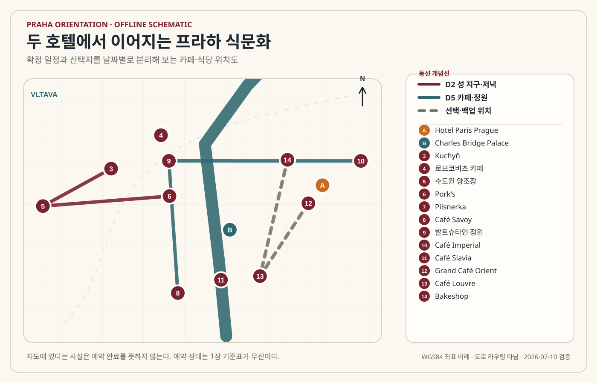

## 미식 26. Kuchyň - 궁정 요리책을 오늘의 접시로

Kuchyň은 프라하성의 살름 궁전 공간에 있으며, 오래된 궁정 요리책에서 영감을 받은 체코 요리를 현대적으로 제공한다. 메뉴 이름보다 냄비나 오늘의 조리 방식 설명을 듣고 고르는 경험, 성 아래 도시가 펼쳐지는 테라스가 핵심이다. [프라하 관광청 Kuchyň](https://prague.eu/en/objevujte/kitchen-kuchyn/), [식당 공식 사이트](https://kuchyn.ambi.cz/)

왜 일정과 잘 맞나. 성 비투스와 왕궁에서 본 권력의 공간을 식탁으로 이어준다. 왕실 요리를 그대로 재현한다는 뜻이 아니라, 오래된 조리 아이디어를 오늘의 재료와 서비스로 번역한다.

주문 전략:

- 수프 또는 전채 하나를 2인이 나누고 메인 양을 확인한다.
- 크네들리키와 소스가 있는 체코 요리 하나, 가벼운 채소나 샐러드 하나를 조합한다.
- 테라스 자리만 고집하다 식사 시간이 과도하게 늘어나지 않게 한다.
- 7월 12일은 성 정류장 폐쇄 영향을 받아 도착 시간이 변할 수 있으므로 예약 조건을 확인한다.

## 미식 27. 로브코비츠 궁전 카페 - 귀족 컬렉션과 테라스

로브코비츠 카페와 레스토랑은 궁전 1층, 르네상스 안뜰과 도시 전망 테라스를 사용한다. 공식 안내는 계절 요리, 디저트, 로브코비츠 와인을 제공하며 매일 10:00-18:00 운영으로 소개한다. [공식 카페 안내](https://www.lobkowicz.cz/en/lobkowicz-palace/lobkowicz-palace-cafe)

Kuchyň과 비교하면 선택 기준이 선명하다.

| 기준 | Kuchyň | 로브코비츠 카페 |
|---|---|---|
| 중심 이야기 | 궁정 요리책과 현대 체코 음식 | 귀족 가문, 컬렉션, 와인 |
| 공간 | 살름 궁전과 테라스 | 로브코비츠 궁전, 안뜰, 발코니 |
| 적합한 상황 | 든든한 점심과 체코 요리 | 박물관 관람 뒤 가벼운 식사나 디저트 |
| 운영 판단 | 메뉴와 예약 확인 | 박물관 동선과 18:00 종료 고려 |

둘 다 넣는 것이 목표가 아니다. 기존 일정의 실제 선택을 존중하고, 선택한 장소의 이야기를 깊게 본다.

\newpage

## 미식 28. Pork's - 큰 고기를 현명하게 공유하기

Pork's Mostecká 16점은 카를교 말라스트라나 쪽 바로 아래에 있다. 공식 사이트는 바삭한 돼지 무릎, 돼지고기 요리, 필스너 탱크 맥주를 대표로 내세운다. 위치가 관광 중심이라는 사실과 조리 전문성은 동시에 존재할 수 있다.

이 식사의 학습 목표는 양이 아니라 조합이다.

- 돼지 무릎의 껍질, 살, 콜라겐 부위를 나눠 맛본다.
- 겨자, 서양고추냉이, 피클이 어떤 순서로 지방감을 줄이는지 본다.
- 흘라딘카 한 잔과 Kofola 또는 물을 함께 두어 음주 속도를 조절한다.
- 2인이 공유하고 다른 메인은 양을 확인한 뒤 추가한다.

카를교 산책 직후라면 손을 씻고 식사를 시작한다. 뼈와 소스가 있는 큰 요리이므로 스냅 촬영 전보다 일정이 끝난 뒤가 편하다. [Pork's 공식 페이지](https://www.porks.cz/en/mostecka)

\newpage

## 미식 29. Pilsnerka Národní - 라거 품질을 배우는 저녁

Pilsnerka Národní는 Národní 1987/22에 있으며 공식 안내 기준 매일 11:00-23:30 운영한다. 핵심은 메뉴 수보다 필스너 라거의 따르기와 펍 음식 조합을 보는 것이다. [Pilsnerka 공식 안내](https://www.pilsnerkanarodni.cz/daily-menu)

첫 잔은 표준 `hladinka`로 주문하고 거품의 조밀함, 잔 벽에 남는 고리, 맥주의 온도를 본다. 두 번째가 필요하면 양이 적은 `šnyt` 가능 여부를 묻는다. 10°, 12°가 ABV가 아니라 맥즙 농도라는 점을 기억한다.

안주는 비프 타르타르, 절인 치즈, 소시지, 굴라시처럼 라거와 맛의 대비가 분명한 것 중 하나만 고른다. 7월 14일 스냅 촬영이 19:30 시작하므로 식사 종료, 이동, 옷과 화장 상태를 우선한다. 큰 양의 마늘 안주와 과음은 촬영 전 피하는 것이 실용적이다.

\newpage

## 미식 30. Café Savoy - 조식보다 천장과 제과를 함께 보기

Café Savoy Prague는 Vítězná 5에 있으며 높은 역사주의 천장, 전통 제과, 아침 식사로 유명하다. 공식 사이트의 2026년 운영 안내는 평일 08:00-22:00, 주말과 공휴일 09:00-22:00이며 온라인 예약을 제공한다. [Café Savoy 공식 예약](https://www.cafesavoy.ambi.cz/en/reservation)

> **예약 상태:** 현재 여행 자료에서는 "예약 권장"이지 예약 완료가 아니다. 좌석이 확정되었다고 책에서 가정하지 않는다.

왜 가나. 최고 조식 목록을 체크하기보다 19세기 말 카페의 높은 천장과 서비스, 제과가 오늘까지 어떻게 재사용되는지 경험한다. 기존 후보인 Savoy breakfast나 트러플 오믈렛은 당일 메뉴와 양을 확인한다.

관찰할 것:

- 천장 장식과 거울이 작은 테이블 공간을 어떻게 웅장하게 만드는가.
- 빵 바구니와 잼, 버터, 달걀 요리가 한 끼의 속도를 어떻게 구성하는가.
- 관광객의 사진 촬영과 실제 식사 서비스가 충돌하지 않는가.

Hotel Paris 조식 포함 조건과 별개로 일정에 이미 잡힌 카페 경험이므로, 그날 전체 식사량을 조절한다.

\newpage

## 미식 31. Café Imperial - 타일로 만든 20세기 초의 무대

Café Imperial은 1913-1914년에 지어진 호텔의 화려한 도자기 타일, 모자이크 천장, 아르누보와 아르데코 전환기 분위기로 유명하다. 공식 안내는 전통 체코 요리를 현대적으로 제공하고, 2026 Michelin Guide 등재를 알리며 매일 07:00-23:00 운영한다고 설명한다. [Café Imperial 공식 안내](https://www.hotel-imperial.cz/en/dining/?lang=en)

왜 가나. 벽과 천장의 장식이 식사의 기대와 행동을 어떻게 바꾸는지 체험할 수 있다. 사진만 찍고 나오는 대신, 한 접시를 먹으며 빛이 타일 표면에서 변하는 것을 본다.

주문은 스비치코바, 굴라시, 오리 같은 전통 요리의 현대적 표현 중 하나를 고르고, 이미 다른 곳에서 먹은 메뉴와 비교한다. 같은 음식 반복이 싫다면 쿨라이다나 계절 수프, 가벼운 요리로 방향을 바꾼다.

인테리어가 화려하다고 모든 메뉴가 전통 원형 그대로인 것은 아니다. 이곳의 가치는 역사적 공간과 현대 레스토랑 서비스의 결합이다.

\newpage

## 미식 32. Café Slavia - 마지막 아침의 문화사

Café Slavia는 Národní 1, 국립극장 맞은편에 있다. 공식 안내는 1881년부터 이어진 역사, 조식 14:00까지, 전통 체코와 국제 메뉴, 매일 저녁 피아노 연주를 소개한다. 창가에서는 국립극장과 강, 성 방향을 볼 수 있다.

07.27에는 조식 없는 호텔 예약과 자연스럽게 연결된다. 창가가 아니어도 카페의 긴 축, 피아노, 대형 창, 극장과의 위치 관계를 본다. 예약이 필수라고 단정하지 않는다. 공식 체코어 페이지는 일반적으로 예약 없이도 좌석을 안내한다고 설명하지만 현장 혼잡은 달라질 수 있다.

추천 경험:

- 체코식 조식 또는 달걀 요리와 커피.
- 작은 디저트 하나를 2인이 나눠 카페 제과를 정리.
- 식사 뒤 국립극장 외관과 강변 10분 산책.

마지막 날 새 명소를 늘리기보다, 이곳에서 프라하의 음악, 극장, 반체제 지식인, 관광도시의 현재를 한 번에 회고한다. [Café Slavia 공식 사이트](https://www.cafeslavia.cz/en/?lang=en)

\newpage

## 미식 33. Grand Café Orient와 시민회관 카페 - 공간을 먹는 두 방식

Grand Café Orient는 검은 성모의 집 안에서 큐비즘 가구와 조명, 계단을 실제로 사용하는 경험이다. 디저트의 모양이 큐비즘이라는 마케팅보다, 건물과 가구, 컵, 서비스가 같은 기하학 언어를 쓰는지 본다.

시민회관 카페는 아르누보의 곡선, 유리, 금속, 조명이 공연장과 식당을 하나의 총체예술로 연결한다. Hotel Paris 바로 앞이므로 별도 장거리 이동 없이 비교할 수 있다.

| 비교 | Grand Café Orient | 시민회관 카페 |
|---|---|---|
| 양식 | 체코 큐비즘 | 프라하 아르누보 |
| 형태 | 사선, 결정, 꺾인 면 | 곡선, 식물 문양, 빛나는 공예 |
| 핵심 질문 | 회화의 큐비즘이 생활용품이 되면 어떤가 | 여러 예술이 한 건물에서 어떻게 통합되는가 |
| 추천 주문 | 커피와 작은 디저트 | 커피, 케이크 또는 가벼운 휴식 |

둘 다 방문하지 않아도 된다. 외관과 실내 한 곳만으로 양식 차이를 확실히 이해하면 충분하다.

\newpage

# 12장. 무엇을 사야 하는가 - 공예와 제품 판별서

## 제품 구매의 네 원칙

1. 제품명보다 제작자와 생산국을 먼저 본다.
2. "Bohemian", "Prague", "traditional" 스티커만으로 지역산이라고 판단하지 않는다.
3. 값비싼 유리와 가넷은 인증서, 제작자 표식, 반품 조건을 확인한다.
4. 가볍고 실용적인 제품은 여행의 맥락을 오래 남길 수 있다.

  
<b>작고 의미 있음</b>
큐비즘 컵, 유리 손톱파일, 지역 디자이너 엽서, 체코 문구.

  
<b>공예 중심</b>
수제 유리, 도자기, 마리오네트, 제작자명이 있는 장신구.

  
<b>인증 필수</b>
보헤미안 가넷, 고가 크리스털, 귀금속.

  
<b>먹는 선물</b>
스파 웨이퍼, 포장 과자, Becherovka. 검역과 수하물 규정 확인.

\newpage

## 제품 1. 보헤미안 유리와 크리스털 - 빛을 사는 법

체코 유리는 오랜 산림, 규사, 장인 기술과 국제 무역이 결합한 대표 공예다. 손으로 불고 자르고 연마한 제품부터 현대 디자인과 산업 생산품까지 범위가 넓다. 2023년 유네스코 무형유산 등재는 여러 나라가 함께 보유한 "수제 유리 생산의 지식과 기술"에 관한 것이지, 모든 `Bohemian crystal` 상품을 인증한다는 뜻은 아니다. [유네스코 수제 유리 기술](https://ich.unesco.org/en/RL/knowledge-craft-and-skills-of-handmade-glass-production-01961)

구매 전 묻는다.

- 체코에서 제작했는가, 브랜드와 공방이 어디인가.
- 손으로 불었는가, 몰드 생산인가, 손으로 커팅했는가.
- 크리스털의 납 함량이나 소재 표기가 있는가.
- 작은 기포와 미세한 차이가 수공예 흔적인지 결함인지 설명할 수 있는가.
- 포장, 위탁 수하물, 파손 시 정책은 무엇인가.

처음 사는 사람에게는 대형 화병보다 작은 잔, 오브제, 유리 손톱파일이 실용적이다. 프라하 공식 쇼핑 목록에는 Preciosa, ERPET, Pragl 등 유리와 공예 공간이 정리되어 있다. [프라하 공식 쇼핑](https://prague.eu/en/objevujte-kategorie/shopping/)

\newpage

## 제품 2. 보헤미안 가넷 - 큰 돌보다 인증서

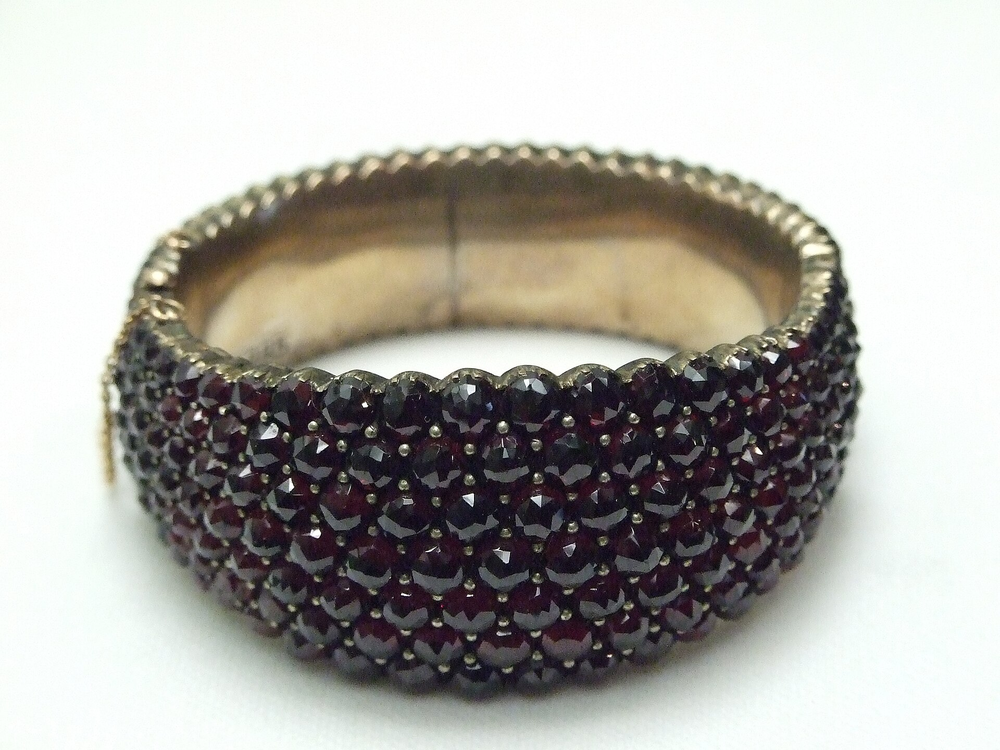

체코 가넷 `Český granát`은 짙은 적색의 파이로프로, 원석은 대체로 작고 컷 뒤 평균 약 4mm다. 큰 붉은 돌이 무조건 더 체코다운 것이 아니며, 다른 산지의 알만딘이나 로돌라이트가 섞일 수 있다. [VisitCzechia 가넷 해설](https://www.visitczechia.com/en-us/things-to-do/places/culture/traditional-crafts/c-czech-garnets-stonecutting)

Granát Turnov 제품의 진위 확인:

- 제작자 표식 `G`를 확인한다.
- 홀로그램이 있는 인증서를 받는다.
- 인증서에 보헤미안 가넷의 산지와 제품 기원이 설명되는지 본다.
- 귀금속의 품위와 보증, 영수증을 함께 보관한다.

공식 인증서 설명에 따르면 Granát Turnov는 `Bohemian Garnet`과 `Bohemian Garnet Jewelry` 원산지 명칭과 상표 권리를 보유하고, 홀로그램 인증서로 제품을 보증한다. [Granát Turnov 인증서](https://www.granat.cz/en/jewelry/certificate-of-authenticity/)

숙소와 가까운 공식 판매 정보에는 Dlouhá 28, Havířská 3, Panská 1, Karlova 8 등이 안내된다. 매장과 운영시간은 당일 확인한다. Karlova 8의 가넷 박물관은 역사와 채굴, 세공을 보고 구매를 판단하기 좋다. [체코 가넷 박물관](https://prague.eu/en/objevujte/czech-garnet-museum-muzeum-ceskeho-granatu/)

\newpage

## 제품 3. 체코 큐비즘 컵과 도자기 - 프라하만의 디자인 언어

체코 큐비즘은 회화의 분절된 면을 건축, 가구, 금속, 유리, 도자기에 적용했다는 점에서 독특하다. 검은 성모의 집 박물관과 Modernista 숍은 건축을 본 직후 제품을 이해할 수 있어 가장 교육적인 구매 동선이다.

프라하 공식 기프트숍의 Modernista 컵과 소서는 1911년 파벨 야나크 디자인의 공인 복제품 계열이며, 프라하의 현존 큐비즘 가로등에서 영감을 받은 장식을 사용한다. 제품은 단순한 기념 머그가 아니라 특정 디자인 계보를 설명할 수 있다. [Modernista 컵 공식 소개](https://prague.eu/en/produkt/modernista-cup-and-saucer/)

구매 판단:

- 원작 디자이너와 제작 라이선스가 표시되는가.
- 형태가 실제 사용에 편한가, 장식품으로 둘 것인가.
- 박물관 전시에서 본 사선과 결정형이 제품에 어떻게 적용되었는가.
- 무거운 세트를 여러 개 사기보다 한 점을 선택한다.

\newpage

## 제품 4. 체코 마리오네트와 장난감 - 살아 있는 공연 전통

체코와 슬로바키아의 인형극은 유네스코 무형유산이다. 가족과 이동 극단, 지역 언어와 풍자, 교육이 결합한 공연 전통이며, 프라하 기념품점의 모든 인형이 이 유산을 대표하는 것은 아니다. [유네스코 체코-슬로바키아 인형극](https://ich.unesco.org/en/RL/puppetry-in-slovakia-and-czechia-01202)

좋은 마리오네트를 고르는 기준:

- 제작자나 공방 이름이 있는가.
- 머리와 손의 소재, 채색 방식, 줄과 조종 구조를 설명할 수 있는가.
- 실제 조종이 가능한가, 장식용인가.
- 캐릭터가 체코 극 전통과 연결되는가, 출처 없는 판타지 상품인가.

작은 목각 인형이나 라이선스된 `Krtek`, 두더지 캐릭터 장난감은 운반이 쉽다. 러시아식 마트료시카는 흥미로운 물건일 수 있지만 체코 전통품으로 사지는 않는다.

\newpage

## 제품 5. 체코 문구와 인쇄물 - 가장 가벼운 디자인 선물

Koh-i-Noor Hardtmuth는 연필, 색연필, 제도용품으로 알려진 체코 문구 브랜드다. 전문가용 색연필 한 세트, 지우개, 금속 홀더는 가격과 운반 부담이 적고 체코 산업 디자인의 실용성을 보여준다.

보헤미아 페이퍼와 독립 서점, 박물관숍에서는 프라하 건축 도면, 타이포그래피 엽서, 아트 프린트, 지도, 책을 찾을 수 있다. 공식 프라하 기프트숍은 지역 예술가와 체코 제작 상품을 선별하고 판매 수익이 지역 예술과 문화유산을 지원한다고 안내한다. [프라하 공식 기프트숍](https://prague.eu/en/objevujte/gift-shop/)

추천 조합:

- 검은 성모의 집에서 큐비즘 엽서 한 장.
- 시민회관 또는 화약탑의 건축 스케치.
- 프라하 메트로 패널 디자인을 활용한 작은 문구.
- 현장에서 적을 수 있는 A6 노트와 체코 연필.

이런 제품은 여행 중 바로 사용하면 기념품과 기록도구가 하나가 된다.

\newpage

## 제품 6. 현대 체코 디자인 - 제작자 이름을 사기

프라하의 현대 디자인은 유리와 도자기 전통을 그대로 반복하지 않고 패션, 주얼리, 가방, 조명, 그래픽으로 확장한다. CZECHDESIGN Shop, DOX by Qubus, THE DESIGN, Showroom. 같은 공간은 제작자 이름과 작업 맥락을 비교하기 좋다.

Hotel Paris 인근에서는 시민회관 주변과 Klimentská 지역의 디자인숍을 살펴볼 수 있고, Charles Bridge Palace 인근에서는 구시가 박물관숍과 SmetanaQ 계열 공간이 가깝다. 매장 방문을 별도 목표로 만들기보다 기존 동선에서 한 곳만 고른다.

구매 전에 제품 태그를 사진으로 남긴다. 디자이너명, 소재, 생산국, 관리법이 있어야 집에 돌아가서도 물건의 이야기를 설명할 수 있다. "체코풍"보다 실제 체코 제작자의 이름이 더 좋은 인증이다. [VisitCzechia 프라하 디자인숍](https://www.visitczechia.com/en-us/news/2025/09/n-prague-best-design-shops)

\newpage

## 제품 7. 화장품과 생활용품 - 전통 이미지와 현대 상품 구분

Manufaktura, Botanicus, Ryor 같은 체코 브랜드는 허브, 소금, 맥주, 온천 이미지를 활용한 화장품과 생활용품으로 알려져 있다. 작은 핸드크림, 비누, 배스 솔트는 실용적이고 운반이 쉽다.

다만 `beer cosmetics`가 실제 체코 브랜드 제품이라고 해서 오래된 민간 치료법이라는 뜻은 아니다. 전통 재료 이미지를 현대 제품으로 만든 것이다. 피부 효능을 의약품처럼 과장하는 설명보다 전성분, 향, 용량, 개봉 후 사용기간을 본다.

구매 체크:

- 알레르기 성분과 향료를 확인한다.
- 액체류 기내 반입 용량을 확인한다.
- 선물용 세트보다 실제 사용할 단품을 고른다.
- 같은 브랜드라도 체코 생산인지 제품별 라벨을 본다.

\newpage

## 제품 8. 식품과 술 - 포장보다 검역이 먼저

운반하기 쉬운 식품은 스파 웨이퍼, 포장 콜라체나 진저브레드, 양귀비씨와 자두잼을 활용한 과자, 차와 허브 제품이다. Becherovka는 지역 이야기가 분명하지만 액체와 알코올 수하물 규정을 확인한다.

주의할 품목:

- 프라하 햄, 소시지 같은 육류는 한국 반입 제한 가능성이 높다.
- 치즈와 유제품도 검역 조건을 확인한다.
- 씨앗이나 생식물은 반입 규정이 별도다.
- 술은 면세 한도와 위탁 수하물 파손을 고려한다.

여행지에서 살 수 있다는 사실과 한국에 반입할 수 있다는 사실은 다르다. 최신 관세청과 농림축산검역본부 안내를 출국 전에 확인한다.

\newpage

## 피해야 할 기념품과 설명

- 제작자와 생산국이 없는 `Bohemian crystal` 대형 제품.
- 인증서 없이 큰 붉은 돌만 강조하는 가넷 장신구.
- 러시아 마트료시카를 체코 민속품으로 설명하는 상품.
- "중세 프라하 연금술"을 내세우는 불붙이는 압생트 세트.
- 성분과 제조사가 불명확한 일반 대마 사탕.
- 무게와 최종 가격이 불명확한 노점 식품.

좋은 구매는 많이 사는 것이 아니라, 물건의 제작자와 프라하의 장소를 함께 기억할 수 있는 한 점을 고르는 것이다.

\newpage

# 13장. 현장 운영 매뉴얼

## 2026년 대중교통 요금

2026년 1월 1일부터 프라하 PID 단기권 요금은 구매 방식에 따라 다르다.

| 유효시간 | PID Lítačka 앱 | 종이권 | 용도 판단 |
|---|---:|---:|---|
| 30분 | 36 CZK | 39 CZK | 가까운 단일 이동, 환승 여유가 작음 |
| 90분 | 46 CZK | 50 CZK | 공항 59번+메트로, 일반 관광 이동의 안전한 기본 |
| 24시간 | 140 CZK | 150 CZK | 유효시간별 이동 묶음을 계산했을 때 단기권 합계가 더 비쌀 때 |
| 72시간 | 340 CZK | 350 CZK | 3일간 대중교통을 적극 이용할 때 |

[2026 PID 공식 요금](https://pid.cz/en/new-pid-tariff-from-1-january-2026-dont-pay-more-than-you-have-to/)

앱 30분권을 서로 독립된 이동에 4회 쓰면 144 CZK이므로 24시간권 140 CZK가 더 저렴할 수 있다. 그러나 앱 90분권 3장은 138 CZK이고, 한 표의 유효시간 안에서는 여러 번 환승할 수 있다. 따라서 '탑승 4회'를 고정 규칙으로 쓰지 말고, 실제로 필요한 **유효시간별 이동 묶음**으로 비교한다.

종이권은 첫 탑승 때 차량 안 검표기에 넣거나, 메트로 유료구역에 들어가기 전에 한 번만 펀칭한다. 환승할 때 다시 찍으면 표를 훼손할 수 있다. 트램과 도시버스 내부 카드 단말기에서 산 표는 구매 시점부터 유효하므로 별도 펀칭하지 않는다. 앱 표는 탑승 전에 활성화하고 보호 시간이 지난 뒤 유효 상태를 확인한다. [표 구매와 검표 규칙](https://pid.cz/en/tickets-and-fare/how-to-buy-ticket/)

> **검표 원칙:** 표를 샀다는 결제 내역이 아니라, 탑승 시점에 유효한 표가 있어야 한다. 두 사람은 각자 표가 필요하다.

\newpage

## 공항과 두 숙소의 비상 대안

프라하 공항에서 도심으로 가장 빠른 일반 대중교통은 59번 트롤리버스로 `Nádraží Veleslavín`까지 약 15분 이동한 뒤 메트로 A로 갈아타는 방식이다. 도심까지 총 약 35분이며 일반 90분권을 사용할 수 있다. 100번 버스와 메트로 B 조합은 약 45분이다. AE 버스는 중앙역 직행 약 45분, 200 CZK 별도 요금이다. [프라하 공항 공식 대중교통](https://www.prg.aero/en/public-transport-buses), [PID 공항 안내](https://pid.cz/en/travel-information/how-do-i-get-from/)

기존에 확정한 픽업이나 이동수단이 있으면 그것을 우선한다. 아래는 문제가 생겼을 때의 비상 이해도다.

- **Hotel Paris:** 59번+메트로 A로 Můstek까지 간 뒤 도보, 또는 Můstek에서 메트로 B로 한 정거장 이동해 Náměstí Republiky에서 내릴 수 있다. 큰 짐과 환승 계단을 고려한다.
- **Charles Bridge Palace:** 59번+메트로 A로 Staroměstská에서 내려 공식 안내 기준 약 8분 걷는다. 카를교 주변 돌길과 인파 때문에 캐리어 이동은 더 오래 걸릴 수 있다.
- **공식 공항 택시:** 공항의 공식 계약 서비스는 Uber Airport다. 앱, 키오스크, 카운터로 사전 가격을 확인하고 배정된 승차 지점을 이용한다. [공항 공식 택시](https://www.prg.aero/en/taxi)

터미널 밖에서 먼저 다가와 차를 권하는 사람은 이용하지 않는다.

\newpage

## Prague Visitor Pass는 언제 가치가 있는가

공식 Prague Visitor Pass는 48, 72, 120시간 동안 다수 명소와 대중교통을 묶는다. 2026년 조사 시 성인 가격은 각각 2,700, 3,300, 3,900 CZK로 안내된다. 교통만 필요하다면 72시간 PID 앱권 340 CZK와 큰 차이가 나므로 매우 비싸다.

구매 전에 실제로 들어갈 유료 명소만 합산한다.

1. 프라하성 유료 회로.
2. 구시청사와 탑.
3. 클레멘티눔 또는 여러 시립 탑.
4. 박물관과 크루즈 등 확실히 이용할 항목.

하루에 많은 유료 명소를 촘촘히 볼 때만 패스가 유리할 수 있다. 이번 여행은 이미 고정 식사와 스냅, 체스키 크룸로프 당일치기가 있어 무조건 패스를 사는 구조가 아니다. [Prague Visitor Pass 공식 안내](https://prague.eu/en/prague-visitor-pass/)

\newpage

## 현금, 카드, 환전, DCC

체코의 통화는 유로가 아니라 체코 코루나 `CZK`, 현지 표기는 `Kč`다. 중심지의 일부 가게가 유로를 받아도 환율이 불리할 수 있다.

카드 단말기나 ATM이 원화 또는 자국통화 결제를 제시하면 `CZK로 결제`를 선택해 카드사의 환율을 쓰는 것이 일반적으로 유리하다. DCC, 동적 통화변환은 편리해 보이지만 가맹점이나 ATM 사업자의 환율과 수수료가 적용될 수 있다.

환전소를 이용한다면 체코 중앙은행의 기본 원칙을 따른다.

- 환전소 관점의 `buy`와 `sell`을 구분한다.
- 수수료 없는 거래가 원칙이지만 실제 받는 금액과 환율을 확인한다.
- 영수증을 반드시 받는다.
- 같은 환전소에서 거래 후 3시간 이내, 최대 1,000유로 상당액까지 이유 없이 취소할 권리가 있다.

[체코 중앙은행 환전 10대 원칙](https://www.cnb.cz/en/supervision-financial-market/consumer-protection-and-financial-literacy/consumer-protection/ten_golden_rules_currency_exchange/)

\newpage

## 택시와 승차 앱

프라하 시내에서는 길에서 바로 잡기보다 앱이나 전화로 사전 예약해 가격과 차량을 기록하는 편이 안전하다. 일반 미터 택시의 시 공식 상한은 기본 60 CZK, 1km당 36 CZK, 대기 1분당 7 CZK다. 앱에서 총액을 사전에 합의한 승차는 별도 방식으로 계산된다. [프라하 관광청 택시 안내](https://prague.eu/en/getting-around/)

공항에서 비공식 운전자의 제안을 받지 않는다. 전통 미터 택시를 이용한다면 외부 TAXI 표식, 노란 등록 스티커, 운전자 ID를 보고 영수증을 요구한다. 부당한 요금이나 영수증 거부가 있으면 시경찰 156에 연락할 수 있다. [프라하 공항 비공식 택시 주의](https://www.prg.aero/en/unofficial-taxi-services)

승차 앱 사용 시:

- 차량번호와 운전자 이름을 대조한다.
- 숙소 앞 도로가 차량 진입 가능한지 확인한다.
- 카를교 주변 보행구역에서는 정확한 픽업 핀을 호텔과 맞춘다.
- 짐 수와 차량 크기를 예약 전에 반영한다.

\newpage

## 여름 보행과 복장

7월 프라하는 햇빛, 더위, 갑작스러운 소나기, 돌바닥을 동시에 고려한다. 기상은 변하므로 책에 고정 예보를 넣지 않고 매일 아침 현지 예보와 레이더를 확인한다.

하루 가방:

- [ ] 500-750ml 물과 필요 시 전해질.
- [ ] 얇은 우비 또는 작은 우산.
- [ ] 자외선 차단제와 모자.
- [ ] 돌바닥에 익숙한 신발과 물집 패치.
- [ ] 성당 관람용 어깨와 무릎을 가릴 가벼운 겉옷.
- [ ] 작은 보조배터리와 오프라인 지도.
- [ ] 여권 원본 보관 원칙에 맞춘 신분증 사본 또는 디지털 백업.

전망대 계단과 언덕은 한 날에 하나만 강하게 넣는다. 물을 아끼지 말고 카페 휴식을 관광 실패로 보지 않는다.

\newpage

## 안전, 소음, 관광 예절

프라하는 대체로 관광 인프라가 잘 갖춰져 있지만, 혼잡한 카를교, 천문시계 정시 군중, 트램 승하차, 메트로 에스컬레이터에서 소지품에 주의한다. 가방 지퍼를 닫고 휴대전화와 지갑을 바깥 주머니에 두지 않는다.

공식 `Enjoy Respect Prague` 캠페인은 느린 여행, 지역 음식, 주민 생활 존중을 권한다. 역사보호구역의 지정 공공장소 음주와 22:00 이후 소음을 피하고, 교회 미사 중 통로를 막지 않는다. [프라하 여행 예절](https://prague.eu/en/enjoy-respect/)

길에서 판매하는 비공식 투어보다 공식 또는 면허 가이드를 이용한다. 레넌 벽에는 스프레이를 사용하지 않고, 공원 야생동물과 발트슈타인 정원의 공작새에게 먹이를 주지 않는다.

긴급번호:

| 상황 | 번호 |
|---|---:|
| EU 통합 긴급 | 112 |
| 구급차 | 155 |
| 국가경찰 | 158 |
| 프라하 시경찰 | 156 |
| 소방 | 150 |

[프라하 공식 긴급 연락처](https://prague.eu/en/important-contacts/)

\newpage

# 14장. 식당 언어, 팁, 알레르기

## 식당에서 바로 쓰는 체코어

| 체코어 | 발음 힌트 | 뜻 |
|---|---|---|
| `Dám si ..., prosím.` | 담 시 ..., 프로심 | ...로 주세요 |
| `Jedno malé pivo, prosím.` | 예드노 말레 피보, 프로심 | 작은 맥주 한 잔 주세요 |
| `Jedno velké pivo, prosím.` | 예드노 벨케 피보, 프로심 | 큰 맥주 한 잔 주세요 |
| `Zaplatím, prosím.` | 자플라팀, 프로심 | 계산할게요 |
| `Kartou, prosím.` | 카르토우, 프로심 | 카드로요 |
| `Hotově, prosím.` | 호토베, 프로심 | 현금으로요 |
| `Zvlášť.` | 즈블라슈티 | 따로 계산 |
| `Dohromady.` | 도흐로마디 | 같이 계산 |
| `Bez ..., prosím.` | 베즈 ..., 프로심 | ... 없이 주세요 |
| `Obsahuje to ...?` | 옵사후예 토 ... | 이것에 ...가 들어 있나요 |
| `Na zdraví!` | 나 즈드라비 | 건배 |
| `Děkuji.` | 제쿠이 | 감사합니다 |

체코어를 완벽하게 발음할 필요는 없다. 인사와 감사, 결제 방식을 짧게 말한 뒤 메뉴를 가리키면 된다. 알레르기는 발음보다 문장과 성분을 글자로 보여주는 것이 안전하다.

\newpage

## 메뉴를 읽는 핵심 단어

| 단어 | 뜻 | 메뉴에서의 판단 |
|---|---|---|
| `hovězí` | 쇠고기 | 굴라시, 타르타르, 스비치코바 |
| `vepřové` | 돼지고기 | 무릎, 구이, 슈니첼 |
| `kuřecí` | 닭고기 | 슈니첼, 구이 |
| `kachna` | 오리 | 양배추와 크네들리키 조합 |
| `šunka` | 햄 | 프라하 햄, 흘레비체크 |
| `knedlíky` | 덤플링 | 빵, 감자, 과일 유형을 구분 |
| `zelí` | 양배추 | 흰색 또는 붉은 양배추 조림 |
| `omáčka` | 소스 | 크림, 육즙, 채소 베이스 확인 |
| `smetana` | 크림 | 우유 알레르기 확인 |
| `houby` | 버섯 | 수프와 소스에 자주 사용 |
| `mák` | 양귀비씨 | 콜라체, 과일 덤플링 토핑 |
| `tvaroh` | 신선 치즈 | 빵 소, 디저트, 덤플링 토핑 |
| `povidla` | 진한 자두잼 | 콜라체와 부흐티 |
| `čepované` | 탭에서 따른 | 생맥주 또는 탭 음료 |

`denní menu` 또는 `polední menu`는 평일 점심 한정 메뉴일 수 있다. 가격이 낮고 실제 생활 음식에 가깝지만 체코어만 있는 경우가 있어 사진 번역을 활용한다.

\newpage

## 팁과 계산

체코의 테이블 서비스에서는 서비스가 포함되지 않았을 때 5-10%가 일반적인 감사 표시로 안내된다. 미국식 의무 팁처럼 고정 비율을 강제할 필요는 없다. 서비스 차지가 영수증에 이미 포함되었으면 중복하지 않는다.

현금 계산은 서버가 금액을 말한 뒤 팁을 포함한 최종액을 말하는 방식이 흔하다. 예를 들어 930 CZK 청구에 1,000 CZK를 내고 잔돈을 받지 않으려면 `One thousand, please`라고 최종액을 말한다. 카드는 결제 단말기를 찍기 전에 팁을 더할 수 있는지 묻는다.

계산 체크:

- 주문하지 않은 빵이나 작은 술이 자동 추가되지 않았는지 본다.
- `service charge`가 포함되었는지 본다.
- 카드 단말기 통화는 CZK를 선택한다.
- 영수증 금액을 확인한 뒤 결제한다.
- 별도 계산은 `Zvlášť`, 함께는 `Dohromady`라고 말한다.

\newpage

## EU 알레르기 숫자와 대표 위험 조합

EU 음식점은 14개 주요 알레르기 정보를 제공해야 하며 체코 메뉴는 1-14 숫자를 쓰는 경우가 많다. 숫자만 믿지 말고 심한 알레르기는 직원에게 재료와 교차오염을 다시 확인한다. [EU 2026 알레르기 안내](https://food.ec.europa.eu/food-safety/campaign-2026/allergies_en)

| 번호 | 알레르기 | 자주 만나는 음식 |
|---:|---|---|
| 1 | 글루텐 함유 곡물 | 크네들리키, 빵, 맥주, 튀김옷 |
| 3 | 달걀 | 스마자크, 디저트, 마요네즈 |
| 4 | 생선 | 흘레비체크 토핑, 일부 샐러드 |
| 7 | 우유 | 스비치코바, 치즈, 크림 디저트 |
| 8 | 견과류 | 콜라체, 슈트루델, 디저트 |
| 9 | 셀러리 | 스비치코바, 육수, 수프 |
| 10 | 겨자 | 돼지 무릎 곁들임, 소스, 델리 |
| 12 | 아황산염 | 와인, 절임, 가공육 가능성 |

대표 위험 조합:

- 스비치코바: 글루텐, 우유, 셀러리, 조리법에 따라 겨자.
- 스마자크: 글루텐, 달걀, 우유, 소스의 겨자.
- 흘레비체크: 토핑에 따라 글루텐, 달걀, 우유, 겨자, 생선.
- 디저트: 글루텐, 달걀, 우유, 견과류가 복합적으로 들어감.
- 소시지와 절임: 겨자, 셀러리, 아황산염 가능.

체코 보건당국은 알레르기 표시 정확성 점검을 이어가고 있다. 심한 알레르기는 체코어와 영어로 된 카드를 인쇄해 주방 확인을 요청한다. [체코 보건부 알레르기 표시 점검](https://mzd.gov.cz/krajske-hygienicke-stanice-pokracuji-v-dohledu-nad-spravnym-oznacovanim-alergenu-ve-stravovacich-zarizenich/)

\newpage

## 알레르기와 채식 문장

- `Mám silnou alergii na ...` - ...에 심한 알레르기가 있습니다.
- `Obsahuje to mléko / vejce / lepek / ořechy?` - 우유 / 달걀 / 글루텐 / 견과가 들어 있나요.
- `Může dojít ke křížové kontaminaci?` - 교차오염 가능성이 있나요.
- `Bez mléka, prosím.` - 우유 없이 주세요.
- `Je to vegetariánské?` - 채식인가요.
- `Je to veganské?` - 비건인가요.

채식으로 보이는 감자수프나 양배추도 고기 육수, 라드, 베이컨을 쓸 수 있다. 스마자크는 고기가 없지만 고기와 같은 기름에서 튀길 수 있다. 엄격한 기준이면 재료뿐 아니라 육수와 조리유를 묻는다.

\newpage

# 15장. 현장 기록장

## 첫날 숙소 반경 기록

| 질문 | 나의 기록 |
|---|---|
| 호텔 문을 나와 가장 먼저 보이는 탑은 무엇인가 |  |
| 시민회관과 Hotel Paris의 장식은 어떻게 다른가 |  |
| 5분 안에 찾은 생활시설 세 곳은 무엇인가 |  |
| 돌길과 신호, 인파가 지도 예상과 어떻게 달랐나 |  |
| 첫날 먹은 음식은 전통과 관광상품 중 어디에 가까웠나 |  |

## 명소 한 곳을 깊게 보는 기록

| 항목 | 기록 |
|---|---|
| 장소와 방문 시각 |  |
| 미리 기억한 연도, 기능, 인물 |  |
| 가장 먼저 보인 형태 |  |
| 실제 사용 흔적 |  |
| 사람들의 행동 |  |
| 예상과 달랐던 점 |  |
| 더 알고 싶은 질문 |  |

\newpage

## 음식 비교 기록

| 음식 | 장소 | 짠맛 | 신맛 | 향 | 식감 | 다시 먹을 이유 |
|---|---|---:|---:|---|---|---|
| 스비치코바 |  |  |  |  |  |  |
| 굴라시 |  |  |  |  |  |  |
| 돼지 무릎 |  |  |  |  |  |  |
| 콜라체 |  |  |  |  |  |  |
| 베트르니크 |  |  |  |  |  |  |
| 흘라딘카 라거 |  |  |  |  |  |  |
| Kofola |  |  |  |  |  |  |

좋았는지 나빴는지만 적지 않는다. 왜 유명한지 이해되었는가, 재료의 역할이 보였는가, 장소가 맛의 기대를 바꾸었는가를 기록한다.

## 기념품 판별 기록

| 품목 | 제작자 | 생산국 | 소재 | 인증 | 구매 이유 |
|---|---|---|---|---|---|
|  |  |  |  |  |  |
|  |  |  |  |  |  |
|  |  |  |  |  |  |

구매하지 않은 것도 기록할 수 있다. 좋은 물건을 보고도 무게, 가격, 인증 때문에 사지 않은 결정은 실패가 아니라 정확한 판단이다.

\newpage

## 날짜별 세 문장

### 07.11

1.
2.
3.

### 07.12

1.
2.
3.

### 07.13

1.
2.
3.

### 07.14

1.
2.
3.

### 07.15

1.
2.
3.

### 07.26

1.
2.
3.

### 07.27

1.
2.
3.

\newpage

## 귀국 후 도시를 기억하는 10문장

1. 프라하는 내게 ____________________ 도시였다.
2. Hotel Paris 주변에서 가장 인상적인 시대의 충돌은 ____________________였다.
3. Charles Bridge Palace 주변에서 강을 새롭게 본 순간은 ____________________였다.
4. 카를교는 사진보다 ____________________ 때문에 기억난다.
5. 프라하성에서 국가와 종교의 관계는 ____________________처럼 보였다.
6. 요세포프에서 가장 오래 남은 이름 또는 상징은 ____________________였다.
7. 가장 체코답다고 느낀 음식은 ____________________이고, 이유는 ____________________다.
8. 관광상품임을 알고도 즐거웠던 것은 ____________________였다.
9. 산 물건 또는 사지 않기로 한 물건은 ____________________이고, 판단 이유는 ____________________다.
10. 다시 프라하에 온다면 구시가 밖에서 ____________________을 공부하고 싶다.

\newpage

# 16장. 출처와 검증 기준

## 이 책의 자료 원칙

이 책은 여행 저장소의 확정 예약과 일정 골격을 바꾸지 않고, 2026년 7월 10일 기준 공식 기관 자료를 추가해 작성했다. 명소 해설은 프라하 관광청, 프라하성, 유대인박물관, 국립박물관, 국립극장, 비셰흐라드, 유네스코 자료를 우선했다. 교통은 PID, DPP, 프라하 공항, 금융은 체코 중앙은행 자료를 사용했다. 음식과 제품은 VisitCzechia, EU, UNESCO, 브랜드의 진위 인증 페이지를 교차 확인했다.

운영시간, 요금, 공사, 예약 정책, 메뉴는 바뀔 수 있다. 역사적 설명은 비교적 안정적이지만, 숫자와 접근 동선은 방문 직전 다시 확인한다.

## 지도 제작과 사용 범위

책에 수록된 6개 지도는 숙소와 명소 좌표를 외부 경로 서버로 보내지 않고 로컬에서 생성한 오프라인 SVG다. 좌표는 두 호텔 공식 페이지, Wikidata, OpenStreetMap 참조값과 저장소의 일정 위치를 교차 확인했으며 WGS84 비례로 투영했다. 개인정보 보호를 위해 실제 도로 라우팅이나 실시간 통제 정보는 포함하지 않았다.

- 지도는 **지역 관계, 강의 위치, 명소 순서, 숙소 기준 방향**을 설명한다.
- 선은 도보 설명 순서 또는 역사적 개념축이며 실제 도로 모양이 아니다.
- 현장에서는 오프라인 지도와 PID Lítačka를 함께 사용한다.
- 성, 광장, 공원처럼 면적이 큰 장소는 핀이 실제 입구와 다를 수 있다.
- 좌표·생성 방식·각 지도 POI는 `assets/guidebook/prague/maps/map-manifest.json`에 기록했다.

## 사진 출처와 라이선스

아래 24장은 Wikimedia Commons 파일 페이지에서 저작자와 재사용 조건을 확인해 내려받았다. 책의 캡션에는 저작자, 파일명, 라이선스, 크롭 여부를 표시했다. `CC BY-SA` 사진의 페이지 배치용 변형은 해당 사진 부분에 같은 라이선스 조건을 유지한다. 라이선스 원문: [CC BY 4.0](https://creativecommons.org/licenses/by/4.0/), [CC BY-SA 4.0](https://creativecommons.org/licenses/by-sa/4.0/), [CC BY-SA 3.0](https://creativecommons.org/licenses/by-sa/3.0/), [CC BY 3.0](https://creativecommons.org/licenses/by/3.0/), [CC BY 2.0](https://creativecommons.org/licenses/by/2.0/), [CC0 1.0](https://creativecommons.org/publicdomain/zero/1.0/), [Public Domain Mark](https://creativecommons.org/publicdomain/mark/1.0/).

- **Hotel Paris Prague** - Derbrauni, CC BY 4.0. [Commons 파일](https://commons.wikimedia.org/wiki/File:Hotel_Paris_Prag_01.jpg)
- **시민회관** - Slyronit, CC BY-SA 4.0. [Commons 파일](https://commons.wikimedia.org/wiki/File:Municipal_House,_Prague.jpg)
- **Charles Bridge Palace** - Silver Dovelet, CC BY-SA 3.0. [Commons 파일](https://commons.wikimedia.org/wiki/File:Charles_Bridge_Palace.jpg)
- **화약탑** - Yair Haklai, CC BY-SA 4.0. [Commons 파일](https://commons.wikimedia.org/wiki/File:Powder_Tower,_Prague.jpg)
- **검은 성모의 집** - Perituss, CC0 1.0. [Commons 파일](https://commons.wikimedia.org/wiki/File:House_of_the_Black_Madonna_2010_4.jpg)
- **구시가 광장과 틴 성당** - Nan Palmero, CC BY 2.0. [Commons 파일](https://commons.wikimedia.org/wiki/File:Church_of_Our_Lady_Before_Tyn_in_Old_Town_Square_Prague_%2834349652964%29.jpg)
- **천문시계** - Jorge Royan, CC BY-SA 3.0. [Commons 파일](https://commons.wikimedia.org/wiki/File:The_Prague_Astronomical_Clock_in_Old_Town_-_8549.jpg)
- **카를교 파노라마** - Tiia Monto, CC BY-SA 4.0. [Commons 파일](https://commons.wikimedia.org/wiki/File:Charles_Bridge_-_panorama.jpg)
- **프라하성 파노라마** - Janmad, CC BY 3.0. [Commons 파일](https://commons.wikimedia.org/wiki/File:Prague_Castle_from_Charles_Bridge_panorama.JPG)
- **성 비투스 대성당** - Slyronit, CC BY-SA 4.0. [Commons 파일](https://commons.wikimedia.org/wiki/File:Facade_of_St._Vitus_Cathedral,_Prague.jpg)
- **황금소로** - Diego Delso, delso.photo, CC BY-SA 4.0. [Commons 파일](https://commons.wikimedia.org/wiki/File:Callej%C3%B3n_del_oro,_Praga,_Rep%C3%BAblica_Checa,_2022-07-02,_DD_139.jpg)
- **스트라호프 신학 홀** - Jorge Royan, CC BY-SA 3.0. [Commons 파일](https://commons.wikimedia.org/wiki/File:Strahov_Theological_Hall,_Prague_-_7565.jpg)
- **말라스트라나 성 니콜라스** - Radler59, CC BY-SA 4.0. [Commons 파일](https://commons.wikimedia.org/wiki/File:Prague_Mala_Strana_St._Nicholas-01.jpg)
- **발트슈타인 정원** - Mattsjc, CC BY-SA 4.0. [Commons 파일](https://commons.wikimedia.org/wiki/File:Gardens_of_Wallenstein_Palace.jpg)
- **체르토프카 수로** - Lady Rowena, Public Domain. [Commons 파일](https://commons.wikimedia.org/wiki/File:%C4%8Certovka,_vodn%C3%AD_kolo.jpg)
- **스페인 회당 내부** - Thomas Ledl, CC BY-SA 4.0. [Commons 파일](https://commons.wikimedia.org/wiki/File:Spanish_Synagogue_in_Prague_inside.jpg)
- **구유대인묘지** - Uoaei1, CC BY-SA 4.0. [Commons 파일](https://commons.wikimedia.org/wiki/File:Praha_Old_Jewish_Cemetery_20170501_04.jpg)
- **비셰흐라드 전망** - M4r51n, CC BY-SA 4.0. [Commons 파일](https://commons.wikimedia.org/wiki/File:Panorama_of_Prague_from_Vysehrad.jpg)
- **성 마르틴 원형교회** - Alena Tučímová, CC BY-SA 4.0. [Commons 파일](https://commons.wikimedia.org/wiki/File:Rotunda_sv._Martina_-_Vy%C5%A1ehrad_1.jpg)
- **스비치코바** - JOtruba, CC BY 3.0. [Commons 파일](https://commons.wikimedia.org/wiki/File:Sv%C3%AD%C4%8Dkov%C3%A1_na_smetan%C4%9B_s_brusinkov%C3%BDm_ter%C4%8Dem.jpg)
- **흘레비체크** - Jakub Holzer (WMCZ), CC BY-SA 4.0. [Commons 파일](https://commons.wikimedia.org/wiki/File:Chlebicek.2.jpg)
- **베트르니크** - Jakub Holzer (WMCZ), CC BY-SA 4.0. [Commons 파일](https://commons.wikimedia.org/wiki/File:Vetrnik.jpg)
- **필스너 잔** - Jürgen Striewski, CC BY-SA 4.0. [Commons 파일](https://commons.wikimedia.org/wiki/File:Pilsener_Urquell_hohes_Glas.jpg)
- **보헤미안 가넷 팔찌** - Kozuch, CC BY-SA 3.0. [Commons 파일](https://commons.wikimedia.org/wiki/File:The_Republic_exhibition_-_NM_Prague_52.JPG)

## 공식 도시와 세계유산

- [유네스코 프라하 역사 지구](https://whc.unesco.org/en/list/616) - 세계유산 가치, 도시 구조, 주요 시대.
- [프라하 관광청 공식 포털](https://prague.eu/en/) - 명소, 운영시간, 공식 티켓, 쇼핑, 미식.
- [프라하 공식 관광 안내소](https://prague.eu/en/official-tourist-information/) - 방문자 센터와 공식 가이드.
- [Enjoy Respect Prague](https://prague.eu/en/enjoy-respect/) - 주민 생활과 문화유산을 존중하는 여행 원칙.

## 두 숙소

- [Hotel Paris Prague - Prague City Tourism](https://prague.eu/en/ubytovani/hotel-paris-prague-2/) - 주소, 1904년 건축, 문화적 배경.
- [Hotel Paris Prague 공식 연락처](https://www.hotel-paris.cz/cs/kontakt/) - 주소와 교통 접근.
- [Tony's Café & Bar](https://www.tonyscafeandbar.cz/kontakt) - 호텔 내 카페의 위치와 운영 정보.
- [Charles Bridge Palace 공식 연락처](https://www.charlesbridgepalace.com/contact) - 주소, 메트로와 트램 접근.

## 구시가와 왕의 길

- [시민회관](https://prague.eu/en/objevujte/municipal-house-obecni-dum/) - 아르누보 건축과 실내.
- [시민회관의 역사 이야기](https://prague.eu/en/home/discover/prague-phenomenon/prague-stories/municipal-house-the-art-nouveau-pearl-of-prague/) - 독립과 1989년의 장소성.
- [화약탑](https://prague.eu/en/objevujte/powder-gate-tower-prasna-brana/) - 후기 고딕과 전망대 정보.
- [검은 성모의 집](https://prague.eu/en/objevujte/museum-of-decorative-arts-house-at-the-black-madonna-dum-u-cerne-matky-bozi/) - 체코 큐비즘.
- [구시가 광장](https://prague.eu/en/objevujte/old-town-square-staromestske-namesti/) - 시장과 정치사의 축적.
- [구시청사와 천문시계](https://prague.eu/en/objevujte/old-town-hall-with-astronomical-clock-staromestska-radnice-s-orlojem/) - 작동 시간과 내부 관람.
- [카를교](https://prague.eu/en/objevujte/charles-bridge-karluv-most/) - 건설 역사와 조각 상세.
- [클레멘티눔](https://prague.eu/en/objevujte/the-clementinum-astronomical-tower-and-baroque-library/) - 가이드 투어, 계단, 예매, 도서관과 기상 관측.

\newpage

## 프라하성과 말라스트라나

- [프라하성 역사](https://www.hrad.cz/en/prague-castle-for-visitors/other/history-of-prague-castle-10340) - 약 880년 이후 국가 중심의 변화.
- [프라하성 운영시간](https://www.hrad.cz/en/prague-castle-for-visitors/opening-hours) - 여름과 겨울 시즌.
- [프라하성 티켓](https://www.hrad.cz/en/prague-castle-for-visitors/tickets) - 공식 회로와 현장 안내.
- [황금소로](https://www.hrad.cz/en/prague-castle-for-visitors/objects-for-visitors/golden-lane-10334) - 사수와 장인의 생활사.
- [로브코비츠 궁전](https://www.lobkowicz.cz/en/lobkowicz-palace) - 컬렉션과 2026년 성 정류장 폐쇄 공지.
- [로브코비츠 카페](https://www.lobkowicz.cz/en/lobkowicz-palace/lobkowicz-palace-cafe) - 운영시간과 테라스.
- [스트라호프 도서관](https://www.strahovskyklaster.cz/en/for-visitors/what-you-can-visit/strahov-library) - 관람 범위와 두 홀.
- [말라스트라나 성 니콜라스 성당](https://prague.eu/en/objevujte/st-nicholas-church-at-mala-strana-kostel-sv-mikulase-mala-strana/) - 하이 바로크.
- [캄파](https://prague.eu/en/objevujte/kampa/) - 섬과 수로.
- [레넌 벽](https://prague.eu/en/objevujte/john-lennon-wall-zed-johna-lennona/) - 역사와 현재 사용 규칙.
- [페트르진 푸니쿨라](https://prague.eu/en/objevujte/petrin-funicular-lanova-draha-na-petrin/) - 장기 운휴와 대체 접근.
- [DPP 페트르진 공식 현황](https://www.dpp.cz/zabava-a-zazitky/lanova-draha-na-petrin) - 최신 재개 예상.

## 유대인 지구와 기억

- [프라하 유대인박물관 방문 안내](https://www.jewishmuseum.cz/en/info/visit/) - 구성 장소와 전시.
- [입장권](https://www.jewishmuseum.cz/en/info/visit/admission/) - 2026 통합권과 유효기간.
- [2026 운영시간](https://www.jewishmuseum.cz/en/info/visit/opening-hours/) - 토요일과 유대교 휴일 포함.
- [박물관 역사](https://www.jewishmuseum.cz/en/info/about-us/history-of-the-museum/) - 1906년 설립과 전쟁기 컬렉션.
- [핀카스 회당](https://www.jewishmuseum.cz/en/explore/sites/pinkas-synagogue/) - 쇼아 희생자 이름과 어린이 그림.
- [구유대인묘지](https://www.jewishmuseum.cz/en/explore/sites/old-jewish-cemetery/) - 묘지의 사용과 상징.
- [프라하 유대인 지구](https://www.jewishmuseum.cz/en/explore/sites/jewish-town/) - 회당과 공동체 역사.

\newpage

## 신시가, 극장, 대안 지역

- [바츨라프 광장](https://prague.eu/en/objevujte/wenceslas-square-vaclavske-namesti/) - 1918, 1948, 1969, 1989년 기억.
- [국립박물관 단지](https://www.nm.cz/en/visit-us/buildings/museum-complex-of-the-national-museum) - 역사관과 신관.
- [에스테이트 극장 역사](https://www.narodni-divadlo.cz/en/stages/the-estates-theatre/history) - 모차르트 초연.
- [국립극장 역사](https://www.narodni-divadlo.cz/en/stages/the-national-theatre/history) - 시민 모금과 재건.
- [Café Slavia](https://www.cafeslavia.cz/en/?lang=en) - 역사, 조식, 전망, 피아노.
- [비셰흐라드 역사와 신화](https://praha-vysehrad.cz/en/history-and-myths/) - 전설과 실제 역사 구분.
- [프라하 관광청 비셰흐라드](https://prague.eu/en/objevujte/vysehrad/) - 주요 건축과 지하 공간.
- [댄싱 하우스](https://prague.eu/en/objevujte/dancing-house-tancici-dum/) - 1996년 현대 건축.
- [레트나 메트로놈](https://prague.eu/en/objevujte/metronome/) - 스탈린 기념상 이후의 장소.

## 음식과 디저트

- [체코 음식 개요](https://www.visitczechia.com/en-us/things-to-do/places/gastronomic-tourism/czech-cuisine-and-regional-products/g-czech-cuisine) - 중부유럽 맥락과 기본 음식.
- [스비치코바](https://www.visitczechia.com/en-us/things-to-do/places/gastronomic-tourism/czech-cuisine-and-regional-products/g-svickova-na-smetane) - 재료, 역사, 먹는 방식.
- [체코 펍 음식](https://www.visitczechia.com/en-us/news/2026/02/n-controversial-czech-cuisine) - 굴라시와 저장식.
- [체코 전통 디저트](https://www.visitczechia.com/en-us/news/2024/08/n-sweet-delicacies-czech-cuisine) - 콜라체와 제과점 디저트.
- [트르델니크 사실 해설](https://www.visitczechia.com/en-us/things-to-do/places/gastronomic-tourism/czech-cuisine-and-regional-products/c-trdelnik-chimney-cake-in-czechia) - 기원과 관광상품화.
- [프라하 햄 EU 규정](https://eur-lex.europa.eu/eli/reg_impl/2018/506) - TSG 등록.

\newpage

## 맥주, 카페, 식당

- [체코식 맥주 따르기](https://www.visitczechia.com/en-us/news/2017/04/n-beer-manual) - 흘라딘카, 슈니트, 믈리코, 초흐탄.
- [Pilsner Urquell 역사](https://www.prazdroj.cz/en/our-story) - 1842년 플젠.
- [브르제브노프 수도원 양조장](https://www.visitczechia.com/en-us/things-to-do/places/gastronomic-tourism/beer-and-breweries/g-brevnov-brewery-prague) - 993년 기록과 현대 부활.
- [Kofola 역사](https://www.kofola.cz/en/our-history) - 체코슬로바키아 탄산음료.
- [베헤로브카](https://www.visitczechia.com/en-us/things-to-do/places/gastronomic-tourism/czech-cuisine-and-regional-products/g-becherovka) - 카를로비바리 허브 리큐어.
- [Kuchyň](https://kuchyn.ambi.cz/) - 프라하성 식당.
- [Pork's Mostecká](https://www.porks.cz/en/mostecka) - 돼지 무릎과 위치.
- [Pilsnerka Národní](https://www.pilsnerkanarodni.cz/daily-menu) - 운영시간과 메뉴.
- [Café Savoy](https://www.cafesavoy.ambi.cz/en/reservation) - 주소, 운영, 예약.
- [Café Imperial](https://www.hotel-imperial.cz/en/dining/?lang=en) - 역사적 실내와 운영.

## 제품과 공예

- [프라하 공식 쇼핑 목록](https://prague.eu/en/objevujte-kategorie/shopping/) - 공식 추천 매장과 카테고리.
- [프라하 공식 기프트숍](https://prague.eu/en/objevujte/gift-shop/) - 체코 제작과 지역 예술가 상품.
- [Modernista 큐비즘 컵](https://prague.eu/en/produkt/modernista-cup-and-saucer/) - 라이선스와 디자인 계보.
- [Granát Turnov 인증서](https://www.granat.cz/en/jewelry/certificate-of-authenticity/) - G 표식과 홀로그램.
- [체코 가넷 이야기](https://www.visitczechia.com/en-us/things-to-do/places/culture/traditional-crafts/c-czech-garnets-stonecutting) - 산지와 크기.
- [유네스코 수제 유리 기술](https://ich.unesco.org/en/RL/knowledge-craft-and-skills-of-handmade-glass-production-01961) - 다국가 무형유산.
- [유네스코 체코-슬로바키아 인형극](https://ich.unesco.org/en/RL/puppetry-in-slovakia-and-czechia-01202) - 공연 전통.

\newpage

## 교통, 금융, 안전

- [PID 2026 요금](https://pid.cz/en/new-pid-tariff-from-1-january-2026-dont-pay-more-than-you-have-to/) - 앱과 종이권 가격.
- [PID 표 구매와 검표](https://pid.cz/en/tickets-and-fare/how-to-buy-ticket/) - 차내 단말기와 종이권.
- [PID 공항 이동](https://pid.cz/en/travel-information/how-do-i-get-from/) - 59, 100, AE 노선.
- [프라하 공항 대중교통](https://www.prg.aero/en/public-transport-buses) - 터미널과 59번.
- [프라하 공항 공식 택시](https://www.prg.aero/en/taxi) - Uber Airport.
- [프라하 관광청 이동 안내](https://prague.eu/en/getting-around/) - 택시 상한과 앱.
- [체코 중앙은행 환전 원칙](https://www.cnb.cz/en/supervision-financial-market/consumer-protection-and-financial-literacy/consumer-protection/ten_golden_rules_currency_exchange/) - 영수증과 3시간 취소권.
- [프라하 긴급 연락처](https://prague.eu/en/important-contacts/) - 112, 155, 158, 156, 150.
- [EU 알레르기 안내](https://food.ec.europa.eu/food-safety/campaign-2026/allergies_en) - 14개 주요 알레르기.

\newpage

# 17장. 출발 전 마지막 한 장

## 숙소와 항공

- 07.11 KE969 인천 11:05 - 프라하 17:05.
- 07.11-07.16 Hotel Paris Prague, U Obecního domu 1, 조식 포함.
- 07.16 LX1485 프라하 09:30 - 취리히 10:55.
- 07.26 베르가모 15:10 - 프라하 16:35.
- 07.26-07.27 Charles Bridge Palace, Anenské nám. 203/1, 조식 없음.
- 07.27 KE970 프라하 19:05 출발, 한국 도착 07.28.

## 반드시 기억할 2026년 변화

- [ ] 07.12 프라하성 방문 전 `Pražský hrad` 정류장 폐쇄 우회 확인.
- [ ] 페트르진 푸니쿨라 운휴 전제로 이동.
- [ ] PID 앱 요금: 30분 36, 90분 46, 24시간 140, 72시간 340 CZK.
- [ ] 클레멘티눔 표와 프라하성 운영 공지를 공식 사이트에서 재확인.
- [ ] 유대인박물관은 토요일과 유대교 휴일 휴관.

## 지역 8개 한 줄 공식

| 지역 | 한 줄 설명 | 눈으로 증명할 것 |
|---|---|---|
| 구시가 | 상인과 시민이 만든 중세 시장도시 | 좁은 필지, 굽은 골목, 광장과 탑 |
| 신시가 | 카를 4세가 계획한 중세 확장도시 | 넓은 도로, 긴 광장, 큰 도시 스케일 |
| 요세포프 | 공동체 유산과 19세기 정비가 겹친 기억의 도시 | 오래된 회당·묘지와 근대 블록의 대비 |
| 말라스트라나 | 성 아래의 귀족·궁전·바로크 도시 | 경사, 큰 문, 정원 담장, 돔 |
| 흐라드차니 | 왕궁·대성당·수도원이 모인 능선 위 국가도시 | 성벽, 문, 광장, 고도와 통제 |
| 비셰흐라드 | 전설·요새·국민묘지가 겹친 남쪽 기억의 장소 | 절벽, 성벽, 원형교회, 인물 이름 |
| 레트나 | 전망과 집회, 사라진 기념상의 정치적 고원 | 도시 조망, 큰 기단, 메트로놈 |
| 홀레쇼비체 | 산업시설을 시장·미술·디자인으로 다시 쓰는 현재형 | 큰 블록, 벽돌·철골, 재사용 흔적 |

## 꼭 기억할 음식과 제품

- 체코 소스 문화: 스비치코바.
- 펍의 구조: 돼지고기, 크네들리키, 양배추, 라거.
- 생활 음식: 흘레비체크, 콜라체, 부흐티.
- 체코 제과: 베트르니크, 라스콘카, 과일 크네들리키.
- 관광상품 구분: 트르델니크는 즐겨도 고대 프라하 전통으로 기억하지 않기.
- 무알코올 문화: 탭 Kofola.
- 제품: 제작자 있는 유리, 인증서 있는 가넷, 큐비즘 디자인, 체코 문구.

## 위급할 때

- 통합 긴급 112.
- 구급 155.
- 국가경찰 158.
- 프라하 시경찰 156.
- 소방 150.

> 이 책의 성공 기준은 명소를 전부 보는 것이 아니다. 두 숙소에서 시작해 프라하의 길, 권력, 신앙, 시민, 음식, 공예가 서로 연결되어 보이면 충분하다.
