# 표지

## 스위스 인터라켄·루체른 실전 여행가이드북

### 루체른, 리기산, 인터라켄, 그린델발트, 융프라우 지역을 확정 일정에 맞춰 읽는 현장형 가이드

> 여행 구간: 2026.07.16 목 - 2026.07.21 화
> 대상 지역: 루체른, 리기산, 인터라켄, 운터젠, 그린델발트, 피르스트, 융프라우 지역
> 작성 기준일: 2026.07.10
> 원천 일정: `switzerland_honeymoon_guide.html`, `assets/map-data.json`, `WORKLOG.md`에 반영된 확정 일정과 예약 상태
> 작성 원칙: 기존 예약 숙소, 항공편, 열차, 식당/액티비티, 날짜별 확정 순서는 변경하지 않는다.

---

## 여행 개요

이 가이드북은 이미 확정된 스위스 허니문 일정에 붙여서 읽는 실전형 원고다. 새로운 여행 일정을 다시 설계하는 문서가 아니라, 정해진 항공편, 숙소, 열차, 산악 이동, 도시 산책, 식사 후보를 현장에서 더 안정적으로 운영하기 위한 설명서다.

스위스 구간은 짧지만 밀도가 높다. 07.16에는 프라하에서 취리히로 들어와 루체른에 도착하고, 07.17에는 리기산 라운드트립을 진행한다. 07.18에는 결제된 Luzern-Interlaken Express를 타고 인터라켄 West까지 이동한 뒤 15:00 패러글라이딩 예약을 진행한다. 07.19에는 융프라우요흐 고산 일정을, 07.20에는 그린델발트 이동 뒤 마을·Coop Eigershop·20:00 BelAqua 일정을 따른다. 07.21에는 관광보다 남행 환승 성공을 우선해 밀라노로 넘어간다.

스위스 여행에서 가장 흔한 실패는 명소를 모르는 데서 오지 않는다. 대부분은 날씨 판단, 환승 여유, 산악 교통 마감, 비싼 식사 선택, 숙소 위치 감각, 역 이름 혼동, 짐 이동 피로에서 생긴다. 이 원고는 그런 실패를 줄이기 위해 도시별 감각, 산악권 판단법, 식사 운영, 사진 포인트, 비상 대응, 체크리스트를 충분히 풀어서 정리한다.

## 이 가이드북의 사용법

- 출국 전에는 1장, 2장, 15장, 16장을 먼저 읽는다.
- 스위스 도착 전날에는 9장의 날짜별 해설에서 다음 날 항목만 읽는다.
- 산악 일정이 있는 날 아침에는 5장, 8장, 11장의 날씨 판단 기준을 확인한다.
- 식사 결정을 미루고 싶을 때는 10장을 보고, 예약이 필요한 후보는 공식 사이트 또는 Google Maps 최신 영업 상태를 다시 확인한다.
- 응급상황, 분실, 지연, 몸 상태 문제는 14장을 먼저 본다.
- 공식 사이트 확인이 필요한 항목은 본문에 `방문 전 공식 사이트 확인 필요`라고 표시했다.

> PDF 편집 메모
> Markdown을 PDF로 변환할 때는 장 제목을 새 페이지에서 시작하도록 설정하는 것을 권장한다. 본문에는 장별로 충분한 표, 체크리스트, 박스, 날짜별 운영 메모를 넣어 50페이지 이상 편집을 목표로 작성했다.

\newpage

# 목차

## 표지와 안내

- 여행 개요
- 이 가이드북의 사용법
- 공식 확인 기준과 변동 가능성

## 1장. 이 여행의 확정 조건

- 예약된 숙소 요약
- 예약된 항공편 요약
- 예약된 열차/이동 요약
- 예약된 식당/액티비티 요약
- 확정 일정 요약
- 절대 변경하지 않아야 할 항목
- 이 가이드북에서 보완하는 정보의 범위

## 2장. 스위스 여행 기본 정보

- 여행 시기와 날씨
- 옷차림과 짐 준비
- 스위스 물가 감각
- 현금, 카드, 팁
- 화장실, 마트, 약국, 응급상황
- 한국인 여행자가 자주 실수하는 부분
- 스위스 대중교통 기본 구조
- SBB 앱 사용 팁
- 플랫폼, 환승, 좌석, 짐 보관 팁
- 산악열차와 일반열차 차이
- 날씨가 일정에 미치는 영향
- 여행 전에 알아두는 스위스 역사 프라이머

## 3장. 인터라켄 실전 가이드

- 도시 개요
- 인터라켄의 분위기
- 인터라켄 동역과 서역 차이
- 숙소 위치를 기준으로 한 이동 팁
- 도보 이동 감각
- 밤 시간대 이동 주의사항
- 마트, 약국, 편의시설 활용법
- 인터라켄에서 꼭 알아야 할 현장 팁
- 인터라켄과 운터젠을 이해하는 역사

## 4장. 인터라켄 핵심 명소

- 하더쿨름
- 회에마테
- 아레강 주변 산책
- 인터라켄 동역/서역 주변
- 브리엔츠호
- 툰호
- 이젤트발트
- 슈피츠
- 기타 여유 시간 선택지
- 역사와 문화를 보는 여유 시간 선택지

## 5장. 융프라우 지역 실전 가이드

- 융프라우요흐
- 그린델발트
- 그린델발트 피르스트
- 라우터브루넨
- 뮈렌
- 벵엔
- 클라이네 샤이덱
- 아이거 익스프레스
- 날씨별 판단 기준
- 고산지대 복장
- 멀미, 고산증, 체력 관리
- 비싸지만 후회 없는 선택과 굳이 안 해도 되는 선택
- 흐린 날 대체 플랜
- 융프라우 지역의 철도와 등반 역사
- 그린델발트 장보기와 Day 6 이동식 준비

## 6장. 루체른 실전 가이드

- 도시 개요
- 루체른의 분위기
- 루체른역 기준 동선
- 구시가지 걷는 법
- 호수 주변 산책 팁
- 숙소 위치를 기준으로 한 이동 팁
- 마트, 약국, 편의시설
- 야경과 저녁 산책
- 루체른에서 꼭 알아야 할 현장 팁
- 루체른을 이해하는 역사
- 루체른 식품 쇼핑 실행표

## 7장. 루체른 핵심 명소

- 카펠교
- 빈사의 사자상
- 루체른 구시가지
- 예수회 교회
- 무제크 성벽
- 루체른 호수
- 스위스 교통박물관
- 리하르트 바그너 박물관
- 기타 여유 시간 선택지
- 놓치기 쉬운 주요 명소와 문화 선택지

## 8장. 루체른 주변 산악 여행

- 리기산
- 필라투스
- 티틀리스
- 슈탄저호른
- 루체른 호수 유람선
- 골든 라운드 트립 개념
- 날씨별 선택 기준
- 반나절/하루 코스 판단법
- 산악 여행 전 체크리스트
- 리기산 철도 역사와 풍경 읽기

## 9장. 확정 일정 기반 날짜별 여행 해설

- 2026.07.16 목: 프라하 → 취리히 → 루체른
- 2026.07.17 금: 리기산 라운드트립
- 2026.07.18 토: 루체른 → 인터라켄 West
- 2026.07.19 일: 인터라켄 → 융프라우요흐
- 2026.07.20 월: 인터라켄 → 그린델발트, 마을·Coop·BelAqua
- 2026.07.21 화: 그린델발트 → 도모도솔라 → 밀라노

## 10장. 식사와 카페 실전 가이드

- 스위스 식당 이용법
- 예약 문화
- 팁 문화
- 물 주문
- 메뉴판 읽는 법
- 인터라켄 식사 선택 기준
- 루체른 식사 선택 기준
- 간단히 먹기 좋은 선택
- 마트/테이크아웃 활용법
- 신혼여행 분위기 좋은 식사 선택법
- 비싼 식당을 피하면서 만족도 높이는 방법
- 스위스 음식 사전
- 도시별 장보기 실행표
- 마트 진열대와 가격표 읽는 법
- 세 번의 실전 장바구니
- 숙소를 기준으로 지역을 공부하는 방법
- 무엇을 먹을지: 음식별 이유와 주문 기준
- 마트별 역할과 실제 장보기 목록
- 숙소 주변에서 관광명소를 읽는 순서
- 사진과 지도 보강 사용법
- 최종 누락 점검표

## 11장. 날씨별 대체 전략

- 맑은 날
- 흐린 날
- 비 오는 날
- 강풍/산악 교통 제한 시
- 더운 날
- 추운 날
- 사진이 잘 나오는 시간대
- 산에 올라가도 되는 날과 피해야 하는 날
- 당일 아침 의사결정 체크리스트

## 12장. 교통 실전 매뉴얼

- 기차 탑승 전 체크
- 환승이 짧을 때 행동법
- 플랫폼 찾는 법
- 짐 들고 이동할 때 팁
- 산악열차, 케이블카, 곤돌라 이용 팁
- 유람선 이용 팁
- 택시가 필요한 상황
- 길을 잃었을 때 대처
- SBB 앱에서 꼭 확인할 항목

## 13장. 사진과 기록 가이드

- 인터라켄 사진 포인트
- 루체른 사진 포인트
- 산악 지역 사진 팁
- 호수 사진 팁
- 흐린 날 사진 팁
- 커플/신혼여행 사진 구도
- 사람이 많은 곳에서 사진 찍는 법
- 여행 기록용 메모 템플릿
- 수록 사진을 현장에서 비교하는 법
- 수록 지도를 사용하는 법

## 14장. 안전과 리스크 관리

- 소매치기/분실 대비
- 여권/카드 분실 시 대응
- 산악 지역 안전
- 날씨 급변
- 기차 지연
- 예약 시간에 늦을 것 같을 때
- 몸이 안 좋을 때
- 여행자 보험 확인사항
- 비상 연락처 정리 템플릿

## 15장. 출국 전·여행 중 체크리스트

- 출국 7일 전
- 출국 3일 전
- 출국 전날
- 매일 아침
- 산악 일정 전
- 도시 이동 전
- 체크아웃 전
- 귀국 전

## 16장. 부록

- 유용한 독일어 표현
- 유용한 영어 표현
- 식당에서 쓸 표현
- 기차역에서 쓸 표현
- 응급상황 표현
- 공식 사이트 확인 목록
- 지도 링크 삽입 자리
- 예약 정보 정리표
- 하루 지출 기록표
- 여행 메모 페이지
- 사진·지도 출처와 라이선스

\newpage

# 1장. 이 여행의 확정 조건

## 이 장에서 알 수 있는 것

- 이미 확정된 예약과 이동 조건을 한눈에 확인한다.
- 이 가이드북이 새로 설계하지 않는 항목을 명확히 구분한다.
- 추가 추천을 어디까지 받아들여도 되는지 기준을 세운다.
- 날짜별 일정 순서, 예약 시간, 숙소 위치를 고정값으로 정리한다.

## 1.1 확정 조건을 읽는 원칙

이 여행의 핵심 원칙은 단순하다. 예약된 것과 이미 확정된 것은 움직이지 않는다. 이 원고는 일정표를 다시 짜는 문서가 아니다. 여행 당일 PDF로 열어 보고, 정해진 동선 안에서 무엇을 보고, 무엇을 확인하고, 어디서 줄이고, 날씨가 나쁠 때 어떻게 대응할지 판단하도록 돕는 문서다.

따라서 본문에서 나오는 추가 추천은 기본 일정에 끼워 넣는 새로운 의무 일정이 아니다. 특히 산악 지역, 호수 마을, 박물관, 카페, 식당 후보는 `여유 시간이 생겼을 때`, `날씨가 맞을 때`, `체력이 남을 때`만 참고한다. 기존 열차와 예약 시간보다 우선하지 않는다.

## 1.2 예약된 숙소 요약

| 날짜 | 도시/권역 | 숙소 | 주소/위치 | 고정 운영 기준 |
|---|---|---|---|---|
| 2026.07.16-07.18 | 루체른 | Hotel Luzernerhof | Alpenstrasse 3, 6004 Luzern | Day 1과 Day 2 루체른 베이스. 조식 미포함 기준. 역, 호수, 카펠교, 선착장 이동은 도보권 중심. |
| 2026.07.18-07.20 | 인터라켄/운터젠 | 스위스:인터젠의방 | 65 Hauptstrasse, Unterseen, BE 3800 | Interlaken West 하차 기준으로 확정. Day 3 패러글라이딩, Day 4 융프라우요흐 출발 베이스. |
| 2026.07.20-07.21 | 그린델발트 | Hotel Gletscherblick | Kirchbühlstrasse 14, 3818 Grindelwald | Day 5 마을·Coop·BelAqua 베이스. Day 6 아침식사는 신청하지 않은 기준으로 개별 준비. 주소는 예약 원문 최종 확인. |

> 방문 전 확인
> 호텔별 공식 체크인/체크아웃 시각, 짐 보관 가능 여부, 조식 신청 상태는 예약 원문과 호텔 공식 안내에서 다시 확인한다. 이 원고는 기존 일정에 적힌 운영 기준을 바꾸지 않는다.

## 1.3 예약된 항공편 요약

| 날짜 | 항공편 | 구간 | 시간 | 고정 상태 |
|---|---|---|---|---|
| 2026.07.16 목 | 스위스국제항공 LX1485 | Prague PRG → Zurich ZRH | 09:30 → 10:55 | 예약 완료 |

이 항공편은 스위스 구간의 시작점이다. 취리히 공항 도착 후 루체른으로 들어가지만, 공항-루체른 열차는 입국심사와 수하물 수령 지연 가능성을 감안해 당일 구매예정으로 둔다. 즉, 항공편은 고정이고, 공항 이후 철도 구매는 실제 도착 상태를 보고 확정한다.

## 1.4 예약된 열차/이동 요약

| 날짜 | 구간 | 시간 | 상태 | 운영 메모 |
|---|---|---:|---|---|
| 2026.07.16 | Zürich Flughafen → Luzern | 1순위 12:15 → 13:25 | 당일 구매예정 | 항공, 입국심사, 수하물 수령 후 실제 탑승 가능 시간 확인. 12:39 직통, 13:15 직통 백업. |
| 2026.07.17 | Luzern Pier 1 → Vitznau → Rigi Kulm → Rigi Kaltbad → Weggis → Luzern | 09:12 출발축, 17:05 복귀축 | 일정 확정 교통축 | Lake Lucerne, Rigi 공식 시간표 재확인 필요. 날씨가 나쁘면 강도를 줄인다. |
| 2026.07.18 | Luzern → Interlaken Ost → Interlaken West | 09:24 → 11:17, 11:29 → 11:32 | 결제 티켓 기준 고정 | Luzern PL15, Interlaken Ost PL8, Interlaken West PL1 기준. 공식 일반 패턴과 섞어 다시 예약하지 않는다. |
| 2026.07.20 | Interlaken West → Interlaken Ost → Grindelwald | 10:22 → 10:26, 10:34 → 11:10 | 엑셀 일정 예약 구간 기준 고정 | 숙소에서 West로 먼저 이동. 짐이 있으면 택시/버스도 고려하되 시간은 바꾸지 않는다. |
| 2026.07.21 | Grindelwald → Interlaken Ost → Spiez → Brig → Iselle di Trasquera → Iselle stazione → Domodossola | 11:17 → 14:32 | 예약 완료 | 짧은 환승이 이어지므로 문 앞 대기, 플랫폼 확인, 점심 사전 확보가 핵심. |
| 2026.07.21 | Domodossola → Sesto Calende → Milano Centrale | 15:49 → 18:35 | Le Frecce 통합표 예약 완료 | Autobus 7435A와 Regionale 2435가 하나의 연결 예약 안에 포함. |

## 1.5 예약된 식당/액티비티 요약

현재 기존 스위스 가이드에서 식당은 대부분 `후보`, `옵션`, `당일 확인` 성격으로 정리되어 있다. 예약 완료로 고정된 식당이 아니라면, 본 원고에서도 확정 일정으로 승격하지 않는다.

| 항목 | 상태 | 원고에서의 처리 |
|---|---|---|
| 루체른 저녁 후보: Rathaus Brauerei, Restaurant Des Alpes, FONDUE HOUSE DU PONT | 후보/예약 확인 필요 | 피로도와 예약 가능 여부에 따라 선택. 일정 고정값으로 다루지 않음. |
| 리기산 점심: Rigi Kulm 또는 Rigi Kaltbad 식사 | 후보/영업 확인 필요 | 산악 교통과 날씨가 우선. 식당 때문에 하산 연결을 늦추지 않음. |
| 인터라켄/운터젠 저녁 후보 | 후보/당일 확인 | Day 5 이동 대비 빠른 식사 또는 장보기 저녁을 우선. |
| 07.18 인터라켄 패러글라이딩 | 15:00 예약 일정 | 운영사·집결지·기상 연락을 예약 원문에서 확인. 일정 순서와 시간 변경 금지. |
| 07.19 융프라우요흐 | 확정 고산 일정 | 2026.05.01-10.31 좌석 예약 의무, 별도 유효 승차권 필요. 예약 원문·웹캠·운행 확인. |
| 07.20 Hotel Belvedere BelAqua | 20:00 방문축, 외부 입장 사전 확인 | Hotel Gletscherblick 투숙과 별개. 외부 성인 입장 가능 여부·요금·예약 방식 공식 확인. |
| 그린델발트 First 액티비티 | 확정 일정 밖 참고 정보 | 이 책의 지역 학습용 설명이며 07.20 일정에 추가하지 않는다. |

## 1.6 확정 일정 요약

| 날짜 | 확정 큰 흐름 | 절대 바꾸지 않는 것 |
|---|---|---|
| 07.16 목 | PRG → ZRH 도착, Luzern 이동, Hotel Luzernerhof, 호프교회/빈사의 사자상/카펠교/구시가지 산책 | LX1485 시간, 루체른 숙소, 공항 도착 후 당일 구매 원칙 |
| 07.17 금 | 루체른 선착장, Vitznau, Rigi Kulm, Rigi Kaltbad, Weggis, Luzern 복귀 | 리기산 라운드트립 축, 산악/선박 공식 시간표 확인 원칙 |
| 07.18 토 | Hotel Luzernerhof 체크아웃, Luzern 09:24, Interlaken Ost 11:17, West 11:32, 스위스:인터젠의방, 15:00 패러글라이딩, 회에마테 | 결제 티켓 기준 이동, West 하차, 15:00 예약과 운영사 지시 |
| 07.19 일 | 운터젠 숙소 → Interlaken Ost → Grindelwald Terminal → Eigergletscher → Jungfraujoch 왕복 | 융프라우요흐 확정 일정, 좌석 예약과 별도 승차권, 웹캠·운행 확인 |
| 07.20 월 | Interlaken West 10:22, Grindelwald 11:10, Hotel Gletscherblick, Dorfstrasse, Coop Eigershop, 20:00 BelAqua | 10:22/10:34 이동, 숙소, 마을·장보기·BelAqua 순서. 피르스트 추가 금지 |
| 07.21 화 | Grindelwald 11:17, Domodossola 14:32, Milano Centrale 18:35 | 남행 예약 교통. 관광보다 환승 성공 우선 |

## 1.7 절대 변경하지 않아야 할 항목

아래 항목은 이 원고에서 새로 설계하거나 대체하지 않는다.

- 2026.07.16 LX1485 Prague PRG 09:30 출발, Zurich ZRH 10:55 도착 항공편
- 2026.07.16-07.18 Hotel Luzernerhof 숙박 베이스
- 2026.07.17 루체른-리기산 라운드트립 기본 교통축
- 2026.07.18 Luzern 09:24 → Interlaken Ost 11:17 결제 티켓 기준 이동
- 2026.07.18 Interlaken Ost 11:29 → Interlaken West 11:32 환승 및 West 하차
- 2026.07.18 15:00 인터라켄 패러글라이딩 예약 일정과 운영사 집결 지시
- 2026.07.18-07.20 `스위스:인터젠의방`, 65 Hauptstrasse, Unterseen, BE 3800 숙소 체류
- 2026.07.19 융프라우요흐 확정 일정과 예약된 좌석·승차권 조건
- 2026.07.20 Interlaken West 10:22 → Interlaken Ost 10:26 → Grindelwald 11:10 이동
- 2026.07.20-07.21 Hotel Gletscherblick 숙박 베이스
- 2026.07.20 그린델발트 마을·Coop Eigershop·20:00 BelAqua 순서
- 2026.07.21 Grindelwald 11:17 → Domodossola 14:32 예약 완료 남행 이동
- 2026.07.21 Domodossola 15:49 → Milano Centrale 18:35 Le Frecce 통합표 예약 완료 이동
- 기존 일정에서 후보로 둔 식당과 액티비티의 후보/옵션 성격

## 1.8 이 가이드북에서 보완하는 정보의 범위

이 원고가 추가하는 것은 다음과 같다.

- 확정 일정의 각 장소에 대한 배경지식
- 이동 전 확인할 것과 현장 행동 순서
- 날씨가 나쁠 때 줄이는 기준
- 사진 포인트와 커플 사진 구도
- 식사, 마트, 테이크아웃, 물가 감각
- 대중교통 앱과 플랫폼 확인법
- 산악권 복장, 고산증, 멀미, 체력 관리
- 분실, 지연, 응급상황 대응
- 공식 사이트 확인 목록과 기록 템플릿

이 원고가 하지 않는 것은 다음과 같다.

- 예약된 항공편 시간 변경
- 예약된 열차 시간 변경
- 숙소 위치나 숙박 순서 변경
- Day 6 남행 예약 교통 대체
- 확정 일정의 순서 재배치
- 후보 식당을 확정 예약처럼 표현

## 핵심 체크포인트

- 이 문서는 새 일정표가 아니라 확정 일정 보완용 가이드북이다.
- Day 6의 성공 기준은 관광이 아니라 Domodossola 15:49 연결편 탑승이다.
- Interlaken 숙소는 `스위스:인터젠의방`, 하차역은 `Interlaken West`다.
- Luzern-Interlaken Express는 결제 티켓 기준 09:24 출발을 우선한다.
- 후보 명소와 식당은 여유 시간 항목일 뿐, 예약보다 앞설 수 없다.

\newpage

# 2장. 스위스 여행 기본 정보

## 이 장에서 알 수 있는 것

- 7월 스위스에서 날씨와 복장을 어떻게 판단해야 하는지 이해한다.
- 카드, 현금, 팁, 물가, 마트 사용법을 현장 기준으로 정리한다.
- SBB 앱과 스위스 대중교통 구조를 실제 탑승 순서에 맞춰 익힌다.
- 산악 교통과 일반 열차의 차이를 알고, 날씨 변수에 대비한다.

## 2.1 여행 시기와 날씨

7월 중순 스위스는 도시 기준으로 여행하기 좋은 여름이다. 루체른과 인터라켄 시내는 낮에 덥게 느껴질 수 있고, 햇볕이 강하면 얇은 반팔과 선글라스가 필요하다. 하지만 산 위는 전혀 다른 환경이다. 리기산, 하더쿨름, 피르스트, 융프라우요흐 같은 고도 높은 지역은 바람, 구름, 체감온도, 소나기가 일정 만족도를 크게 바꾼다.

스위스 여행에서는 `오늘 비가 온다`보다 `어느 고도에 구름이 걸리는가`가 더 중요하다. 도시가 흐려도 산 위가 맑을 수 있고, 반대로 도시가 맑아도 정상부가 구름 속일 수 있다. 산악 일정 아침에는 다음 세 가지를 함께 본다.

| 확인 항목 | 무엇을 보는가 | 판단 |
|---|---|---|
| 일기예보 | 비, 강풍, 체감온도 | 비와 강풍이면 장거리 산악 이동을 줄인다. |
| 웹캠 | 정상부 시야, 구름 위치 | 웹캠이 흰 화면이면 전망형 일정은 만족도가 낮다. |
| 운행 정보 | 케이블카, 곤돌라, 산악열차 운행 | 일부 구간 중단 시 대체 플랜으로 전환한다. |

> 방문 전 공식 사이트 확인 필요
> 날씨는 MeteoSwiss, 각 산악철도 공식 사이트의 Live/Operating info/Webcam을 기준으로 확인한다. 외부 블로그의 오래된 운행 시간이나 가격은 참고만 한다.

## 2.2 옷차림과 짐 준비

도시와 산악을 한 여행 안에서 모두 다니므로 옷은 `겹쳐 입기`가 기본이다. 7월이라도 산 위에서 반팔만 입고 오래 머물면 춥다. 반대로 인터라켄 시내를 걸을 때는 얇은 겉옷이 짐처럼 느껴질 수 있다.

### 기본 복장

- 상의: 반팔 또는 얇은 셔츠 + 얇은 긴팔 또는 경량 바람막이
- 하의: 오래 걸어도 편한 바지 또는 기능성 팬츠
- 신발: 미끄럼이 적고 발이 이미 익숙한 운동화
- 보온: 얇은 플리스 또는 가디건 1개
- 우천: 접이식 우산보다 얇은 우비가 산악 이동에 유리
- 햇빛: 선글라스, 모자, 자외선 차단제

### 산악 일정 가방

| 물품 | 이유 |
|---|---|
| 물 500ml 이상 | 산 위 매점 가격이 높고, 줄이 길 수 있다. |
| 초콜릿/바/견과류 | 환승 지연이나 식당 혼잡 시 체력 저하를 막는다. |
| 바람막이 | 정상부 바람과 곤돌라 대기 시간 대비. |
| 작은 우비 | 손이 자유로워야 짐과 티켓을 다루기 쉽다. |
| 보조배터리 | SBB 앱, 지도, 티켓 QR 확인에 필수. |
| 여권 원본 또는 공식 신분증 | Swiss Half Fare Card 검표 시 원본 제시가 필요할 수 있다. |

## 2.3 스위스 물가 감각

스위스는 유럽 안에서도 체감 물가가 높다. 특히 식당에서 앉아 먹는 한 끼, 산 위 레스토랑, 병 음료, 커피, 디저트 가격이 높게 느껴질 수 있다. 하지만 모든 식사를 고급 레스토랑으로 잡을 필요는 없다. 허니문 분위기가 필요한 한두 끼는 제대로 쓰고, 이동일과 산악 일정에는 마트/베이커리/테이크아웃을 섞는 편이 만족도가 높다.

### 현장 예산 감각

| 상황 | 운영 기준 |
|---|---|
| 도시 아침 | 베이커리 커피+빵, 역 카페, 마트 요거트와 과일 조합이 효율적이다. |
| 산 위 점심 | 전망이 좋을 때만 레스토랑 만족도가 높다. 구름 속이면 내려와 먹는 편이 낫다. |
| 저녁 | 피로도가 높으면 코스식보다 빠른 스위스식/파스타/테이크아웃이 낫다. |
| 음료 | 물을 매번 식당에서 사면 부담이 커진다. 마트에서 미리 보충한다. |

## 2.4 현금, 카드, 팁

카드 사용은 널리 가능하지만, 현금이 전혀 필요 없다고 단정하면 곤란하다. 작은 화장실, 일부 보관함, 작은 가게, 팁, 비상 상황을 위해 CHF 소액권과 동전이 있으면 안정적이다.

스위스 관광청 안내 기준으로 팁은 의무가 아니다. 만족스러운 서비스에 대해 반올림하거나 소액을 더하는 문화가 있으며, 고액 팁을 미국식으로 계산할 필요는 없다. 식당에서 카드 결제를 할 때 팁 화면이 나오더라도 반드시 큰 금액을 누를 필요는 없다.

### 팁 판단 기준

| 상황 | 권장 |
|---|---|
| 카페에서 커피만 마심 | 팁 없이 결제해도 자연스럽다. |
| 식당에서 친절하고 만족스러움 | 가까운 금액으로 반올림 또는 소액 추가. |
| 고급 레스토랑 | 서비스가 좋으면 5-10% 범위 검토 가능. 단, 의무로 생각하지 않는다. |
| 택시 | 잔돈 반올림 정도면 충분하다. |

## 2.5 화장실, 마트, 약국, 응급상황

스위스 역과 관광지는 화장실이 유료이거나 카드/동전 결제를 요구할 수 있다. 산악 일정 전에는 역에서 무조건 한 번 다녀오는 편이 좋다. 리기산, 피르스트, 융프라우 지역에서는 화장실 위치가 교통 시설과 식당 중심으로 제한된다.

마트는 Coop, Migros, Denner 등을 많이 보게 된다. 역 안 마트는 영업 시간이 넓은 편이고, 작은 마을의 지점은 일찍 닫거나 일요일 운영이 제한될 수 있다. 산악 일정 전날 저녁에는 물, 간식, 휴지를 미리 보충한다.

약국은 독일어권에서 `Apotheke`라고 표시된다. 감기약, 소화제, 밴드, 파스류가 필요할 수 있지만 한국에서 익숙한 약과 성분명이 다를 수 있다. 복용 중인 약은 한국에서 충분히 준비하고, 처방약은 영문 처방전 또는 약 봉투를 함께 보관한다.

### 응급 번호

| 상황 | 번호 |
|---|---|
| 유럽 공통 긴급 | 112 |
| 경찰 | 117 |
| 소방 | 118 |
| 구급차 | 144 |
| 독극물/중독 상담 | 145 |
| 스위스 항공구조 REGA | 1414 |
| 주스위스 대한민국 대사관 긴급 연락 | 방문 전 외교부 공식 페이지에서 재확인 |

## 2.6 한국인 여행자가 자주 실수하는 부분

스위스 첫 여행에서 자주 생기는 실수는 다음과 같다.

- `Interlaken Ost`와 `Interlaken West`를 혼동한다.
- 산악열차와 일반열차 티켓 적용 범위를 같다고 생각한다.
- Half Fare Card 자체가 탑승권이라고 착각한다.
- 날씨가 흐린데 비싼 전망대를 무조건 올라간다.
- 환승 시간이 짧은데 플랫폼 번호를 도착 후에 처음 확인한다.
- 캐리어를 든 상태로 너무 긴 도보 이동을 계획한다.
- 산 위 체감온도를 도시 날씨로 판단한다.
- 식당 예약 없이 성수기 저녁 피크 시간에 인기 장소를 찾는다.
- 마트/베이커리 활용을 너무 늦게 생각한다.
- 모든 곳에서 영어가 완벽히 통한다고 가정한다.

## 2.7 스위스 대중교통 기본 구조

스위스 대중교통은 기차, 버스, 배, 산악열차, 케이블카, 곤돌라가 연결되어 하나의 이동망처럼 작동한다. 하지만 운영사는 다양하고, 할인 적용 방식도 구간마다 다르다. SBB 앱에서 조회된다고 해서 모든 구간이 같은 조건으로 예약되는 것은 아니다.

### 이동 수단별 감각

| 수단 | 특징 | 이 일정에서의 예 |
|---|---|---|
| 일반 열차 | 도시/마을 간 이동, 플랫폼과 환승 중요 | Zürich Flughafen-Luzern, Luzern-Interlaken, Interlaken-Grindelwald |
| 파노라마 열차 | 일반 교통이지만 조망 가치 높음 | Luzern-Interlaken Express |
| 배 | 호수 이동, 선착장 번호 중요 | Luzern Pier 1-Vitznau, Weggis-Luzern |
| 산악열차 | 고도 상승, 날씨와 운행 여부 중요 | Vitznau-Rigi Kulm |
| 푸니쿨라 | 짧은 급경사 이동 | Harder Railway |
| 곤돌라/케이블카 | 바람과 운행 정보 영향 큼 | Grindelwald-First, Rigi Kaltbad-Weggis |

## 2.8 SBB 앱 사용 팁

SBB Mobile은 스위스 내 이동의 기본 앱이다. 공식 안내 기준으로 시간표 조회, 티켓 구매, Travelcard 표시, 디지털 티켓 확인에 사용된다. 이번 일정에서는 티켓을 새로 사는 기능보다 `플랫폼`, `지연`, `대체 운행`, `환승 시간`, `출발 전 변경` 확인이 더 중요하다.

### SBB 앱에서 꼭 보는 항목

- 출발역과 도착역이 정확한지
- 날짜와 시간이 여행 날짜와 맞는지
- 플랫폼 번호가 기존 일정과 같은지
- 환승 시간이 너무 짧아지지 않았는지
- 지연, 공사, 대체 버스 안내가 있는지
- 1등석/2등석 표기가 티켓과 맞는지
- Half Fare 적용 티켓인지
- QR 코드가 오프라인에서도 열리는지

> 주의
> Swiss Half Fare Card는 할인 카드이지 모든 교통을 무료로 타는 패스가 아니다. 구간별 티켓을 별도로 구매해야 하는 경우가 많다. 검표 시 Half Fare Card와 여권/공식 신분증 원본을 함께 요구받을 수 있다.

## 2.9 플랫폼, 환승, 좌석, 짐 보관 팁

스위스 환승은 효율적이지만 캐리어가 있으면 체감 난이도가 올라간다. 특히 07.21에는 5분, 12분, 15분 환승이 이어진다. 짧은 환승에서는 `도착 후 생각하기`가 아니라 `도착 전 준비하기`가 핵심이다.

### 짧은 환승 행동 순서

1. 도착 5분 전 다음 플랫폼을 SBB 앱에서 확인한다.
2. 짐을 문 가까이 옮긴다.
3. 내리면 사진을 찍거나 화장실을 찾지 않는다.
4. 전광판에서 다음 열차 번호와 플랫폼을 재확인한다.
5. 플랫폼이 바뀌었으면 표지판을 따라 바로 이동한다.
6. 환승이 불가능해 보이면 즉시 역 직원에게 다음 연결편을 묻는다.

SBB 공식 안내 기준 역 보관함은 최대 96시간까지 이용 가능한 형태가 있으며, 결제 방식과 위치는 역마다 다르다. 하지만 이 일정에서는 캐리어를 보관함에 넣어 장시간 관광하는 날보다 숙소 짐 보관, 빠른 이동, 짧은 산책이 더 현실적이다.

## 2.10 산악열차와 일반열차 차이

산악열차와 일반열차는 이동 경험이 다르다. 일반열차는 `정시 환승`이 중심이고, 산악열차는 `날씨와 시야`, `운행 간격`, `마지막 하산`, `줄`, `고도 적응`이 더 중요하다.

리기산 산악열차는 라운드트립의 감성을 만든다. 하더쿨름 푸니쿨라는 짧고 쉬운 전망 이동이지만 이번 확정 일정에는 들어 있지 않다. 피르스트 곤돌라는 First Cliff Walk와 Bachalpsee의 관문이지만 07.20 일정에 추가하지 않는다. 융프라우요흐는 비용과 고도 부담이 크더라도 07.19 확정 일정이므로 좌석 예약·승차권·웹캠·운행 상태를 먼저 확인하고, 안전상 운행 제한이 있을 때는 운영사 안내에 따른다.

## 2.11 날씨가 일정에 미치는 영향

스위스 일정에서 날씨는 `좋다/나쁘다`보다 `무엇을 포기하고 무엇을 남길지`의 문제다. 비가 와도 도시 산책, 박물관, 카페, 호수 주변 짧은 걷기는 가능하다. 하지만 강풍, 낮은 구름, 뇌우 예보가 있으면 산악 케이블카와 고산 전망은 줄여야 한다.

### 날씨별 기본 원칙

| 날씨 | 기본 전략 |
|---|---|
| 맑음 | 산악 전망, 호수, 일몰 사진을 우선한다. |
| 흐림 | 고가 전망대보다 도시 산책, 호수 낮은 고도, 카페를 우선한다. |
| 비 | 박물관, 역 주변 식사, 마트, 짧은 구시가지 동선을 쓴다. |
| 강풍 | 곤돌라/케이블카 운행 확인 전까지 산 위로 올라가지 않는다. |
| 폭염 | 13:00-16:00은 실내, 그늘, 숙소 휴식 비중을 높인다. |

## 2.12 여행 전에 알아두는 스위스 역사 프라이머

스위스의 풍경은 자연만으로 만들어진 것이 아니다. 호수의 선착장, 고개를 넘는 철도, 산 중턱의 호텔, 목초지와 마을은 오래된 교역로와 지역 자치, 19세기 관광산업이 겹쳐진 결과다. 이번 여행에서 이 배경을 알고 보면 루체른의 다리, 리기산의 산악열차, 인터라켄의 대형 호텔, 융프라우 지역의 터널과 곤돌라가 서로 연결되어 보인다.

### 짧은 연표

| 시기 | 핵심 맥락 | 여행 중 보이는 흔적 |
|---|---|---|
| 중세 | 알프스 고개와 호수를 잇는 교역, 수도원과 장터의 성장 | 루체른 구시가지, 인터라켄 옛 수도원, 운터젠 골목 |
| 1291년 전후 | 중앙 스위스 공동체의 동맹 전통이 스위스 연방 서사의 출발점이 됨 | 루체른·리기 일대의 지역 정체성, 산악 교통의 상징성 |
| 16세기 | 종교개혁으로 지역별 종교·정치 질서가 달라짐 | 가톨릭 전통이 강한 루체른과 베른 영향권 인터라켄의 차이 |
| 18-19세기 | 알프스 풍경을 찾아온 유럽 여행자와 등반가가 관광산업을 키움 | 인터라켄의 그랜드호텔 축, 산악 안내 문화, 전망대 |
| 1871년 이후 | 리기산 철도를 시작으로 산악철도 시대가 본격화 | Vitznau-Rigi 철도, 선착장과 산악역의 긴밀한 연결 |
| 1912년 | 융프라우 철도가 융프라우요흐까지 개통 | 아이거 내부 터널, 고산 전망 관광의 기술적 규모 |
| 현대 | 연방·칸톤·지방자치가 함께 작동하는 다언어 국가 | 지역별 교통 운영사, 영업시간, 표기 언어가 조금씩 다른 이유 |

### 풍경을 읽는 네 가지 관점

1. **호수는 장식이 아니라 교통로였다.** 루체른 호수의 배는 관광 유람선이면서 철도 이전부터 마을과 장터를 잇던 이동 전통의 연장선이다.
2. **산악철도는 전망대보다 큰 역사다.** 19세기 후반 철도 기술은 정상 접근을 등반가의 영역에서 일반 여행자의 경험으로 바꾸었다.
3. **목초지는 자연 그대로가 아니다.** 알프스의 열린 초지는 방목과 치즈 생산이 장기간 만든 문화경관이다. 울타리와 가축이 있는 곳에서는 사유지와 작업 동선을 존중한다.
4. **도시마다 정체성이 다르다.** 루체른은 중앙 스위스의 가톨릭·호수 도시, 인터라켄은 베른고원 관광 관문이라는 차이가 건축과 분위기에 반영된다.

> 역사 정보 사용 원칙
> 현장에서 건물 연대나 시설 개장 연도를 확인할 때는 관광청·박물관·교통 운영사 공식 안내를 우선한다. 전설과 지역 홍보 문구는 역사적 사실과 구분해서 읽는다.

## 핵심 체크포인트

- 7월 도시 날씨와 산 위 날씨는 다르다.
- Half Fare Card는 할인 카드이며 탑승권 자체가 아니다.
- SBB 앱에서는 시간보다 플랫폼, 지연, 대체 운행을 같이 본다.
- 산악 일정은 웹캠, 운행 정보, 체력, 하산 마감까지 함께 판단한다.
- 스위스 물가는 높으므로 식당과 마트/베이커리를 섞어 운영한다.

\newpage

# 3장. 인터라켄 실전 가이드

## 이 장에서 알 수 있는 것

- 인터라켄과 운터젠의 위치 감각을 익힌다.
- Interlaken Ost와 Interlaken West의 차이를 확실히 구분한다.
- 숙소인 `스위스:인터젠의방` 기준으로 이동 방식을 판단한다.
- 밤 시간, 마트, 약국, 도보 이동, 짐 이동 팁을 정리한다.

## 3.1 도시 개요

인터라켄은 이름 그대로 두 호수 사이에 있는 도시다. 동쪽에는 브리엔츠호, 서쪽에는 툰호가 있고, 도시 남쪽으로는 라우터브루넨, 그린델발트, 융프라우 지역으로 들어가는 철도축이 이어진다. 여행자에게 인터라켄은 자체가 목적지이면서 동시에 산악 지역으로 들어가는 관문이다.

이번 일정에서 인터라켄은 두 가지 역할을 한다.

첫째, 07.18 루체른에서 넘어온 뒤 짐을 풀고 15:00 패러글라이딩으로 이동하는 베이스다. 둘째, 07.19 이른 융프라우요흐 출발의 생활 거점이다. 07.18 비행 뒤 시내를 과하게 채우면 다음 날 고산 일정의 체력과 수면이 흔들릴 수 있다.

## 3.2 인터라켄의 분위기

인터라켄은 스위스 전통 마을의 조용함과 액티비티 도시의 활기가 섞여 있다. Hoheweg 주변은 호텔, 레스토랑, 기념품점, 패러글라이딩 착륙장이 이어져 여행자 중심 분위기가 강하다. 반면 Unterseen 쪽은 골목, 강변, 주거지, 작은 식당이 섞여 조금 더 차분하다.

신혼여행자에게 인터라켄은 `많이 보는 도시`보다 `산과 호수를 앞에 두고 템포를 조절하는 도시`로 접근하는 편이 좋다. 특히 장거리 이동 뒤에는 유명 명소를 더 붙이기보다, 마트에서 물과 간식을 사고 숙소 주변을 이해하는 시간이 여행 전체 안정성을 높인다.

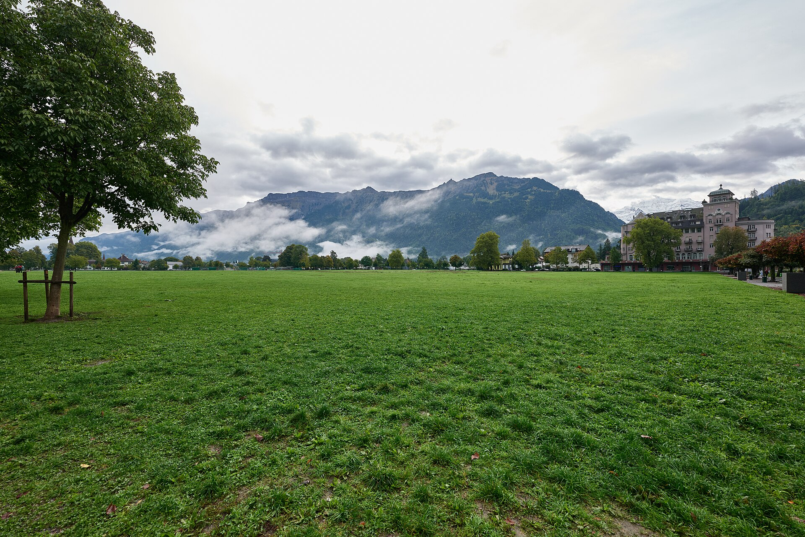

## 3.3 Interlaken Ost와 Interlaken West 차이

이번 일정에서 가장 중요한 현장 실수 방지 항목이다.

| 역 | 역할 | 이번 일정에서의 의미 |
|---|---|---|
| Interlaken Ost | 융프라우 지역 관문, Grindelwald/Lauterbrunnen 방향 환승 중심 | Luzern-Interlaken Express 도착역, 07.19·07.20·07.21 주요 환승축 |
| Interlaken West | 인터라켄 시내 서쪽, Unterseen 숙소 접근에 유리 | `스위스:인터젠의방` 하차 기준 확정 |

07.18에는 Luzern에서 Interlaken Ost까지 온 뒤, 11:29에 Interlaken West행 열차로 환승해 11:32에 도착한다. 이 짧은 구간을 생략하고 Ost에서 내려 걸어가려 하면 짐 이동이 불필요하게 길어진다. 기존 일정은 West 하차로 확정되어 있으므로 그대로 따른다.

## 3.4 숙소 위치 기준 이동 팁

`스위스:인터젠의방` 위치는 65 Hauptstrasse, Unterseen, BE 3800이다. Interlaken West에서 접근하는 기준으로 잡는다. 도보 이동은 가능하지만 캐리어가 크거나 비가 오거나 더운 날에는 짧은 택시/버스를 고려해도 된다. 다만 교통수단을 바꾸더라도 도착역과 예약 열차 시간은 바꾸지 않는다.

### 숙소 도착 후 30분 루틴

- 와이파이와 충전 위치를 확인한다.
- 다음 날 산악 일정에 필요한 옷을 따로 꺼낸다.
- 물, 간식, 휴지, 우비를 확인한다.
- SBB 앱에서 07.19 융프라우요흐 예약 연결과 07.20 Interlaken West 10:22 이동을 저장한다.
- 쓰레기, 열쇠, 체크아웃 규정을 숙소 안내에서 확인한다.
- Interlaken West까지 돌아가는 길을 지도 앱에 저장한다.

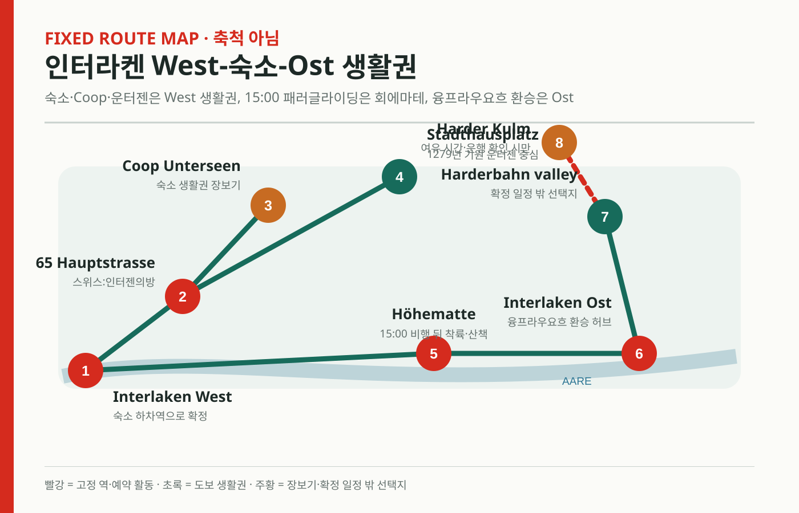

### 지도 읽는 법

- **Interlaken West**는 07.18 숙소 도착과 운터젠 생활권의 기준점이다.
- **65 Hauptstrasse**와 **Unterseen**은 취침, 장보기, 짧은 저녁 산책의 중심이다.
- **Höhematte-Höheweg**는 평지 산책축이지만, 숙소에서 왕복하면 체력 소모가 누적된다.
- **Interlaken Ost**는 07.20·07.21 산악 방향 이동에서 중요한 환승 허브다.
- **Harderbahn**은 날씨와 운행을 확인한 뒤 접근하는 전망 이동이며, 고정 숙소·열차보다 우선하지 않는다.

## 3.5 도보 이동 감각

인터라켄 시내는 평지 이동이 많아 걷기 쉬운 편이다. 하지만 체감 거리는 날씨와 짐 상태에 따라 크게 달라진다. Hoheweg, Kursaal, 패러글라이딩 착륙장, Aare 강변, Unterseen 골목은 천천히 연결하기 좋다.

도보 동선의 기본은 `West-숙소-강변-Hoheweg-Ost` 축이다. 하더쿨름으로 갈 때는 Ost 쪽으로 접근하고, 숙소 복귀는 West/Unterseen 쪽 감각으로 잡는다. 밤에는 큰 도로와 밝은 길을 우선한다.

## 3.6 밤 시간대 이동 주의사항

스위스는 전반적으로 안전한 편이지만, 밤에 낯선 골목과 강변을 오래 걷는 것은 추천하지 않는다. 특히 휴대폰 배터리가 적거나 비가 오거나 피곤한 상태에서는 숙소 복귀를 앞당긴다.

### 밤 이동 원칙

- 식사 후 숙소까지의 경로를 식당에 들어가기 전에 저장한다.
- 강변 사진은 밝을 때 또는 사람 많은 시간대에 찍는다.
- 여권 원본, 카드, 현금은 한 가방에 몰아 넣지 않는다.
- 술을 마신 뒤에는 새로운 산책 루트를 만들지 않는다.
- 내일 산악 일정이 있으면 21:30 이후 외출을 줄인다.

## 3.7 마트, 약국, 편의시설 활용법

인터라켄에서 가장 실용적인 준비는 물과 간식 확보다. 산악 지역에 들어가면 가격이 올라가고 선택지가 줄어든다. Coop, Migros, 역 주변 매장, 베이커리, 약국 위치를 숙소 도착 후 확인한다.

### 어느 마트를 선택할까

| 매장 | 위치와 강점 | 이번 여행에서의 쓰임 | 주의 |
|---|---|---|---|
| **Coop Unterseen** | Bahnhofstrasse 35, 숙소·Interlaken West 생활권에서 접근하기 쉬움 | 07.18 토요일 숙소 정리 후 물, 아침거리, Day 4 간식 확보의 1순위 | 현재 공개 영업 정보상 일요일 휴무 가능성이 높다. 07.18 정확한 폐점 시각은 공식 지점 페이지 확인 필요. |
| **Migros Interlaken** | Rugenparkstrasse 1, West 남쪽의 비교적 큰 장보기 선택지 | 요거트, 과일, 샐러드, `M-Budget` 가성비 품목을 함께 볼 때 | 숙소에서의 실제 도보 거리와 2026년 영업시간을 공식 지점 정보에서 재확인한다. |
| **Coop Interlaken Ost** | Untere Bönigstrasse 10, Ost 환승권의 대형 매장 | Ost에 이미 있을 때 빠진 품목 보충, 열차 전 간단한 식사 확보 | 숙소에서 일부러 왕복하기보다 확정 이동과 같은 방향일 때만 이용한다. |

> 장보기 핵심 창구
> 07.18은 토요일이고 07.19는 일요일이다. 확정 일정의 순서를 바꾸지 않는 범위에서 **07.18 숙소 체크인·정리 후 여유 시간**을 첫 장보기 창구로 본다. 일요일 아침에 작은 지점이 열 것이라고 가정하지 않는다.

### 07.18 토요일 권장 구매량

| 묶음 | 구체적인 품목 | 수량 감각 |
|---|---|---|
| 숙소 아침 | 요거트 2개, 과일 2-4개, 빵 또는 뮤즐리 | 2인 1회분 |
| Day 4 융프라우요흐 | 물, 작은 초콜릿, 견과류 | 각자 물 1병 + 공유 간식 |
| Day 4 융프라우요흐·Day 5 이동 백업 | 단단한 빵/샌드위치 재료, 에너지바 | 상하기 쉬운 음식은 07.20 그린델발트에서 다시 보충 |
| 생활 소모품 | 물티슈, 휴지, 작은 봉투 | 필요한 것만 소포장 |

약국은 간판의 `Apotheke`를 찾는다. 운영시간이 마트보다 짧을 수 있으므로 밴드, 진통제, 멀미약처럼 이미 필요성이 예상되는 물품은 한국에서 준비한다. 현지 약사에게 증상을 설명할 때는 복용 중인 약과 알레르기를 먼저 알린다.

### 인터라켄 장보기 목록

| 항목 | 용도 |
|---|---|
| 물 1-2병 | Day 4 융프라우요흐와 Day 5 이동 |
| 초콜릿/에너지바 | 환승 지연, 하이킹 중 간식 |
| 샌드위치 또는 빵 | 융프라우요흐·그린델발트 이동식 |
| 과일/요거트 | 숙소 아침 또는 늦은 저녁 |
| 물티슈/휴지 | 산악 교통, 열차 이동 |
| 작은 비닐봉투 | 젖은 우비/쓰레기 분리 |

## 3.8 인터라켄에서 꼭 알아야 할 현장 팁

인터라켄은 `무엇을 더 할까`보다 `예약된 다음 일정에 무엇을 남길까`가 중요하다. 07.18은 15:00 패러글라이딩 뒤 회에마테·회에벡을 짧게 걷고, 07.19 융프라우요흐를 위해 일찍 마무리한다. 07.20은 피르스트가 아니라 그린델발트 마을·Coop Eigershop·BelAqua 일정이므로 새로운 산악 액티비티를 추가하지 않는다.

> 운영 원칙
> 고정 일정 보호 원칙
> 07.19 Jungfraujoch는 확정 일정이다. Harder Kulm은 별도 날짜의 여유 시간 선택지이며 같은 날 추가하지 않는다. 07.20에도 First·Bachalpsee를 새로 넣지 않는다.

## 3.9 인터라켄과 운터젠을 이해하는 역사

오늘의 인터라켄 중심지는 오랫동안 `Aarmühle`로 불렸다. 12세기 문헌에 등장하는 인터라켄 수도원은 지역의 큰 토지·종교 권력이었지만, 현대 자치도시와 수도원을 같은 조직으로 이해하면 안 된다. 19세기 관광객 사이에서 `Interlaken`이라는 이름이 널리 쓰였고 1891년 Aarmühle가 공식적으로 Interlaken으로 개칭되었다. 종교개혁 이후 수도원 재산과 행정은 베른의 영향 아래 재편되었다.

19세기에는 알프스 풍경을 찾는 여행이 유럽 상류층과 예술가 사이에서 확산되고 철도와 증기선이 접근성을 높였다. Höhematte의 열린 초지는 우연히 남은 빈 땅이 아니라 융프라우 조망축과 관광도시의 전면 경관을 유지하는 공간이다. 반면 Aare 강 건너 Unterseen은 1279년 도시 건설 허가를 바탕으로 시장·교량·통행권을 가진 별도 도시로 성장했다. 수도원 및 베른과 긴장·협력을 반복한 역사가 있어 단순한 `조용한 인터라켄 동네`로 설명하면 부족하다.

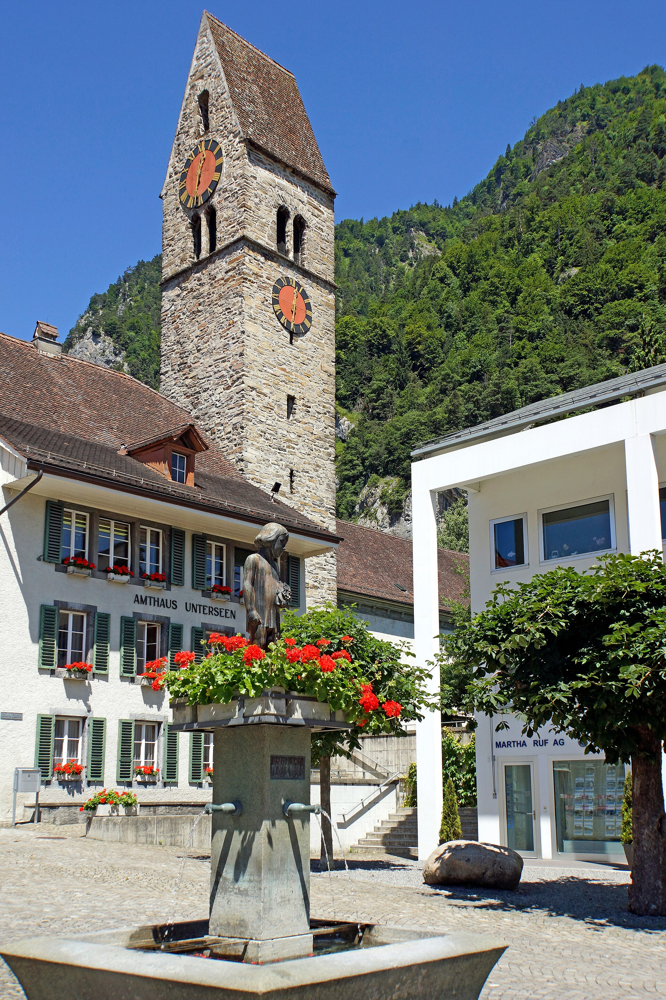

### 여유 시간이 생겼을 때 보는 역사 지점

| 장소 | 무엇을 보는가 | 운영 방식 |
|---|---|---|
| 옛 수도원·인터라켄 성채 구역 | 1133년 문헌에 등장하는 수도원에서 시작된 지역사의 흔적 | 정규 일정 뒤 짧은 외관 산책으로만 검토 |
| Tourismuseum Unterseen | 알프스 관광 500년과 교통·숙박·등반 문화 | 비가 오거나 체력이 남을 때만 개관일·시간 확인 후 방문 |
| Unterseen 구시가지 | 관광지 전면부보다 생활도시의 구조가 잘 보이는 골목 | 숙소 주변 산책과 겹칠 때만 자연스럽게 연결 |

> 방문 전 공식 사이트 확인 필요
> Tourismuseum은 계절별 개관일이 달라질 수 있다. 고정 일정에 새 예약처럼 넣지 말고, 당일 공식 안내와 남은 체력을 확인한 뒤 `여유 시간이 생겼을 때`만 선택한다.

## 핵심 체크포인트

- Interlaken West는 숙소 하차역으로 확정되어 있다.
- Interlaken Ost는 융프라우/그린델발트 방향 환승 관문이다.
- Unterseen 숙소 주변에서는 물, 간식, 우비, 다음 날 티켓을 먼저 정리한다.
- 밤에는 새로운 골목 탐색보다 숙소 복귀를 우선한다.
- 인터라켄 일정은 07.18 패러글라이딩과 07.19 융프라우요흐를 연결하는 숙박·교통 베이스다.

\newpage

# 4장. 인터라켄 핵심 명소

## 이 장에서 알 수 있는 것

- 인터라켄과 주변 호수 명소를 현장형 기준으로 이해한다.
- 각 명소의 소요시간, 날씨 영향, 사진 포인트, 주의사항을 정리한다.
- 확정 일정에 어떻게 연결되는지 확인한다.
- 여유 시간이 생겼을 때만 고려할 선택지를 구분한다.

## 4.1 하더쿨름

### 어떤 곳인지

하더쿨름은 인터라켄에서 가장 쉽게 접근하는 전망대다. Jungfrau 공식 안내 기준 Interlaken Ost에서 계곡역까지 짧게 걸은 뒤 푸니쿨라를 타고 약 10분이면 Harder Kulm에 도착한다. 고도는 1,322m이며 Two-Lakes Lookout에서 Lake Thun, Lake Brienz, Eiger, Monch, Jungfrau 방향을 한눈에 볼 수 있다.

### 왜 가는지

고산권으로 깊게 들어가지 않고도 두 호수와 융프라우 산군의 관계를 볼 수 있다는 것이 장점이다. 리기산보다 이동이 짧고, 융프라우요흐보다 비용과 체력 부담이 낮다. 다만 이번 여행에서는 07.19 융프라우요흐가 확정되어 있으므로 Harder Kulm은 지역을 공부하기 위한 설명이자 별도 여유 시간 선택지다.

### 누구에게 추천하는지

- 인터라켄에서 짧고 강한 전망을 원하는 사람
- 장거리 이동 후 무리하지 않고 산 위를 느끼고 싶은 사람
- 호수 두 개와 융프라우 산군을 한 장면에 담고 싶은 사람
- 고산증이나 장거리 산악 이동이 부담스러운 사람

### 예상 소요시간

| 구성 | 시간 |
|---|---:|
| Interlaken Ost에서 계곡역 이동 | 10-15분 |
| 푸니쿨라 탑승 | 약 10분 |
| 전망대 체류 | 45-60분 |
| 식사 포함 | 2-3시간 |

### 날씨 영향

맑거나 구름이 높으면 만족도가 높다. 낮은 구름이 끼면 전망대에 올라가도 하얀 화면만 볼 수 있다. 비가 오고 바람이 강하면 푸니쿨라 운행과 전망대 체류가 불편하다.

### 사진 포인트

- Two-Lakes Lookout 난간에서 두 호수 배경
- 전망대에서 Interlaken 시내를 아래로 넣은 구도
- Panorama Restaurant 주변에서 산군 배경
- 오후 빛이 부드러워질 때 호수 색 대비

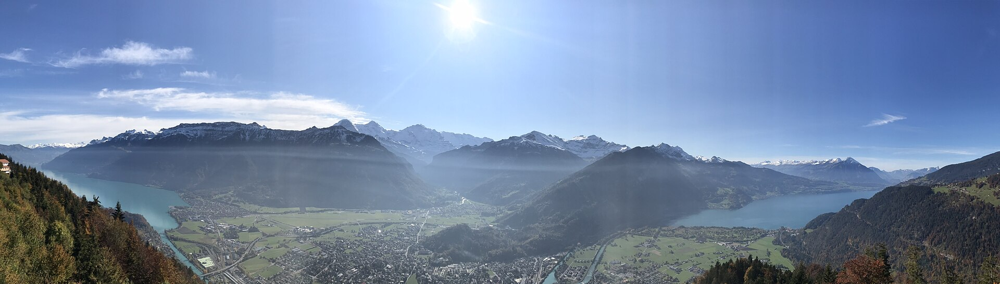

### 사진에서 읽을 것

- 도시 한가운데 길게 열린 녹지가 **회에마테**다.
- 왼쪽과 오른쪽으로 갈라지는 큰 물길이 브리엔츠호·툰호 방향 감각을 만든다.
- 사진보다 실제 현장에서는 구름이 산군을 가릴 수 있으므로, 정상 도착 직후보다 구름이 걷히는 순간을 기다리는 편이 낫다.
- 커플 사진은 난간 정중앙보다 사람이 덜 겹치는 측면에서 촬영하면 도시와 호수를 더 넓게 넣을 수 있다.

### 현장에서 주의할 점

- 정상 식당은 전망이 좋을 때만 가치가 크다.
- 흐리면 체류 시간을 줄이고 Hoheweg/Unterseen 산책으로 내려온다.
- 일몰까지 머물 경우 마지막 하산편과 숙소 복귀 시간을 확인한다.
- 전망대 난간 주변은 사진 대기와 밀집이 생길 수 있다.

### 확정 일정과 연결해서 보는 법

이번 확정 일정에는 넣지 않는다. 별도 여유 시간이 실제로 생기고 공식 운행·마지막 하산편·체력이 모두 맞을 때만 검토한다. 07.19 융프라우요흐와 같은 날 결합하지 않는다.

### 방문 전 확인할 것

- Jungfrau 공식 Harder Kulm 페이지
- 당일 운행 정보
- 웹캠
- 왕복 요금과 할인 적용
- 마지막 하산 시간

## 4.2 회에마테

### 어떤 곳인지

회에마테는 인터라켄 중심부의 넓은 초지와 공원 공간이다. 패러글라이딩 착륙장으로도 유명해 하늘에서 내려오는 사람들을 볼 수 있다. 주변에는 호텔, 기념품점, 카페, 레스토랑이 이어진다.

### 왜 가는지

도시 안에서 산과 하늘을 가장 쉽게 보는 장소다. 하더쿨름 이후 내려와 걷기에 좋고, 긴 설명 없이도 사진이 잘 나온다. 이동 피로가 있을 때 앉아 쉬기에도 좋다.

### 누구에게 추천하는지

- 산책을 길게 하지 않고도 인터라켄 분위기를 느끼고 싶은 사람
- 패러글라이딩 장면을 보고 싶은 사람
- 커플 사진을 부담 없이 찍고 싶은 사람

### 예상 소요시간

30-60분이면 충분하다. 카페와 연결하면 90분까지도 가능하다.

### 날씨 영향

맑은 날은 산 배경이 살아나고, 흐린 날은 사진 대비가 떨어진다. 비 오는 날에는 오래 머물기보다 이동 통로로만 활용한다.

### 사진 포인트

- 초지와 산을 함께 넣은 넓은 구도
- 패러글라이더 착륙 장면
- Hoheweg 가로수와 호텔 간판 배경

### 현장에서 주의할 점

착륙 구역 근처에서는 방해가 되지 않도록 이동한다. 초지 안에서 캐리어를 끌거나 우산을 넓게 펼치는 행동은 피한다.

### 확정 일정과 연결해서 보는 법

07.18 패러글라이딩 착륙 뒤 시간이 남을 때 짧게 붙인다. 15:00 예약과 다음 날 융프라우요흐 준비보다 앞세우지 않는다.

### 방문 전 확인할 것

특별 운영 확인은 필요하지 않지만, 비와 강풍이면 야외 체류를 줄인다.

## 4.3 아레강 주변 산책

### 어떤 곳인지

Aare 강은 인터라켄과 운터젠 주변을 흐르는 물길이다. 맑은 날에는 물빛이 선명하고, 도시 중심보다 조용한 산책감을 준다.

### 왜 가는지

숙소가 Unterseen 쪽이므로 강변 산책은 숙소 복귀와 자연스럽게 연결된다. 여행 중 과하게 비싼 명소를 추가하지 않아도 스위스다운 물빛과 마을 분위기를 느낄 수 있다.

### 누구에게 추천하는지

- 사람 많은 Hoheweg보다 조용한 길을 원하는 사람
- 저녁 식사 전후로 짧게 걷고 싶은 사람
- 숙소 주변 지리를 익히고 싶은 사람

### 예상 소요시간

30-90분. 사진을 찍고 벤치에 앉으면 더 길어진다.

### 날씨 영향

비가 오면 길이 미끄럽고 사진 만족도가 낮다. 해가 진 뒤에는 조명이 적은 구간을 피한다.

### 사진 포인트

- 강물과 산 능선이 함께 보이는 다리
- Unterseen 골목과 강변을 함께 넣은 구도
- 낮은 햇빛이 물에 반사되는 시간대

### 현장에서 주의할 점

강가에 너무 가까이 가지 않는다. 밤에는 휴대폰을 손에 들고 오래 걷지 않는다. 혼잡하지 않은 곳일수록 소지품 관리가 느슨해지지 않도록 한다.

### 확정 일정과 연결해서 보는 법

07.18 패러글라이딩 뒤 숙소로 복귀하는 짧은 산책에 적합하다. 07.19 융프라우요흐 당일에는 추가하지 않는다.

### 방문 전 확인할 것

비, 강풍, 일몰 시간만 확인하면 된다.

## 4.4 Interlaken Ost / West 주변

### 어떤 곳인지

Interlaken Ost는 산악 지역으로 들어가는 관문이고, Interlaken West는 숙소 접근과 도심 서쪽 생활권에 가깝다. 두 역 사이 거리는 짧아 보이지만 캐리어가 있으면 체감이 달라진다.

### 왜 가는지

역 자체가 관광 명소라기보다 이번 일정의 정확성을 좌우하는 교통 기준점이다. 잘못 내리면 짐 이동과 시간 손실이 생긴다.

### 누구에게 추천하는지

모든 여행자에게 필수 확인 대상이다. 특히 07.18과 07.20에는 역 이름을 반드시 구분해야 한다.

### 예상 소요시간

역 내부 이동은 짧지만, 플랫폼 확인과 화장실, 물 구매, 짐 정리까지 포함하면 10-20분 여유가 필요하다.

### 날씨 영향

비나 폭염에는 역 사이 도보 이동을 줄이고 기차/버스/택시를 활용한다.

### 사진 포인트

사진 목적보다는 실전 목적이다. 다만 Ost 주변에서는 산악 철도 분위기를, West 주변에서는 도심과 Unterseen 방향 생활권을 볼 수 있다.

### 현장에서 주의할 점

- `Ost`와 `West`를 지도 앱에서 자동완성으로 잘못 선택하지 않는다.
- Day 3에는 West 하차가 맞다.
- Day 5에는 West에서 출발해 Ost로 환승한다.

### 확정 일정과 연결해서 보는 법

07.18: Ost 도착, West 하차, 숙소 이동.
07.20: West 출발, Ost 환승, Grindelwald 이동.

### 방문 전 확인할 것

SBB 앱에서 플랫폼, 지연, 환승 시간을 확인한다.

## 4.5 브리엔츠호

### 어떤 곳인지

브리엔츠호는 인터라켄 동쪽의 청록빛 호수다. 루체른에서 인터라켄으로 넘어오는 열차에서도 Brienz 구간의 풍경을 볼 수 있다. 맑은 날에는 물빛이 매우 선명하다.

### 왜 가는지

짧은 스위스 일정에서 호수 풍경을 깊게 느끼고 싶을 때 좋은 선택지다. 다만 이번 확정 일정에서는 별도의 장거리 호수 유람을 기본으로 넣지 않는다.

### 누구에게 추천하는지

- 확정 일정과 숙소 복귀를 모두 마친 별도 여유 시간에 호수 방향을 공부하려는 사람
- 비싸고 긴 산악권 대신 낮은 고도 호수 풍경을 원하는 사람
- 이젤트발트나 Brienz 마을에 관심이 있는 사람

### 예상 소요시간

짧게는 1-2시간, 마을 이동까지 포함하면 반나절이 필요하다. 확정 일정 안에서는 여유 시간이 충분할 때만 고려한다.

### 날씨 영향

맑은 날 물빛이 가장 좋다. 흐린 날에는 물색이 탁해 보이고 사진 만족도가 줄어든다.

### 사진 포인트

- 호수와 산이 겹치는 낮은 각도
- 선착장 주변
- 기차 차창에서 보이는 Brienz 접근 구간

### 현장에서 주의할 점

선박 시간표와 마지막 복귀편을 확인한다. 호수 마을에 들어가면 돌아오는 교통이 제한될 수 있다.

### 확정 일정과 연결해서 보는 법

07.18 열차 이동 중 차창 풍경으로 이미 일부 경험한다. 별도 방문은 07.19 여유 시간이 생길 때만 고려한다.

### 방문 전 확인할 것

Interlaken 관광청, BLS/Lake Brienz 운항, SBB 연결 시간.

## 4.6 툰호

### 어떤 곳인지

툰호는 인터라켄 서쪽에 있는 깊은 파란색 호수다. Spiez, Thun 등 호수 마을과 연결되며, 루체른/인터라켄과는 다른 분위기를 준다.

### 왜 가는지

하더쿨름 전망대에서 Lake Thun과 Lake Brienz를 함께 내려다보는 것이 이번 일정의 핵심이다. 별도 방문을 하지 않아도 전망으로 의미를 얻을 수 있다.

### 누구에게 추천하는지

- Spiez 마을 산책을 여유 시간 선택지로 보고 싶은 사람
- 호수와 성, 포도밭 느낌을 좋아하는 사람
- 장거리 산악 이동보다 낮은 고도 풍경을 선호하는 사람

### 예상 소요시간

Spiez를 다녀오면 최소 2-3시간이 필요하다. 배를 섞으면 반나절 이상이 된다.

### 날씨 영향

맑은 날과 오후 빛이 좋다. 비가 오면 유람선보다 도시형 실내 대안을 택한다.

### 사진 포인트

- Spiez 성과 호수
- 포도밭 언덕에서 내려다보는 호수
- 하더쿨름에서 두 호수를 함께 보는 장면

### 현장에서 주의할 점

Spiez는 아름답지만 이번 일정의 필수 목적지는 아니다. 07.21 환승지 Spiez와 관광지 Spiez를 혼동하지 않는다. Day 6의 Spiez는 환승 성공이 목적이다.

### 확정 일정과 연결해서 보는 법

07.19 여유 시간이 생겼을 때만 낮은 고도 대안으로 본다. Day 6에는 관광으로 확장하지 않는다.

### 방문 전 확인할 것

SBB 연결, 배 운항, 날씨.

## 4.7 이젤트발트

### 어떤 곳인지

이젤트발트는 브리엔츠호 남쪽의 작은 호수 마을이다. 물가 마을, 선착장, 산 배경이 조용한 사진을 만든다. 다만 인기 드라마/사진 명소 효과로 특정 지점은 사람이 몰릴 수 있다.

### 왜 가는지

호수 마을 분위기를 짧게 느끼기 좋다. 하지만 이동 시간이 들어가므로 이미 확정된 Day 4 회복 일정에 무리해서 넣을 필요는 없다.

### 누구에게 추천하는지

- 하더쿨름을 짧게 끝내고 오후 시간이 많이 남은 사람
- 도시보다 호수 마을 사진을 선호하는 사람
- 배나 버스 연결을 미리 확인할 수 있는 사람

### 예상 소요시간

왕복과 체류를 포함해 최소 2-3시간. 교통 대기까지 고려하면 더 길어질 수 있다.

### 날씨 영향

맑은 날에는 물빛과 마을 사진이 좋다. 흐린 날에는 만족도가 크게 떨어진다.

### 사진 포인트

- 선착장 주변
- 호수변 산책로
- 마을과 산을 함께 넣은 넓은 구도

### 현장에서 주의할 점

마을은 관광지이기 전에 생활 공간이다. 사유지, 호텔/주거지 입구, 좁은 길에서 사진 촬영을 오래 하지 않는다.

### 확정 일정과 연결해서 보는 법

07.19 오후에 날씨가 좋고 체력이 남을 때만 `여유 시간이 생겼을 때` 항목으로 고려한다.

### 방문 전 확인할 것

SBB/버스/배 연결, 마지막 복귀편, 날씨, 혼잡.

## 4.8 슈피츠

### 어떤 곳인지

슈피츠는 툰호변의 마을로, 성과 호수, 포도밭 풍경이 유명하다. 이번 일정에서는 07.21 남행 이동 중 환승역으로 등장한다.

### 왜 가는지

관광지로도 매력 있지만 이번 여행에서는 Day 6의 환승지가 더 중요하다. 12:23 도착, 12:38 출발 환승 시간이 있으므로 관광으로 확장하지 않는다.

### 누구에게 추천하는지

별도 여유일이 있다면 추천할 수 있지만, 이번 고정 일정에서는 Day 6 관광 확장 대상이 아니다.

### 예상 소요시간

관광으로 보려면 최소 2시간 이상이 필요하다. Day 6 환승 시간 15분으로는 관광이 불가능하다.

### 날씨 영향

맑은 날 호수와 성 사진이 좋다.

### 사진 포인트

별도 방문 시 성, 항구, 포도밭 언덕. Day 6 환승 중에는 플랫폼 이동이 우선이라 사진을 노리지 않는다.

### 현장에서 주의할 점

Day 6에는 화장실, 물 구매, 사진보다 다음 플랫폼 확인이 우선이다.

### 확정 일정과 연결해서 보는 법

07.21에는 환승지로만 본다. 관광지로 확장하지 않는다.

### 방문 전 확인할 것

별도 방문을 계획할 경우 SBB 연결과 호수 유람선 운영을 확인한다.

## 4.9 기타 여유 시간 선택지

확정 일정이 흔들리지 않는 범위에서만 다음을 고려한다.

| 선택지 | 적합한 상황 | 피해야 할 상황 |
|---|---|---|
| Unterseen 골목 산책 | 숙소 복귀 전 30-60분 여유 | 밤 늦은 시간, 비바람 |
| Hoheweg 카페 | 하더쿨름 후 피곤할 때 | 다음 이동 전 시간이 빠듯할 때 |
| Brienz 짧은 방문 | 맑고 호수 색이 좋을 때 | 흐림, 복귀편 불확실 |
| Spiez 별도 방문 | 07.19 오후가 완전히 비었을 때 | 07.21 환승일 |
| Jungfraujoch | 07.19 완전 맑음, 예산/체력 충분 | 흐림, 강풍, 늦은 출발, Day 5 체력 우려 |

## 4.10 역사와 문화를 보는 여유 시간 선택지

다음 장소는 인터라켄의 관광산업 이전과 이후를 비교해서 볼 수 있는 곳이다. 모두 확정 일정 밖의 선택지이며, 하더쿨름·식사·숙소 복귀를 끝낸 뒤 여유 시간이 있을 때만 검토한다.

| 장소 | 주요 의미 | 권장 체류 | 연결 방식 |
|---|---|---:|---|
| 옛 수도원·인터라켄 성채 | 12세기 수도원에서 시작된 지역 중심의 흔적 | 외관 20-30분 | Höhematte 동쪽 산책과 같은 방향일 때 |
| Tourismuseum Unterseen | 스위스 최초의 관광박물관으로 소개되며 알프스 관광 약 500년을 다룸 | 60-90분 | 숙소 생활권에서 비 오는 날 선택 |
| Unterseen Stadthausplatz | 장터·행정·주거가 만나는 운터젠의 생활도시 표정 | 20-40분 | 장보기나 숙소 복귀와 묶기 |
| Kursaal 정원 | 인터라켄이 국제 휴양도시로 성장한 분위기를 읽기 좋은 정원 | 20-30분 | Höhematte 산책 중 통과 |

### 보는 순서보다 중요한 질문

- 이 건물은 지역 주민을 위한 시설인가, 19세기 이후 여행자를 위한 시설인가?
- 산악 관광이 성장하기 전에는 호수와 고개가 어떤 생활 교통로였을까?
- 대형 호텔 전면부와 운터젠 골목의 건물 규모가 왜 다른가?
- 영어·독일어·프랑스어·한국어 간판이 함께 보이는 현재의 관광도시는 어떻게 형성됐을까?

> 방문 전 공식 사이트 확인 필요
> Tourismuseum과 성채 내부 시설은 계절별 개관일이 달라질 수 있다. 공식 Interlaken 관광청과 박물관 안내에서 2026년 7월 운영을 확인한다.

## 핵심 체크포인트

- 하더쿨름은 지역을 설명하기 위한 참고 명소이며 Day 4 확정 일정이 아니다.
- 호수 마을은 여유 시간 선택지이며 필수 일정이 아니다.
- Spiez는 Day 6에 관광지가 아니라 환승지다.
- Interlaken West/Ost 구분이 실수 방지의 핵심이다.
- 추가 명소는 확정 열차와 숙소 이동을 방해하지 않을 때만 선택한다.

\newpage

# 5장. 융프라우 지역 실전 가이드

## 이 장에서 알 수 있는 것

- 융프라우 지역의 주요 마을과 산악 교통을 이해한다.
- 07.19와 07.20에 어떤 기준으로 산악 일정을 판단할지 정리한다.
- 피르스트, 융프라우요흐, 라우터브루넨, 뮈렌, 벵엔의 성격을 구분한다.
- 고산 복장, 고산증, 멀미, 체력 관리 기준을 세운다.

## 5.1 융프라우요흐

융프라우요흐는 융프라우산 정상의 이름이 아니라 **묀히와 융프라우 사이의 고개**다. 고개 안쪽의 Jungfraujoch역은 해발 3,454m에 자리한 유럽 최고도 철도역이고, 엘리베이터로 연결되는 Sphinx 전망대는 약 3,571m다. 남쪽으로 보이는 알레치 빙하는 알프스 최대 빙하이며 `Swiss Alps Jungfrau-Aletsch` 유네스코 세계자연유산의 핵심 경관이다. 따라서 이곳에서는 “정상을 정복한다”보다 고개·철도역·전망대·빙하가 서로 다른 대상이라는 점을 구분해 설명한다.

이번 여행의 **07.19 확정 일정**이다. 날씨가 좋을 때만 새로 선택하는 옵션이 아니며, 하더쿨름과 교환하지 않는다. 다만 고산 교통이 안전상 중단되거나 운영사가 변경을 안내하면 그 지시에 따른다. 2026년 공식 안내상 5월 1일부터 10월 31일까지 융프라우요흐 구간 좌석 예약이 의무이며, 좌석 예약과 별도로 유효한 승차권이 필요하다. 예약 확인서의 편명·시각·구간을 전날과 당일 아침 다시 확인한다.

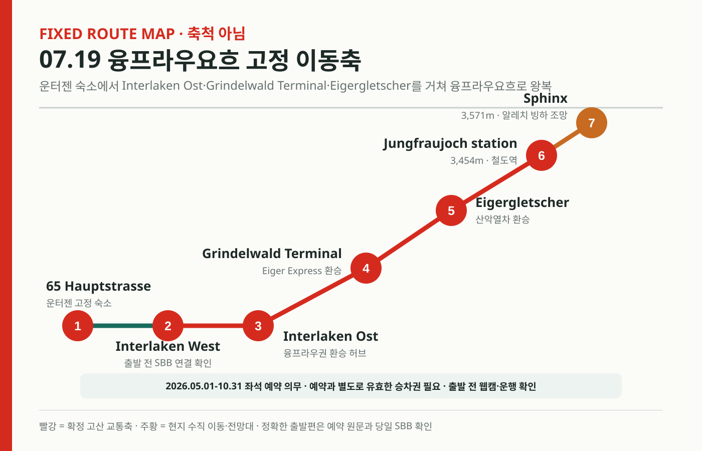

### 현장에서 설명할 핵심

| 대상 | 설명 | 현장 확인 포인트 |
|---|---|---|
| Jungfraujoch역 | 3,454m의 고산 철도역 | 도착 직후 뛰지 말고 몸 상태를 확인한다. |
| Sphinx | 엘리베이터로 오르는 과학 관측·전망 시설 | 전망 테라스의 강풍과 체감온도에 주의한다. |
| Aletsch Glacier | 알프스 최대 빙하, 세계자연유산 핵심 경관 | 빙하 흐름 방향과 모레인 띠를 관찰한다. |
| Ice Palace | 빙하 얼음 내부를 가공한 관람 공간 | 바닥이 미끄러우므로 난간과 보행선을 따른다. |
| Alpine Sensation | 철도 건설과 관광 역사를 설명하는 전시축 | 터널 공사와 1912년 개통의 의미를 읽는다. |

### 현장 운영 원칙

- 07.18 저녁과 07.19 아침에 웹캠·운행 정보를 확인하되 임의로 일정을 바꾸지 않는다.
- 좌석 예약 QR과 유효 승차권을 각각 오프라인 저장한다.
- 두통·메스꺼움·호흡 곤란이 시작되면 관람을 줄이고 직원에게 알린 뒤 하산한다.
- 전망이 열렸을 때 알레치 빙하와 산군을 먼저 보고, 쇼핑과 식사는 뒤로 미룬다.
- 하더쿨름, 라우터브루넨, 피르스트를 같은 날 추가하지 않는다.

## 5.2 그린델발트

그린델발트는 아이거 북벽 아래의 산악 마을이자 융프라우 지역의 교통·숙박 거점이다. 19세기 영국 여행자와 산악가이드 문화, 1858년 아이거 정상 초등, 1938년 아이거 북벽 초등, 1888년 겨울관광의 시작, 1890년 철도 개통이 마을의 성격을 바꿨다. 1892년 대화재 이후 재건된 마을과 관광시설도 오늘의 경관에 영향을 주었다. 정상 초등과 북벽 초등은 서로 다른 사건이므로 혼동하지 않는다.

이번 일정에서는 07.20 Interlaken West에서 출발해 11:10 Grindelwald에 도착하고 Hotel Gletscherblick에 짐을 둔 뒤, Dorfstrasse와 Coop Eigershop을 보고 숙소에서 저녁·휴식을 취한다. 20:00에는 Hotel Belvedere의 BelAqua 외부 이용 가능 여부를 사전 확인한 뒤 이동한다. First·Bachalpsee는 이 날의 일정이 아니다.

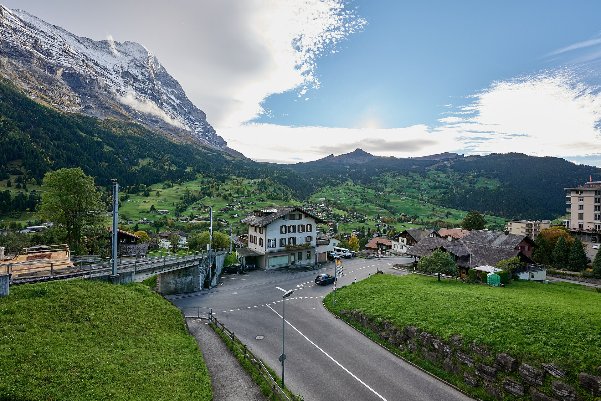

### 07.20 그린델발트 도착 루틴

1. 플랫폼에서 짐을 정리한다.
2. 호텔 이동 또는 짐 보관 가능 여부를 확인한다.
3. Dorfstrasse에서 아이거 북벽과 샬레 경관을 천천히 본다.
4. Coop Eigershop에서 저녁 보충식과 07.21 남행 이동식을 준비한다.
5. 숙소에서 저녁·휴식을 마친 뒤 20:00 BelAqua 외부 입장 가능 여부를 재확인한다.

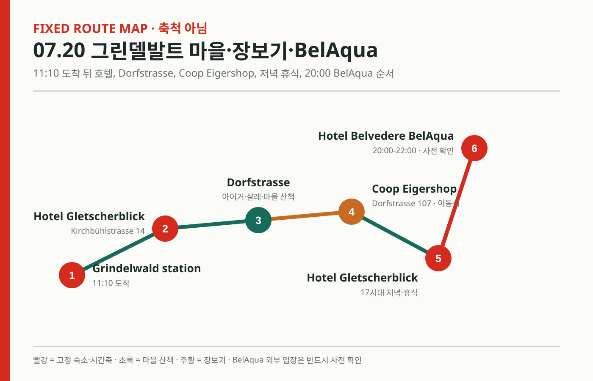

### 지도 읽는 법

- 빨간 축은 역·숙소·20:00 BelAqua처럼 이날 순서를 지켜야 할 기준점이다.
- 주황 지점은 Coop Eigershop 장보기다. 07.21 남행 이동식까지 함께 준비한다.
- Hotel Gletscherblick와 Hotel Belvedere는 서로 다른 호텔이다. 숙박만으로 BelAqua 이용이 보장되지 않는다.
- First는 이 지도와 07.20 일정에 포함하지 않는다.

## 5.3 그린델발트 피르스트

피르스트는 그린델발트 북쪽 능선의 산악 관광지다. First 정상역은 약 2,168m, Bachalpsee는 약 2,265m이며 Bort와 Schreckfeld가 곤돌라 중간역이다. Jungfrau 공식 안내 기준 Grindelwald 역에서 계곡역까지 도보 약 10분, First까지 곤돌라 약 25분이다. First Cliff Walk와 First View, Bachalpsee 하이킹, 액티비티가 핵심이지만 **이번 07.20 확정 일정에는 포함되지 않는다.** 이 절은 지역을 설명하기 위한 참고 지식이다.

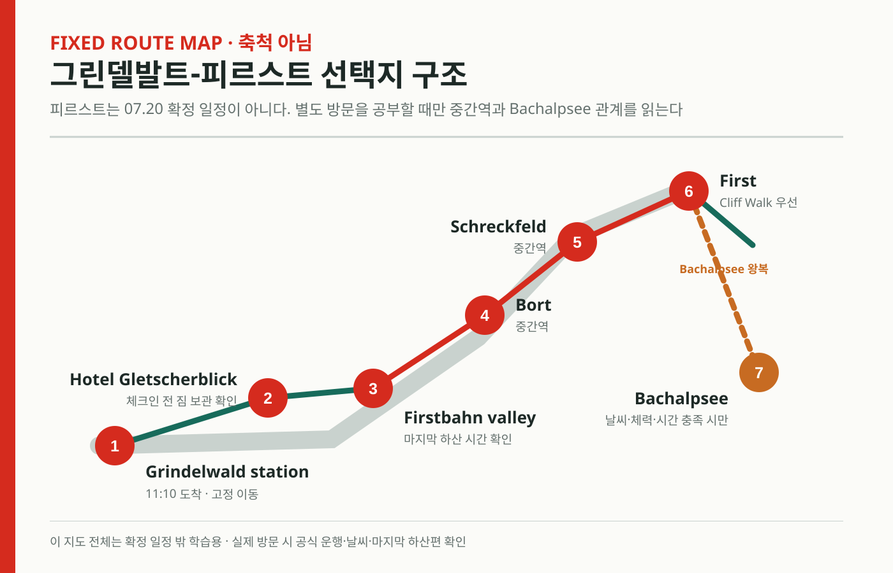

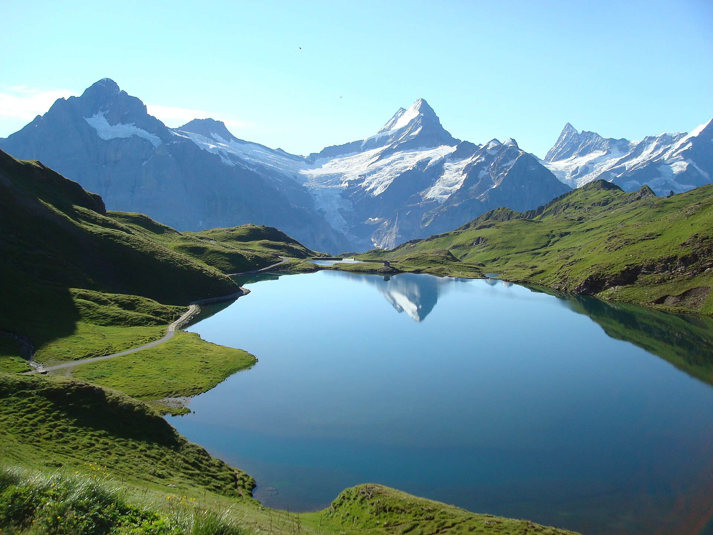

### 우선순위

| 우선순위 | 항목 | 조건 |
|---:|---|---|
| 1 | First Cliff Walk / First View | 도착 후 가장 먼저 진행 |
| 2 | 산 위 카페/짧은 휴식 | 날씨가 좋거나 체력 보존 필요할 때 |
| 3 | Bachalpsee 왕복 | 13:30 이전 정상부 도착, 날씨 양호, 체력 충분 |
| 4 | First Flyer/Mountain Cart | 대기 짧고 하산 마감 여유가 있을 때 하나만 |

### Bachalpsee 판단

Bachalpsee는 사진으로는 가벼워 보이지만 실제로는 고도와 체력이 들어간다. 공식 안내의 왕복 보행은 약 1시간 50분이며 사진, 휴식, 길 찾기, 곤돌라 대기를 별도로 더한다. 잔잔한 수면에는 슈렉호른과 핀스터아어호른 방향 산군이 반영될 수 있다. 별도 방문을 계획하더라도 늦은 오후, 비, 낮은 구름, 강풍, 피로가 있으면 생략한다.

## 5.4 라우터브루넨

라우터브루넨은 빙하가 깎아 만든 U자형 계곡 바닥의 마을이다. 양쪽 절벽에서 내려오는 72개 폭포로 알려졌으며, 슈타우프바흐 폭포는 마을 가까이에서 수직 낙차와 계곡벽의 규모를 읽게 한다. 이 계곡은 벵엔·뮈렌·융프라우권으로 갈라지는 교통 관문이기도 하다. 다만 이번 확정 일정에는 방문지로 들어 있지 않다.

### 여유 시간 선택지로 보는 법

지역 공부용 선택지로만 읽는다. 07.19 Jungfraujoch 또는 07.20 그린델발트 고정 순서를 바꾸거나 대체하는 근거로 사용하지 않는다.

## 5.5 뮈렌

뮈렌은 라우터브루넨 계곡 서쪽 절벽 위 약 1,650m에 자리한 무차량 산악 마을이다. Lauterbrunnen-Grütschalp 산악교통과 열차 또는 Stechelberg-Schilthorn 방향 케이블카로 접근하며, 아이거·묀히·융프라우가 계곡 건너편에 펼쳐진다. 차량이 없는 것은 관광 연출이 아니라 지형과 산악교통 구조에서 나온 생활 조건이다. 이번 일정에는 포함되지 않는다.

### 추천 조건

- 별도 하루가 있을 때
- 날씨가 맑고 산악 교통 운행이 안정적일 때
- 걷는 시간을 충분히 잡을 수 있을 때

이번 일정에서는 참고 정보로만 둔다.

## 5.6 벵엔

벵엔은 라우터브루넨 동쪽 사면 약 1,274m에 자리한 무차량 마을이다. Lauterbrunnen에서 Wengernalpbahn으로 접근하며, Kleine Scheidegg와 연결되는 철도축이 마을의 생활과 관광을 함께 지탱한다. 라우버호른 스키 경기로도 알려졌지만 이번 일정에는 포함되지 않는다.

## 5.7 클라이네 샤이덱

클라이네 샤이덱은 해발 약 2,061m에서 아이거·묀히·융프라우가 가까워지는 산악 고개이자 철도 결절점이다. Wengernalpbahn과 융프라우철도가 만나는 전통 경로의 핵심이지만, 이번 07.19 확정 이동은 예약 원문이 지정한 Grindelwald Terminal·Eiger Express 경로를 우선한다. 별도 체험을 위해 끼워 넣지 않는다.

## 5.8 아이거 익스프레스

아이거 익스프레스는 Grindelwald Terminal과 Eigergletscher를 연결하는 곤돌라축이다. Jungfraujoch 이동 시간을 줄이는 데 의미가 있다. 하지만 티켓, 좌석 예약, 혼잡, 날씨를 함께 판단해야 한다.

### 이번 일정에서의 판단

07.19 확정 Jungfraujoch 이동에서 Grindelwald Terminal-Eigergletscher를 잇는 핵심 구간이다. 예약 원문에 지정된 편과 좌석을 따르며, 07.20에는 Eiger Express나 First를 별도 체험처럼 추가하지 않는다.

## 5.9 날씨별 판단 기준

| 조건 | 선택 |
|---|---|
| 완전 맑음, 웹캠 좋음 | 07.19 예약 경로대로 진행하고 도착 직후 전망을 우선 |
| 흐림, 정상부 구름 | 예약·운행 상태를 확인하고 현지 체류 동선을 짧게 운영 |
| 비·강풍·운행 제한 | 임의 대체하지 말고 운영사·예약처 지시를 확인 |
| 고산 증상 | 즉시 관람을 줄이고 직원에게 알린 뒤 하산 판단 |
| 07.20 맑음 | 정해진 마을·Coop·BelAqua를 유지하고 First를 추가하지 않음 |

## 5.10 고산지대 복장

고산지대에서는 바람막이가 필수다. 여름이라도 정상부에서는 얇은 겉옷, 모자, 선글라스가 필요하다. 눈이 있는 곳은 햇빛 반사가 강해 눈부심이 크다. 샌들이나 새 신발은 피한다.

### 고산 체크리스트

- [ ] 바람막이
- [ ] 얇은 보온층
- [ ] 선글라스
- [ ] 물
- [ ] 간식
- [ ] 보조배터리
- [ ] 여권/티켓 QR
- [ ] 멀미/두통 대비 개인약
- [ ] 하산 마감 시간 캡처

## 5.11 멀미, 고산증, 체력 관리

고산증은 사람마다 다르게 온다. 두통, 메스꺼움, 숨참, 어지러움이 있으면 무리하지 않는다. 술을 마신 다음 날 고산 일정은 피로가 더 크게 느껴질 수 있다. 산악열차와 곤돌라가 이어지는 날은 식사를 너무 무겁게 하지 않는다.

### 몸 상태가 나빠질 때 행동

1. 사진 욕심을 멈춘다.
2. 앉아서 물을 마신다.
3. 카페/실내로 이동한다.
4. 증상이 지속되면 하산한다.
5. 호흡 곤란, 심한 두통, 의식 저하가 있으면 즉시 도움을 요청한다.

## 5.12 비싸지만 후회 없는 선택과 굳이 안 해도 되는 선택

### 비용이 크지만 이번 일정에서 의미가 분명한 경험

- 07.19 예약된 Jungfraujoch에서 Sphinx·알레치 빙하·Ice Palace를 순서대로 보는 경험
- 리기산 라운드트립의 배+산악열차+케이블카 연결

### 굳이 안 해도 되는 선택

- 흐린 날 비싼 전망대
- 확정 일정에 없는 First·Bachalpsee·Harder Kulm 즉흥 추가
- Day 6 환승일의 추가 관광
- 산 위 레스토랑을 위해 마지막 하산을 늦추는 선택
- 짐 보관이 불확실한 상태에서 긴 산악 활동

## 5.13 흐린 날 대체 플랜

흐린 날에는 `높이 올라가기`보다 `낮은 고도에서 좋은 장면을 찾기`가 낫다.

- Interlaken: Hoheweg, Unterseen, Aare 강변, 카페
- Lucerne: 구시가지, 카펠교, 교통박물관
- Grindelwald: 확정된 마을 산책, Coop 장보기, 카페, 숙소 휴식
- Rigi: 정상부가 안 보이면 루체른 호수/교통박물관으로 전환

## 5.14 융프라우 지역의 철도와 등반 역사

융프라우 지역의 풍경은 자연과 공학이 강하게 맞닿는 곳이다. 19세기 후반 알프스 등반과 관광이 성장하면서 산악호텔, 안내인, 철도가 함께 발달했다. 융프라우 철도는 1890년대에 구상이 구체화되고 공사를 거쳐 1912년 융프라우요흐까지 개통했다. 전체 약 9km 가운데 대부분이 아이거·묀히 내부 터널을 통과한다는 점은 당시 공사의 규모를 보여준다.

피르스트 지역의 교통도 한 번에 완성된 것이 아니다. 공식 운영사 역사는 1947년부터 이어진 산악 교통의 변화를 설명한다. 오늘날 곤돌라는 여행자가 짧은 시간에 고도를 얻도록 하지만, 정상부 기상과 마지막 하산이라는 산의 조건까지 없애주지는 않는다.

### 현장에서 역사를 읽는 포인트

| 보이는 것 | 역사적 의미 | 여행자 행동 |
|---|---|---|
| 아이거의 거대한 북벽 | 등반사에서 위험과 기술의 상징이 된 지형 | 전망만 보고 접근 금지 구역·등산로 표지를 존중한다. |
| 산 안으로 들어가는 철도·터널 | 고산 관광을 대중화한 19-20세기 공학 | 터널 구간에서 GPS가 끊겨도 역 안내를 따른다. |
| 산악역의 호텔·식당 | 관광과 교통이 함께 성장한 구조 | 높은 가격은 물류비와 입지의 영향도 있음을 이해한다. |
| 목초지와 치즈 판매 | 방목과 계절 이동이 만든 문화경관 | 가축과 울타리에 가까이 가지 않고 농로를 막지 않는다. |

> 정확한 연혁 확인
> 시설별 개통 연도와 개량 내역은 Jungfrau Railways 공식 기업사 자료를 기준으로 한다. 이 역사 정보는 07.19·07.20의 확정 순서를 바꾸기 위한 근거가 아니다.

## 5.15 그린델발트 장보기와 Day 6 이동식 준비

그린델발트에서는 마을 슈퍼마켓을 활용하는 편이 효율적이다. 07.21은 Grindelwald 11:17 출발 뒤 Milano Centrale 18:35 도착까지 환승이 이어지므로, **07.20 Dorfstrasse 산책 중 Coop Eigershop에 들르는 시간**이 Day 6 먹거리 준비의 마지막 안정적인 창구다.

| 매장 | 위치·특징 | 적합한 구매 |
|---|---|---|
| **Coop Supermarkt Grindelwald Eigershop** | Dorfstrasse 107, 확정 마을 산책축 | 물, 빵, 과일, 에너지바, 샌드위치, 가격표가 명확한 기본 식품 |
| **VOI Grindelwald** | Migros 상품과 현지 빵·우유·육류 등을 함께 취급하는 파트너 매장 | Coop에 원하는 품목이 없거나 현지 소형점 구성을 보고 싶을 때 |

### Day 6용 2인 이동식 권장 구성

- 물 500-750ml씩 2병. 너무 무거운 대용량은 짧은 환승에 불리하다.
- 눌리지 않는 빵 또는 샌드위치 2개.
- 바나나보다 사과처럼 가방에서 버티는 과일 2개.
- 견과류·에너지바·작은 초콜릿 중 2-3개.
- 냄새가 강하지 않고 포장이 잘 닫히는 간식.
- 휴지와 작은 쓰레기봉투 1개.

치즈, 육가공품, 요거트처럼 냉장 보관이 필요한 품목은 당일 아침 바로 먹을 분량만 산다. 남행 국경 구간에서 먹기 위해 장시간 상온에 두지 않는다. Domodossola의 긴 대기시간은 식사 기회가 될 수 있지만, 연결편 변경이나 역 혼잡을 고려해 최소한의 이동식은 그린델발트에서 준비한다.

> 방문 전 공식 사이트 확인 필요
> Coop Eigershop과 VOI의 2026.07.20 폐점 시각을 당일 확인한다. 20:00 BelAqua 이동과 숙면을 방해하지 않도록 마을 산책 중 장보기를 끝낸다.

## 핵심 체크포인트

- Jungfraujoch는 07.19 확정 일정이며 성수기 좌석 예약과 별도 승차권이 모두 필요하다.
- 07.20의 기본은 Grindelwald 마을, Coop Eigershop, 숙소 휴식, 20:00 BelAqua다.
- Harder Kulm·First·Bachalpsee는 확정 일정 밖 지역 학습 정보다.
- 고산에서는 체감온도와 바람이 도시와 다르다.
- 산악 일정은 마지막 하산 시간을 먼저 본다.

\newpage

# 6장. 루체른 실전 가이드

## 이 장에서 알 수 있는 것

- 루체른의 도시 구조와 숙소 기준 동선을 이해한다.
- 루체른역, 카펠교, 구시가지, 호수, 선착장의 위치 감각을 익힌다.
- 첫날 피로와 리기산 전날 준비를 고려해 식사와 산책을 조절한다.
- 밤 산책, 마트, 약국, 편의시설 활용법을 정리한다.

## 6.1 도시 개요

루체른은 스위스 중부의 대표 도시다. 호수, 목조 다리, 구시가지, 산악 여행의 출발점이 한곳에 모여 있다. 취리히 공항에서 접근이 좋고, 리기산, 필라투스, 티틀리스, 슈탄저호른 같은 산악 여행의 베이스가 된다.

이번 일정에서 루체른은 07.16 도착 도시이자 07.17 리기산 라운드트립 출발 도시다. Hotel Luzernerhof를 기준으로 카펠교, 구시가지, 호프교회, 빈사의 사자상, 호수, Luzern Pier 1, Luzern Station이 모두 비교적 가까운 권역에 있다.

## 6.2 루체른의 분위기

루체른은 인터라켄보다 도시적이고, 그린델발트보다 산악 느낌은 덜하지만, 허니문 첫 스위스 도시로 안정감이 있다. 카펠교와 Reuss 강변은 저녁 산책에 좋고, 호수 주변은 도착 직후 시차와 피로를 풀기 좋다.

첫날에는 많은 명소를 체크하듯 돌기보다, 호텔 위치를 익히고 물과 간식을 보충하고, 카펠교와 구시가지를 가볍게 보는 정도가 좋다. 장거리 비행 후 첫날 저녁 식사를 너무 무겁게 잡으면 다음 날 리기산 일정에 피로가 남을 수 있다.

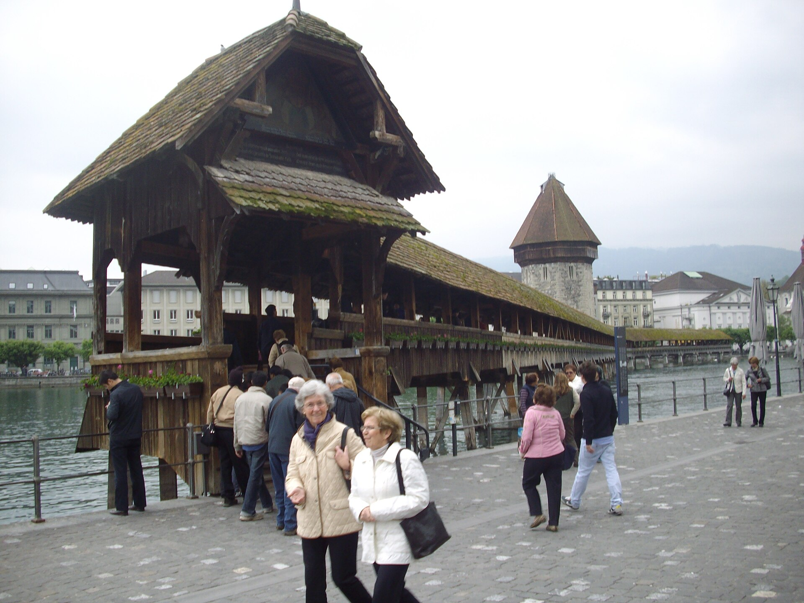

## 6.3 루체른역 기준 동선

Luzern Station은 기차역이면서 선착장, 버스, 카페, 마트, 베이커리 접근의 중심이다. 이번 일정에서 역은 네 번 중요하다.

| 날짜 | 역의 역할 |
|---|---|
| 07.16 | 취리히 공항에서 도착하는 기준점 |
| 07.17 | 아침 식사 후보와 선착장 접근 기준점 |
| 07.18 | 09:24 Luzern-Interlaken Express 출발 기준점 |
| 비상 시 | 마트, 약국, 물, 간식, 택시, 대체 교통 확인점 |

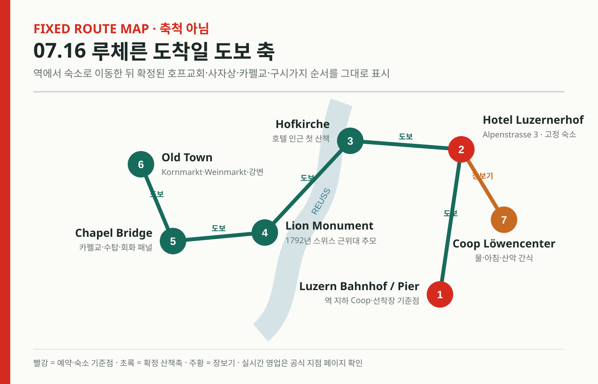

### 지도 읽는 법

- **Luzern Bahnhof / Pier**는 열차와 07.17 선박을 함께 이해하는 기준점이다.
- **Hotel Luzernerhof**는 짐과 컨디션을 리셋하는 중심이며, 관광보다 체크인·짐 보관이 먼저다.
- **Hofkirche-사자상-카펠교-구시가지**는 확정된 첫날 흐름을 표시한다.
- 지도는 축척 지도가 아니므로 실제 도보 시간, 횡단보도, 공사 구간은 현장 지도 앱으로 확인한다.

## 6.4 구시가지 걷는 법

루체른 구시가지는 카펠교, 수탑, Kornmarkt, Weinmarkt, Reuss 강변을 중심으로 걷는다. 길은 어렵지 않지만 관광객이 많고 사진 지점이 몰린다. 첫날은 다음 순서가 안정적이다.

1. 호텔에서 호수 방향으로 짧게 내려온다.
2. 호프교회 또는 빈사의 사자상 중 숙소에서 가까운 쪽을 먼저 본다.
3. 카펠교로 이동한다.
4. 구시가지 광장을 천천히 돈다.
5. 저녁 식사 후보를 확인한다.
6. 컨디션이 남으면 카펠교 야경을 본다.

## 6.5 호수 주변 산책 팁

루체른 호수 산책은 첫날과 둘째 날 모두 의미가 있다. 첫날은 도착 후 스위스 첫인상을 만드는 산책이고, 둘째 날은 리기산 선박 이동의 일부다.

호수 주변에서는 사진을 오래 찍기보다 내일 아침 선착장 위치를 익히는 것도 중요하다. Luzern Pier 1이 Vitznau/Weggis 방향의 핵심 출발점이므로, Day 2 전날 밤 위치를 눈으로 확인해두면 아침 동선이 훨씬 편하다.

## 6.6 숙소 위치를 기준으로 한 이동 팁

Hotel Luzernerhof는 Alpenstrasse 3, 6004 Luzern에 있다. 호프교회와 빈사의 사자상 방향 접근이 좋고, 루체른역까지는 도보로 이동 가능한 거리다. 다만 캐리어가 있거나 비가 오면 역-호텔 이동 체감이 길어진다.

### 호텔 기준 운영

- Day 1: 체크인 또는 짐 보관 후 호수/구시가지 짧은 산책
- Day 2: 08:30 전후 호텔 출발, 선착장 이동
- Day 3: 09:00 전후 호텔 출발, Luzern Station PL15 확인

## 6.7 마트, 약국, 편의시설

루체른역 주변은 아침 식사, 포장, 물 구매, 간식 보충에 유리하다. 기존 일정의 HEINI Bahnhof Luzern과 Confiserie Bachmann은 아침 후보다. Bachmann의 `Bahnhof UG`와 `Gleis 3`는 같은 매장을 가리키는 별칭이 아니라 서로 다른 역 지점이므로 예약·지도에서 지점명을 구분한다. 정확한 영업시간은 방문 전 공식 사이트에서 재확인한다.

### 루체른에서 사두면 좋은 것

- 리기산용 물
- 작은 빵/샌드위치
- 초콜릿/에너지바
- 휴지
- 손소독 티슈
- 자외선 차단제 보충

### 어느 마트를 선택할까

| 매장 | 위치와 강점 | 이번 일정에서의 역할 |
|---|---|---|
| **Coop Supermarkt Luzern Löwencenter** | Zürichstrasse 9. Hotel Luzernerhof·사자상 생활권에서 접근하기 편한 쇼핑센터 매장 | 07.16 체크인 후 여유 시간에 리기산용 물·과일·간식·생활용품을 한 번에 살 때 1순위 |
| **Coop Supermarkt Luzern Bahnhof** | Bahnhof SBB. 이른 아침과 저녁까지 비교적 긴 영업시간을 제공하는 역 매장 | 07.17 Pier 1 출발 전 빠진 물품, 07.18 열차 탑승 전 아침·이동식 보충 |
| **Löwencenter 내 할인점/기타 매장** | Coop 외에도 식품 매장을 비교할 수 있는 생활 쇼핑센터 | 가격을 비교하거나 특정 품목이 없을 때만 이용. 쇼핑 시간이 길어지지 않게 목록을 정한다. |

### 07.16 도착일 장보기 원칙

1. 호텔 체크인 또는 짐 보관을 먼저 끝낸다.
2. 확정 산책 중 Löwencenter가 자연스럽게 같은 생활권일 때만 들른다.
3. 물 2병, 다음 날 아침 백업, 산용 간식까지만 우선 산다.
4. 냉장 제품은 객실 냉장고 유무를 확인한 뒤 구매한다.
5. 장보기를 위해 카펠교·저녁·숙면 순서를 재배치하지 않는다.

> 방문 전 공식 사이트 확인 필요
> Coop Bahnhof는 역 매장 특성상 영업 폭이 넓지만 날짜별 시간이 달라질 수 있고, Löwencenter는 점포별 시간이 다르다. 2026.07.16-18의 공식 지점 페이지와 특별 영업시간을 확인한다.

## 6.8 야경과 저녁 산책

카펠교 야경은 루체른 첫날의 좋은 마무리다. 하지만 장거리 이동 후 피곤하면 과감히 줄인다. 특히 다음 날 09:12 선박 출발축을 잡고 있으므로 늦은 밤까지 돌아다니는 것은 추천하지 않는다.

### 야경 산책 기준

| 컨디션 | 선택 |
|---|---|
| 피곤함 | 저녁 후 바로 숙소 |
| 보통 | 카펠교 20-30분 짧은 야경 |
| 좋음 | Reuss 강변과 구시가지 45분 산책 |
| 비/강풍 | 숙소 복귀 우선 |

## 6.9 루체른에서 꼭 알아야 할 현장 팁

루체른은 도시가 아름다워 첫날 욕심이 생기기 쉽다. 하지만 이번 여행은 첫 스위스 도시 다음 날 바로 리기산 라운드트립이 있다. 첫날의 성공 기준은 `모든 명소 완료`가 아니라 `숙소에 무사히 들어가고, 내일 선착장과 아침 동선을 이해하고, 적당한 저녁을 먹고 쉬는 것`이다.

> 운영 원칙
> Day 1에서 빈사의 사자상이나 호프교회를 놓쳐도 여행 실패가 아니다. 리기산 복귀 후 Day 2 저녁에 짧게 보완할 수 있다.

## 6.10 루체른을 이해하는 역사

루체른은 호수와 로이스강, 고트하르트 방면 교역로가 만나는 곳에서 성장했다. 8세기 호프 수도원이 초기 중심을 이루었고, 1178년 무렵 교회 공동체에서 도시 자치가 분리되며 도시의 형태가 뚜렷해졌다. 약 1220년 고트하르트 통행로가 열리면서 남북 교역의 가치가 커졌고, 1332년에는 초기 스위스 동맹에 합류했다. 1386년 젬파흐 전투는 합스부르크 세력에 맞선 루체른과 동맹의 정치적 위상을 강화한 사건으로 기억된다. 이후 증기선·철도·산악철도가 결합하면서 중앙 스위스 관광의 관문이 되었다.

### 다섯 연대로 설명하는 루체른

| 시기 | 사건 | 오늘 보이는 흔적 |
|---|---|---|
| 8세기 | 호프 수도원 공동체 | Hofkirche 일대의 종교 중심성 |
| 1178년 무렵 | 도시 공동체 형성 | 강 양안의 시장·행정 공간 |
| 약 1220년 | 고트하르트 통행로 성장 | 호수·강·남북 교역의 결절성 |
| 1332년 | 초기 스위스 동맹 가입 | 중앙 스위스 정치사의 핵심 도시 |
| 1386년 | 젬파흐 전투 | 도시의 독립성과 동맹 기억 |

### 도시를 읽는 다섯 장면

| 장면 | 역사적 의미 | 현장에서 볼 것 |
|---|---|---|
| Hofkirche 쌍탑 | 수도원·교회 중심에서 성장한 초기 루체른의 종교적 중심 | 호텔 방향에서 보이는 두 탑과 호수 쪽 축 |
| 카펠교와 수탑 | 중세 도시 방어선과 강을 건너는 연결축 | 지붕 아래 회화 패널, 다리의 비스듬한 선, 수탑 위치 |
| 구시가지 광장 | 장터·길드·행정 기능이 모인 생활 중심 | 건물 외벽 벽화, 분수, 광장 크기의 차이 |
| 무제크 성벽 | 도시가 확장되기 전 경계를 보여주는 방어시설 | 구시가지 지붕선 위에 남은 성벽과 탑 |
| 선착장과 역 | 19세기 이후 호수 교통과 철도가 관광을 키운 결절점 | 역 앞에서 배·버스·철도가 몇 분 거리로 연결되는 구조 |

카펠교는 1993년 화재로 큰 피해를 입은 뒤 복원됐다. 지붕 아래 그림 중 일부가 비어 있거나 화재 흔적이 남아 있는 것은 완전한 새것으로 덮기보다 사건을 기억하게 하는 요소다. 빈사의 사자상은 1792년 프랑스혁명기 튈르리궁에서 희생된 스위스 근위대를 추모하며, 1821년 공개된 기념물이다.

## 6.11 루체른 식품 쇼핑 실행표

| 시점 | 매장 우선순위 | 사야 할 것 | 사지 않아도 되는 것 |
|---|---|---|---|
| 07.16 숙소 정리 후 여유 시간 | Löwencenter | 리기용 물, 과일, 에너지바, 휴지 | 대용량 식재료, 무거운 음료 묶음 |
| 07.17 이른 아침 | Bahnhof Coop 또는 확정 아침 후보 | 빠진 물 1병, 작은 빵 | 조리 필요한 식품 |
| 07.17 저녁 | 필요할 때만 Löwencenter/역 | 07.18 열차용 간식 | 인터라켄까지 들고 갈 과도한 냉장품 |
| 07.18 출발 직전 | Bahnhof Coop | 커피·빵·물 최종 보충 | 쇼핑 때문에 09:24 열차를 위험하게 하는 품목 |

## 핵심 체크포인트

- 루체른역은 기차, 선착장, 아침 식사, 물 보충의 중심이다.
- Hotel Luzernerhof는 Day 1-2 도보 운영에 유리하다.
- Day 1은 작게 시작하고, Day 2 리기산을 위해 일찍 쉰다.
- Pier 1 위치는 리기산 전날 또는 아침에 반드시 확인한다.
- 구시가지 야경은 컨디션이 남을 때만 진행한다.

\newpage

# 7장. 루체른 핵심 명소

## 이 장에서 알 수 있는 것

- 루체른 대표 명소를 확정 일정과 연결해 읽는다.
- 각 장소의 소요시간, 사진 포인트, 혼잡, 비 오는 날 적합도를 판단한다.
- 첫날과 리기산 복귀 후 무엇을 남기고 무엇을 줄일지 결정한다.

## 7.1 카펠교

### 어떤 곳인지

카펠교는 루체른을 대표하는 목조 다리다. 수탑과 함께 루체른을 상징하는 장면을 만든다. 구시가지와 강변 산책의 중심점이며, 첫날 저녁에 가장 쉽게 루체른다운 사진을 남길 수 있다.

중세 도시의 방어와 이동을 위해 놓인 다리에는 지붕 아래 삼각형 회화 패널이 이어진다. 1993년 화재로 다리와 그림이 큰 피해를 입었고 빠르게 복원되었지만, 소실된 구간과 흔적은 현재의 관람 포인트이기도 하다. 수탑은 감옥·보관·방어 등 여러 용도로 쓰인 도시 시설이지 동화적 장식물이 아니었다.

### 왜 가는지

루체른 첫인상을 가장 짧은 시간에 얻을 수 있다. 숙소, 저녁 식사 후보, 구시가지 산책과 연결이 쉽다.

### 누구에게 추천하는지

모든 여행자에게 추천한다. 특히 신혼여행 사진에서 배경이 명확하다.

### 예상 소요시간

20-40분. 구시가지와 함께 보면 90분.

### 사진 포인트

- 다리 밖에서 수탑과 목조 다리를 함께 담는 구도
- Reuss 강변에서 다리 전체를 사선으로 담는 구도
- 해 질 무렵 조명이 켜질 때

### 혼잡 시간대

오후와 저녁 피크에는 사람이 많다. 사진은 잠깐 기다려서 빈 구간이 생길 때 찍는다.

### 비 오는 날 적합도

비가 약하면 분위기가 있지만, 우산이 많아 사진과 이동이 불편하다. 강한 비면 짧게 보고 식당/카페로 이동한다.

### 확정 일정과 연결해서 보는 법

07.16 Day 1 오후/저녁 산책의 핵심이다. 피곤하면 카펠교만 보고 숙소로 돌아가도 충분하다.

## 7.2 빈사의 사자상

### 어떤 곳인지

빈사의 사자상은 1792년 8월 10일 프랑스혁명 중 튈르리 궁전을 지키다 희생된 스위스 근위대를 추모하는 기념물이다. 덴마크 조각가 베르텔 토르발센이 설계하고 루카스 아호른이 바위에 조각했으며 1821년 공개되었다. 창에 찔린 사자 아래의 깨진 방패와 왕정 상징은 충성·희생·패배의 기억을 압축한다. 이 기념물은 사건을 영웅화하는 시각과 용병 제도의 정치성을 함께 생각하며 본다.

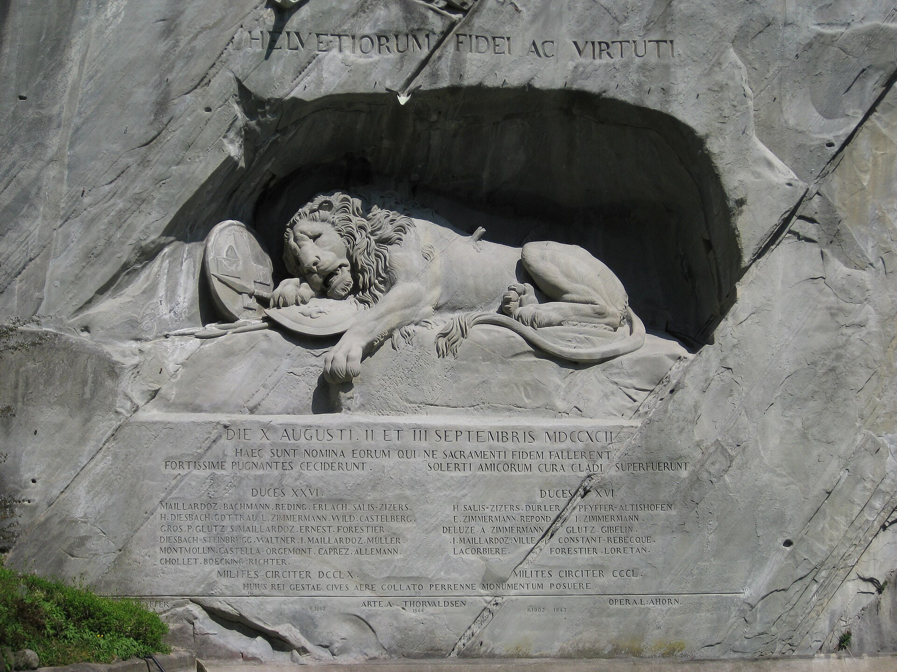

기념물은 1792년 8월 프랑스혁명기 파리 튈르리궁에서 루이 16세를 지키다 희생된 스위스 근위대를 추모한다. 덴마크 조각가 베르텔 토르발센의 디자인을 바탕으로 암벽에 조각되었고 1821년 공개됐다. 사자 아래의 방패와 창, 표정까지 보면 단순한 동물상이 아니라 패배와 충성, 애도의 정치적 기념물임을 이해할 수 있다.

### 왜 가는지

Hotel Luzernerhof에서 접근이 좋고, 첫날 짧은 산책에 넣기 쉽다. 카펠교와 다른 정적인 분위기를 준다.

### 누구에게 추천하는지

역사적 기념물, 조용한 사진, 짧은 산책을 원하는 사람.

### 예상 소요시간

20-30분. 주변 공원까지 천천히 보면 45분.

### 사진 포인트

연못과 사자상을 함께 담는다. 사람이 많으면 정면 집착보다 약간 측면에서 찍는다.

### 혼잡 시간대

단체 관광객이 몰리면 짧은 공간이 복잡해진다. 늦은 오후나 아침이 더 낫다.

### 비 오는 날 적합도

짧게 볼 수 있어 비 오는 날에도 가능하지만 오래 머물 이유는 적다.

### 확정 일정과 연결해서 보는 법

07.16 첫날 15:00 전후 후보다. 입국/수하물 지연 시 Day 2 저녁으로 넘긴다.

## 7.3 루체른 구시가지

### 어떤 곳인지

Kornmarkt, Weinmarkt, Reuss 강변, 오래된 건물 외관이 이어지는 구역이다. 큰 입장료 없이 도시 분위기를 느끼기 좋다.

구시가지의 외벽 그림과 간판은 건물의 소유자, 업종, 길드, 지역 이야기를 시각적으로 알리던 전통과 연결된다. 광장마다 건물 높이와 바닥 포장이 달라지는 지점을 보면 장터와 행정공간이 한 덩어리가 아니라 여러 생활 중심으로 구성됐음을 알 수 있다.

### 왜 가는지

첫날 장거리 이동 후 무리 없이 걸을 수 있고, 식사 후보와 자연스럽게 연결된다.

### 누구에게 추천하는지

사진, 산책, 카페, 짧은 쇼핑을 함께 원하는 사람.

### 예상 소요시간

60-90분. 식사 포함 시 2-3시간.

### 사진 포인트

- 광장 벽화와 분수
- Reuss 강변
- 카펠교와 이어지는 골목

### 혼잡 시간대

저녁 식사 전후와 주말 오후.

### 비 오는 날 적합도

약한 비는 가능하지만 골목 바닥이 미끄러울 수 있다. 비가 강하면 박물관/카페로 전환한다.

### 확정 일정과 연결해서 보는 법

07.16 Day 1 카펠교와 함께 본다. 쇼핑을 길게 하지 말고 저녁과 숙소 복귀를 우선한다.

## 7.4 예수회 교회

### 어떤 곳인지

Reuss 강변의 바로크 양식 교회다. 17세기 예수회와 가톨릭 반종교개혁의 맥락에서 세워진 공간으로, 밝은 흰색·분홍색 장식, 천장화, 제단이 신앙의 감각적 설득력을 높인다. 외관과 내부 모두 루체른 구시가지 산책 중 들르기 좋지만 예배가 진행 중이면 관람과 촬영을 멈춘다.

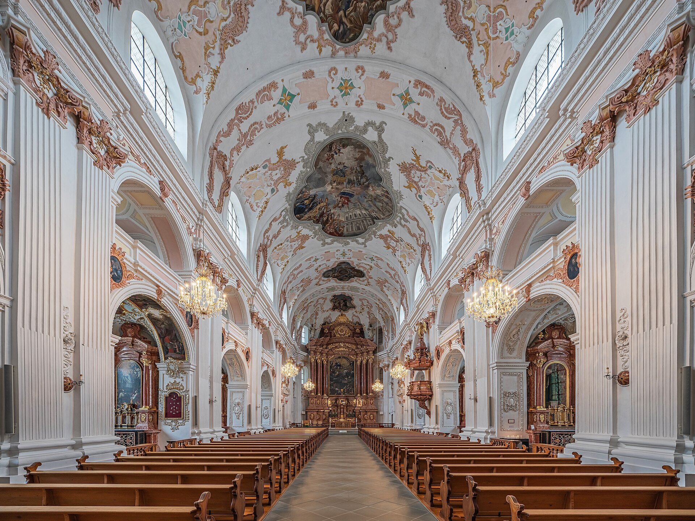

17세기 가톨릭 루체른의 종교·교육 전통을 보여주는 대표 바로크 공간이다. 강 건너에서 두 탑과 수면 반사를 먼저 보고, 내부에서는 밝은 색의 장식과 천장을 조용히 관찰한다. 미사와 행사가 있으면 관광 동선을 즉시 줄인다.

### 왜 가는지

카펠교와 강변을 걷는 중 짧게 넣을 수 있고, 비가 올 때 잠깐 실내로 들어가기 좋다.

### 누구에게 추천하는지

건축, 조용한 실내, 강변 산책을 좋아하는 사람.

### 예상 소요시간

15-30분.

### 사진 포인트

강 건너 외관, 내부 천장과 밝은 색감.

### 혼잡 시간대

예배나 행사 시간에는 내부 관람을 방해하지 않는다.

### 비 오는 날 적합도

좋다. 단, 예배 중이면 조용히 짧게 본다.

### 확정 일정과 연결해서 보는 법

07.16 구시가지 산책 중 여유가 있을 때만 들른다.

## 7.5 무제크 성벽

### 어떤 곳인지

루체른을 내려다보는 성벽과 탑 구간이다. 공식 안내 기준 겨울에는 닫히며, 계절별 개방과 시간은 방문 전 확인해야 한다. 여름에는 도시 전망을 얻기 좋은 장소다.

중세 방어선 가운데 남아 있는 성벽과 아홉 탑이 루체른의 옛 경계를 보여준다. 일부 탑만 계절에 따라 올라갈 수 있으므로 `성벽 전체가 언제나 자유롭게 개방된다`고 생각하지 않는다. 탑의 높이보다 구시가지 지붕과 호수, 이후 성벽 밖으로 확장된 도시를 함께 보는 것이 핵심이다.

### 왜 가는지

카펠교보다 높은 위치에서 루체른 지붕과 호수, 산을 볼 수 있다.

### 누구에게 추천하는지

걷는 것을 좋아하고, 계단과 언덕이 부담스럽지 않은 사람.

### 예상 소요시간

45-90분.

### 사진 포인트

성벽 위에서 보는 구시가지 지붕, 호수와 산 배경.

### 혼잡 시간대

오후보다 오전이나 늦은 오후가 낫다.

### 비 오는 날 적합도

낮다. 계단과 성벽 길이 미끄러울 수 있다.

### 확정 일정과 연결해서 보는 법

이번 확정 일정에는 필수로 넣지 않는다. Day 1 컨디션이 아주 좋거나 Day 2 복귀 후 여유가 있을 때만 고려한다.

## 7.6 루체른 호수

### 어떤 곳인지

루체른 도시의 풍경을 완성하는 호수다. 리기산 라운드트립에서는 이동 수단 자체가 호수 경험이 된다.

### 왜 가는지

호수 위 배 이동은 리기산 일정의 핵심 장면이다. 단순한 교통이 아니라 Day 2의 분위기를 만든다.

### 누구에게 추천하는지

모든 여행자에게 추천한다. 특히 사진보다 풍경을 천천히 보고 싶은 사람에게 좋다.

### 예상 소요시간

짧은 산책은 30분, 리기산 선박 이동은 일정 전체에 포함.

### 사진 포인트

선착장, 배 위 갑판, 호수와 산 능선, 저녁 빛.

### 혼잡 시간대

성수기 선박 출발 전 선착장.

### 비 오는 날 적합도

약한 비는 가능하지만 시야와 갑판 체류가 줄어든다.

### 확정 일정과 연결해서 보는 법

07.17 Luzern Pier 1에서 Vitznau로 가는 배와 Weggis에서 돌아오는 배가 핵심이다.

## 7.7 스위스 교통박물관

### 어떤 곳인지

루체른의 대표 실내 박물관이다. 철도·자동차·항공·우주·수운 전시는 스위스의 지형을 극복한 교통 기술을 이해하게 한다. 영화관, 플라네타륨, Swiss Chocolate Adventure는 일반 박물관 입장권과 포함 범위가 다를 수 있으며 통합 Day Pass 여부에 따라 추가 요금이 생길 수 있다. 운영시간과 정확한 티켓 범위는 방문 전 공식 사이트에서 확인한다.

### 왜 가는지

비 오는 날, 리기산 시야가 좋지 않은 날, 도시 실내 대안으로 좋다.

### 누구에게 추천하는지

비/흐림 대체, 교통/기계/전시를 좋아하는 사람, 일정이 무리 없이 비는 사람.

### 예상 소요시간

2-4시간.

### 사진 포인트

실내 전시물, 외부 대형 전시. 단, 사진 규정은 현장 안내를 따른다.

### 혼잡 시간대

주말, 비 오는 날, 가족 방문 시간대.

### 비 오는 날 적합도

높다.

### 확정 일정과 연결해서 보는 법

07.17 리기산 날씨가 나쁘면 대안 A로 검토한다. 리기산이 정상 진행되면 굳이 넣지 않는다.

## 7.8 리하르트 바그너 박물관

### 어떤 곳인지

루체른 호수 Tribschen의 저택은 리하르트 바그너가 1866년부터 1872년까지 살았던 곳이다. 이 시기에 《뉘른베르크의 명가수》를 완성하고 《지크프리트》를 작업했으며, 계단에서 연주된 《지크프리트 목가》의 초연 기억도 연결된다. 오늘의 박물관은 작품과 생활사뿐 아니라 바그너의 반유대주의와 수용사의 문제도 비판적으로 다룬다. 공식 안내 기준 시즌 운영과 휴관일이 있으므로 방문 전 확인이 필요하다.

### 왜 가는지

루체른에서 조용한 문화 일정과 호수 산책을 함께 하고 싶을 때 적합하다.

### 누구에게 추천하는지

음악, 조용한 박물관, 관광객이 비교적 덜 몰리는 장소를 원하는 사람.

### 예상 소요시간

60-90분. 호수 이동 포함 시 2시간 이상.

### 사진 포인트

건물 외관, 호수 주변. 내부 촬영은 현장 규정 확인.

### 혼잡 시간대

대형 명소보다 덜 혼잡한 편이지만 시즌과 행사에 따라 달라질 수 있다.

### 비 오는 날 적합도

중간. 이동 구간이 비에 노출될 수 있다.

### 확정 일정과 연결해서 보는 법

이번 일정의 필수 방문지는 아니다. 비가 약하고 리기산을 줄였을 때만 고려한다.

## 7.9 기타 여유 시간 선택지

| 선택지 | 쓰기 좋은 때 | 주의 |
|---|---|---|
| KKL 주변 산책 | 역/호수 근처에서 짧게 | 공연/행사 혼잡 |
| Seepromenade | 날씨 좋고 컨디션 좋을 때 | 햇볕 강함 |
| Glacier Garden | 빈사의 사자상 근처 실내 대안 | 입장료와 운영시간 확인 |
| 루체른역 쇼핑 | 아침/간식/물 보충 | 쇼핑이 길어지면 열차 시간 위험 |

## 7.10 놓치기 쉬운 주요 명소와 문화 선택지

다음 장소는 루체른을 더 깊게 이해하게 하지만, 07.16 확정 산책 순서에 새 필수 지점으로 끼워 넣지 않는다.

| 장소 | 핵심 내용 | 비 오는 날 | 이번 일정에서의 위치 |
|---|---|---:|---|
| **Hofkirche St. Leodegar** | 수도원 기원과 17세기 재건, 루체른 종교사의 중심 | 중간 | 호텔 인근 확정 산책에서 외관·내부를 짧게 봄 |
| **Spreuerbrücke** | 카펠교와 다른 목조교, 지붕 아래 `죽음의 춤` 회화 연작 | 중간 | 구시가지 산책 후 여유 시간에만 |
| **KKL Luzern** | 장 누벨 설계의 현대 공연·문화시설, 역사도시의 현대적 얼굴 | 높음 | 역·선착장에 이미 있을 때 외관과 로비 가능 범위 확인 |
| **Glacier Garden** | 빙하 흔적과 지질, 사자상 인근 실내·외 전시 | 높음 | 비가 오고 사자상 주변에 있을 때 |
| **Bourbaki Panorama** | 1871년 프랑스 부르바키군의 스위스 피난을 다룬 대형 파노라마 | 높음 | 역사 관심이 높고 60분 이상 남을 때 |
| **Rosengart Collection** | 피카소·클레 등 근현대 미술 컬렉션 | 높음 | 리기산 취소나 강한 비 때만 |

> 방문 전 확인
> 예배, 공연, 전시, 계절 개방에 따라 접근 범위가 달라진다. 티켓이 필요한 장소는 당일 공식 사이트를 확인하고, 07.17 리기산과 07.18 09:24 열차보다 우선하지 않는다.

## 핵심 체크포인트

- 카펠교는 Day 1의 핵심이고, 놓치기 어렵다.
- 빈사의 사자상은 지연 시 Day 2 저녁으로 넘길 수 있다.
- 교통박물관은 리기산 날씨가 나쁠 때 유용한 실내 대안이다.
- 무제크 성벽은 계단과 날씨 조건을 본 뒤 여유 시간에만 간다.
- 루체른 호수는 Day 2 리기산 라운드트립 안에서 충분히 경험한다.

\newpage

# 8장. 루체른 주변 산악 여행

## 이 장에서 알 수 있는 것

- 루체른 주변 산악 목적지의 성격을 비교한다.
- 리기산 확정 일정과 다른 산악 선택지를 구분한다.
- 필라투스, 티틀리스, 슈탄저호른을 여유 시간 정보로 이해한다.
- 날씨별, 반나절/하루 코스별 판단 기준을 정리한다.

## 8.1 리기산

리기산은 이번 일정에서 확정된 Day 2의 핵심이다. 루체른 호수 배, Vitznau 산악열차, Rigi Kulm 정상, Rigi Kaltbad, Weggis 케이블카, 루체른 복귀 배가 이어진다. 산 하나를 보는 일정이라기보다 `배-산악열차-정상-케이블카-배`가 이어지는 경험 전체가 목적이다.

### 이번 일정의 리기산 운영축

| 시간 | 구간 | 메모 |
|---:|---|---|
| 07:00 | 호텔 밖 아침 | HEINI/Bachmann 등 후보. 오래 앉지 않음. |
| 08:30 | Hotel Luzernerhof 출발 | Luzern Pier 1 이동. |
| 09:12 | Luzern → Vitznau 배 | 공식 시간표 재확인. |
| 10:15 | Vitznau → Rigi Kulm 산악열차 | 정상 도착 후 전망과 짧은 산책. |
| 12:20 이후 | 점심/휴식 | Rigi Kulm 또는 Kaltbad. |
| 15:00-15:15 | Rigi Kulm역 → Rigi Kaltbad | 16:10 케이블카를 위한 안전 연결. 공식 시간표 재확인. |
| 16:10 | Rigi Kaltbad → Weggis 케이블카 | 하산 후 선착장 도보. |
| 17:05 | Weggis → Luzern 배 | 복귀 후 저녁. |

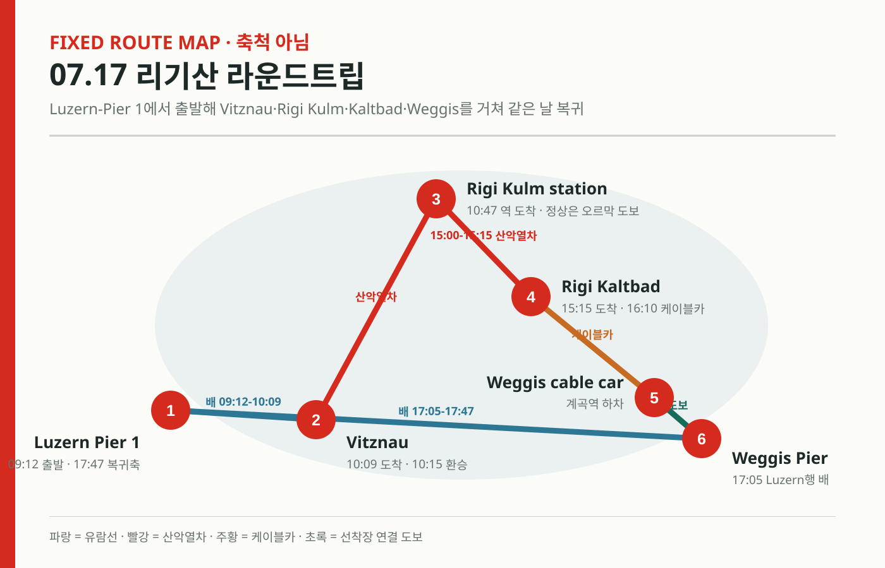

### 지도 읽는 법

- 파란 구간은 유람선, 빨간 구간은 산악열차, 주황은 케이블카, 초록은 선착장 연결 도보다.
- Vitznau에서는 호수 경치보다 10:15 산악열차 연결을 먼저 확인한다.
- Rigi Kulm역 도착 뒤 실제 정상 전망점까지는 오르막 도보가 남는다. 역 도착과 정상 도착을 같은 뜻으로 쓰지 않는다.
- Rigi Kulm 15:00 → Rigi Kaltbad 15:15 산악열차를 놓치지 않아야 16:10 케이블카 연결이 안정적이다.
- Rigi Kaltbad는 정상 이후 템포를 조절하면서 16:10 케이블카를 준비하는 거점이다.
- Weggis 하산 뒤에는 17:05 배가 마지막 핵심 고정축이다.

### 날씨 판단

정상 웹캠이 좋으면 예정대로 진행한다. 정상부가 구름 속이면 Rigi Kulm 체류를 줄이고 Kaltbad, 루체른 호수, 교통박물관 대안으로 전환한다.

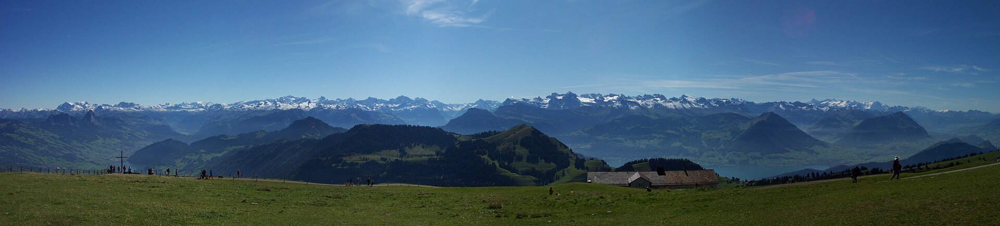

## 8.2 필라투스

필라투스는 루체른의 대표 산이다. 공식 Pilatus 안내 기준 Golden Round Trip은 배, 톱니바퀴 철도, 케이블웨이, 파노라마 곤돌라를 연결하는 루체른 대표 라운드트립이다. 일반적으로 5시간 이상 잡아야 하며, 계절과 운행 조건을 확인해야 한다.

이번 일정에서는 리기산이 이미 확정되어 있으므로 필라투스를 추가하지 않는다. 필라투스는 별도 루체른 체류일이 있거나 리기산을 하지 않는 여행자에게 적합한 정보로만 둔다.

### 필라투스가 맞는 사람

- 루체른에서 하루가 더 있는 사람
- 더 극적인 산악 풍경을 원하는 사람
- Golden Round Trip의 이동 조합에 관심이 있는 사람

### 이번 일정에서 피하는 이유

- Day 2 리기산과 성격이 겹친다.
- Day 3 09:24 인터라켄 이동 전 피로가 누적될 수 있다.
- 확정된 리기산 라운드트립을 대체할 이유가 없다.

## 8.3 티틀리스

티틀리스는 Engelberg에서 접근하는 고산 목적지다. 공식 Titlis 안내 기준 운영시간과 케이블카/Rotair 관련 정비 정보가 시기별로 달라질 수 있다. 2026년에는 일부 케이블카 정비와 대체 운행 정보가 있으므로 방문 전 공식 사이트 확인이 필수다.

이번 일정에서는 티틀리스를 추가하지 않는다. 이동 시간이 길고, 리기산과 07.19 융프라우요흐가 이미 산악 경험을 제공한다.

### 추천 조건

- 루체른에 별도 하루가 있고 눈/빙하/고산 체험이 목표일 때
- 공식 운행 정보가 안정적일 때
- 강풍이 없고 시야가 좋은 날

## 8.4 슈탄저호른

슈탄저호른은 CabriO 케이블카로 알려진 루체른 주변 산악 선택지다. 공식 안내 기준 2026년 시즌과 시간표가 공개되어 있으며, 예약/운행 조건은 방문 전 확인해야 한다.

리기산보다 덜 대표적이지만, 독특한 케이블카 경험과 상대적으로 다른 분위기가 있다. 이번 일정에서는 확정 일정이 아니므로 참고용으로만 둔다.

## 8.5 루체른 호수 유람선

이번 일정에서 루체른 호수 유람선은 별도 옵션이 아니라 리기산 라운드트립의 일부다. Luzern에서 Vitznau로 가고, Weggis에서 Luzern으로 돌아오는 배 구간이 Day 2의 분위기를 만든다.

### 선박 이용 팁

- Pier 번호를 먼저 확인한다.
- 갑판 사진을 찍되 짐과 티켓을 놓지 않는다.
- 바람이 강하면 실내 좌석도 활용한다.
- 식사를 배 안에서 할 계획이면 별도 예약 가능 여부를 공식 사이트에서 확인한다.
- 선착장 도착 후 바로 줄을 서기보다 전광판/표지판을 먼저 확인한다.

## 8.6 Golden Round Trip 개념

Golden Round Trip은 일반적으로 루체른에서 배, 산악열차, 케이블카/곤돌라, 버스 등을 연결해 원형으로 돌아오는 방식의 산악 여행을 말한다. 필라투스 Golden Round Trip이 대표적이며, 리기산 일정도 유사하게 같은 길을 반복하지 않는 원형 경험을 준다.

이번 일정에서 중요한 점은 `라운드트립을 더 많이 하는 것`이 아니라 `이미 확정된 리기산 라운드트립을 안정적으로 끝내는 것`이다.

## 8.7 날씨별 선택 기준

| 날씨 | 리기산 | 필라투스 | 티틀리스 | 슈탄저호른 | 루체른 호수 |
|---|---|---|---|---|---|
| 맑음 | 진행 | 별도일이면 적합 | 별도일이면 적합 | 적합 | 매우 좋음 |
| 흐림 | 웹캠 보고 축소 | 비추천 | 비추천 | 신중 | 짧게 가능 |
| 비 | 도시 대안 | 비추천 | 비추천 | 비추천 | 짧은 유람만 가능 |
| 강풍 | 운행 확인 필수 | 운행 확인 필수 | 운행 확인 필수 | 운행 확인 필수 | 선박 정보 확인 |
| 폭염 | 산 위가 오히려 나을 수 있음 | 가능 | 고산 체감 주의 | 가능 | 햇볕 주의 |

## 8.8 반나절/하루 코스 판단법

리기산은 사실상 하루 코스다. 오전 출발, 정상과 점심, Kaltbad, Weggis, 루체른 복귀까지 이어지면 저녁에 돌아온다. 필라투스 Golden Round Trip도 5시간 이상이 필요하다. 티틀리스는 Engelberg 이동까지 포함해 하루를 잡아야 한다. 슈탄저호른은 상대적으로 짧게 운영할 수 있지만, 그래도 반나절 이상이 필요하다.

### 이번 일정에서의 결론

- Day 2: 리기산 확정 진행
- Day 1: 산악 추가 없음
- Day 3: 09:24 열차가 우선, 산악 추가 없음
- Day 4: 예약된 융프라우요흐
- Day 5: 그린델발트 마을·Coop Eigershop·BelAqua
- Day 6: 남행 환승

## 8.9 산악 여행 전 체크리스트

- [ ] 공식 시간표 확인
- [ ] 웹캠 확인
- [ ] 강풍/뇌우 확인
- [ ] 마지막 하산 시간 확인
- [ ] Half Fare 적용 여부 확인
- [ ] 티켓 QR 오프라인 저장
- [ ] 여권 원본/신분증 확인
- [ ] 물과 간식 준비
- [ ] 바람막이 준비
- [ ] 보조배터리 충전
- [ ] 식당 운영시간 확인

## 8.10 리기산 철도 역사와 풍경 읽기

Vitznau-Rigi 철도는 1871년 5월 21일 유럽 최초의 산악철도로 운행을 시작했다. 최초 개통 구간은 Vitznau에서 Rigi Staffelhöhe까지였고 이후 정상 방향 연결이 완성되었다. 호숫가 증기선과 산악철도가 연결되면서 여행자는 장거리 도보나 말 없이도 높은 전망대에 접근할 수 있게 됐다. 오늘의 Day 2가 `배-철도-산-케이블카-배`로 구성되는 이유는 19세기부터 이어진 중앙 스위스 관광 교통의 구조와 맞닿아 있다.

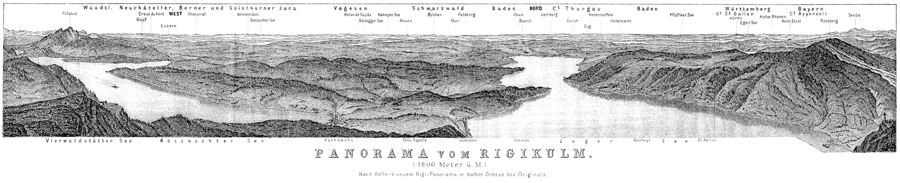

### 현대 사진과 역사 도판을 비교하는 법

| 비교 항목 | 관찰 질문 |
|---|---|
| 산의 윤곽 | 100년 이상 전 도판과 오늘 사진에서 같은 봉우리를 찾을 수 있는가? |
| 호수와 마을 | 교통이 발달하면서 어느 방향의 정착지가 더 크게 보이는가? |
| 관광 표현 | 역사 도판은 실제 시야를 정확히 옮겼는가, 여러 방향을 한 장에 압축했는가? |
| 현장 경험 | 당시 여행자에게 산악열차와 정상 호텔은 어떤 기술적 충격이었을까? |

Rigi가 `Queen of the Mountains`로 불리는 홍보 문구보다 중요한 것은, 산 하나가 호수 교통·철도 기술·호텔 산업·파노라마 인쇄물의 결절점이 되었다는 사실이다. 정상에서 사진만 찍고 내려오기보다 산악열차의 톱니 구동음, 역 위치, 호수와 이어지는 선형을 한 번 관찰한다.

> 방문 전 공식 사이트 확인 필요
> 철도 운행과 차량 형식은 시대에 따라 바뀐다. 역사 열차나 특별 운행을 기대한다면 Rigi Bahnen 공식 공지를 확인하며, 일반 확정편을 특별편으로 임의 변경하지 않는다.

## 핵심 체크포인트

- 이번 루체른 산악 핵심은 리기산이다.
- 필라투스, 티틀리스, 슈탄저호른은 참고용 대안이지 확정 일정이 아니다.
- 산악 여행은 운행 정보와 웹캠이 먼저다.
- Golden Round Trip은 멋진 개념이지만 일정이 길다.
- Day 2를 무리하면 Day 3 인터라켄 이동에 피로가 남는다.

\newpage

# 9장. 확정 일정 기반 날짜별 여행 해설

## 이 장에서 알 수 있는 것

- 날짜별 확정 순서를 그대로 유지하면서 현장 운영 정보를 붙인다.
- 각 날짜의 이동 구조, 체크리스트, 날씨 대처, 식사 선택을 확인한다.
- 예약과 열차 시간을 놓치지 않기 위한 당일 행동 순서를 정리한다.
- 추가 추천은 `여유 시간이 생겼을 때` 항목으로만 다룬다.

## 9.1 2026.07.16 목 - 프라하 → 취리히 → 루체른

### 오늘의 핵심

장거리 이동 후 스위스에 들어오는 날이다. 성공 기준은 `LX1485 탑승`, `취리히 공항 도착`, `루체른 이동`, `Hotel Luzernerhof 체크인 또는 짐 보관`, `카펠교와 구시가지 짧은 산책`, `무리 없는 저녁`이다.

### 오늘의 이동 구조

| 시간 | 고정/운영 | 내용 |
|---:|---|---|
| 09:30-10:55 | 예약 완료 | LX1485 Prague PRG → Zurich ZRH |
| 12:15 | 당일 구매예정 1순위 | Zürich Flughafen → Zürich HB 환승 → Luzern 13:25 |
| 12:39 또는 13:15 | 백업 | 직통 또는 늦은 직통 |
| 13:40 이후 | 숙소 이동 | Hotel Luzernerhof, Alpenstrasse 3 |
| 15:00 이후 | 가벼운 산책 | 호프교회, 빈사의 사자상 |
| 17:00 이후 | 구시가지 | 카펠교, Kornmarkt, Weinmarkt |
| 저녁 | 후보 | Rathaus Brauerei, Des Alpes 등 |

### 아침 체크리스트

- [ ] 항공권 QR/앱 확인
- [ ] 여권 원본 확인
- [ ] Swiss Half Fare Card QR 저장 여부 확인
- [ ] 취리히 공항 도착 후 열차 구매는 서두르지 않기
- [ ] 루체른 숙소 주소 오프라인 저장
- [ ] 보조배터리 충전

### 이동 전 확인할 것

취리히 공항 도착 후에는 `Bahn / Train` 표지판을 따라 Zürich Flughafen 역으로 이동한다. 항공 지연, 입국심사, 수하물 수령이 끝나기 전에는 12:15 열차를 무리하게 확정하지 않는다. SBB 앱에서 실제 가능한 열차를 보고 구매한다.

### 방문지별 배경지식

호프교회는 호텔에서 접근이 좋은 루체른 대표 교회다. 빈사의 사자상은 역사적 기념물이며 짧게 관람한다. 카펠교는 루체른을 상징하는 목조 다리로 첫날 가장 중요한 사진 포인트다. 구시가지는 카펠교와 이어지는 강변 골목을 천천히 걷는 방식이 좋다.

### 현장에서 보면 좋은 포인트

- 취리히 공항역 표지판의 `Bahn/Train`
- Luzern Station 도착 후 호수와 선착장의 방향
- Hotel Luzernerhof에서 호프교회/호수로 이어지는 길
- 카펠교와 수탑이 동시에 보이는 강변 위치
- 저녁 식사 후 숙소 복귀 길

### 사진 포인트

- 카펠교와 수탑
- Reuss 강변에서 보는 구시가지
- 빈사의 사자상 정면
- 호텔 주변 첫 스위스 거리 사진

### 식사 선택 팁

첫날은 피로가 크다. 너무 무거운 퐁듀보다 캐주얼한 식사가 낫다. Rathaus Brauerei는 짧고 부담 없는 저녁 후보이고, Restaurant Des Alpes는 카펠교 주변 분위기 있는 저녁 후보다. 예약 가능 여부와 영업시간은 방문 전 공식 사이트 확인 필요.

### 날씨가 안 좋을 때 대처

비가 오면 빈사의 사자상과 호프교회는 짧게 보고, 카펠교 사진만 남긴 뒤 식당/카페로 들어간다. 강한 비라면 구시가지 긴 산책을 생략한다.

### 체력이 떨어졌을 때 줄일 수 있는 부분

- 빈사의 사자상은 Day 2 저녁으로 이동 가능
- 구시가지 깊은 골목 탐색 생략
- 야경 산책 생략
- 저녁은 포장/간단 식사로 전환

### 절대 놓치면 안 되는 예약/이동

- LX1485 항공편
- 취리히 공항에서 루체른 이동
- Hotel Luzernerhof 체크인/짐 보관

### 여유 시간이 생겼을 때

- Max Chocolatier에서 선물용 초콜릿 확인
- 예수회 교회 짧은 관람
- 카펠교 야경 20분
- 숙소 정리 뒤 Löwencenter에서 리기산용 물·간식 보충

### 하루 마무리 체크

- [ ] Day 2 Luzern Pier 1 위치 확인
- [ ] 리기산 날씨와 웹캠 확인
- [ ] 물과 간식 보충
- [ ] 09:12 배 시간 확인
- [ ] 바람막이와 티켓 준비

\newpage

## 9.2 2026.07.17 금 - 리기산 라운드트립

### 오늘의 핵심

오늘은 루체른 호수, Vitznau 산악열차, Rigi Kulm, Rigi Kaltbad, Weggis 케이블카, 루체른 복귀 배가 이어지는 메인 데이다. 일정의 핵심은 하나의 정상만 보는 것이 아니라 이동 경험 전체다.

### 오늘의 이동 구조

| 시간 | 구간 | 메모 |
|---:|---|---|
| 07:00 | 호텔 밖 아침 | HEINI Bahnhof Luzern 또는 Bachmann 등 |
| 08:30 | Hotel Luzernerhof 출발 | Pier 1 이동 |
| 09:12-10:09 | Luzern → Vitznau 배 | 공식 시간표 확인 |
| 10:15-10:47 | Vitznau → Rigi Kulm 산악열차 | 정상 전망 |
| 12:20 전후 | 점심/휴식 | Kulm 또는 Kaltbad |
| 16:10 | Rigi Kaltbad → Weggis 케이블카 | 하산 |
| 17:05-17:47 | Weggis → Luzern 배 | 복귀 |
| 저녁 | 루체른 저녁 | 퐁듀/강변 식당 후보 |

### 아침 체크리스트

- [ ] Rigi 공식 운행 정보 확인
- [ ] Lake Lucerne 선박 시간표 확인
- [ ] 정상 웹캠 확인
- [ ] 물, 간식, 바람막이
- [ ] Half Fare Card와 여권 원본
- [ ] 배 출발 20분 전 선착장 도착 목표

### 이동 전 확인할 것

Luzern Pier 1 출발인지 확인한다. 선착장에 도착하면 목적지가 Vitznau인지, 배 시간이 맞는지, 줄이 어느 방향인지 본다. 산악열차 연결은 공식 시간표를 기준으로 하지만, 현장 안내가 우선이다.

### 방문지별 배경지식

Vitznau는 리기산 산악열차의 호수 쪽 출발점이다. Rigi Kulm은 정상 전망 지점이고, Rigi Kaltbad는 휴식과 케이블카 연결의 중간 거점이다. Weggis는 케이블카 하산 후 루체른 복귀 배를 타는 선착장이다.

### 현장에서 보면 좋은 포인트

- Luzern 출발 직후 호수 위에서 보는 도시와 산
- Vitznau에서 산악열차로 갈아타는 장면
- Rigi Kulm 정상부에서 호수와 산이 겹치는 전망
- Kaltbad에서 템포를 낮추는 산 위 마을 분위기
- Weggis로 내려오며 보이는 호수

### 사진 포인트

- 배 갑판에서 루체른 호수와 산 능선
- Rigi Kulm 정상 표식 주변
- 산악열차 창문 너머 풍경
- 케이블카 하산 구간
- 루체른 복귀 배에서 저녁 빛

### 식사 선택 팁

산 위 식사는 날씨가 좋을 때 만족도가 높다. 구름 속이면 정상 레스토랑에 오래 머물 이유가 줄어든다. 점심은 Rigi Kulm에서 단순하게 해결하거나 Kaltbad 카페로 내려와 쉬는 방식이 안정적이다. 저녁은 Day 1보다 퐁듀 만족도가 높을 수 있지만, 피곤하면 가벼운 식사로 바꾼다.

### 날씨가 안 좋을 때 대처

정상 웹캠이 흐리면 리기산 전체 일정을 줄인다. 대안은 루체른 구시가지, 교통박물관, 짧은 호수 유람선, 카페 중심이다. 강풍 또는 운행 제한이 있으면 산악교통을 억지로 진행하지 않는다.

### 체력이 떨어졌을 때 줄일 수 있는 부분

- Rigi Kulm 정상 체류 단축
- Kaltbad 긴 산책 생략
- 저녁 퐁듀 대신 간단 식사
- 카펠교 야경 재방문 생략

### 절대 놓치면 안 되는 예약/이동

- Luzern Pier 1 출발 배
- Vitznau-Rigi Kulm 연결
- Rigi Kaltbad-Weggis 하산
- Weggis-Luzern 복귀 배

### 여유 시간이 생겼을 때

- 리기산 정상 주변 짧은 산책
- Kaltbad 카페 휴식
- 루체른 복귀 후 카펠교 야경

### 하루 마무리 체크

- [ ] 07.18 09:24 Luzern 출발 티켓 QR 확인
- [ ] Luzern Station PL15 확인
- [ ] 체크아웃 준비
- [ ] 물과 간식 보충
- [ ] Interlaken West 숙소 주소 저장

\newpage

## 9.3 2026.07.18 토 - 루체른 → 인터라켄 West

### 오늘의 핵심

오늘은 결제한 09:24 Luzern-Interlaken Express로 Interlaken West까지 이동한 뒤, 숙소에 짐을 두고 **15:00 패러글라이딩 예약**에 맞추는 날이다. 열차 풍경과 비행이 두 개의 핵심이며, 그 사이에 새로운 관광지를 넣지 않는다.

### 오늘의 이동 구조

| 시간 | 구간 | 상태 |
|---:|---|---|
| 07:30 | 기상/체크아웃 준비 | 캐리어, 여권, 티켓 QR |
| 09:00 | Hotel Luzernerhof → Luzern Station | PL15 확인 |
| 09:24-11:17 | Luzern → Interlaken Ost | 결제 티켓 기준 |
| 11:29-11:32 | Interlaken Ost → Interlaken West | PL8 → PL1 |
| 11:45 이후 | 스위스:인터젠의방 이동 | West 하차 기준 |
| 점심 이후 | 숙소 → 예약 확인서의 집결지 | 운영사·픽업 장소 확인 |
| 15:00 | 인터라켄 패러글라이딩 | 체크인·이동·안전 안내·탠덤 비행 |
| 비행 뒤 | 회에마테·회에벡·숙소 복귀 | 착륙 뒤 짧은 산책 |

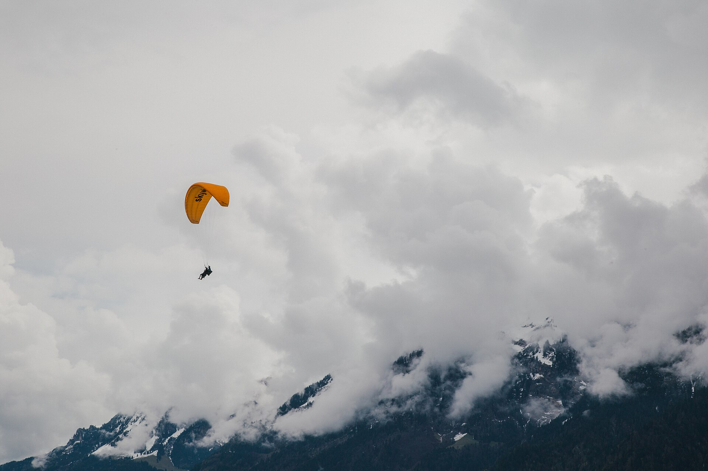

### 아침 체크리스트

- [ ] 호텔 방에 물건 놓고 나오지 않았는지 확인
- [ ] Half Fare Card QR
- [ ] 열차 티켓 QR
- [ ] 여권 원본
- [ ] 보조배터리
- [ ] Luzern Station PL15
- [ ] Interlaken West 하차 재확인
- [ ] 15:00 패러글라이딩 예약서·운영사·집결지·연락 메시지 확인
- [ ] 발을 잡아 주는 운동화와 얇은 겉옷

### 이동 전 확인할 것

SBB 앱에서 Luzern 09:24, Interlaken Ost 11:17, Interlaken West 11:32 연결이 기존 일정과 맞는지 확인한다. 공식 일반 패턴인 매시 06분 출발 정보와 섞어 다시 예약하지 않는다. 비행 운영사의 당일 기상 연락, 15:00 집결 시각, 픽업 위치는 예약 확인서를 기준으로 한다.

### 방문지별 배경지식

Luzern-Interlaken Express는 이동 자체가 관광이 되는 구간이다. Sarnen, Brünig, Brienz로 이어지는 구간에서 호수와 산, 전원 풍경이 이어진다. 패러글라이딩은 일반적으로 이륙장 이동과 안전 설명, 비행, 회에마테 인근 착륙까지 60-90분을 잡지만 실제 운영은 바람·비·뇌우와 운영사 판단에 따른다.

### 현장에서 보면 좋은 포인트

- Luzern 출발 후 호수/전원 풍경
- Brunig 고개 전후 고도감
- Brienz 호수 접근 구간
- Interlaken Ost 환승 전 플랫폼 안내
- Interlaken West 도착 후 숙소 방향

### 사진 포인트

차창 사진은 창 반사와 속도 때문에 어렵다. 카메라를 창에 가까이 대고 찍되, 다른 승객을 방해하지 않는다. 동영상 10초씩 짧게 찍는 편이 사진보다 안정적일 수 있다.

### 식사 선택 팁

아침은 역 카페/베이커리에서 짧게 해결한다. 열차 안에서 냄새 강한 음식을 먹지 않는다. Interlaken 도착 후 점심은 무리하게 유명 식당을 찾기보다 숙소 이동과 짐 정리 후 결정한다.

### 날씨가 안 좋을 때 대처

열차 이동은 날씨가 나빠도 진행한다. 패러글라이딩은 운영사가 변경·취소할 수 있으므로 연락을 확인한다. 취소되면 즉흥적으로 다른 업체를 예약하지 않고 회에마테·회에벡·Unterseen 산책과 카페 시간을 늘린다.

### 체력이 떨어졌을 때 줄일 수 있는 부분

- 도착 후 Hoheweg 긴 산책 생략
- 저녁 외식 대신 장보기 저녁
- 사진 산책보다 숙소 정리 우선

### 절대 놓치면 안 되는 예약/이동

- Luzern 09:24 출발
- Interlaken Ost 11:29 환승
- Interlaken West 11:32 도착
- 스위스:인터젠의방 이동
- 15:00 패러글라이딩 예약과 운영사 집결 지시

### 여유 시간이 생겼을 때

- Coop Unterseen 또는 Migros Interlaken에서 일요일 아침·간식 장보기
- Interlaken West 주변 확인
- Aare 강변 짧은 산책
- Hoheweg 카페

### 하루 마무리 체크

- [ ] 07.19 융프라우요흐 좌석 예약·유효 승차권·웹캠·운행 확인
- [ ] 07.20 Interlaken West 10:22 이동 저장
- [ ] 07.19 일요일분 물, 아침, 간식, 우비 준비
- [ ] 숙소 체크아웃 규정 확인

\newpage

## 9.4 2026.07.19 일 - 인터라켄 → 융프라우요흐

### 오늘의 핵심

오늘은 확정된 융프라우요흐 고산 일정일이다. 운터젠 숙소에서 Interlaken Ost, Grindelwald Terminal, Eigergletscher를 거쳐 Jungfraujoch역과 Sphinx 전망대로 이동한다. 하더쿨름·라우터브루넨·피르스트를 추가하거나 교환하지 않는다.

### 오늘의 이동 구조

| 단계 | 구간 | 메모 |
|---:|---|---|
| 1 | 숙소 → Interlaken West/Ost | 예약 편보다 충분히 일찍 출발 |
| 2 | Interlaken Ost → Grindelwald Terminal | 예약 연결과 플랫폼 확인 |
| 3 | Grindelwald Terminal → Eigergletscher | Eiger Express |
| 4 | Eigergletscher → Jungfraujoch | 예약 좌석·유효 승차권 필요 |
| 5 | Sphinx·알레치 빙하·Ice Palace | 몸 상태에 따라 관람 강도 조절 |
| 6 | 예약 경로로 Interlaken/Unterseen 복귀 | 귀환 연결 우선 |

### 아침 체크리스트

- [ ] 융프라우요흐 좌석 예약 QR
- [ ] 좌석 예약과 별도의 유효 승차권
- [ ] 예약 편·환승역·플랫폼 확인
- [ ] Jungfrau 공식 웹캠·운행 정보
- [ ] 비·강풍·체감온도 확인
- [ ] 물과 간식
- [ ] 선글라스·바람막이·보온층
- [ ] 고산 증상 대비 개인약

### 이동 전 확인할 것

Jungfrau 공식 안내와 예약 확인서에서 좌석 예약, 유효 승차권, 탑승편, 환승역을 확인한다. 2026.05.01-10.31은 좌석 예약 의무 기간이다. 웹캠이 흐려도 임의로 다른 일정을 만들지 말고 운행 여부와 예약 변경 조건을 운영사에 확인한다.

### 방문지별 배경지식

융프라우요흐는 산 정상 자체가 아니라 묀히와 융프라우 사이의 고개다. 3,454m Jungfraujoch역은 유럽 최고도 철도역이며, Sphinx 전망대는 약 3,571m다. 남쪽 알레치 빙하는 알프스 최대 빙하이고 유네스코 세계자연유산 경관의 핵심이다. 철도는 1912년 이 고개까지 개통했다.

### 현장에서 보면 좋은 포인트

- Grindelwald Terminal의 케이블카-철도 환승 구조
- Eigergletscher에서 달라지는 수목 한계선과 암설 지형
- Sphinx에서 알레치 빙하의 흐름과 중앙 모레인
- Ice Palace의 빙하 얼음과 미끄러운 보행면
- Alpine Sensation의 철도 건설사 설명

### 사진 포인트

- Sphinx 전망대에서 알레치 빙하가 길게 이어지는 세로·가로 구도
- 역명판과 고도 표기를 함께 담은 기록 사진
- 눈밭에서는 노출을 낮추고 선글라스를 벗은 사진은 짧게 촬영
- 강풍 시 난간 밖으로 휴대폰이나 셀카봉을 내밀지 않기

### 식사 선택 팁

고산 이동 전에는 과식과 음주를 피한다. 산 위 식당은 혼잡과 가격 변수가 있으므로 물과 간단한 이동식을 준비한다. 식사 때문에 예약된 하산 연결을 늦추지 않는다. 복귀 후 저녁은 다음 날 체크아웃을 위해 소화가 편한 메뉴로 짧게 끝낸다.

### 날씨가 안 좋을 때 대처

날씨가 나쁘면 Jungfrau Railways의 운행·예약 변경 안내를 우선한다. 운행은 하지만 전망이 닫혔다면 Sphinx 야외 체류를 줄이고 Ice Palace·Alpine Sensation 등 실내 관람을 중심으로 한다. 안전상 운행이 제한되면 예약처 지시에 따라 처리하며 이 책이 임의 대체 일정을 지시하지 않는다.

### 체력이 떨어졌을 때 줄일 수 있는 부분

- Sphinx 야외 체류 단축
- 쇼핑·긴 식사 생략
- 사진 반복 촬영 생략
- 복귀 후 산책·외식 생략

### 절대 놓치면 안 되는 예약/이동

- 예약된 융프라우요흐 좌석과 유효 승차권
- Interlaken Ost·Grindelwald Terminal·Eigergletscher 환승
- 예약된 귀환편과 마지막 연결
- 몸 상태 악화 시 즉시 하산 판단

### 여유 시간이 생겼을 때

- 확정 고산 관람과 복귀를 모두 마친 뒤 숙소 주변 짧은 산책
- 다음 날 이동식 장보기
- Unterseen에서 가벼운 저녁

### 하루 마무리 체크

- [ ] 07.20 Interlaken West 10:22 티켓/일정 확인
- [ ] 체크아웃 준비
- [ ] Hotel Gletscherblick 위치 저장
- [ ] Coop Eigershop 영업시간 확인
- [ ] 20:00 BelAqua 외부 입장 가능 여부·요금·예약 방식 확인
- [ ] 우비, 물, 07.21 이동식 준비 계획

\newpage

## 9.5 2026.07.20 월 - 인터라켄 → 그린델발트 마을·Coop·BelAqua

### 오늘의 핵심

Interlaken West 10:22, Interlaken Ost 10:34, Grindelwald 11:10 이동을 고정한다. Hotel Gletscherblick에 짐을 둔 뒤 Dorfstrasse와 Coop Eigershop을 보고 숙소에서 저녁·휴식을 취한다. 20:00에는 Hotel Belvedere BelAqua 외부 입장 가능 여부를 확인한 뒤 이동한다. First·Bachalpsee를 추가하지 않는다.

### 오늘의 이동 구조

| 시간 | 구간 | 상태 |
|---:|---|---|
| 09:30 | Airbnb 체크아웃 준비 | 10:00 체크아웃 기준 |
| 10:22-10:26 | Interlaken West → Interlaken Ost | 예약 구간 기준 |
| 10:34-11:10 | Interlaken Ost → Grindelwald | 예약 구간 기준 |
| 11:30 전후 | Hotel Gletscherblick 이동/짐 보관 | 가능 여부 확인 |
| 14:00 전후 | Dorfstrasse 마을 산책 | 아이거·샬레·마을 생활권 |
| 오후 | Coop Eigershop | 저녁 보충식·07.21 이동식 |
| 17:00대 | 숙소 복귀·저녁·휴식 | 체력 회복 |
| 20:00-22:00 | Hotel Belvedere BelAqua | 외부 성인 입장 사전 확인 |
| 22:00 | Hotel Gletscherblick 복귀 | 남행 준비 |

### 아침 체크리스트

- [ ] 숙소 체크아웃 규정 확인
- [ ] 열쇠/쓰레기/짐 정리
- [ ] Interlaken West 도착 여유 확보
- [ ] 물, 간식, 우비
- [ ] Hotel Gletscherblick 주소·짐 보관 확인
- [ ] Coop Eigershop 영업시간
- [ ] BelAqua 외부 입장 가능 여부·요금·예약 방식
- [ ] 수영복·가운·슬리퍼 필요 여부

### 이동 전 확인할 것

Interlaken West에서 Interlaken Ost 환승 시간이 짧다. West 역에 여유 있게 도착하고 플랫폼 안내를 먼저 본다. Grindelwald 도착 후에는 사진보다 짐 처리가 먼저다. BelAqua는 다른 호텔의 시설이므로 Hotel Gletscherblick 숙박과 자동 연계되지 않는다.

### 방문지별 배경지식

Grindelwald는 Eiger 북벽 아래의 산악 마을이다. 19세기 등반과 겨울관광, 1890년 철도 개통, 1892년 대화재와 재건이 오늘의 리조트 경관을 만들었다. Dorfstrasse에서는 호텔·상점·샬레와 아이거 북벽의 거대한 수직 규모를 함께 본다. Hotel Belvedere의 BelAqua는 수영장·월풀 중심의 별도 외부 이용 프로그램이며 공식 조건을 확인한다.

### 현장에서 보면 좋은 포인트

- Interlaken Ost에서 Grindelwald 방향으로 좁아지는 계곡
- Grindelwald 도착 직후 아이거 북벽 방향
- Dorfstrasse의 관광 상업축과 생활시설
- Coop Eigershop의 지역 치즈·유제품·이동식 진열
- Hotel Gletscherblick와 Hotel Belvedere의 위치 차이

### 사진 포인트

- Grindelwald 역 주변 산 배경
- Dorfstrasse의 샬레와 아이거 북벽을 함께 담는 구도
- 호텔 주변 저녁 산 풍경
- BelAqua 내부는 촬영 규정과 다른 이용객의 사생활을 우선

### 식사 선택 팁

점심은 짐 처리 뒤 마을에서 가볍게 해결한다. Coop Eigershop에서는 물·과일·샌드위치·요거트뿐 아니라 Berner Alpkäse AOP, Hobelkäse, 현지 유제품과 포장 상태를 비교한다. 저녁은 BelAqua 이동 전에 끝내거나 숙소에서 간단히 먹는다.

### 날씨가 안 좋을 때 대처

비가 오면 Dorfstrasse 체류를 줄이고 Coop 장보기와 숙소 휴식을 먼저 한다. BelAqua 입장이 확인되었다면 젖은 옷을 정리하고 이동한다. 입장이 불가능하면 숙소 휴식으로 마무리하며 다른 산악 일정을 즉흥적으로 추가하지 않는다.

### 체력이 떨어졌을 때 줄일 수 있는 부분

- Dorfstrasse 산책 단축
- 카페·쇼핑 생략
- 저녁 외식 대신 숙소에서 간단 식사
- BelAqua가 미확정이면 이동 생략

### 절대 놓치면 안 되는 예약/이동

- Interlaken West 10:22 출발
- Interlaken Ost 10:34 출발
- Grindelwald 11:10 도착
- Hotel Gletscherblick 체크인/짐 처리
- Coop Eigershop에서 07.21 이동식 확보
- 20:00 BelAqua는 외부 입장 가능 여부를 확인한 경우에만 이동

### 여유 시간이 생겼을 때

- 그린델발트 마을 저녁 산책
- Eigerness 등 지역 제품 매장 구경
- 숙소 주변에서 아이거 방향 사진

### 하루 마무리 체크

- [ ] 07.21 11:17 Grindelwald 출발 예약 확인
- [ ] Domodossola 15:49 연결표 확인
- [ ] Coop Eigershop에서 긴 환승일용 물·샌드위치·간식 준비
- [ ] 캐리어를 빠르게 내릴 수 있게 정리
- [ ] 아침식사 대안 확인

\newpage

## 9.6 2026.07.21 화 - 그린델발트 → 도모도솔라 → 밀라노

### 오늘의 핵심

스위스 마지막 날은 관광보다 남행 환승 성공이 일정이다. Grindelwald 11:17 출발부터 Domodossola 15:49 출발, Milano Centrale 18:35 도착까지 모든 선택은 예약 교통을 놓치지 않는 쪽으로 한다.

### 오늘의 이동 구조

| 시간 | 구간 | 상태 |
|---:|---|---|
| 08:00 | 아침식사 | 개별 준비 |
| 10:30 | 체크아웃, Grindelwald 역 이동 | 30분 이상 여유 |
| 11:17-11:54 | Grindelwald → Interlaken Ost | 예약 완료 |
| 11:59-12:23 | Interlaken Ost → Spiez | 예약 완료 |
| 12:38-13:13 | Spiez → Brig | 예약 완료 |
| 13:25-13:40 | Brig → Iselle di Trasquera | 예약 완료 |
| 14:03-14:32 | Iselle stazione → Domodossola | 예약 완료 |
| 15:49-18:35 | Domodossola → Sesto Calende → Milano Centrale | Le Frecce 통합표 예약 완료 |

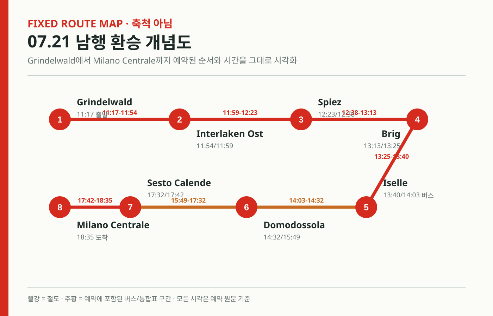

### 지도에서 먼저 표시할 환승

- **Interlaken Ost 5분**: 11:54 도착, 11:59 출발. 내리기 전 문 쪽으로 이동한다.
- **Spiez 15분**: 사진·매점보다 12:38 Brig행 플랫폼이 먼저다.
- **Brig 12분**: 13:25 Iselle 방향 연결을 찾는다.
- **Iselle 23분**: `Iselle di Trasquera` 역명과 `Iselle stazione` 버스 연결 표기를 혼동하지 않는다.
- **Domodossola 77분**: 15:49 통합표 출발 위치를 먼저 확인한 뒤 화장실·식사를 해결한다.

### 아침 체크리스트

- [ ] 여권, 카드, 현금
- [ ] 모든 티켓 QR 오프라인 저장
- [ ] 물, 샌드위치, 초콜릿
- [ ] 휴지
- [ ] 보조배터리
- [ ] 캐리어 손잡이/바퀴 상태
- [ ] SBB 앱에서 전체 연결 저장
- [ ] Le Frecce 통합표 저장

### 이동 전 확인할 것

이 날은 사진보다 플랫폼이 먼저다. Grindelwald 출발 전 모든 연결을 SBB/예약 앱에서 확인하고, 지연이 보이면 바로 다음 연결 가능성을 본다. 환승 시간이 짧기 때문에 도착 전부터 문 앞에 선다.

### 방문지별 배경지식

Interlaken Ost, Spiez, Brig는 관광지가 아니라 환승지다. Iselle di Trasquera와 Iselle stazione 구간은 국경 이동과 버스 연결이 포함될 수 있으므로, 현장 표지판과 직원 안내를 따른다. Domodossola에서는 Le Frecce 통합표의 15:49 출발 연결을 최우선으로 확인한다.

### 현장에서 보면 좋은 포인트

풍경을 즐길 수는 있지만 환승을 방해하지 않는 범위에서만 본다. Spiez에서 호수가 보여도 플랫폼을 벗어나지 않는다. Brig에서는 화장실보다 다음 승강장이 우선일 수 있다.

### 사진 포인트

이 날의 사진은 보너스다. 찍는다면 열차 안에서 짧게, 또는 Domodossola에서 출발 위치 확인이 끝난 뒤에만 찍는다.

### 식사 선택 팁

점심은 기차 안에서 해결할 수 있게 전날 또는 아침에 준비한다. Spiez/Brig 환승 시간에 점심을 사려 하면 위험하다. Domodossola에서 시간이 남으면 간단히 먹되, 15:49 출발 위치 확인 후 움직인다.

### 날씨가 안 좋을 때 대처

이 날은 날씨와 무관하게 예약 이동이 우선이다. 비가 오면 플랫폼 이동이 느려지므로 더 일찍 문 앞에 준비한다. 젖은 우비와 우산은 다른 승객 통로를 막지 않게 정리한다.

### 체력이 떨어졌을 때 줄일 수 있는 부분

- 아침 산책 생략
- 역 주변 사진 생략
- Domodossola 카페 방문 생략
- Milano 도착 후 바로 숙소 이동

### 절대 놓치면 안 되는 예약/이동

- Grindelwald 11:17
- Interlaken Ost 11:59
- Spiez 12:38
- Brig 13:25
- Iselle stazione 14:03
- Domodossola 15:49
- Milano Centrale 18:35 도착

### 여유 시간이 생겼을 때

여유 시간은 관광으로 쓰지 말고 다음 연결 확인, 화장실, 물 보충, 간단 식사, 메시지 확인에 쓴다.

### 하루 마무리 체크

- [ ] Milano Centrale 도착 후 다음 숙소 이동 확인
- [ ] 스위스 구간 티켓과 영수증 정리
- [ ] 사용한 카드 결제 내역 확인
- [ ] 분실물 여부 확인

## 핵심 체크포인트

- 날짜별 순서는 변경하지 않는다.
- 추가 추천은 여유 시간이 생겼을 때만 참고한다.
- Day 6는 스위스 관광일이 아니라 예약 환승일이다.
- 산악 일정은 날씨와 하산 시간을 기준으로 줄인다.
- 매일 밤 다음 날 티켓과 이동 시간을 확인한다.

\newpage

# 10장. 식사와 카페 실전 가이드

## 이 장에서 알 수 있는 것

- 스위스 식당 이용법, 예약, 물 주문, 팁 문화를 이해한다.
- 루체른, 인터라켄, 그린델발트에서 식사를 고르는 기준을 세운다.
- 비싼 식당을 피하면서 만족도를 높이는 방법을 익힌다.
- 허니문 분위기와 실전 효율 사이의 균형을 잡는다.

## 10.1 스위스 식당 이용법

스위스 식당은 가격이 높고, 피크 시간에는 예약이 필요할 수 있다. 관광지 중심 식당은 위치가 좋지만 가격 대비 만족도가 낮을 수도 있다. 메뉴를 보기 전에 오늘의 피로도, 내일 이동, 날씨, 예산을 먼저 본다.

### 입장 전 확인

- 영업 중인지
- 예약이 필요한지
- 카드 결제 가능 여부
- 메뉴 가격대
- 물이 유료인지
- 주방 마감 시간
- 숙소까지 복귀 시간

## 10.2 예약 문화

루체른 강변, 인기 전통식당, 퐁듀 식당, 전망 식당은 예약 가능 여부를 확인하는 편이 좋다. 하지만 이번 일정에서 예약이 확정되지 않은 후보를 마치 확정처럼 다루면 일정이 경직된다. 예약하지 않은 식당은 항상 후보로 둔다.

### 예약하면 좋은 상황

- 금요일/토요일 저녁
- 강변 전망 좌석을 원하는 경우
- 퐁듀처럼 체류 시간이 긴 식사
- 산악 정상 레스토랑에서 특별히 앉고 싶은 경우

### 예약하지 않아도 되는 상황

- 이동일 아침
- 역 베이커리/카페
- 마트/테이크아웃
- 날씨에 따라 산악 일정이 바뀔 수 있는 날

## 10.3 팁 문화

스위스에서는 팁이 의무가 아니다. 만족스러운 식사 후 반올림하거나 소액을 더하는 정도가 자연스럽다. 카드 단말기에 팁 선택 화면이 나와도 부담을 느낄 필요는 없다.

## 10.4 물 주문

식당에서 물은 자동으로 무료 제공되지 않을 수 있다. 생수는 병으로 판매되는 경우가 많고, 탄산수/무탄산수를 구분한다.

### 표현

- Still water: 무탄산수
- Sparkling water: 탄산수
- Tap water: 수돗물
- A glass of tap water, please: 수돗물 한 잔 부탁드립니다

수돗물을 요청해도 식당 정책에 따라 제공 방식이 다를 수 있다. 분위기 좋은 저녁 식사에서는 물값을 예산에 포함하는 편이 마음이 편하다.

## 10.5 메뉴판 읽는 법

스위스 독일어권에서는 독일어 메뉴를 많이 본다. 영어 메뉴가 있어도 모든 항목이 완벽히 번역되지는 않는다.

| 표현 | 의미 |
|---|---|
| Suppe | 수프 |
| Salat | 샐러드 |
| Rosti | 감자전/감자 요리 |
| Schnitzel | 얇게 편 고기 튀김/구이 |
| Wurst | 소시지 |
| Kalb | 송아지 고기 |
| Huhn | 닭고기 |
| Fisch | 생선 |
| Kase | 치즈 |
| Dessert | 디저트 |

## 10.6 인터라켄 식사 선택 기준

인터라켄에서는 `예약 전후 소화 부담`, `빠른 식사`, `숙소 복귀 편의`를 나눠 판단한다. 07.18은 패러글라이딩 전 과식을 피하고, 07.19는 융프라우요흐 복귀 뒤 다음 날 그린델발트 이동을 위해 저녁을 길게 잡지 않는다.

### 인터라켄 운영 기준

- 패러글라이딩 전에는 가벼운 점심과 무알코올 음료
- 융프라우요흐에서는 예약 하산편을 우선하고 식사는 짧게
- Unterseen 숙소 복귀 전 빠른 저녁 우선
- 다음 날 산악 일정 전 과음 금지
- 마트 저녁도 충분히 좋은 선택

## 10.7 루체른 식사 선택 기준

루체른은 첫날과 리기산 복귀 후 식사 성격이 다르다.

| 날짜 | 권장 |
|---|---|
| Day 1 | 장거리 이동 후 가벼운 캐주얼 식사 |
| Day 2 | 리기산 후 컨디션이 좋으면 퐁듀/전통식 |
| Day 3 아침 | 09:24 열차를 놓치지 않는 역 카페/포장 |

Rathaus Brauerei, Restaurant Des Alpes, FONDUE HOUSE DU PONT는 후보로 활용한다. 예약, 영업시간, 메뉴는 방문 전 공식 사이트 확인 필요.

## 10.8 간단히 먹기 좋은 선택

스위스에서 항상 레스토랑을 고집할 필요는 없다.

- 역 베이커리: 아침/이동일에 좋다.
- Coop/Migros 샐러드: 더운 날 부담이 적다.
- 샌드위치: 열차 이동과 산악 일정 백업.
- 요거트+과일: 숙소 아침 대안.
- 초콜릿/견과류: 산악 이동 비상 간식.
- 수프/뢰스티: 산 위에서 무리 없는 메뉴.

## 10.9 마트/테이크아웃 활용법

마트는 여행의 질을 떨어뜨리는 선택이 아니다. 오히려 스위스에서는 예산과 체력을 지키는 핵심 도구다. 산악 일정 전날에는 물과 간식을 사두고, 이동일에는 냄새가 적고 먹기 쉬운 음식을 고른다.

### 마트 선택 팁

- 냄새 강한 음식은 열차에서 피한다.
- 샐러드는 포크가 포함되어 있는지 확인한다.
- 과일은 씻을 수 있는지 생각한다.
- 초콜릿은 여름에 녹을 수 있으니 오래 들고 다니지 않는다.
- 물은 숙소 냉장고 또는 가방에 미리 넣어둔다.

## 10.10 신혼여행 분위기 좋은 식사 선택법

분위기 있는 식사는 `가장 비싼 식당`보다 `동선이 자연스럽고 피로를 덜 만드는 식당`이 좋다. 카펠교 야경과 연결되는 강변 저녁, 리기산 후 따뜻한 퐁듀, 그린델발트 산 배경 저녁처럼 장소 맥락이 있는 식사가 기억에 오래 남는다.

### 분위기 식사 기준

- 숙소 복귀가 쉬운가
- 너무 늦게 끝나지 않는가
- 내일 아침 일정에 부담이 없는가
- 예약이 가능한가
- 날씨가 나빠도 만족도가 있는가

## 10.11 비싼 식당을 피하면서 만족도 높이는 방법

1. 점심은 간단히, 저녁 한 끼만 분위기 있게 쓴다.
2. 산 위 식당은 전망이 좋을 때만 이용한다.
3. 음료를 많이 주문하지 않는다.
4. 마트 과일과 디저트를 숙소에서 먹는다.
5. 이동일에는 베이커리와 샌드위치를 활용한다.
6. 메뉴를 모르겠으면 직원에게 추천을 묻되 가격대를 먼저 본다.

## 10.12 스위스 음식 사전

스위스 음식은 치즈 요리만으로 설명되지 않는다. 산악 목축, 감자·곡물, 도시 제과, 지역 교역이 함께 만든 음식이다. 한여름에는 무거운 전통식을 매 끼니 먹기보다, 지역성을 느낄 한두 끼와 가벼운 마트식을 섞는다.

| 음식 | 어떤 음식인가 | 이번 여행에서 먹기 좋은 때 | 주문 전 확인 |
|---|---|---|---|
| **Fondue** | 스위스 전역에서 접하는 공동 치즈 요리. 특정 루체른 향토식으로 보지 않음 | 리기산을 마친 07.17 저녁, 컨디션이 좋을 때 | 2인 최소 주문, 치즈 종류, 여름 운영 여부, 체류시간 |
| **Raclette** | 발레 지역 기원이 강한 녹인 치즈 요리 | 서늘하거나 비 오는 저녁 | 1인분 가능 여부, 냄새와 포만감 |
| **Rösti** | 채 썬 감자를 눌러 구운 음식. 베른권 농가 음식 전통과 연결 | 산악 점심 또는 가벼운 저녁 | 달걀·치즈·베이컨 토핑에 따라 매우 무거워짐 |
| **Älplermagronen** | 중앙스위스 계통이 강한 마카로니·감자·치즈·크림·양파 음식 | 리기처럼 많이 걸은 날 | 사과소스, 양, 포만감 |
| **Luzerner Chügelipastete** | 페이스트리 껍질에 송아지고기·브랫 완자·버섯·크림소스를 담는 루체른 음식 | 07.16 또는 07.17 루체른 저녁 | 건포도 포함 여부와 식당별 조리 마감 |
| **Luzerner Birewegge** | 향신료를 넣은 배 소가 든 빵·페이스트리 | 역 베이커리 간식 또는 선물 | 견과류·알레르기 성분, 보관 기간 |
| **Luzerner Lebkuchen** | 배 농축액과 향신료가 특징인 부드러운 지역 과자 | 카페 디저트·상온 선물 | 일반 독일식 생강과자와 식감·향이 다름 |
| **Kafi Luz** | 묽은 커피에 과일 증류주를 더한 중앙스위스 음료 | 저녁 식후, 술을 마셔도 되는 날 | 알코올 도수와 다음 날 고산 일정 고려 |
| **Chatzestreckerli** | 루체른 지역에서 찾는 길쭉한 과자·제과류 명칭 | 베이커리 소포장 선물 | 지점별 판매·재료 확인 |
| **Birchermüesli** | 귀리, 과일, 유제품을 섞은 차가운 아침 음식 | 숙소 아침, 더운 날 가벼운 식사 | 냉장 보관과 당 함량 |
| **Alpkäse** | 여름철 알프스 목초지 우유로 만드는 산악 치즈 계열 | 마트에서 작은 조각 시식용 구매 | 상온 이동 시간, 향, 원산지 표기 |
| **Bündnerfleisch/건조육** | 그라우뷘덴 지역성이 강한 건조 소고기 | 빵과 함께 숙소식 또는 피크닉 | 베른고원 향토식으로 오해하지 않기 |
| **Berner Alpkäse AOP / Hobelkäse AOP** | 베른고원 산지의 단단한 치즈와 숙성·삭힌 형태 | 인터라켄·그린델발트 마트와 치즈 플래터 | AOP 표기, 생산지, 숙성도, 진공포장 |
| **Meringue mit Rahm** | 머랭과 크림 조합, 베른고원에서 접하기 쉬운 디저트 | 인터라켄 카페에서 공유 | 단맛과 크림 양이 많음 |
| **Swiss chocolate** | 지역·브랜드별 카카오와 우유 조합이 다양한 대표 간식 | 이동 중 비상간식보다 숙소에서 천천히 | 7월 가방 속에서 쉽게 녹음 |

### 지역별 한 가지를 고른다면

- **루체른**: Chügelipastete 또는 Birewegge 중 하나. 둘 다 찾느라 확정 동선을 늘리지 않는다.
- **인터라켄·베른고원**: Berner Alpkäse AOP 또는 Hobelkäse AOP를 우선하고 Rösti는 한 끼 식사로 경험한다.
- **그린델발트**: 날씨 좋은 저녁에는 산 배경 식사, 피곤하면 마트식과 따뜻한 수프를 조합한다.
- **산악 정상**: 음식 자체보다 전망과 하산 여유가 값을 결정한다.

## 10.13 도시별 장보기 실행표

| 도시·날짜 | 1순위 매장 | 2순위 | 구매 목적 | 실행 조건 |
|---|---|---|---|---|
| 루체른 07.16 | Coop Löwencenter | Coop Luzern Bahnhof | 07.17 리기산용 물·간식 | 호텔 정리 후 여유 시간이 있을 때 |
| 루체른 07.17-18 | Coop Luzern Bahnhof | 역 베이커리 | 이른 아침·09:24 열차 전 빠른 보충 | 탑승 20분 이내에는 쇼핑 중단 |
| 인터라켄 07.18 | Coop Unterseen | Migros Interlaken | 일요일 아침, Day 4 간식 | 숙소 정리 후 토요일 폐점 전 |
| 인터라켄 Ost 생활권 | Coop Interlaken Ost | 역 매장 | Ost에 이미 있을 때 빠진 품목 | 숙소에서 일부러 왕복하지 않음 |
| 그린델발트 07.20 | Coop Eigershop | VOI Grindelwald | Day 6 남행 이동식·아침 백업 | Dorfstrasse 산책 중, 숙소 휴식과 20:00 BelAqua 전에 |

> 영업시간 원칙
> 스위스 매장은 지점·요일·공휴일에 따라 시간이 다르다. 역 매장은 일반 도심점보다 길게 여는 경우가 많지만 예외가 있다. 이 표는 `어디를 먼저 볼지` 정하는 표이며, 2026년 7월의 정확한 시간은 각 공식 지점 페이지에서 확인한다.

## 10.14 마트 진열대와 가격표 읽는 법

| 표기 | 의미 | 활용법 |
|---|---|---|
| **Aktion** | 행사·할인 품목 | 단위가격과 유통기한을 함께 본다. 필요 없는 대용량은 사지 않는다. |
| **Prix Garantie** | Coop의 저가 자체 브랜드 | 물, 간식, 기본 식품에서 예산을 낮추기 좋다. |
| **M-Budget** | Migros의 저가 자체 브랜드 | 요거트, 뮤즐리, 스낵 등 기본품 비교에 유용하다. |
| **Naturaplan** | Coop의 유기농·지속가능성 계열 브랜드 | 가격보다 생산 기준을 우선할 때 선택한다. |
| **Bio** | 유기농 표기 | 인증 마크와 원산지를 함께 확인한다. |
| **Schweiz / Suisse / Svizzera** | 스위스산 표기 | 국기 그림만 보지 말고 원재료·제조국 표기를 읽는다. |
| **pro 100 g / kg** | 100g·kg당 단위가격 | 포장 크기가 다른 치즈·과일의 실제 가격 비교에 쓴다. |
| **gekühlt lagern** | 냉장 보관 | 장거리 이동식으로 고르지 않는다. |

셀프 계산대에서는 상품을 한 번씩 스캔하고, 과일·채소는 매장 방식에 따라 저울 번호나 화면 품목을 선택한다. 영수증은 숙소에 돌아갈 때까지 보관한다. 주류는 연령 확인을 요청할 수 있다.

## 10.15 세 번의 실전 장바구니

### A. 루체른 리기산 전날, 2인

- 물 500-750ml 2병
- 작은 빵 또는 샌드위치 2개
- 사과 2개
- 견과류 1봉 또는 에너지바 2개
- 작은 휴지 1개

### B. 인터라켄 토요일, 일요일 대비 2인

- 숙소 아침용 요거트 2개와 뮤즐리 소포장
- 빵 1봉, 치즈 또는 잼 소포장
- 과일 2-4개
- 물 2-4병
- Day 4용 간식 2개
- 바로 먹는 샐러드 또는 가벼운 저녁 1회분

### C. 그린델발트, 남행 환승 전 2인

- 눌리지 않는 샌드위치 2개
- 물 2병
- 사과 2개
- 견과류·에너지바 합계 3개
- 작은 초콜릿 1개
- 휴지와 쓰레기봉투

유리병, 쉽게 터지는 컵 과일, 냄새 강한 생선·달걀 음식, 장시간 상온에 둘 크림 제품은 환승식으로 피한다. `저렴해서 많이 사는 것`보다 `두 사람이 다음 고정 이동까지 실제로 먹을 양`을 산다.

## 핵심 체크포인트

- 예약 없는 식당은 후보일 뿐 확정 일정이 아니다.
- 첫날은 가볍게, 리기산 후에는 컨디션에 따라 전통식.
- 산 위 식사는 전망이 좋을 때 가치가 커진다.
- 물과 간식은 마트에서 미리 보충한다.
- 팁은 의무가 아니며 반올림/소액 추가 정도로 충분하다.

\newpage

## 10.16 숙소를 기준으로 지역을 공부하는 방법

여행 전에는 지도를 한 번에 외우려 하지 말고, 숙소를 중심으로 세 개의 고리로 나누어 공부한다. 첫 번째 고리는 숙소에서 도보 10분 안에 있는 역·마트·약국·카페다. 두 번째 고리는 예약된 이동의 출발역과 도착역 사이에 있는 핵심 관광지다. 세 번째 고리는 날씨와 체력이 허락할 때만 선택하는 호수 마을·박물관·전망대다. 이 순서로 보면 명소를 많이 아는 것보다 실제로 필요한 장소를 빠르게 찾을 수 있다.

### Hotel Luzernerhof 기준: 호수와 구시가지 생활권

Hotel Luzernerhof는 호수와 구시가지 사이에서 루체른을 도보로 읽기 좋은 베이스다. 첫날에는 숙소에서 호프교회와 빈사의 사자상, 구시가지, 카펠교를 하나의 역사 산책으로 묶고, 다음 날 리기산 출발 전에는 루체른역·선착장·마트의 위치를 직접 확인한다. 루체른역은 이동과 장보기의 기준점이고, 카펠교는 사진 명소이면서 구시가지의 방향을 잡는 기준물이다.

#### 이 숙소에서 우선 공부할 것

| 우선순위 | 장소 | 공부할 이유 | 현장 활용 |
|---|---|---|---|
| 1 | Luzern Bahnhof | 도시 이동, 마트, 사물함, 화장실의 기준점 | 07.17 아침 리기산 출발 전 동선 확인 |
| 2 | Schwanenplatz·카펠교 | 구시가지와 호수의 경계 | 낮과 저녁 사진을 비교하기 좋음 |
| 3 | 호프교회·빈사의 사자상 | 루체른의 종교·정치·군사 기억을 짧은 산책으로 이해 | 첫날 도착 후 무리 없는 문화 코스 |
| 4 | Coop Luzern Bahnhof 또는 Coop Löwencenter | 물, 과일, 샌드위치, 초콜릿을 한 번에 준비 | 산악 일정용 간식 구매 |
| 5 | Bachmann·Max Chocolatier | 루체른다운 디저트와 선물 선택 | 귀국 선물과 즉석 디저트 비교 |

### 스위스:인터젠의방 기준: Unterseen 생활권

이 숙소는 Interlaken West와 Unterseen 구시가지 사이의 생활권으로 이해한다. 관광객이 몰리는 Höheweg만 보지 말고, Stadthausplatz와 아레강 쪽을 함께 걸어야 숙소가 있는 지역의 성격이 보인다. Unterseen은 13세기 도시 형성과 시장 기능의 흔적을 가진 별도의 역사 공간이며, Tourismuseum은 이 지역이 알프스 관광지로 성장한 과정을 이해하는 데 유용하다. 방문 가능 시간은 변동될 수 있으므로 공식 사이트 확인이 필요하다.

#### 이 숙소에서 우선 공부할 것

- Interlaken West: 숙소 도착·출발과 장보기의 실용적 기준점
- Unterseen Stadthausplatz: 조용한 구시가지, 식당·카페, 사진 배경
- 아레강 산책로: 색과 수량이 날씨에 따라 달라지는 강변 풍경
- Höheweg·회에마테: 관광 상업지와 열린 공원의 대비
- Harder Kulm 하부역: 10분 케이블/푸니쿨라 이동으로 큰 전망을 얻는 장소

### Hotel Gletscherblick 기준: Grindelwald 생활권

그린델발트에서는 명소보다 먼저 짐과 장보기의 순서를 공부한다. 도착 직후 숙소에 짐을 맡길 수 있는지 확인하고, Dorfstrasse와 Coop Eigershop, Hotel Belvedere BelAqua의 위치를 지도에 표시한다. 20:00 스파 이동 전 물·아침식사·다음 날 이동용 간식을 확보한다. First행 곤돌라는 지역 학습용으로만 표시하며 이날 방문지로 취급하지 않는다.

## 10.17 무엇을 먹을지: 음식별 이유와 주문 기준

스위스 음식은 “유명하니까 한 번 먹는 메뉴”보다 장소와 상황에 맞게 선택해야 만족도가 높다. 치즈 요리는 산악권과 호숫가에서 풍경과 함께 먹을 때 의미가 크고, Rösti는 빠른 한 끼나 브런치로 적합하다. 디저트와 초콜릿은 이동 중 휴대성이 좋아 여행 선물로도 실용적이다.

| 음식·제품 | 왜 먹는가 | 언제 좋은가 | 주문·구매 팁 |
|---|---|---|---|
| Fondue | 알프스 목축과 치즈 문화를 가장 직접적으로 경험 | 저녁, 두 사람이 천천히 먹는 날 | 빵·감자·피클 구성과 최소 주문 인원 확인 |
| Raclette | 녹인 치즈와 감자·피클의 조합을 비교적 간단히 즐김 | 추운 날, 산에서 내려온 뒤 | 향이 강할 수 있어 양을 무리하지 않음 |
| Rösti | 감자 중심의 스위스식 든든한 메뉴 | 이동 전 점심, 체력이 떨어진 날 | 달걀·치즈·베이컨 토핑을 확인 |
| Älplermagronen | 산악 목동 음식의 현대적 형태 | 산악 레스토랑 | 사과소스가 곁들여지는지 확인 |
| Hobelkäse·Alpkäse | 베른고원·중부 스위스의 산악 치즈를 맛봄 | 간단한 점심·와인/음료 안주 | 치즈 이름과 생산 지역을 사진으로 기록 |
| Sbrinz | 루체른을 포함한 중앙스위스 생산권의 AOP 경성 치즈 | 선물·치즈 플래터 | 루체른시 전용 제품으로 설명하지 말고 진공포장 확인 |
| Bircher Müesli | 스위스 호텔식 아침의 대표 메뉴 | 조식 또는 가벼운 아침 | 과일·견과류·유제품 알레르기 확인 |
| Swiss chocolate | 코코아 제품을 가장 쉽게 휴대하는 기념품 | 이동 중 간식·선물 | 여름에는 녹지 않게 기내용 가방 안쪽에 보관 |

### 디저트와 카페 선택

루체른에서는 Confiserie Bachmann의 빵·페이스트리·초콜릿을 한 번에 비교하기 좋다. Schwanenplatz 본점은 구시가지 관광 동선에 붙이기 쉽고, 카페에서 커피와 디저트를 함께 먹은 뒤 선물용 제품을 따로 고르기 좋다. Max Chocolatier는 수제 초콜릿 선물의 성격이 강하므로 “대량 구매”보다 맛과 포장 경험을 우선한다. 영업시간과 지점별 제품은 방문 전 공식 사이트에서 확인한다.

인터라켄에서는 Funky Chocolate Club이 초콜릿 제작 체험과 기념품 구매를 결합한다. 워크숍은 등록이 필요하지만 이번 확정 일정에는 넣지 않는다. 07.18 패러글라이딩과 07.19 융프라우요흐를 모두 마친 뒤 실제 여유 시간이 생긴 경우에만 매장 쇼핑 정도를 검토한다.

## 10.18 마트별 역할과 실제 장보기 목록

마트는 브랜드보다 위치와 구매 목적을 기준으로 선택한다. Coop은 일반 식료품과 자체 브랜드 제품을 한 번에 찾기 쉽고, Prix Garantie는 예산을 낮추고 싶을 때, Naturaplan은 유기농 제품을 찾을 때 참고한다. Migros의 M-Budget도 간식·음료·간단한 식사 비교에 유용하지만 지점별 구성이 다르므로 특정 제품을 단정하지 않는다.

| 도시·숙소 | 우선 확인할 마트 | 가장 좋은 구매 시점 | 추천 장보기 |
|---|---|---|---|
| 루체른 | Coop Luzern Bahnhof, Coop Löwencenter | 첫날 저녁 또는 리기산 전날 | 물, 바나나, 요거트, 샌드위치, 견과, 초콜릿 |
| 인터라켄·운터젠 | Coop Unterseen, Coop Interlaken Ost | 07.18 패러글라이딩 전후, 토요일 폐점 전 | 빵, 치즈, 햄, 과일, 즉석 샐러드, 물 |
| 그린델발트 | Coop Eigershop 및 현지 제품점 | 07.20 Dorfstrasse 산책 중 | 다음 날 아침, 기차 간식, 초콜릿, 치즈 |

### 산악 이동용 장바구니

- 500ml 물 1~2병: 역과 산 위 가격 차이를 줄인다.
- 바나나 또는 사과: 포장과 섭취가 쉽다.
- 작은 샌드위치 또는 랩: 환승 중 식사 대체용.
- 견과·시리얼바: 케이블카 대기나 하이킹 중 비상 간식.
- 초콜릿 소량: 고도에서 녹을 수 있으므로 큰 선물 포장은 나중에 산다.
- 휴지·물티슈: 산악역과 야외 전망대에서 유용하다.

### 제품을 고르는 기준

선물은 “스위스에서 샀다”보다 “어느 지역의 무엇인지 설명할 수 있다”가 좋다. 루체른에서는 Sbrinz, 지역 치즈, 초콜릿, 빵·과자류를 우선 보고, 인터라켄·베른고원에서는 Alpkäse, Mutschli, 허브 제품, 산악 지역 초콜릿을 살펴본다. 시계·칼·고가 제품은 가격 비교와 공식 보증서, 기내 반입 규정을 확인한다. Victorinox 제품은 조각·각인 서비스가 가능한지 매장별로 확인한다.

그린델발트에서는 `Eigerness` 표기가 붙은 지역 제품과 현지 생산자 정보를 살펴볼 가치가 있다. 치즈·유제품·건조소시지·맥주·수공예품은 제품명보다 생산자 주소, 원산지, 냉장 여부, 유통기한을 먼저 본다. 이 표시는 무조건 저렴하다는 뜻이 아니라 “그린델발트와 아이거 지역의 생산·디자인 맥락을 설명할 수 있는가”를 판단하는 단서다. Coop에서 기본 이동식을 사고, 지역 제품 매장은 여유 시간이 생겼을 때만 둘러본다.

> 방문 전 확인
>
> Coop·Migros의 지점별 영업시간, 일요일 운영 여부, 재고, 냉장식품 판매 범위는 변동될 수 있다. 공식 지점 페이지에서 확인하고, 일요일에는 마트가 닫을 수 있다는 전제로 전날 장보기를 우선한다.

## 10.19 숙소 주변에서 관광명소를 읽는 순서

### 루체른: 물길·다리·방어시설·종교 건축

카펠교와 물탑은 단순한 포토스폿이 아니라 중세 도시의 방어와 교통을 읽는 시작점이다. 슈프로이어교까지 걸으면 도시가 강을 건너는 방식과 17세기 회화 장식을 비교할 수 있다. 무제크 성벽은 도시를 둘러싼 방어선의 흔적이고, 빈사의 사자상은 스위스 용병의 역사 기억을 압축한다. 호프교회와 예수회 교회는 서로 다른 시대의 종교 건축을 비교하는 데 좋다.

### 인터라켄: 관광도시와 역사도시의 대비

Höheweg는 호텔·상점·공원이 집중된 현대 관광축이고, Unterseen은 Stadthausplatz·교회·아레강·Tourismuseum이 남아 있는 역사 생활권이다. 두 공간을 함께 걸으면 “인터라켄=전망대”라는 인상을 넘어, 알프스 관광이 철도와 호텔 산업을 통해 성장한 과정을 이해할 수 있다. 회에마테에서는 융프라우 방향의 시야를 먼저 보고, Unterseen에서는 건물과 강의 스케일을 관찰한다.

### 그린델발트·피르스트: 철도관광과 고산 레저

그린델발트 마을은 아이거 북벽을 배경으로 한 정착지이고, First는 곤돌라와 전망시설, 산책로, 레저 액티비티가 결합된 고산 관광지다. First Cliff Walk는 짧은 시간에도 큰 전망을 얻는 핵심 요소이며, Bachalpsee는 날씨와 체력에 따라 선택한다. 산악 레스토랑에서는 Rösti·치즈 요리·수프처럼 이동 후 회복에 맞는 음식을 고르고, 운영시간보다 늦게 내려오지 않도록 마지막 곤돌라를 먼저 확인한다.

## 10.20 사진과 지도 보강 사용법

책에 넣을 사진은 예쁜 풍경만 모으지 말고 “현장에서 비교할 수 있는 사진”으로 구성한다.

| 사진 묶음 | 반드시 포함할 장면 | 설명 캡션에 넣을 것 |
|---|---|---|
| 루체른 | 카펠교와 물탑, 사자상, 호프교회, 구시가지 간판 | 건축 시대·도시 역사·촬영 방향 |
| 리기산 | Rigi Kulm 정상, 산악열차, 호수 조망 | 고도, 날씨, 하산 기준 |
| 인터라켄 | 회에마테, Harder Kulm Two Lakes Bridge, 아레강, Unterseen 광장 | 두 호수 방향과 숙소 생활권 |
| 그린델발트 | 아이거 북벽, First Cliff Walk, 곤돌라 역 | 전망 대상과 걷기 난이도 |
| 먹거리 | Rösti, fondue, Alpkäse, 초콜릿, 마트 장바구니 | 왜 먹는지, 언제 사는지, 보관법 |

지도는 축척보다 순서를 보여줘야 한다. 각 지도에는 `현재 위치 → 다음 역/선착장 → 핵심 명소 → 식사 또는 마트 → 숙소 복귀`의 5개 표식을 넣는다. 루체른 지도에는 Hotel Luzernerhof와 Luzern Bahnhof·선착장을, 인터라켄 지도에는 스위스:인터젠의방과 Interlaken West·Unterseen·Höheweg를, 그린델발트 지도에는 Hotel Gletscherblick·곤돌라역·Coop를 반드시 표시한다. 지도 아래에는 “실시간 플랫폼과 운행 정보는 SBB·운영사 공식 앱 확인”이라는 문구를 넣는다.

## 10.21 최종 누락 점검표

- [x] 숙소별 인근 역·마트·약국·관광축을 연결했다.
- [x] 루체른의 대표 명소와 중세 다리·방어시설·종교 건축의 의미를 설명했다.
- [x] 인터라켄의 관광축과 Unterseen 역사 생활권을 분리해 설명했다.
- [x] 그린델발트·First의 전망·레저·식사·마지막 하산 기준을 설명했다.
- [x] fondue, raclette, Rösti, Älplermagronen, 치즈, Sbrinz, 초콜릿을 먹는 이유와 선택 기준을 넣었다.
- [x] Bachmann, Max Chocolatier, Funky Chocolate Club 등 디저트·선물 선택지를 넣었다.
- [x] Coop·Migros·지점별 장보기 역할과 산악용 장바구니를 넣었다.
- [x] 사진은 장소·역사·음식·현장 비교 목적별로 보강 기준을 넣었다.
- [x] 지도에는 숙소, 역, 선착장, 마트, 핵심 명소를 표시하도록 설명했다.
- [x] 운영시간·재고·날씨·교통은 방문 전 공식 사이트 확인 대상으로 표시했다.

# 11장. 날씨별 대체 전략

## 이 장에서 알 수 있는 것

- 맑은 날, 흐린 날, 비 오는 날, 강풍 시 무엇을 선택할지 정리한다.
- 산악 일정의 진행/축소/취소 기준을 세운다.
- 사진이 잘 나오는 시간대와 피해야 할 조건을 이해한다.
- 당일 아침 의사결정 체크리스트를 만든다.

## 11.1 맑은 날

맑은 날은 산악 전망과 호수 색이 살아난다. 리기산, 하더쿨름, 피르스트, Bachalpsee, 카펠교 야경 모두 만족도가 높다. 하지만 맑은 날일수록 사람이 많고 햇빛이 강하다.

### 맑은 날 운영

- 산악 일정은 오전에 출발한다.
- 선글라스와 자외선 차단제를 챙긴다.
- 물을 더 많이 준비한다.
- 사진 욕심 때문에 하산 시간을 놓치지 않는다.
- 유명 포인트에서는 짧게 찍고 이동한다.

## 11.2 흐린 날

흐린 날에는 높은 전망대보다 낮은 고도와 도시 산책이 낫다. 하더쿨름이나 리기산을 완전히 포기할 필요는 없지만, 웹캠이 안 좋으면 체류 시간을 줄인다.

### 흐린 날 선택

- 루체른: 구시가지, 카펠교, 교통박물관
- 인터라켄: Hoheweg, Unterseen, Aare 강변
- 그린델발트: 마을 산책, 짧은 First 전망
- 산악 고가 일정: 보류 또는 축소

## 11.3 비 오는 날

비가 오는 날에는 방수보다 `동선 축소`가 중요하다. 우산을 쓰고 캐리어를 끌거나 산악 교통을 무리하면 피로가 급격히 올라간다.

### 비 오는 날 원칙

- 외부 계단, 성벽, 전망대 체류를 줄인다.
- 박물관, 역, 카페, 마트 중심으로 운영한다.
- 신발이 젖으면 다음 날 물집 위험이 커진다.
- 사진보다 체온 유지가 우선이다.
- 젖은 우비는 열차 안에서 다른 사람에게 닿지 않게 접는다.

## 11.4 강풍/산악 교통 제한 시

강풍은 산악 교통의 가장 중요한 변수다. 곤돌라, 케이블카, 정상부 전망대는 바람에 영향을 받는다. 운행 정보가 불확실하면 매표 전 공식 운영 정보를 본다.

### 강풍 시 하지 않을 것

- 운행 제한을 무시하고 올라가기
- 마지막 하산 시간까지 정상부에 머무르기
- Cliff Walk 같은 노출 구간에서 오래 사진 찍기
- 우산을 펼치고 고지대에서 이동하기

## 11.5 더운 날

7월 도시에서는 더울 수 있다. 스위스라고 항상 시원하다고 생각하면 안 된다. 루체른 구시가지, 인터라켄 Hoheweg, 역 주변 포장도로는 햇빛이 강하면 피곤하다.

### 더운 날 운영

- 13:00-16:00 야외 산책을 줄인다.
- 호수/강변 그늘을 활용한다.
- 마트에서 물을 미리 산다.
- 카페 휴식과 숙소 휴식을 일정에 넣는다.
- 산 위는 시원할 수 있지만 햇빛 반사가 강하다.

## 11.6 추운 날

도시는 따뜻해도 산 위는 춥다. 비, 바람, 그늘이 겹치면 7월에도 체감이 낮다.

### 추운 날 운영

- 바람막이를 꺼내기 쉬운 위치에 둔다.
- 젖은 옷을 오래 입지 않는다.
- 산 위에서는 따뜻한 음료를 활용한다.
- 손이 차가우면 사진 품질보다 하산을 우선한다.

## 11.7 사진이 잘 나오는 시간대

| 시간대 | 특징 |
|---|---|
| 오전 | 산이 비교적 선명한 경우가 많고 사람이 적다. |
| 정오 | 빛이 강해 얼굴 그림자가 진다. 산악 풍경은 선명할 수 있다. |
| 늦은 오후 | 호수와 도시 사진이 부드럽다. |
| 해질 무렵 | 카펠교, 호수, 하더쿨름 분위기가 좋다. |
| 밤 | 야경은 좋지만 삼각대 없이 흔들릴 수 있다. |

## 11.8 산에 올라가도 되는 날과 피해야 하는 날

### 올라가도 되는 날

- 웹캠이 선명하다.
- 강풍 경보가 없다.
- 비/뇌우 가능성이 낮다.
- 마지막 하산까지 충분한 시간이 있다.
- 몸 상태가 좋다.

### 피해야 하는 날

- 웹캠이 하얗다.
- 비와 강풍이 함께 예보된다.
- 곤돌라 운행 정보가 불안정하다.
- 출발이 늦어졌다.
- 전날 잠을 거의 못 잤다.
- 두통, 메스꺼움, 어지러움이 있다.

## 11.9 당일 아침 의사결정 체크리스트

- [ ] 오늘의 고정 예약/열차는 무엇인가
- [ ] 변경 가능한 후보 일정은 무엇인가
- [ ] 공식 웹캠은 보이는가
- [ ] 강풍/비/뇌우가 있는가
- [ ] 마지막 하산 시간은 몇 시인가
- [ ] 몸 상태는 어떤가
- [ ] 식사 예약이 있다면 시간은 고정인가
- [ ] 포기해도 되는 항목은 무엇인가
- [ ] 무조건 지켜야 할 다음 이동은 무엇인가

## 핵심 체크포인트

- 산악 일정은 날씨보다 웹캠과 운행 정보가 중요하다.
- 흐린 날에는 낮은 고도와 도시 대안이 더 만족스러울 수 있다.
- 강풍에는 곤돌라/케이블카를 억지로 진행하지 않는다.
- 더운 날에는 물과 그늘, 카페 휴식을 적극 활용한다.
- 당일 아침에는 `무조건 지킬 이동`부터 확인한다.

\newpage

# 12장. 교통 실전 매뉴얼

## 이 장에서 알 수 있는 것

- 기차, 환승, 플랫폼, 짐 이동을 실제 행동 순서로 익힌다.
- 산악열차, 케이블카, 곤돌라, 유람선 이용 팁을 정리한다.
- 택시가 필요한 상황과 길을 잃었을 때 대처법을 확인한다.
- SBB 앱에서 꼭 볼 항목을 체크리스트화한다.

## 12.1 기차 탑승 전 체크

기차를 타기 전에는 `시간`만 보면 부족하다. 스위스에서는 플랫폼이 바뀔 수 있고, 지연과 대체 운행이 생길 수 있다.

### 탑승 전 10분 체크

- [ ] 출발역
- [ ] 도착역
- [ ] 출발 시간
- [ ] 플랫폼
- [ ] 열차 번호 또는 방향
- [ ] 1등석/2등석 구분
- [ ] 티켓 QR
- [ ] Half Fare Card
- [ ] 여권 원본

## 12.2 환승이 짧을 때 행동법

07.21은 짧은 환승이 이어지는 대표적인 날이다. 환승이 짧을수록 내려서 생각하면 늦다.

### 행동 순서

1. 도착 10분 전 다음 연결을 앱으로 확인한다.
2. 도착 5분 전 짐을 문 근처로 옮긴다.
3. 열차가 멈추면 바로 내린다.
4. 플랫폼 전광판을 확인한다.
5. 이동 중 사진을 찍지 않는다.
6. 다음 열차에 탄 뒤 좌석과 짐을 정리한다.

## 12.3 플랫폼 찾는 법

스위스 역에서는 `Gleis` 또는 `Platform` 표기를 본다. 큰 역에서는 같은 플랫폼 안에서도 A/B 구역이 있을 수 있다. Interlaken Ost처럼 환승 시간이 짧은 역에서는 방향 표지판을 먼저 보고 이동한다.

### 플랫폼 확인 우선순위

1. SBB 앱
2. 역 전광판
3. 플랫폼 전광판
4. 역 직원
5. 열차 외부 목적지 표시

## 12.4 짐 들고 이동할 때 팁

캐리어가 있으면 10분 도보도 길게 느껴진다. 특히 자갈길, 계단, 비, 더위가 있으면 체감 난이도가 올라간다.

### 짐 이동 원칙

- 한 손은 항상 비워둔다.
- 여권과 지갑은 캐리어 외부 주머니에 넣지 않는다.
- 환승 전에는 물건을 좌석 위 선반에 깊게 넣지 않는다.
- 짧은 환승 전에는 작은 가방을 몸에 착용한다.
- 무거운 캐리어를 들고 긴 도보를 해야 하면 택시를 고려한다.

## 12.5 산악열차/케이블카/곤돌라 이용 팁

산악 교통은 일반 기차보다 날씨와 운행 정보가 중요하다.

### 탑승 전

- 운행 여부 확인
- 마지막 하산 시간 확인
- 티켓 할인 적용 확인
- 대기줄 확인
- 바람막이 준비
- 화장실 다녀오기

### 탑승 중

- 창가에 몰려 다른 승객을 밀지 않는다.
- 정차역을 놓치지 않는다.
- 사진은 짧게 찍고 손잡이를 잡는다.
- 멀미가 있으면 먼 곳을 보고 휴대폰 사용을 줄인다.

## 12.6 유람선 이용 팁

루체른 호수 선박은 Day 2 핵심이다. 선착장 번호와 목적지를 확인한다.

### 선박 체크리스트

- [ ] Pier 번호
- [ ] 목적지 Vitznau/Weggis
- [ ] 출발 시간
- [ ] 할인/티켓
- [ ] 갑판 바람 대비
- [ ] 복귀편 시간

## 12.7 택시가 필요한 상황

스위스에서는 택시가 비쌀 수 있지만, 특정 상황에서는 합리적이다.

### 택시 고려 상황

- 캐리어가 크고 비가 오는 날 역-숙소 이동
- 체크인/환승 시간이 촉박한데 도보가 길 때
- 몸 상태가 좋지 않을 때
- 늦은 밤 낯선 길을 걸어야 할 때
- 짐 보관 실패로 산악 일정이 흔들릴 때

## 12.8 길을 잃었을 때 대처

1. 멈춰서 현재 위치를 확인한다.
2. 목적지를 다시 입력한다.
3. 역/선착장/호텔처럼 큰 기준점을 잡는다.
4. 시간이 촉박하면 도보 고집을 버린다.
5. 주변 직원, 호텔 프런트, 역 직원에게 짧게 묻는다.

### 물어볼 표현

- Where is platform 8?
- Is this the train to Interlaken West?
- Where is Pier 1?
- Can I walk there with luggage?
- Is there a taxi stand nearby?

## 12.9 SBB 앱에서 꼭 확인할 항목

- 출발/도착 역 이름
- 날짜
- 플랫폼
- 환승 시간
- 지연
- 공사/대체 버스
- 열차 방향
- 티켓 클래스
- 할인 적용
- QR 오프라인 저장

## 핵심 체크포인트

- 짧은 환승은 도착 전 준비가 핵심이다.
- 플랫폼은 앱과 전광판을 함께 확인한다.
- 캐리어가 있으면 도보 시간은 더 길게 잡는다.
- 산악 교통은 마지막 하산 시간을 먼저 본다.
- 택시는 낭비가 아니라 일정 보호 수단이 될 수 있다.

\newpage

# 13장. 사진과 기록 가이드

## 이 장에서 알 수 있는 것

- 루체른, 인터라켄, 산악 지역, 호수의 대표 사진 포인트를 정리한다.
- 흐린 날과 사람이 많은 곳에서 사진 품질을 높이는 방법을 익힌다.
- 커플/신혼여행 사진 구도와 기록 템플릿을 제공한다.

## 13.1 인터라켄 사진 포인트

- Harder Kulm Two-Lakes Lookout
- Hoheweg 초지와 산 배경
- Aare 강변
- Unterseen 골목
- Interlaken West 주변 생활권
- Brienz/Thun 호수 방향 여유 선택지

### 구도 팁

인터라켄에서는 사람을 크게 넣기보다 산과 호수를 넓게 잡고, 인물은 화면 아래쪽 1/3에 배치한다. 하늘이 좋으면 광각, 흐리면 인물을 더 크게 넣는다.

## 13.2 루체른 사진 포인트

- 카펠교와 수탑
- Reuss 강변
- 구시가지 광장
- 빈사의 사자상
- 루체른 호수와 선착장
- 리기산 배 위 갑판

### 구도 팁

카펠교는 정면보다 사선 구도가 좋다. 수탑과 다리를 함께 넣고, 인물은 다리 난간 가까이에 세우기보다 강변 쪽에서 자연스럽게 넣는다.

## 13.3 산악 지역 사진 팁

산에서는 하늘과 눈, 바위, 초지가 화면을 크게 차지한다. 자동 노출이 밝게 튈 수 있으므로 얼굴이 어둡게 나오면 인물을 그늘에서 빼거나 역광을 피한다.

### 산악 사진 체크

- 렌즈를 자주 닦는다.
- 바람이 강하면 모자와 머리카락을 먼저 정리한다.
- 절벽/난간 가까이서 무리하지 않는다.
- 다른 여행자의 이동을 막지 않는다.
- 사진보다 마지막 하산 시간이 우선이다.

## 13.4 호수 사진 팁

호수는 아침과 늦은 오후가 좋다. 정오에는 반사가 강하고 얼굴 그림자가 진다. 배 위에서는 수평이 흔들리기 쉬우므로 짧은 동영상을 함께 남긴다.

## 13.5 흐린 날 사진 팁

흐린 날에는 넓은 산 풍경보다 디테일을 찍는다.

- 구시가지 간판
- 카페 컵과 창밖 풍경
- 비 오는 카펠교
- 강물 색
- 열차 창문과 티켓
- 손을 잡고 걷는 뒷모습

## 13.6 커플/신혼여행 사진 구도

### 안정적인 구도

- 손잡고 걷는 뒷모습
- 한 명은 카메라를 보고 한 명은 풍경을 보는 구도
- 다리/호수/산 배경에서 인물을 작게 넣는 구도
- 카페 테이블 위 손, 커피, 지도, 티켓
- 열차 창가에 앉은 실루엣

### 피하면 좋은 구도

- 사람 많은 난간 한가운데 오래 서 있기
- 절벽 가까이에서 점프샷
- 강한 역광에서 얼굴이 모두 어둡게 나오는 사진
- 식당에서 다른 손님을 크게 담는 사진

## 13.7 사람이 많은 곳에서 사진 찍는 법

1. 먼저 전체 구도를 보고 대기한다.
2. 사람이 빠지는 3-5초를 기다린다.
3. 세로 사진과 가로 사진을 모두 찍는다.
4. 인물을 화면 한쪽에 두면 배경 혼잡이 덜 보인다.
5. 인기 포인트에서 오래 버티지 않는다.

## 13.8 여행 기록용 메모 템플릿

### 하루 기록

| 항목 | 기록 |
|---|---|
| 오늘 날짜 |  |
| 날씨 |  |
| 가장 좋았던 장면 |  |
| 생각보다 힘들었던 것 |  |
| 맛있었던 것 |  |
| 다음 여행자를 위한 팁 |  |
| 오늘의 지출 |  |
| 내일 꼭 확인할 것 |  |

### 사진 정리 태그

- `Day1_Luzern_Arrival`
- `Day2_Rigi`
- `Day3_Luzern_Interlaken`
- `Day4_HarderKulm`
- `Day5_GrindelwaldFirst`
- `Day6_ToMilano`

## 13.9 수록 사진을 현장에서 비교하는 법

이 책의 사진은 `반드시 같은 사진을 찍어야 하는 목표`가 아니라 방향, 시야, 날씨, 지형을 빠르게 이해하기 위한 참고 자료다. 계절과 촬영 시각이 실제 여행과 다르므로 색과 구름이 같을 것이라고 기대하지 않는다.

| 수록 사진 | 현장에서 비교할 것 | 판단에 쓰는 법 |
|---|---|---|
| 카펠교 | 다리의 사선, 수탑, 강변 건물의 겹침 | 같은 구도를 찾기보다 보행 흐름이 덜 막히는 강변 측면을 고른다. |
| 회에마테 | 하더 능선과 남쪽 고산 방향의 구름 높이 | 능선이 가려지면 하더쿨름 웹캠을 다시 확인한다. |
| 하더쿨름 파노라마 | 두 호수와 인터라켄 시가지의 위치 관계 | 정상에서 어느 쪽이 브리엔츠호·툰호인지 구분한다. |
| 아이거 | 마을 건물과 암벽의 크기 대비 | 산이 가까워 보여도 공식 보행로 밖으로 접근하지 않는다. |
| 바흐알프제 반영 | 바람, 수면, 구름, 빛의 네 조건 | 반영이 없더라도 실패가 아니다. 하산 시간보다 사진을 우선하지 않는다. |
| 리기 현대 파노라마 | 전경·중경·원경 산 능선이 몇 겹 보이는지 | 원경이 모두 사라지면 정상 체류를 줄일 근거로 쓴다. |
| 리기 역사 도판 | 과거 여행자가 산 이름과 방향을 학습한 방식 | 길 찾기용으로 사용하지 않고 현대 사진과 관광사를 비교한다. |

### 같은 장소를 기록하는 세 장

1. **정보 사진**: 역명, 플랫폼, 선착장 번호, 운영시간을 읽을 수 있게 찍는다.
2. **풍경 사진**: 장소의 규모와 방향을 남기는 가로 사진을 찍는다.
3. **기억 사진**: 두 사람, 음식, 티켓, 날씨처럼 그날만의 상황을 담는다.

정보 사진에는 여권, 예약번호, 카드번호가 함께 들어가지 않도록 화면을 확인한다.

## 13.10 수록 지도를 사용하는 법

| 지도 | 가장 먼저 확인할 것 | 실제 길 찾기에서 추가 확인 |
|---|---|---|
| 07.16 루체른 도보축 | 역-호텔-확정 명소 순서 | 횡단보도, 공사, 실제 도보시간 |
| 07.17 리기 라운드트립 | 배·산악열차·케이블카 교통수단 변화 | 선착장, 플랫폼, 운행 중단, 마지막 편 |
| 인터라켄 생활권 | West=숙소, Ost=산악 환승 역할 | 버스 정류장, 숙소 출입구, 마트 영업시간 |
| 07.19 융프라우요흐축 | West/Ost-Terminal-Eigergletscher-Jungfraujoch 환승 | 좌석 예약·승차권·웹캠·고산 증상 |
| 07.20 그린델발트축 | 호텔-Dorfstrasse-Coop-숙소-BelAqua 순서 | 외부 입장 사전 확인·22:00 복귀 |
| 07.21 남행 환승도 | 예약된 역 순서와 짧은 환승 | 당일 플랫폼, 지연, 대체 버스, 국경 구간 안내 |

> 지도 사용 주의
> 본문 지도는 확정 순서 이해를 위한 **비축척 개념도**다. 실시간 길, 플랫폼, 고도, 폐쇄 구간을 보장하지 않는다. 도보는 오프라인 지도, 철도·배는 SBB와 운영사 공식 안내, 산악로는 현장 표지를 최종 기준으로 한다.

## 핵심 체크포인트

- 산악 사진은 안전과 하산 시간이 먼저다.
- 흐린 날에는 넓은 풍경보다 디테일을 찍는다.
- 신혼여행 사진은 장소 맥락이 보이게 넓게 찍는다.
- 사람 많은 곳에서는 짧게 찍고 이동한다.
- 매일 밤 사진을 날짜별로 정리하면 여행 후 편하다.

\newpage

# 14장. 안전과 리스크 관리

## 이 장에서 알 수 있는 것

- 소매치기, 분실, 여권/카드 문제에 대비한다.
- 산악 지역 안전, 날씨 급변, 기차 지연에 대응한다.
- 예약 시간에 늦을 것 같을 때의 행동 순서를 정리한다.
- 비상 연락처와 여행자 보험 확인사항을 정리한다.

## 14.1 소매치기/분실 대비

스위스는 안전한 편이지만 관광지와 역에서는 분실과 소매치기 가능성을 무시하면 안 된다. 특히 루체른역, Interlaken Ost, 밀집된 카펠교, 선착장, 산악철도 대기줄에서는 가방을 몸 앞쪽으로 둔다.

### 기본 원칙

- 여권, 카드, 현금을 한곳에 몰아두지 않는다.
- 외투 주머니에 지갑을 넣지 않는다.
- 열차 선반 위에 작은 가방을 두지 않는다.
- 식당 의자 등받이에 가방을 걸지 않는다.
- 사진 찍을 때 휴대폰과 가방을 분리하지 않는다.

## 14.2 여권/카드 분실 시 대응

### 여권 분실

1. 마지막으로 사용한 장소를 확인한다.
2. 숙소, 역, 식당에 연락한다.
3. 현지 경찰 신고 필요 여부를 확인한다.
4. 주스위스 대한민국 대사관 또는 영사안전콜센터 안내를 확인한다.
5. 항공/열차 이동 일정 영향 여부를 확인한다.

### 카드 분실

1. 카드 앱에서 즉시 잠금 처리한다.
2. 다른 카드와 현금을 확인한다.
3. 최근 결제 내역을 확인한다.
4. 필요 시 카드사 해외 긴급번호로 연락한다.

## 14.3 산악 지역 안전

산에서는 난간, 절벽, 젖은 길, 강풍이 위험하다. 사진을 위해 안전선을 넘지 않는다. 비가 온 뒤에는 나무 데크와 돌길이 미끄럽다.

### 산악 안전 원칙

- 공식 탐방로 밖으로 나가지 않는다.
- 강풍 시 Cliff Walk 체류를 줄인다.
- 마지막 하산 시간을 지킨다.
- 몸 상태가 나쁘면 하산한다.
- 안개가 심하면 하이킹을 줄인다.

## 14.4 날씨 급변

산악 지역은 날씨가 빠르게 바뀐다. 아침에 맑아도 오후에 구름과 비가 들어올 수 있다.

### 급변 대응

- 정상 도착 후 먼저 핵심 전망을 본다.
- 식사보다 사진/전망 우선순위를 먼저 처리한다.
- 구름이 빠르게 올라오면 하산을 앞당긴다.
- 뇌우 가능성이 있으면 노출된 능선과 호수 주변을 피한다.

## 14.5 기차 지연

기차 지연이 생기면 당황해서 임의로 다른 열차를 타기보다 SBB 앱과 역 직원 안내를 함께 본다. 특히 07.21은 연결이 길기 때문에 지연이 생기면 다음 연결이 가능한지 즉시 확인한다.

### 지연 시 행동

1. SBB 앱에서 대체 연결 확인
2. 역 직원에게 예약 연결을 설명
3. 다음 목적지와 최종 목적지를 함께 말하기
4. 필요한 경우 지연 증명/보상 가능성은 나중에 확인
5. 지금 당장 타야 할 다음 열차부터 확보

## 14.6 예약 시간에 늦을 것 같을 때

### 식당 예약

전화 또는 온라인 예약 페이지로 늦는다고 알린다. 15분 이상 늦으면 좌석 보장이 어려울 수 있다.

### 열차 예약

일반 열차와 좌석 예약, 특정 티켓 조건이 다르다. 놓치면 SBB/운영사 안내를 확인한다. 임의로 타도 되는지 단정하지 않는다.

### 호텔 체크인

늦은 체크인이 예상되면 숙소에 메시지를 보낸다. 열쇠 수령 방식과 프런트 운영 시간을 확인한다.

## 14.7 몸이 안 좋을 때

여행 중 몸 상태가 나쁘면 일정을 줄이는 것이 정답이다. 특히 산악 일정에서는 두통, 어지러움, 메스꺼움, 탈수, 발 통증을 가볍게 보지 않는다.

### 줄이는 순서

1. 추가 사진 포인트
2. 카페/쇼핑
3. 옵션 명소
4. 산 위 긴 하이킹
5. 비예약 식사

예약 교통과 숙소 이동은 마지막까지 지키되, 건강이 우선이다.

## 14.8 여행자 보험 확인사항

출국 전 보험 증권을 PDF로 저장한다.

### 확인할 것

- 해외 의료비 보장
- 휴대품 손해
- 항공/수하물 지연
- 여행 중단/취소
- 긴급 이송
- 보험사 24시간 연락처
- 영문 보험증명서

## 14.9 비상 연락처 정리 템플릿

| 구분 | 연락처 | 메모 |
|---|---|---|
| 유럽 공통 긴급 | 112 | 경찰 연결 |
| 스위스 경찰 | 117 |  |
| 소방 | 118 |  |
| 구급차 | 144 |  |
| 주스위스 대한민국 대사관 | 방문 전 공식 확인 |  |
| 영사안전콜센터 | 방문 전 공식 확인 | 앱/전화 확인 |
| 보험사 |  |  |
| 카드사 1 |  |  |
| 카드사 2 |  |  |
| 항공사 |  | LX1485 |
| 호텔 루체르너호프 |  |  |
| 스위스:인터젠의방 |  |  |
| Hotel Gletscherblick |  |  |

## 핵심 체크포인트

- 안전한 나라에서도 역과 관광지는 소지품 관리가 필요하다.
- 여권과 Half Fare Card 확인용 신분증은 원본을 관리한다.
- 산악 일정에서는 안전선, 강풍, 하산 시간이 우선이다.
- 지연이 생기면 SBB 앱과 역 직원 안내를 함께 확인한다.
- 보험, 대사관, 카드사 연락처는 오프라인 저장한다.

\newpage

# 15장. 출국 전·여행 중 체크리스트

## 이 장에서 알 수 있는 것

- 출국 7일 전부터 귀국 전까지 확인할 항목을 시간순으로 정리한다.
- 산악 일정, 도시 이동, 체크아웃, 매일 아침 체크를 분리한다.
- 확정 일정 변경 없이 준비 상태를 높인다.

## 15.1 출국 7일 전

- [ ] 여권 유효기간 확인
- [ ] 항공권 PDF 저장
- [ ] 모든 숙소 예약 PDF 저장
- [ ] Swiss Half Fare Card QR 저장
- [ ] SBB 앱 설치/로그인
- [ ] Le Frecce 등 예약 앱/계정 확인
- [ ] 여행자 보험 PDF 저장
- [ ] 카드 해외 사용 설정 확인
- [ ] 비상 연락처 오프라인 저장
- [ ] 산악 교통 공식 사이트 즐겨찾기
- [ ] MeteoSwiss 또는 날씨 앱 설치

## 15.2 출국 3일 전

- [ ] LX1485 항공편 상태 확인
- [ ] Hotel Luzernerhof 체크인/조식 상태 확인
- [ ] 스위스:인터젠의방 주소와 체크인 안내 저장
- [ ] Hotel Gletscherblick 체크인/짐 보관 문의 필요 여부 확인
- [ ] 07.18 Luzern 09:24 티켓 확인
- [ ] 07.21 남행 예약 전체 확인
- [ ] 리기산, Lake Lucerne, Jungfrau 공식 운행 정보 확인
- [ ] 옷차림 최종 조정
- [ ] 약, 보조배터리, 충전기 확인

## 15.3 출국 전날

- [ ] 여권을 가방에 넣었는지 확인
- [ ] 티켓 QR 오프라인 저장
- [ ] 숙소 주소 스크린샷
- [ ] 카드 2장 이상 분산 보관
- [ ] CHF 소액 현금 준비
- [ ] 유심/eSIM 확인
- [ ] 날씨 확인
- [ ] 가방 무게 확인
- [ ] 물티슈, 휴지, 개인약 준비

## 15.4 매일 아침

- [ ] 오늘의 고정 예약 확인
- [ ] 다음 이동 시간 확인
- [ ] 날씨와 웹캠 확인
- [ ] 물과 간식 확인
- [ ] 휴대폰 배터리
- [ ] 보조배터리
- [ ] 여권/카드 위치
- [ ] 숙소 복귀 방법
- [ ] 줄일 수 있는 일정 확인

## 15.5 산악 일정 전

- [ ] 공식 운행 정보
- [ ] 웹캠
- [ ] 강풍/비/뇌우
- [ ] 마지막 하산 시간
- [ ] 바람막이
- [ ] 선글라스
- [ ] 물
- [ ] 간식
- [ ] 티켓 할인 적용
- [ ] 몸 상태

## 15.6 도시 이동 전

- [ ] 체크아웃 시간
- [ ] 숙소 키 반납
- [ ] 냉장고/콘센트/화장실 물건 확인
- [ ] 역까지 이동시간
- [ ] 플랫폼
- [ ] 티켓 QR
- [ ] 캐리어 정리
- [ ] 다음 숙소 주소

## 15.7 체크아웃 전

- [ ] 여권
- [ ] 지갑
- [ ] 카드
- [ ] 충전기
- [ ] 보조배터리
- [ ] 세면도구
- [ ] 옷장/서랍
- [ ] 냉장고
- [ ] 침대 밑
- [ ] 쓰레기/분리수거
- [ ] 열쇠 반납

## 15.8 귀국 전

- [ ] 남은 현금 정리
- [ ] 카드 결제 내역 확인
- [ ] 분실물 확인
- [ ] 사진 백업
- [ ] 보험 청구 필요 서류 확인
- [ ] 택스프리/영수증 정리
- [ ] 항공편 체크인

## 핵심 체크포인트

- 체크리스트는 기억을 대신하기 위한 도구다.
- 매일 아침 `오늘의 고정 예약`을 먼저 본다.
- 산악 일정은 운행, 웹캠, 하산 시간이 핵심이다.
- 체크아웃 전 콘센트와 서랍을 반드시 확인한다.
- 티켓과 예약 PDF는 오프라인 저장한다.

\newpage

# 16장. 부록

## 이 장에서 알 수 있는 것

- 현장에서 쓸 독일어/영어 표현을 정리한다.
- 공식 사이트 확인 목록과 지도 링크 삽입 자리를 제공한다.
- 예약 정보, 지출, 여행 메모 템플릿을 바로 사용할 수 있게 제공한다.

## 16.1 유용한 독일어 표현

| 독일어 | 의미 |
|---|---|
| Guten Morgen | 좋은 아침입니다 |
| Guten Tag | 안녕하세요 |
| Danke | 감사합니다 |
| Bitte | 부탁합니다/천만에요 |
| Entschuldigung | 실례합니다/죄송합니다 |
| Bahnhof | 기차역 |
| Gleis | 플랫폼/선로 |
| Ausgang | 출구 |
| Eingang | 입구 |
| Fahrkarte/Billett | 티켓 |
| Apotheke | 약국 |
| WC/Toilette | 화장실 |
| Wasser | 물 |
| Ohne Kohlensaure | 무탄산 |
| Mit Kohlensaure | 탄산 |

## 16.2 유용한 영어 표현

| 상황 | 표현 |
|---|---|
| 플랫폼 묻기 | Which platform is the train to Interlaken West? |
| 환승 확인 | Is this connection still possible? |
| 지연 문의 | My train is delayed. What is the next connection? |
| 짐 보관 | Can we leave our luggage before check-in? |
| 식당 예약 | Do you have a table for two tonight? |
| 물 주문 | Still water, please. |
| 계산 | Could we have the bill, please? |
| 택시 | Could you call a taxi for us? |
| 도움 요청 | Could you help us? |

## 16.3 식당에서 쓸 표현

- We have a reservation under the name Choi.
- A table for two, please.
- Do you have an English menu?
- What do you recommend?
- Is this dish with pork?
- Could we have tap water?
- Could we pay by card?
- Could we split the bill?
- We are in a bit of a hurry.

## 16.4 기차역에서 쓸 표현

- Where is platform 15?
- Is this the train to Luzern?
- Does this train stop at Interlaken West?
- We have a short connection. Which way should we go?
- Is there a delay?
- Is there a replacement bus?
- Where are the lockers?
- Where is the taxi stand?

## 16.5 응급상황 표현

- I need help.
- I lost my passport.
- My wallet was stolen.
- I feel dizzy.
- I have a severe headache.
- I need a doctor.
- Please call an ambulance.
- Where is the nearest pharmacy?
- Can you contact the police?

## 16.6 공식 사이트 확인 목록

| 항목 | 공식 사이트 |
|---|---|
| SBB Swiss Half Fare Card | https://www.sbb.ch/en/offers/swiss-half-fare-card |
| SBB Mobile | https://www.sbb.ch/en/travel-information/apps/sbb-mobile.html |
| SBB lockers | https://www.sbb.ch/en/travel-information/stations/services-station/luggage-deposit/lockers.html |
| Lake Lucerne timetable | https://www.lakelucerne.ch/en/information/timetable/ |
| Rigi timetables | https://www.rigi.ch/en/inform/timetables |
| Harder Kulm | https://www.jungfrau.ch/en-gb/harder-kulm/ |
| Grindelwald-First | https://www.jungfrau.ch/en-gb/grindelwaldfirst/ |
| Jungfraujoch | https://www.jungfrau.ch/en-gb/jungfraujoch-top-of-europe/ |
| Jungfrau 도착·2026 좌석 예약 조건 | https://www.jungfrau.ch/en-gb/arriving/ |
| UNESCO Swiss Alps Jungfrau-Aletsch | https://whc.unesco.org/en/list/1037/ |
| Jungfrau timetable | https://www.jungfrau.ch/en-gb/timetable/ |
| Interlaken Tourism | https://www.interlaken.swiss/en/ |
| Lucerne Tourism | https://www.luzern.com/en/the-city/sights/top-sights |
| Pilatus Golden Round Trip | https://pilatus.ch/en/railway-cableways/tickets/golden-round-trip |
| Titlis timetables | https://www.titlis.ch/en/information/timetable-lifts |
| Stanserhorn timetable | https://www.stanserhorn.ch/en/informations/timetable |
| Swiss Museum of Transport | https://www.verkehrshaus.ch/en/dein-besuch/besuch-planen/opening-hours |
| Richard Wagner Museum | https://www.richard-wagner-museum.ch/visit/information/ |
| Musegg Wall | https://www.museggmauer.ch/oeffnungszeiten-barrieren/ |
| MeteoSwiss | https://www.meteoswiss.admin.ch/ |
| Switzerland emergency info | https://www.ch.ch/en/safety-and-justice/emergencies-and-danger/ |
| Switzerland tipping | https://www.myswitzerland.com/en-us/planning/about-switzerland/general-facts/money-and-shopping/tipping/ |
| Typical Swiss food | https://www.myswitzerland.com/en-us/planning/about-switzerland/custom-and-tradition/typical-food-old/ |
| Lucerne regional specialities PDF | https://www.luzern.com/fileadmin/Mediendatenbank/Luzern-Tourismus/PDF_Dokumente/Tourist_Information/Bildungsunterlagen/Spezialitaeten_Luzern.pdf |
| Chapel Bridge history | https://www.luzern.com/en/the-city/sights/top-sights/lucernes-landmarks-the-chapel-bridge-and-its-water-tower/All |
| Lion Monument history | https://www.luzern.com/en/the-city/sights/top-sights/lion-monument |
| Hofkirche St. Leodegar | https://www.luzern.com/en/poi/church-of-st-leodegar |
| Spreuer Bridge | https://www.luzern.com/en/poi/spreuer-bridges |
| Jesuit Church | https://www.luzern.com/en/the-city/sights/top-sights/jesuit-church |
| Interlaken monastery and castle | https://www.interlaken.swiss/en/experiences/poi/monastery-and-interlaken-castle |
| Tourismuseum Unterseen | https://www.interlaken.swiss/en/experiences/poi/tourismuseum |
| Unterseen 공식 역사 | https://www.unterseen.ch/gemeinde-unterseen/geschichte.html |
| Grindelwald 역사 | https://grindelwald.swiss/en/destination/about-the-region/things-to-know-about-grindelwald/historical-background-stories.html |
| Grindelwald 지역 제품 | https://grindelwald.swiss/en/discover/shopping-and-rental/local-products.html |
| Rigi first mountain railway history | https://www.rigi.ch/en/about-us/history/history-of-the-first-mountain-railway-of-europe |
| Rigi 2026 여름 공식 시간표 | https://www.rigi.ch/_Resources/Persistent/d691a3111ff6392cc9d168d667796e7b85b939dd/01%20Sommer_23.05.-06.09.2026-EN.pdf |
| Jungfrau Railway company history | https://www.jungfrau.ch/en-gb/corporate/jungfrau-railways/jungfraubahn-holding-ag/jungfraubahn-ag/ |
| Firstbahn history | https://www.jungfrau.ch/de-ch/unternehmen/erneuerung-firstbahn/ |
| Coop Luzern Bahnhof | https://www.coop.ch/en/locations/coop-supermarkt-luzern-bahnhof/3705_POS |
| Coop Luzern Löwencenter | https://www.coop.ch/de/standorte/coop-supermarkt-luzern-loewencenter/1986_POS |
| Löwencenter opening hours | https://www.loewencenter.ch/oeffnungszeiten |
| Coop Unterseen | https://www.coop.ch/de/standorte/coop-supermarkt-unterseen/1139_POS |
| Coop Interlaken Ost | https://www.coop.ch/en/locations/coop-supermarkt-interlaken-ost/1954_POS |
| Coop Grindelwald | https://www.coop.ch/de/standorte/coop-supermarkt-grindelwald/4066_POS |
| VOI Grindelwald operator background | https://aare.migros.ch/de/neuigkeiten/2019/voigrindelwald.html |
| Coop Prix Garantie | https://www.coop.ch/en/brands-inspiration/own-brands/prix-garantie/prix-garantie.html |
| Coop Naturaplan | https://www.coop.ch/en/brands-inspiration/own-brands/naturaplan/the-naturaplan-brand.html |
| Migros M-Budget | https://www.migros.ch/de/brand/m-budget?context=ecommerce |
| 주스위스 대한민국 대사관 | https://ch.mofa.go.kr/ |
| 외교부 해외안전여행 | https://0404.go.kr/ |

## 16.7 지도 링크 삽입 자리

| 날짜 | 책 내 개념도 | 외부 지도 링크 | 메모 |
|---|---|---|---|
| 07.16 루체른 도착 | 6.3 / 9.1 수록 |  | LX1485, Zürich Flughafen, Luzern, Hotel Luzernerhof, 카펠교 |
| 07.17 리기산 | 8.1 / 9.2 수록 |  | Luzern Pier 1, Vitznau, Rigi Kulm, Kaltbad, Weggis |
| 07.18 인터라켄 이동 | 3.4 / 9.3 수록 |  | Luzern, Interlaken Ost, Interlaken West, 스위스:인터젠의방 |
| 07.19 인터라켄 | 3.4 수록 |  | Harder Kulm, Hoheweg, Aare, Unterseen |
| 07.19 융프라우요흐 | 5.1 / 9.4 수록 |  | Interlaken Ost, Grindelwald Terminal, Eigergletscher, Jungfraujoch, Sphinx |
| 07.20 그린델발트 | 5.2 / 9.5 수록 |  | Interlaken West, Grindelwald, Hotel Gletscherblick, Coop Eigershop, BelAqua |
| 07.21 밀라노 이동 | 9.6 수록 |  | Grindelwald, Interlaken Ost, Spiez, Brig, Domodossola, Milano Centrale |

> 지도 편집 메모
> 외부 지도 링크 칸에는 출국 전 본인이 저장한 Google Maps 목록 또는 오프라인 지도 링크를 넣는다. 책 내 지도는 경로 순서 설명용이며 실시간 길 안내를 대신하지 않는다.

## 16.8 예약 정보 정리표

| 구분 | 예약명/번호 | 날짜 | 시간 | 장소 | 확인 상태 |
|---|---|---|---|---|---|
| 항공 | LX1485 | 2026.07.16 | 09:30-10:55 | PRG-ZRH | 예약 완료 |
| 숙소 | Hotel Luzernerhof | 07.16-07.18 |  | Luzern | 예약 원문 확인 |
| 이동 | Luzern-Interlaken Express | 2026.07.18 | 09:24-11:17 | Luzern-Interlaken Ost | 결제 티켓 기준 |
| 숙소 | 스위스:인터젠의방 | 07.18-07.20 |  | Unterseen | 위치 확정 |
| 이동 | Interlaken West-Grindelwald | 2026.07.20 | 10:22-11:10 | Interlaken-Grindelwald | 엑셀 일정 기준 |
| 숙소 | Hotel Gletscherblick | 07.20-07.21 |  | Grindelwald | 예약 원문 확인 |
| 이동 | Grindelwald-Domodossola | 2026.07.21 | 11:17-14:32 | CH-IT | 예약 완료 |
| 이동 | Domodossola-Milano Centrale | 2026.07.21 | 15:49-18:35 | IT | Le Frecce 통합표 예약 완료 |

## 16.9 하루 지출 기록표

| 날짜 | 교통 | 식사 | 카페/간식 | 입장권/액티비티 | 쇼핑 | 기타 | 합계 |
|---|---:|---:|---:|---:|---:|---:|---:|
| 07.16 |  |  |  |  |  |  |  |
| 07.17 |  |  |  |  |  |  |  |
| 07.18 |  |  |  |  |  |  |  |
| 07.19 |  |  |  |  |  |  |  |
| 07.20 |  |  |  |  |  |  |  |
| 07.21 |  |  |  |  |  |  |  |

## 16.10 여행 메모 페이지

### 오늘의 메모

| 항목 | 내용 |
|---|---|
| 날짜 |  |
| 날씨 |  |
| 오늘 가장 좋았던 순간 |  |
| 예상보다 어려웠던 점 |  |
| 다음에 다시 오면 바꾸고 싶은 점 |  |
| 오늘의 식사 |  |
| 오늘의 이동 팁 |  |
| 내일 확인할 것 |  |

### 장소별 짧은 기록

| 장소 | 한 줄 메모 | 다시 가고 싶은가 |
|---|---|---|
| 루체른 |  |  |
| 리기산 |  |  |
| 인터라켄 |  |  |
| 하더쿨름 |  |  |
| 그린델발트 |  |  |
| 피르스트 |  |  |

## 16.11 사진·지도 출처와 라이선스

### 사진 크레딧

| 수록 파일 | 저작자 | 라이선스 | 원문 |
|---|---|---|---|
| 카펠교 | Rudolph A. Furtado | Public Domain | [Wikimedia Commons](https://commons.wikimedia.org/wiki/File:Kapell_Brucke_Bridge_in_Lucerne..jpg) |
| 리기쿨름 현대 파노라마 | Chris j wood | [CC BY-SA 3.0](https://creativecommons.org/licenses/by-sa/3.0) | [Wikimedia Commons](https://commons.wikimedia.org/wiki/File:Panorama_of_Swiss_Alps_from_Rigi_Kulm.jpg) |
| 리기쿨름 역사 도판 | C. Bertrand / Heinrich Keller | Public Domain | [Wikimedia Commons](https://commons.wikimedia.org/wiki/File:PanoramaRigiKulmKeller.png) |
| 회에마테 | Leonhard Lenz | [CC0](http://creativecommons.org/publicdomain/zero/1.0/deed.en) | [Wikimedia Commons](https://commons.wikimedia.org/wiki/File:H%C3%B6hematte_Interlaken_2022-10-02_01.jpg) |
| 하더쿨름 파노라마 | Oldschooler95 | [CC BY-SA 4.0](https://creativecommons.org/licenses/by-sa/4.0) | [Wikimedia Commons](https://commons.wikimedia.org/wiki/File:Top_of_Interlaken_-_Panorama.jpg) |
| 그린델발트의 아이거 | Leonhard Lenz | [CC0](http://creativecommons.org/publicdomain/zero/1.0/deed.en) | [Wikimedia Commons](https://commons.wikimedia.org/wiki/File:Eiger_seen_from_Grindelwald_village_2022-10-02_01.jpg) |
| 바흐알프제 반영 | Ryan Gsell | [CC BY 2.0](https://creativecommons.org/licenses/by/2.0) | [Wikimedia Commons](https://commons.wikimedia.org/wiki/File:Bachalpsee_reflection.jpg) |
| 빈사의 사자상 | Gürkan Sengün | Public Domain | [Wikimedia Commons](https://commons.wikimedia.org/wiki/File:Lion_Monument.jpg) |
| 루체른 예수회 교회 내부 | A.Savin, Wikipedia | [Free Art License](http://artlibre.org/licence/lal/en) | [Wikimedia Commons](https://commons.wikimedia.org/wiki/File:Luzern_asv2022-10_Jesuitenkirche_img2.jpg) |
| 운터젠 Stadthausplatz | Dennis G. Jarvis | [CC BY-SA 2.0](https://creativecommons.org/licenses/by-sa/2.0) | [Wikimedia Commons](https://commons.wikimedia.org/wiki/File:Switzerland-03221_-_Town_Hall_Square_(23704506431).jpg) |
| 인터라켄 패러글라이딩 | Tran Mau Tri Tam | [CC0](http://creativecommons.org/publicdomain/zero/1.0/deed.en) | [Wikimedia Commons](https://commons.wikimedia.org/wiki/File:Paragliding_Interlaken_-_Switzerland_(Unsplash).jpg) |

사진은 현장 이해를 위한 편집용 축소본이며, 라이선스와 저작자 표기는 2026.07.10 Wikimedia Commons 파일 설명을 기준으로 정리했다. 재배포·재편집 시 각 원문 페이지의 최신 조건을 다시 확인한다.

### 지도 크레딧

| 지도 | 작성 근거 | 성격 |
|---|---|---|
| 07.16 루체른 도보축 | 확정 일정, `assets/map-data.json` | 자체 제작 비축척 개념도 |
| 07.17 리기산 라운드트립 | 확정 선박·산악열차·케이블카 시각 | 자체 제작 비축척 개념도 |
| 인터라켄 생활권 | 확정 숙소 주소, West/Ost 역할 | 자체 제작 비축척 개념도 |
| 07.19 융프라우요흐 | 확정 환승 순서·고도·좌석 예약 주의 | 자체 제작 비축척 개념도 |
| 07.20 그린델발트 마을·BelAqua | 확정 도착·숙소·Coop·스파 순서 | 자체 제작 비축척 개념도 |
| 그린델발트-피르스트 | 확정 일정 밖 지역 학습용 구조 | 자체 제작 비축척 개념도 |
| 07.21 남행 환승 | 예약된 열차·버스·통합표 순서와 시각 | 자체 제작 비축척 개념도 |

지도에는 제3자 지도 타일을 사용하지 않았다. 지리적 축척·실시간 플랫폼·도로 공사를 표현하지 않으며, 확정 일정의 순서를 빠르게 이해하기 위한 설명 자료다.

## 16.12 지역별 1분 설명 카드

이 절은 현장에서 동행자에게 장소를 설명하거나 여행 후 사진을 정리할 때 사용한다. 첫 문장으로 지형과 정체성을 말하고, 역사 한 가지, 대표 장면 한 가지, 음식 한 가지를 붙이면 과장 없이 지역을 설명할 수 있다.

### 루체른

> 루체른은 루체른호에서 로이스강이 빠져나오는 지점에 형성된 중앙스위스의 역사도시다. 8세기 호프 수도원, 고트하르트 교역로, 1332년 스위스 동맹 가입을 거쳐 성장했고, 카펠교·무제크 성벽·호프교회가 중세 도시의 이동·방어·종교 기능을 보여준다. 19세기에는 증기선과 철도, 산악관광이 결합해 리기와 필라투스의 관문이 됐다. 음식은 스위스 일반식인 퐁뒤와 별개로 Luzerner Chügelipastete, Birewegge, Luzerner Lebkuchen을 지역 음식으로 설명할 수 있다.

설명할 때 볼 것: 카펠교의 비스듬한 선, 수탑, 로이스강 양안, 사자상의 방패와 상처, 예수회 교회의 바로크 내부.

### 리기산

> 리기는 루체른호와 중앙스위스 호수들을 내려다보는 산악 관광지로 `Queen of the Mountains`라는 별칭이 있다. 1871년 Vitznau-Rigi Staffelhöhe 구간에서 유럽 최초 산악철도가 운행을 시작했고, 배와 산악열차가 연결되며 정상 전망을 대중 관광으로 바꿨다. 이번 여행은 Luzern-Vitznau-Rigi Kulm-Rigi Kaltbad-Weggis-Luzern을 잇는 원형 이동 자체가 핵심이다. 산에서는 Älplermagronen, Rösti, 치즈 플래터가 맥락에 맞지만 15:00 산악열차와 16:10 케이블카 연결이 식사보다 우선이다.

설명할 때 볼 것: Rigi Kulm역과 실제 정상 전망점의 차이, 톱니철도, 호수와 알프스가 층을 이루는 방향.

### 인터라켄

> 인터라켄은 툰호와 브리엔츠호 사이, 융프라우 지역으로 갈라지는 교통축에 발달한 관광도시다. 중심지는 본래 Aarmühle로 불렸고, 19세기 관광산업에서 널리 쓰인 Interlaken이라는 이름을 1891년 공식 채택했다. 회에마테의 열린 초지는 융프라우 방향 조망을 보존하며 호텔 거리의 전면 무대가 되고, Interlaken Ost는 산악 환승, West는 운터젠 숙소 생활권의 역할을 한다. 07.18 패러글라이딩은 두 호수 사이 지형을 공중에서 읽는 확정 경험이다.

설명할 때 볼 것: 회에마테 남쪽 산군, 패러글라이더 착륙 방향, West와 Ost의 기능 차이.

### 운터젠

> 운터젠은 인터라켄의 조용한 동네가 아니라 1279년 도시 건설 허가를 바탕으로 시장·교량·통행 기능을 키운 별도 역사도시다. Stadthausplatz, 교회, 아레강, Tourismuseum이 관광 호텔축과 다른 생활도시의 규모를 보여준다. 이번 여행의 65 Hauptstrasse 숙소는 이 역사 생활권에 있어 Interlaken West와 Coop Unterseen을 실용적 기준점으로 삼는다.

설명할 때 볼 것: Stadthaus와 교회 탑, 광장 규모, 아레강과 다리, 현대 관광 간판이 적은 골목.

### 융프라우요흐

> 융프라우요흐는 융프라우 정상 자체가 아니라 묀히와 융프라우 사이의 고개다. 해발 3,454m Jungfraujoch역은 유럽 최고도 철도역이고, 약 3,571m Sphinx 전망대에서는 알프스 최대 알레치 빙하와 유네스코 세계자연유산 경관을 본다. 1912년 개통한 융프라우철도는 아이거·묀히 내부 터널을 이용해 고산 관광을 대중화했다. 2026년 7월은 좌석 예약 의무 기간이며 좌석 예약과 별도의 유효 승차권이 필요하다.

설명할 때 볼 것: 고개·역·전망대의 고도 차이, 빙하 흐름과 모레인, 터널 철도의 공학, 고산 증상.

### 그린델발트

> 그린델발트는 아이거 북벽 아래의 빙하 지형 마을이자 융프라우권 관광 거점이다. 19세기 영국 여행자와 산악가이드, 1888년 겨울관광, 1890년 철도, 1892년 대화재와 재건이 리조트 형성에 영향을 주었다. 1858년 아이거 정상 초등과 1938년 북벽 초등은 서로 다른 등반사 사건이다. 이번 일정에서는 First를 추가하지 않고 Dorfstrasse, Coop Eigershop, Hotel Gletscherblick, 20:00 BelAqua 순서를 유지한다. 지역 제품은 Berner Alpkäse AOP, Hobelkäse AOP와 Eigerness 표기를 살펴본다.

설명할 때 볼 것: 아이거 북벽과 마을 건물의 크기 대비, 샬레·호텔·철도, 지역 제품의 생산지 표기.

## 최종 핵심 체크포인트

- 이 가이드북은 확정 일정을 보완한다.
- 예약된 항공, 숙소, 열차, 남행 이동은 바꾸지 않는다.
- 산악 일정은 날씨, 웹캠, 운행 정보, 마지막 하산 시간이 핵심이다.
- 비싼 선택은 날씨가 좋을 때만 가치가 커진다.
- Day 6는 관광보다 환승 성공이 목표다.
- 매일 밤 다음 날 티켓, 플랫폼, 날씨, 물과 간식을 확인한다.
